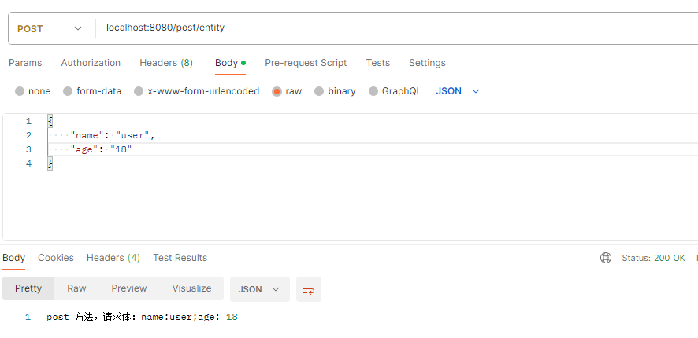
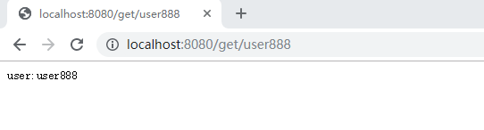
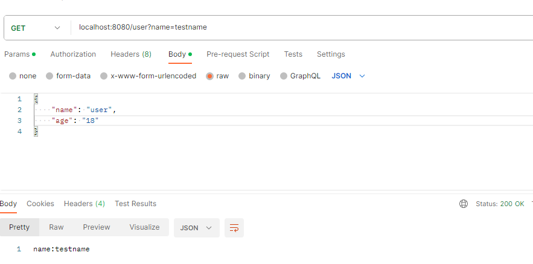

# 2.5 深入 Controller

经过前面几节的介绍与学习，我们实现基本的控制器、服务类，了解了依赖注入的基本使用和不同实现的标识与区别。作为应用的门面，控制器类中包含了应用的 API 的端点，这些端点用于接收用户请求并响应用户。

类似于 Spring Boot 框架的控制器，Micronaut 框架的控制器设计中，我们通过注解来标识哪些类是控制器，哪些函数是 API 端点、 RESTful API 的 HTTP 方法是什么、URI 是什么以及如何获取用户请求数据等。

## 再看 Controller

在之前的学习中，我们知道为一个类添加注解 `@Controller`，即标明该类为控制器。如之前示例代码中的 `HelloController`：

```java
@Controller
public class HelloController {

    @Inject
    @Named("HelloOne")
    private HelloService helloService;

    @Inject
    @HelloQualifier("Three")
    private HelloService helloThreeService;

    @Get("/hello")
    @Produces(MediaType.TEXT_PLAIN)
    public String hello() {
        return helloThreeService.hello();
    }

    @Post("/echo")
    @Consumes(MediaType.TEXT_PLAIN)
    public String echo(String txt) {
        return helloThreeService.echo(txt);
    }
}
```

类似于 Spring Boot 框架，我们可以在 `@Controller` 注解中为整个控制器的 API 端点添加统一的 URI 前缀，比如我们添加一个前缀 `/v1`：

```java
@Controller("/v1")
public class HelloController {
//...
}
```

这样修改后，所有 API 端点都会添加前缀，比如原 `@Get("/hello")` 的完整 URI为 `http://localhost:8080/hello`，URI 将会变为 `http://localhost:8080/v1/hello`。

在 `@Controller` 中添加 URI 前缀，最大用途就是为整个控制类的 API 统一添加前缀，避免重复工作。需要这种配置比较常见的场景有两种，一种是整个控制器的 API 端点具有统一的前缀，减少重复字符的输入；二是在版本迭代升级后，我们需要实现新版本的 API 时，为旧版本 API 统一添加版本前缀，如示例中的 `/v1`（但需要注意的是，Micronaut 框架专门提供了版本化的能力，并不太需要这种方法解决版本问题）。

在注解 `@Controller` 中，我们可以看到，除了属性 `value` 用于配置 URI，还有 `produces` 用于配置响应数据类型（即响应头中的 `Content-Type`，默认为 `application/json`），还有 `consumes` 用于配置接收数据类型（即请求头中的 `Content-Type`，默认为 `application.json`）。

而这两个配置数据类型的参数，一般情况下都用不上。一是因为默认值即为 RESTful API 用得最多的 `application/json`，二是不同的 API 端口如果要指定数据类型，自行指定即可，不需要在控制器上统一修改。

## 控制器使用不同的 HTTP 方法

HTTP 的方法有：`HEAD`、`GET`、`PUT`、`POST`、`PATCH`、`DELETE`、`OPTIONS`、`TRACE` 和 `CONNECT`。

这些方法中，用于 REST API 的方法主要有：`GET`、`POST`、`PUT`、`PATCH` 和 `DELETE`。

语义上来讲，一般使用 `GET` 对应查询操作；`POST` 对应新建操作；`PUT` 和 `PATCH` 对应修改操作；`DELETE` 则对应删除操作。

在 Micronaut 控制器的实现中，以上这些方法都有对应的注解，这些注解可以直接将方法标明为对应的 HTTP 方法。常用的 REST API 方法示例代码如下：

```java
@Controller
public class MethodController {
    @Get("/get")
    public String getMethod(){
        return "get 方法";
    }

    @Put("/put")
    public String putMethod(@Body String body){
        return "put 方法，请求体：" + body;
    }

    @Patch("/patch")
    public String patchMethod(@Body String body){
        return "patch 方法，请求体：" + body;
    }

    @Post("/post")
    public String postMethod(@Body String body){
        return "post 方法，请求体：" + body;
    }
}
```
 
通过方法注解后，相应的 API 就只能通过对应的 HTTP 方法访问。

## 获取请求体数据

如上示例中，`PUT`、`PATCH`、`POST` 方法是可以传递请求体的，如果我们要接收请求体，需要使用注解  `@Body` 标明方法的形参，这样 Micronaut 框架才会把请求体数据绑定到对应的参数上。

示例中，我们这样的声明接收请求体：

```java
    @Post("/post")
    public String postMethod(@Body String body){
        return "post 方法，请求体：" + body;
    }
```

因为我们没有特别指明 `consumes`，框架就会以默认的 `applilcaiton/json` 格式接收请求体，这样 `String body` 中变量 `body` 将会以 json 字符串形式获得请求体。

我们知道 json 字符串是可以与实体进行序列化和反序列化的转换，所以我们也可以按照请求的 json 格式定义我们的实例，然后以此实例来接受请求体，实例类定义示例如下：

```java
public class PostBody {
    private String name;
    private int age;

    public String getName() {
        return name;
    }

    public void setName(String name) {
        this.name = name;
    }

    public int getAge() {
        return age;
    }

    public void setAge(int age) {
        this.age = age;
    }
}
```

REST API 示例如下：

```java
    @Post("/post/entity")
    public String postBodyMethod(@Body PostBody body){
        return "post 方法，请求体：" + body.toString();
    }
```

运行项目后，访问示例如下图：



## 定义 URI 路径变量

除去常用的请求体获取外，在 HTTP 方法的示例代码的，我们看到示例的 API 都是固定的 URI，比如：`/get`，但实际中，按照 RESTful API 的设计风格，URI 中某段代表的同类可变数据，比如用户名：`/get/user1`、`/get/user2`。

那么，这种情况下，我们在 URI 定义中就会采用路径变量，通过这个变量来接受用户不同的请求，示例代码如下：

```java
@Controller
public class UriController {
    @Get("/get/{user}")
    public String getUser(@PathVariable String user) {
        return "user:" + user;
    }
}
```

示例中，`{user}` 即代表变量。而方法参数中 `@PathVariable` 注解代表此变量为路径变量， URI 中的变量如果与形参名字一样，此注解也可以不写。

项目运行后，访问此 URI，如下图：



## 一个方法支持多个 URI

在上面的实践中，我们看到控制器中一个方法只会配置一个 URI，这也是我们很常规的使用方法，但是凡事总有但是！

但是，有些特殊情况下，比如我们要对同一个方法指定多个 URI 时，就需要通过以下的方式来实现，示例代码如下：

```java
@Controller
public class UriController {
    @Get("/get/{user}")
    public String getUser(@PathVariable String user) {
        return "user:" + user;
    }

    @Get(uris = {"/get/default/{user}", "/get/other/{user}"})
    public String getUsers(@PathVariable String user) {
        return "user:" + user;
    }
}
```

我们需要注意到，默认情况下，我们定义一个 URI 时，其实是对注解的 `uri` 属性进行的赋值。在定义多个 URI 时，我们则是对 `uris` 进行赋值。

## 获取查询参数

上面介绍中，我们知道 `POST` 这些方法主要传递数据的方式为请求体，`GET` 方法传递数据的方法则主要是查询参数。如： `/user?name=xxxx`。

在控制器方法中，我们可以通过为形参指定注解 `@QueryValue` 来标明参数来源是 URI 中的查询参数，示例代码如下：

```java
@Controller
public class GetController {
    @Get("/user")
    public String getName(@QueryValue String name) {
        return "name:" + name;
    }
}
```

运行项目后，访问此 URI，如下图：



## 获取更多数据

HTTP 请求中，除去以上常见的请求体、URI 路径变量、查询参数等，实际还会有很多相关数据，比如请求体、Cookie等，这些数据，我们可以通过 HttpRequest 等注入的实例获取，也可以类比请求体的注解，直接在方法的参数中注入，以下是 Micronaut 框架中设计的一些注解：

|注解|描述|示例|
|--|--|--|
|[@Body](https://micronaut-projects.github.io/micronaut-docs-mn3/3.9.4/api/io/micronaut/http/annotation/Body.html)|从请求体绑定|@Body String body|
|[@CookieValue](https://micronaut-projects.github.io/micronaut-docs-mn3/3.9.4/api/io/micronaut/http/annotation/CookieValue.html)|从 cookie 绑定一个参数|@CookieValue String myCookie|
|[@Header](https://micronaut-projects.github.io/micronaut-docs-mn3/3.9.4/api/io/micronaut/http/annotation/Header.html)|从 HTTP 头绑定一个参数|@Header String requestId|
|[@QueryValue](https://micronaut-projects.github.io/micronaut-docs-mn3/3.9.4/api/io/micronaut/http/annotation/QueryValue.html)|从请求查询参数绑定|@QueryValue String myParam|
|[@Part](https://micronaut-projects.github.io/micronaut-docs-mn3/3.9.4/api/io/micronaut/http/annotation/Part.html)|从 multipart 请求绑定|@Part CompletedFileUpload file|
|[@RequestAttribute](https://micronaut-projects.github.io/micronaut-docs-mn3/3.9.4/api/io/micronaut/http/annotation/RequestAttribute.html)|从请求属性绑定。属性通常在过滤器中创建|@RequestAttribute String myAttribute|
|[@PathVariable](https://micronaut-projects.github.io/micronaut-docs-mn3/3.9.4/api/io/micronaut/http/annotation/PathVariable.html)|从请求路径中绑定|@PathVariable String id|
|[@RequestBean](https://micronaut-projects.github.io/micronaut-docs-mn3/3.9.4/api/io/micronaut/http/annotation/RequestBean.html)|将任何可绑定的值绑定到单个Bean对象|@RequestBean MyBean bean|
