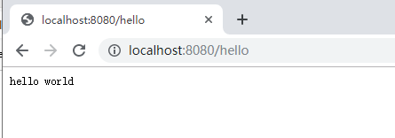
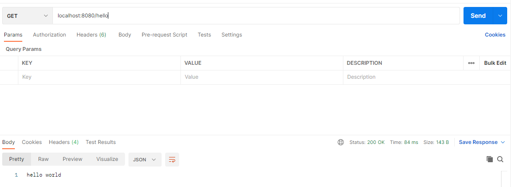
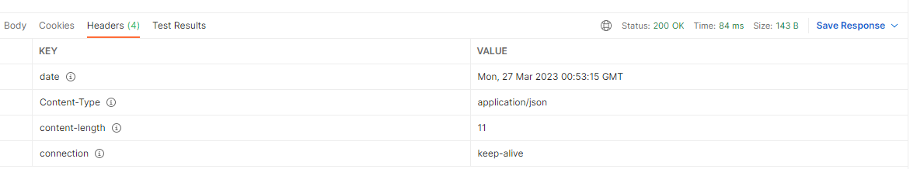
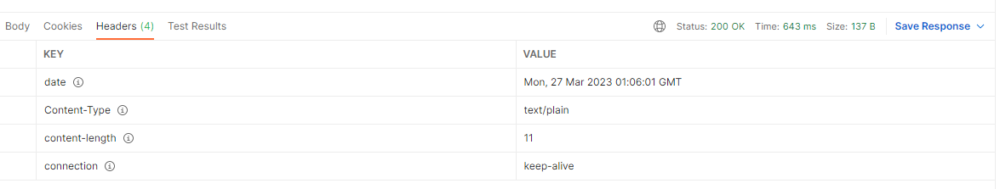
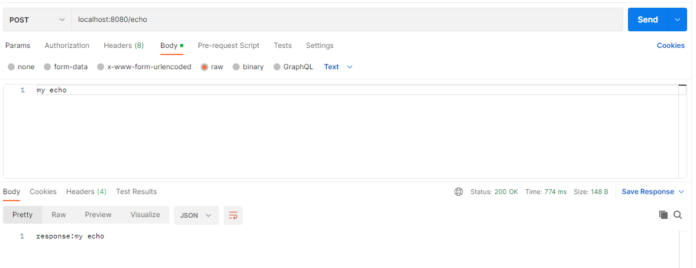

# 2.2 API 与控制器

在上一节中，我们介绍了应用的启动、环境相关等基础信息，但这个应用只是个空架子，不能提供任何响应。作为一个 Web 应用，对外交互的途径主要是通过 Http API。

类似于 Spring Boot 框架，Micronaut 框架也采用了注解的方式来标记哪些类、哪些函数是 API 的入口函数，并且在设计时，Micronaut 框架参加了 Spring Boot 框架的注解设计，让使用者尽量保持编码习惯的一致性。

Micronaut 框架中用于标记 API 入口的控制器类的注解为 `@Controller`，与 Spring Boot 框架名字一致，而 Http 方法的注解略有差异，整理了部分注解对比，见表 1。

**表 1**

|注解说明|Spring Boot|Micronaut|
|--|--|--|
|控制器|`@Controller` / `@RestController`|`@Controller`|
|Get 方法|`@GetMapping`|`@Get`|
|Post 方法|`@PostMapping`|`@Post`|

我们基于上一篇的 demo 项目 “firstdemo”，继续添加控制器实现。

## Controller

我们先创建一个控制器类 `HelloController`，然后我们为这个类添加注解 `@Controller`，代码示例如下：

```java
package fun.mortnon.demo;

import io.micronaut.http.annotation.Controller;

/**
 * @author dev2007
 * @date 2023/3/24
 */
@Controller
public class HelloController {
}
```

`@Controller` 的默认路径为 `/`，默认 http 响应中 `Content-Type` 为 `application/json`。

然后我们添加一个 `/hello` 的 API，http 方法为 Get，函数名为 `hello()` 代码如下：

```java
package fun.mortnon.demo;

import io.micronaut.http.annotation.Controller;
import io.micronaut.http.annotation.Get;

/**
 * @author dev2007
 * @date 2023/3/24
 */
@Controller
public class HelloController {
    
    @Get("/hello")
    public String hello(){
        return "hello world";
    }
}
```

以上代码表明，`@Controller` 的默认路径 `/` 结合 `/hello`，表明 `hello()` 的完整 API 为 `/hello`，http 响应中 `Content-Type` 为 `application/json`。我们成功运行项目后，调用 `/hello`，http 响应会响应一个字符串 `hello world`。如图 1。

**图 1**



## Content-Type

以上，我们成功开发了一个名为 `/hello` 的 API，但我们还是使用浏览器进行了验证，我们接着将使用 Postman 工具进行 API 的测试和验证，如果没有特别说明使用浏览器，则默认使用 Postman。Postman 的官方下载地址为 https://www.postman.com/downloads/ 。

我们打开 Postman，输入 API ``，方法选择 `Get`，点击 “Send” 后，结果如图 2：

**图 2**



从图中可以看到，`/hello` 的响应结果与浏览器一致，然后我们观察响应头，如图 3：

**图 3**



从以上可以看到，响应头中 `Content-Type` 确实为默认的 `application/json`。虽然我们定义的 `hello()` 响应的一个纯文本，纯文本在 `application/json` 下是不会报错的，但始终不是很合适，我们尝试一下适合纯文本的类型 `text/plain`，代码如下：

```java
package fun.mortnon.demo;

import io.micronaut.http.MediaType;
import io.micronaut.http.annotation.Controller;
import io.micronaut.http.annotation.Get;
import io.micronaut.http.annotation.Produces;

/**
 * @author dev2007
 * @date 2023/3/24
 */
@Controller
public class HelloController {

    @Get("/hello")
    @Produces(MediaType.TEXT_PLAIN)
    public String hello(){
        return "hello world";
    }
}
```

以上代码中，我们为函数 `hello()` 增加了一个注解 `@Produces`，同时为它指定一个枚举 `MediaType.TEXT_PLAIN`，该枚举对应的即为 `text/plain`。我们重新运行项目，并再次访问 `/hello`，然后切换到响应头，如图 4：

**图 4**



可以看到响应头中 `Content-Type` 变更为了 `text/plain`。Micronaut 中定义的更多的类型值，可以查看类 `io.micronaut.http.MediaType` 中的定义。

另外还需要注意在 `@Controller` 中有一个属性 `produces`，可以为整个控制器指定 `Content-Type` 类型。

## Http 方法

在以上的示例中，我们使用了注解 `@Get` 标识该 API 为接受 `Get` 方法的 http 请求。类似的，Micronaut 还提供了很多 http 方法，如表 2：

**表 2**

|注解|方法|
|--|--|
|`@Delete`|Delete|
|`@Get`|Get|
|`@Head`|Head|
|`@Options`|Options|
|`@Patch`|Patch|
|`@Post`|Post|
|`@Put`|Put|
|`@Trace`|Trace|

以上这些 http 方法中，我们如果使用 Restful API 风格，常用的方法主要是 `@Delete`、`@Get`、`@Patch`、`@Post` 和 `@Put`。

我们尝试增加一个 `Post` 方法的 API `/echo`，函数名为 `echo(String txt)`，它将接收我们传递的一个字符串，然后添加一个“response:”后，响应回来，代码如下：

```java
    @Post("/echo")
    @Consumes(MediaType.TEXT_PLAIN)
    public String echo(String txt) {
        return "response:" + txt;
    }
```

由于我们接收参数考虑为纯文本，所以我们为函数增加了一个注解 `@Consumes(MediaType.TEXT_PLAIN)`，标明这个函数的参数 `String txt` 的数据来源于 API `/echo` 传入的请求体。我们重新运行项目，然后访问 API `/echo`，如图 5：

**图 5**



可以看到，响应体符合函数的设计。

## 小结

本节我们初步了解了 Micronaut 针对控制器中 http 方法及请求体和响应体中 `Content-Type` 相关的注解，并能初步开发出可用的 API。
