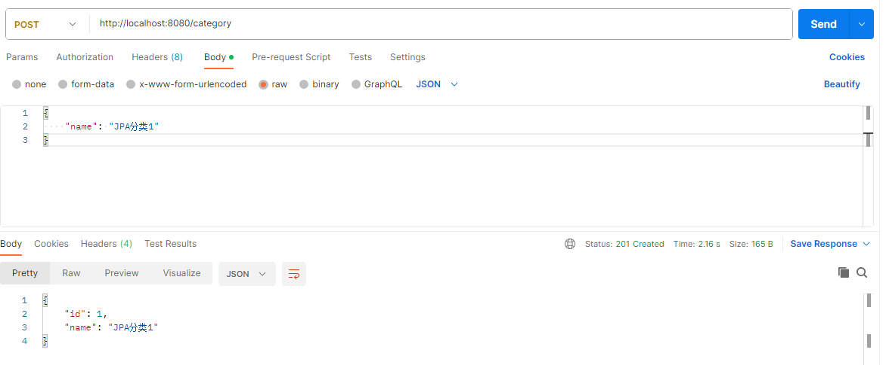
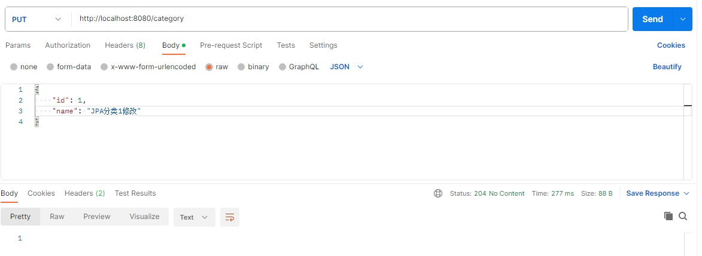
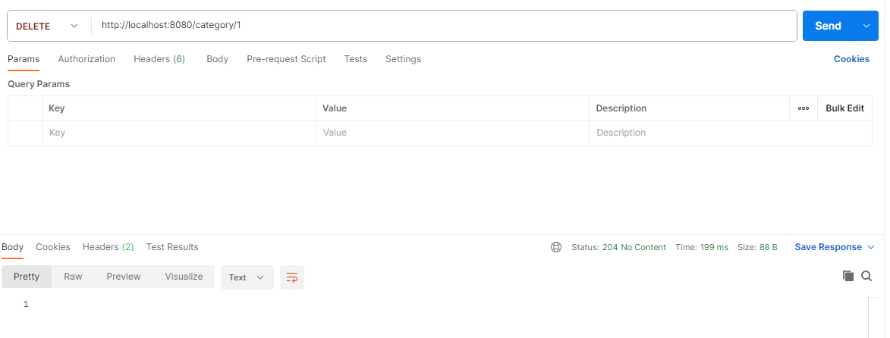

# 3.2 JPA

作为 Java 的亲儿子 JPA（Java Persistence API），它定义了一套持久化 API 规范，然后再与 Hibernate 结合以后，迸发出了很大的能量。

如果再结合 Micronaut 针对 JPA 所定义的常用 CRUD 函数，我们将减少很多重复的代码开发工作。

## 添加依赖

我们在 `pom.xml` 中添加以下依赖：

```xml
    <dependency>
        <groupId>io.micronaut.serde</groupId>
        <artifactId>micronaut-serde-jackson</artifactId>
    </dependency>
    <dependency>
      <groupId>jakarta.annotation</groupId>
      <artifactId>jakarta.annotation-api</artifactId>
      <scope>compile</scope>
    </dependency>
    <dependency>
      <groupId>io.micronaut.sql</groupId>
      <artifactId>micronaut-hibernate-jpa</artifactId>
      <scope>compile</scope>
    </dependency>
    <dependency>
      <groupId>io.micronaut.sql</groupId>
      <artifactId>micronaut-jdbc-hikari</artifactId>
      <scope>compile</scope>
    </dependency>
    <dependency>
      <groupId>com.h2database</groupId>
      <artifactId>h2</artifactId>
      <scope>runtime</scope>
    </dependency>
```

需要注意的是，JPA 使用的注解来源于依赖 `jakarta.annotation-api`，所以该依赖项一定要有。我们使用 H2 作为验证用数据库，所以不需要额外引用 JDBC 驱动。`micronaut-jdbc-hikari` 封装的对接 hikari 连接池的依赖，而 `micronaut-hibernate-jpa` 则是使用 Hibernate JPA 的核心依赖。`micronaut-serde-jackson` 带有实体的序列化注解，也是必需的。

## 添加配置

### 数据库连接

不论我们使用的是哪种数据库，我们都需要在 `application.yml` 文件中配置数据库连接，当前我们使用的 H2 数据库配置示例如下：

```yaml
datasources:
  default:
    url: jdbc:h2:mem:default;DB_CLOSE_DELAY=-1;DB_CLOSE_ON_EXIT=FALSE
    username: sa
    password: ""
    driverClassName: org.h2.Driver
```

### JPA

因为我们使用的是 Hibernate JPA，所以我们还可以针对 Hibernate 提供的配置项，在 `application.yml` 中进行配置，如下示例：

```yaml
jpa:
  default:
    properties:
      hibernate:
        hbm2ddl:
          auto: update
        show_sql: true
```

如果我们不想使用 Hibernate 相关特性，我们也可以不按以上配置，仅配置 JPA 相关的实体扫描包名称，如下示例：

```yaml
jpa:
  default:
    entity-scan:
        packages: 'fun.mortnon.demo.models'
```


## 定义数据实体

与上接对接 MyBatis 框架的实战中一样，我们定义相应的数据实体 `Category`，唯一的区别是我们需要使用 JPA 的注解标明实体。

- `Category.java`

```java
package fun.mortnon.demo.models;

import io.micronaut.serde.annotation.Serdeable;

import javax.persistence.Column;
import javax.persistence.Entity;
import javax.persistence.GeneratedValue;
import javax.persistence.Id;
import javax.persistence.Table;

import static javax.persistence.GenerationType.AUTO;

/**
 * @author dev2007
 * @date 2023/9/20
 */
@Serdeable
@Entity
@Table(name = "category")
public class Category {

    @Id
    @GeneratedValue(strategy = AUTO)
    private Long id;


    @Column(name = "name", nullable = false, unique = true)
    private String name;

    public Category() {
    }

    public Category(String name) {
        this.name = name;
    }

    public Long getId() {
        return id;
    }

    public void setId(Long id) {
        this.id = id;
    }

    public String getName() {
        return name;
    }

    public void setName(String name) {
        this.name = name;
    }
}
```

以上代码中，`@Serdeable` 注解代表类可以序列化，用途等同于实现 `Serializable`，但之所于要专门设计一个注解，也是为了解决项目编译为 Naitive Image 应用时，很多元信息都会丢失，Micronaut 框架可以使用此注解处理相关的静态化编译。

`@Entity` 注解是 JPA 的注解，代表该类是一个实体。`@Table(name = "category")` 注解则代表该类映射到数据库表，`name` 代表相应的表名。

而针对属性的注解中，`@Id` 代表该属性为主键，每一个有 `@Table` 注解的类一定要有一个属性标明为 `@Id`。`@Column` 注解对应具体的表字段。

## 配置注解处理器

我们还需要在 `pom.xml` 的 `annotationProcessorPaths` 中添加 hibernate-jpa 相关注解处理器，示例如下：

```xml
                    <annotationProcessorPaths combine.children="append">
                        <path>
                            <groupId>io.micronaut</groupId>
                            <artifactId>micronaut-inject-java</artifactId>
                            <version>${micronaut.version}</version>
                        </path>
                        <path>
                            <groupId>io.micronaut.data</groupId>
                            <artifactId>micronaut-data-processor</artifactId>
                            <version>${micronaut.data.version}</version>
                        </path>
                        <path>
                            <groupId>io.micronaut</groupId>
                            <artifactId>micronaut-http-validation</artifactId>
                            <version>${micronaut.version}</version>
                        </path>
                        <path>
                            <groupId>io.micronaut.serde</groupId>
                            <artifactId>micronaut-serde-processor</artifactId>
                            <version>${micronaut.serialization.version}</version>
                        </path>
                    </annotationProcessorPaths>
```

我们需要特别注意的是 `micronaut-data-processor` 就是与 `micronaut-data-hibernate-jpa` 相关的注解处理器，`micronaut-serde-processor` 是 `serde` 序列化相关的注解处理器。

## 创建 JPA 访问层

我们先定义一个接口 `CategoryRepository.java`，声明我们需要访问数据库的方法，示例如下：

```java
package fun.mortnon.demo;

import fun.mortnon.demo.models.Category;

import java.util.List;
import java.util.Optional;

/**
 * @author dev2007
 * @date 2023/9/20
 */
public interface CategoryRepository {
    Optional<Category> findById(long id);

    Category save(String name);

    void deleteById(long id);

    List<Category> findAll();

    int update(long id, String name);
}

```

然后我们再实现该接口，示例 `CategoryRepositoryImpl.java` 代码如下：

```java
package fun.mortnon.demo;

import fun.mortnon.demo.models.Category;
import jakarta.inject.Inject;
import jakarta.inject.Singleton;

import javax.persistence.EntityManager;
import javax.persistence.TypedQuery;
import javax.transaction.Transactional;
import java.util.List;
import java.util.Optional;

/**
 * @author dev2007
 * @date 2023/9/20
 */
@Singleton
public class CategoryRepositoryImpl implements CategoryRepository {

    @Inject
    private EntityManager entityManager;

    @Override
    @Transactional
    public Optional<Category> findById(long id) {
        return Optional.ofNullable(entityManager.find(Category.class, id));
    }

    @Override
    @Transactional
    public Category save(String name) {
        Category category = new Category(name);
        entityManager.persist(category);
        return category;
    }

    @Override
    @Transactional
    public void deleteById(long id) {
        findById(id).ifPresent(entityManager::remove);
    }

    @Override
    @Transactional
    public List<Category> findAll() {
        String sql = "SELECT g FROM Category AS g";
        TypedQuery<Category> query = entityManager.createQuery(sql, Category.class);
        return query.getResultList();
    }

    @Override
    @Transactional
    public int update(long id, String name) {
        return entityManager.createQuery("UPDATE Category SET name = :name where id = :id")
                .setParameter("name", name)
                .setParameter("id", id)
                .executeUpdate();
    }
}

```

以上代码可以看到，我们使用 `EntityManager` 进行了相应了数据库表的 CRUD 操作。除去这种方式外，我们还可以使用 Micronaut 框架封装的 JPA 标准 CRUD 操作实现，免去常规的 CRUD 编写工作量，在后面我们会专门介绍这一套方法。

## 创建控制器 API

我们再创建一个控制器，以便用于通过 API 进行数据的相关操作，示例代码如下：

- `CategoryController.java`

```java
package fun.mortnon.demo;

import fun.mortnon.demo.models.Category;
import io.micronaut.http.HttpResponse;
import io.micronaut.http.annotation.Body;
import io.micronaut.http.annotation.Controller;
import io.micronaut.http.annotation.Delete;
import io.micronaut.http.annotation.Get;
import io.micronaut.http.annotation.Post;
import io.micronaut.http.annotation.Put;
import jakarta.inject.Inject;

import java.util.List;

/**
 * @author dev2007
 * @date 2023/9/20
 */
@Controller("/category")
public class CategoryController {
    @Inject
    private CategoryRepository categoryRepository;

    @Get("/{id}")
    public Category show(Long id) {
        return categoryRepository.findById(id).orElse(null);
    }

    @Put("/")
    public HttpResponse<?> update(@Body Category category) {
        int numberOfEntitiesUpdated = categoryRepository.update(category.getId(), category.getName());
        return HttpResponse.noContent();
    }

    @Get(value = "/list")
    public List<Category> list() {
        return categoryRepository.findAll();
    }

    @Post("/")
    public HttpResponse<Category> save(@Body Category category) {
        Category result = categoryRepository.save(category.getName());
        return HttpResponse.created(result);
    }

    @Delete("/{id}")
    public HttpResponse<?> delete(Long id) {
        categoryRepository.deleteById(id);
        return HttpResponse.noContent();
    }
}

```

## 初始化数据库表

类似于 MyBatis 的示例一样，如果我们已经有了相应的数据库及表，那么我们此时已经可以运行项目进行验证了，但是我们在当前示例项目中使用的是 H2 数据库，H2 数据库作为内存数据库，在启动时肯定不会有我们的相应的数据库表，所以我们需要有一个方法在项目运行时先初始化我们的数据库表。

我们选用 Flyway 来初始化数据库表。

### 添加依赖

Micronaut 框架官方适配了 Flyway，我们首先添加 Flyway 相关依赖，在 `pom.xml` 中添加相应依赖：

```xml
    <dependency>
      <groupId>io.micronaut.flyway</groupId>
      <artifactId>micronaut-flyway</artifactId>
    </dependency>
```

### 添加配置

然后我们在 `application.yml` 中添加 Flyway 相应的配置，示例如下：

```yml
flyway:
  datasources:
    default:
      enabled: true
```

### 添加数据库表初始化 SQL

接着我们在 `resources` 目录新建目录 `db`，再在 `db` 目录下新建目录 `migration`，在此目录下放我们的初始化 SQL 文件 `V1__schema.sql`，文件更多的命名规则可以参看 Flyway 相关介绍。

- `V1__schema.sql`

```sql
DROP TABLE IF EXISTS Category;
DROP TABLE IF EXISTS BOOK;

CREATE TABLE Category (
  id    BIGINT auto_increment PRIMARY KEY NOT NULL,
  name VARCHAR(255) NOT NULL UNIQUE
);

CREATE TABLE BOOK (
  id    BIGINT auto_increment PRIMARY KEY NOT NULL,
  name VARCHAR(255)              NOT NULL,
  price DOUBLE NOT NULL,
  category_id BIGINT,
    constraint FKM1T3YVW5I7OLWDF32CWUUL7TA
    foreign key (CATEGORY_ID) references Category
);
```

## 验证

以上完成后，我们运行项目，通过  PostMan 调用 API 来验证数据库的读写功能是否正常。

### 添加数据

我们首先添加数据，使用接口 `POST http://localhost:8080/category`，请求体为：

```json
 {
    "name": "JPA分类1"
}
```

通过 PostMan 操作结果如图：



然后我们再创建第二条数据，请求体为：

```json
 {
    "name": "分类2"
}
```

### 查询数据

接着，我们查询列表数据，使用接口 `GET http://localhost:8080/category/list`，返回结果如下：

```json
[
    {
        "id": 1,
        "name": "JPA分类1"
    },
    {
        "id": 2,
        "name": "JPA分类2"
    }
]
```

通过以上添加数据和查询数据，我们验证了对数据库的读写功能都是正常的，我们再验证下修改和删除。

### 修改数据

我们使用接口 `PUT http://localhost:8080/category`，请求体如下：

```json
{
    "id": 1,
    "name": "JPA分类1修改"
}
```

在 PostMan 中操作结果如图：



### 查询指定数据

然后我们再使用接口 `GET http://localhost:8080/category/1`，查询 id 为 1 的指定数据，响应结果如下：

```json
{
    "id": 1,
    "name": "JPA分类1修改"
}
```

可以看到查询到数据确实已变化。

### 删除指定数据

最后，我们使用接口 `DELETE http://localhost:8080/category/1` 把 id 为 1 的数据删除掉。

在 PostMan 中操作结果如图：



删除成功后，查询接口中就不会再查到相应数据了。


## 小结

我们可以看到，JPA 由于有 Micronaut 框架的官方支持，开发者不需要添加粘合层代码，只需要按 JPA 的规范直接开发实体和数据库层就能成功访问。JPA 和 MyBatis 相同的优点就是可以由用户自行编写 SQL 语句，面对更复杂的查询需求更能游刃有余。

如本节中所提到的，如果我们进一步使用 Micronaut 框架封装的 JPA 标准 CRUD 操作实现，常规的 CRUD 编写工作量我们都不再需要，从要定义不同实体的数据层即可，只有需要 SQL 的复杂查询时，我们才会涉及到实际代码的编写，下一节我们将介绍一下两种方法如何结合使用。

Demo 代码参见：[JPA Demo](https://github.com/dev2007/micronaut-in-action-demo/tree/main/3.2-jpa)
