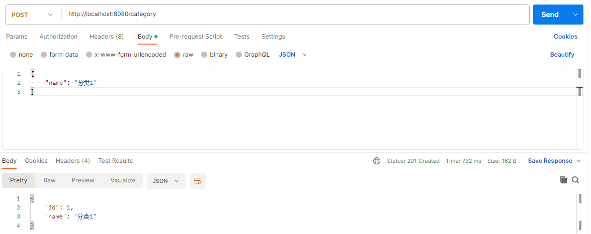
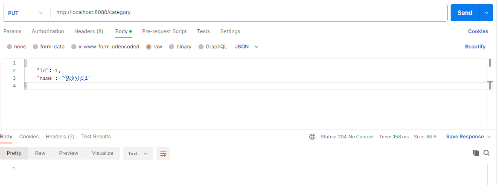
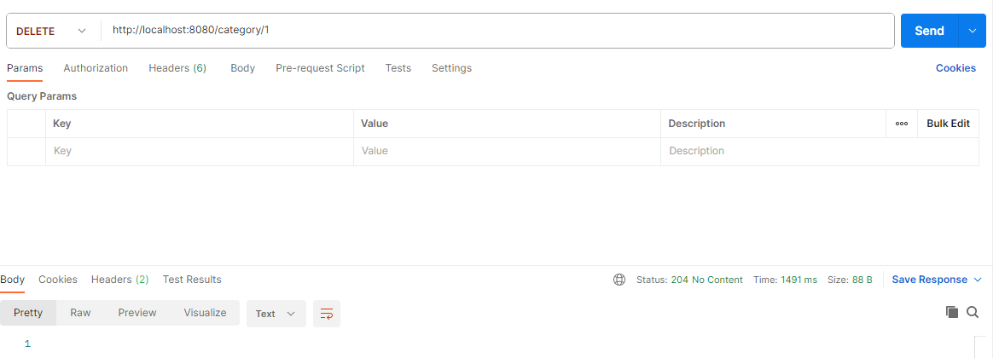

# 3.1 MyBatis

MyBatis 作为用得最多的 ORM 框架，虽然在 Micronaut 框架中，它的结合使用实际上并不像与 Spring Boot 框架一样无缝，但我们如果是将老项目改造为 Micronaut 项目，而老项目使用的就是 MyBatis 的话，我们还是得学会在 Micronaut 框架中如何使用它。

## 创建项目

我们不使用第 2 章实践控制器相关的项目，新建一个全新的项目，我们可以使用本地的 [Launch](/launch) 来创建项目，也可以使用 Micronaut 官网提供的[在线 Launch](https://micronaut.io/launch/) 来创建。

## 添加依赖

创建好后，我们添加相关的依赖，如下：

```xml
    <dependency>
      <groupId>io.micronaut.configuration</groupId>
      <artifactId>micronaut-jdbc-hikari</artifactId>
      <version>2.2.6</version>
    </dependency>
    <dependency>
      <groupId>org.mybatis</groupId>
      <artifactId>mybatis</artifactId>
      <version>3.5.13</version>
    </dependency>
    <dependency>
      <groupId>com.h2database</groupId>
      <artifactId>h2</artifactId>
      <version>2.2.222</version>
      <scope>runtime</scope>
    </dependency>
```

以上依赖中，`micronaut-jdbc-hikari` 封装的对接 hikari 连接池的依赖；`mybatis` 为我们使用的 MyBatis 框架依赖；`h2` 我们验证数据库操作的内存数据库。同时由于 H2 数据库依赖自带了 JDBC 驱动，我们不需要额外添加 JDBC 驱动依赖。实际项目中，如果我们使用的是 MySQL 数据库，我们还需要添加 MySQL 的驱动依赖，如 `mysql-connector-j`。

## 添加数据库配置

不论我们使用的是哪种数据库，我们都需要在 `application.yml` 文件中配置数据库连接，当前我们使用的 H2 数据库配置示例如下：

```yaml
datasources:
  default:
    url: jdbc:h2:mem:default;DB_CLOSE_DELAY=-1;DB_CLOSE_ON_EXIT=FALSE
    username: sa
    password: ""
    driverClassName: org.h2.Driver
```

## 配置 MyBatis 工厂

Micronaut 框架中，没有直接对 MyBatis 进行集成，所以我们需要一种方法将 Micronaut 框架注入的数据源和 MyBatis 绑定上。现在配置的 Bean 工厂就是解决这个问题的。

我们新建一个 `MybatisFactory` 类，定义如下：

```java
package fun.mortnon.demo;


import io.micronaut.context.annotation.Factory;
import jakarta.inject.Singleton;
import org.apache.ibatis.mapping.Environment;
import org.apache.ibatis.session.Configuration;
import org.apache.ibatis.session.SqlSessionFactory;
import org.apache.ibatis.session.SqlSessionFactoryBuilder;
import org.apache.ibatis.transaction.TransactionFactory;
import org.apache.ibatis.transaction.jdbc.JdbcTransactionFactory;

import javax.sql.DataSource;

/**
 * @author dev2007
 * @date 2023/9/18
 */
@Factory
public class MybatisFactory {
    private final DataSource dataSource;

    public MybatisFactory(DataSource dataSource) {
        this.dataSource = dataSource;
    }

    @Singleton
    public SqlSessionFactory sqlSessionFactory() {
        TransactionFactory transactionFactory = new JdbcTransactionFactory();

        Environment environment = new Environment("dev", transactionFactory, dataSource);
        Configuration configuration = new Configuration(environment);
        configuration.addMappers("fun.mortnon.demon.mapper");

        return new SqlSessionFactoryBuilder().build(configuration);
    }
}

```

在该类中，我们可以看到最终是通过该工厂类，可以实现一个 MyBatis 的 SqlSessionFactory 实例，这个实例后续可以直接通过 Micronaut 的依赖注入的注解使用。

我们需要特别注意是如下代码，该方法定义了项目中 MyBatis 的 Mapper 扫描包：

```java
configuration.addMappers("fun.mortnon.demo.mapper");
```

本步所做的工作，在 Spring Boot 框架中，由 MyBatis 自己实现的 Starter 处理了，所以不需要框架使用者独立配置。

## 定义数据实体

以上配置完成后，我们定义验证用的业务数据实体 `Category` 和 `Book`。

- `Category.java`

```java
package fun.mortnon.demo;

import com.fasterxml.jackson.annotation.JsonIgnore;
import io.micronaut.core.annotation.Introspected;
import io.micronaut.core.annotation.NonNull;
import io.micronaut.core.annotation.Nullable;

import javax.validation.constraints.NotNull;
import java.util.HashSet;
import java.util.Set;

/**
 * @author dev2007
 * @date 2023/9/18
 */
@Introspected
public class Category {
    @Nullable
    private Long id;

    @NotNull
    @NonNull
    private String name;

    @NonNull
    @JsonIgnore
    private Set<Book> books = new HashSet<>();

    public Category() {
    }

    public Category(@NonNull @NotNull String name) {
        this.name = name;
    }

    @Nullable
    public Long getId() {
        return id;
    }

    public void setId(@Nullable Long id) {
        this.id = id;
    }

    @NonNull
    public String getName() {
        return name;
    }

    public void setName(@NonNull String name) {
        this.name = name;
    }

    @NonNull
    public Set<Book> getBooks() {
        return books;
    }

    public void setBooks(@NonNull Set<Book> books) {
        this.books = books;
    }
}

```

- `Book.java`

```java
package fun.mortnon.demo;

import io.micronaut.core.annotation.Introspected;

/**
 * @author dev2007
 * @date 2023/9/18
 */

@Introspected
public class Book {
    private String id;
    private String name;
    private Double price;

    public Book() {
        
    }

    public String getId() {
        return id;
    }

    public void setId(String id) {
        this.id = id;
    }

    public String getName() {
        return name;
    }

    public void setName(String name) {
        this.name = name;
    }

    public Double getPrice() {
        return price;
    }

    public void setPrice(Double price) {
        this.price = price;
    }
}

```

两个数据实体示例中，我们需要注意 `@Introspected` 是自省注解，在普通 Java 项目运行下，缺失该注解没有问题。但如果我们的项目要编译为 GraalVM Native Image 应用时，一定要使用该注解，如果缺失该注解，会导致 Native Image 应用运行时，由于丢失实体相关元数据，无法确认数据如何解析。

## Mapper 的定义和实现

数据访问层定义中，我们不引入 MyBatis 的 xml 配置，我们直接通过注解写入我们需要使用的 SQL 语句。我们首先定义一个 Mapper，如下：

- `CategoryMapper.java`

```java
package fun.mortnon.demo.mapper;

import fun.mortnon.demo.Category;

import org.apache.ibatis.annotations.Delete;
import org.apache.ibatis.annotations.Insert;
import org.apache.ibatis.annotations.Options;
import org.apache.ibatis.annotations.Param;
import org.apache.ibatis.annotations.Select;
import org.apache.ibatis.annotations.Update;

import java.util.List;

/**
 * @author dev2007
 * @date 2023/9/18
 */
public interface CategoryMapper {
    @Select("select * from category where id=#{id}")
    Category findById(long id);

    @Insert("insert into category(name) values(#{name})")
    @Options(useGeneratedKeys = true, keyProperty = "id")
    void save(Category genre);

    @Delete("delete from category where id=#{id}")
    void deleteById(long id);

    @Update("update category set name=#{name} where id=#{id}")
    void update(@Param("id") long id, @Param("name") String name);

    @Select("select * from category")
    List<Category> findAll();
}

```

然后我们实现这个接口，如下：

- `CategoryMapperImpl.java`

```java
package fun.mortnon.demo.mapper;

import fun.mortnon.demo.Category;
import jakarta.inject.Inject;
import jakarta.inject.Singleton;
import org.apache.ibatis.session.SqlSession;
import org.apache.ibatis.session.SqlSessionFactory;

import java.util.List;

/**
 * @author dev2007
 * @date 2023/9/18
 */
@Singleton
public class CategoryMapperImpl implements CategoryMapper {
    @Inject
    private SqlSessionFactory sqlSessionFactory;

    private CategoryMapper getMapper(SqlSession sqlSession) {
        return sqlSession.getMapper(CategoryMapper.class);
    }

    @Override
    public Category findById(long id) {
        try (SqlSession sqlSession = sqlSessionFactory.openSession()) {
            return getMapper(sqlSession).findById(id);
        }
    }

    @Override
    public void save(Category category) {
        try (SqlSession sqlSession = sqlSessionFactory.openSession()) {
            getMapper(sqlSession).save(category);
            sqlSession.commit();
        }
    }

    @Override
    public void deleteById(long id) {
        try (SqlSession sqlSession = sqlSessionFactory.openSession()) {
            getMapper(sqlSession).deleteById(id);
            sqlSession.commit();
        }
    }

    @Override
    public void update(long id, String name) {
        try (SqlSession sqlSession = sqlSessionFactory.openSession()) {
            getMapper(sqlSession).update(id, name);
            sqlSession.commit();
        }
    }

    @Override
    public List<Category> findAll() {
        try (SqlSession sqlSession = sqlSessionFactory.openSession()) {
            return getMapper(sqlSession).findAll();
        }
    }
}

```

## 创建控制器 API

我们再创建一个控制器，以便用于通过 API 进行数据的相关操作，示例代码如下：

- `CategoryController.java`

```java
package fun.mortnon.demo;

import fun.mortnon.demo.mapper.CategoryMapper;
import io.micronaut.http.HttpResponse;
import io.micronaut.http.annotation.Body;
import io.micronaut.http.annotation.Controller;
import io.micronaut.http.annotation.Delete;
import io.micronaut.http.annotation.Get;
import io.micronaut.http.annotation.Post;
import io.micronaut.http.annotation.Put;
import jakarta.inject.Inject;

import java.util.List;

/**
 * @author dev2007
 * @date 2023/9/18
 */
@Controller("/category")
public class CategoryController {
    @Inject
    private CategoryMapper categoryMapper;

    @Get("/{id}")
    public Category show(Long id) {
        return categoryMapper.findById(id);
    }

    @Put("/")
    public HttpResponse<?> update(@Body Category category) {
        categoryMapper.update(category.getId(), category.getName());
        return HttpResponse.noContent();
    }

    @Get(value = "/list")
    public List<Category> list() {
        return categoryMapper.findAll();
    }

    @Post("/")
    public HttpResponse<Category> save(@Body Category category) {
        categoryMapper.save(category);

        return HttpResponse.created(category);
    }

    @Delete("/{id}")
    public HttpResponse<?> delete(Long id) {
        categoryMapper.deleteById(id);
        return HttpResponse.noContent();
    }
}

```

## 初始化数据库表

如果我们已经有了相应的数据库及表，那么我们此时已经可以运行项目进行验证了，但是我们在当前示例项目中使用的是 H2 数据库，H2 数据库作为内存数据库，在启动时肯定不会有我们的相应的数据库表，所以我们需要有一个方法在项目运行时先初始化我们的数据库表。

我们选用 Flyway 来初始化数据库表。

### 添加依赖

Micronaut 框架官方适配了 Flyway，我们首先添加 Flyway 相关依赖，在 `pom.xml` 中添加相应依赖：

```xml
    <dependency>
      <groupId>io.micronaut.flyway</groupId>
      <artifactId>micronaut-flyway</artifactId>
    </dependency>
```

### 添加配置

然后我们在 `application.yml` 中添加 Flyway 相应的配置，示例如下：

```yml
flyway:
  datasources:
    default:
      enabled: true
```

### 添加数据库表初始化 SQL

接着我们在 `resources` 目录新建目录 `db`，再在 `db` 目录下新建目录 `migration`，在此目录下放我们的初始化 SQL 文件 `V1__schema.sql`，文件更多的命名规则可以参看 Flyway 相关介绍。

- `V1__schema.sql`

```sql
DROP TABLE IF EXISTS Category;
DROP TABLE IF EXISTS BOOK;

CREATE TABLE Category (
  id    BIGINT auto_increment PRIMARY KEY NOT NULL,
  name VARCHAR(255) NOT NULL UNIQUE
);

CREATE TABLE BOOK (
  id    BIGINT auto_increment PRIMARY KEY NOT NULL,
  name VARCHAR(255)              NOT NULL,
  price DOUBLE NOT NULL,
  category_id BIGINT,
    constraint FKM1T3YVW5I7OLWDF32CWUUL7TA
    foreign key (CATEGORY_ID) references Category
);
```

## 验证

以上配置完成后，我们就可以验证接口能否正确与数据库表交互了。由于我们是新建的表，没有预置数据，所以我们先添加数据，再查询数据，最后删除数据进行验证。

### 添加数据

我们首先添加数据，使用接口 `POST http://localhost:8080/category`，请求体为：

```json
 {
    "name": "分类1"
}
```

在 PostMan 中操作结果如图：



然后我们再创建第二条数据，请求体为：

```json
 {
    "name": "分类2"
}
```

### 查询数据

接着，我们查询列表数据，使用接口 `GET http://localhost:8080/category/list`，返回结果如下：

```json
[
    {
        "id": 1,
        "name": "分类1"
    },
    {
        "id": 2,
        "name": "分类2"
    }
]
```

通过以上添加数据和查询数据，我们验证了对数据库的读写功能都是正常的，我们再验证下修改和删除。

### 修改数据

我们使用接口 `PUT http://localhost:8080/category`，请求体如下：

```json
{
    "id": 1,
    "name": "修改分类1"
}
```

在 PostMan 中操作结果如图：



### 查询指定数据

然后我们再使用接口 `GET http://localhost:8080/category/1`，查询 id 为 1 的指定数据，响应结果如下：

```json
{
    "id": 1,
    "name": "修改分类1"
}
```

可以看到查询到数据确实已变化。

### 删除指定数据

最后，我们使用接口 `DELETE http://localhost:8080/category/1` 把 id 为 1 的数据删除掉。

在 PostMan 中操作结果如图：



删除成功后，查询接口中就不会再查到相应数据了。

## 小结

本节中，我们在 Micronaut 项目中使用了 MyBatis 框架用于数据库访问。由于 Micronaut 框架本身没有官方的适配，所以我们利用 MyBatis 自身初始化方法进行数据源的绑定配置，然后使用 Micronaut 框架本身的依赖注入工厂 `@Factory` 将 MyBatis 的对象实现 bean 的统一管理，而 Mapper 接口需要实现，在实现类中使用 MyBatis 自身扫描 Mapper 定义实现最终的数据库访问。

简而言之，通过整个代码实战，我们可以看到，使用 MyBatis 访问数据库，业务的使用方式都符合我们常规的使用方式，但 MyBatis 本身需要编写很多粘合层的代码，而且不支持响应式编程，不能充分利用 Micronaut 框架的异步能力。如果不是老项目迁移为 Micronaut 框架，我个人不建议使用 MyBatis 访问数据库。

Demo 代码参见：[MyBatis Demo](https://github.com/dev2007/micronaut-in-action-demo/tree/main/3.1-mybatis)
