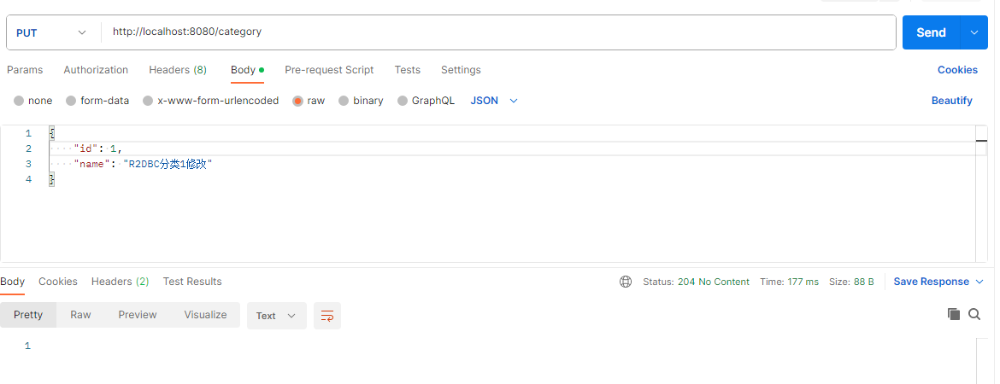

# 3.4 R2DBC

R2DBC 最大的特点在于它提供了响应式的接口，可以和 Micronaut 的响应式结合起来，达到最好的异步编程。另外，它和 JPA 一样，框架也提供了很多内置仓库接口，可以免去很多常规 CRUD 代码的编写。

## 添加依赖

我们在 `pom.xml` 中添加以下依赖：

```xml
        <dependency>
            <groupId>io.micronaut.data</groupId>
            <artifactId>micronaut-data-r2dbc</artifactId>
        </dependency>
        <dependency>
            <groupId>io.r2dbc</groupId>
            <artifactId>r2dbc-h2</artifactId>
            <version>1.0.0.RELEASE</version>
            <scope>runtime</scope>
        </dependency>
        <dependency>
            <groupId>com.h2database</groupId>
            <artifactId>h2</artifactId>
            <version>2.2.222</version>
            <scope>runtime</scope>
        </dependency>
        <dependency>
            <groupId>io.micronaut.configuration</groupId>
            <artifactId>micronaut-jdbc-hikari</artifactId>
            <version>2.2.6</version>
        </dependency>
        <dependency>
            <groupId>io.micronaut.flyway</groupId>
            <artifactId>micronaut-flyway</artifactId>
        </dependency>
```

`micronaut-data-r2dbc` 是 Micronaut 框架支持 R2DBC 提供的适配依赖；`r2dbc-h2` 是 H2 数据库的 R2DBC 官方依赖，如果使用其他数据库，选用对应的依赖即可，如： `r2dbc-mysql`；最后我们还是选择 H2 数据库作为验证。最后由于我们使用了 flyway，所以需要使用 JDBC 的连接池和 flyway 的依赖：`micronaut-jdbc-hikari` 和 `micronaut-flyway`。

## 添加配置

### R2DBC 配置

不论我们使用的是哪种数据库，我们都需要在 `application.yml` 文件中配置 R2DBC 的数据库连接，当前我们使用的 H2 数据库配置示例如下：

```yaml
r2dbc:
  datasources:
    default:
      driver: h2
      url: r2dbc:h2:mem:///default
      username: sa
      password: ""
```

### Flyway 配置

由于我们使用了 flyway 预置数据，我们需要配置 flyway，并且为 flyway 的数据库连接，在 `application.yml` 中添加如下配置：

```yaml
datasources:
  default:
    url: jdbc:h2:mem:default;DB_CLOSE_DELAY=-1;DB_CLOSE_ON_EXIT=FALSE
    username: sa
    password: ""
    driverClassName: org.h2.Driver

flyway:
  datasources:
    default:
      enabled: true
```

我们可以看出来，在 `R2DBC` 的数据源配置，使用的协议为 `r2dbc`，示例中的 url 为：`r2dbc:h2:mem:///default`；而 `JDBC` 的数据源配置中，使用的协议为 `jdbc`，示例中的 url 为： `jdbc:h2:mem:default;DB_CLOSE_DELAY=-1;DB_CLOSE_ON_EXIT=FALSE`。

如果我们不使用 flyway，`datasources` 是不需要配置的。

## 定义数据实体

我们像在 MyBatis 和 JPA 的示例一样，需要定义一个数据实体，但它的注解完全不一样，示例如下：

- `Category.java`

```java
package fun.mortnon.demo.models;

import io.micronaut.data.annotation.GeneratedValue;
import io.micronaut.data.annotation.Id;
import io.micronaut.data.annotation.MappedEntity;
import io.micronaut.serde.annotation.Serdeable;

/**
 * @author dev2007
 * @date 2023/9/20
 */
@Serdeable
@MappedEntity("category")
public class Category {

    @Id
    @GeneratedValue
    private Long id;


    private String name;

    public Category() {
    }

    public Category(String name) {
        this.name = name;
    }

    public Long getId() {
        return id;
    }

    public void setId(Long id) {
        this.id = id;
    }

    public String getName() {
        return name;
    }

    public void setName(String name) {
        this.name = name;
    }
}
```

注意以上示例中的注解 `@MappedEntity`，它代表实体对应的数据库表。针对属性的注解中，`@Id` 代表该属性为主键，实体类中一定要有一个属性标明为 `@Id`。

## 创建仓库

我们使用 Micronaut 框架提供的内置仓库接口来实现最基本的 CRUD 功能，示例代码如下：

- `CategoryRepository.java`

```java
package fun.mortnon.demo;

import fun.mortnon.demo.models.Category;
import io.micronaut.data.model.query.builder.sql.Dialect;
import io.micronaut.data.r2dbc.annotation.R2dbcRepository;
import io.micronaut.data.repository.reactive.ReactorCrudRepository;

/**
 * @author dev2007
 * @date 2023/9/25
 */
@R2dbcRepository(dialect = Dialect.H2)
public interface CategoryRepository extends ReactorCrudRepository<Category, Long> {
}

```

可以看到我们定义了仓库的接口，然后直接继承了框架内置接口 `ReactorCrudRepository`，再声明一个注解 `@R2dbcRepository` 即可。需要注意的是，不同的数据库，需要使用不同的方言声明，比如这时就使用的 `Dialect.H2`。

## 创建控制器 API

最后，我们创建一个控制器，用于测试 CRUD 功能是否正确。示例代码如下：

- `CategoryController.java`

```java
package fun.mortnon.demo;

import fun.mortnon.demo.models.Category;
import io.micronaut.http.HttpResponse;
import io.micronaut.http.annotation.Body;
import io.micronaut.http.annotation.Controller;
import io.micronaut.http.annotation.Delete;
import io.micronaut.http.annotation.Get;
import io.micronaut.http.annotation.Post;
import io.micronaut.http.annotation.Put;
import jakarta.inject.Inject;
import reactor.core.publisher.Flux;
import reactor.core.publisher.Mono;

/**
 * @author dev2007
 * @date 2023/9/20
 */
@Controller("/category")
public class CategoryController {

    @Inject
    private CategoryRepository categoryRepository;

    @Get("/{id}")
    public Mono<Category> show(Long id) {
        return categoryRepository.findById(id);
    }

    @Put("/")
    public Mono<HttpResponse<?>> update(@Body Category category) {
        return categoryRepository.update(category).map(cate -> HttpResponse.noContent());
    }

    @Get(value = "/list")
    public Flux<Category> list() {
        return categoryRepository.findAll();
    }

    @Post("/")
    public Mono<HttpResponse<Category>> save(@Body Category category) {
        return categoryRepository.save(category).map(HttpResponse::created);
    }

    @Delete("/{id}")
    public HttpResponse<?> delete(Long id) {
        categoryRepository.deleteById(id);
        return HttpResponse.noContent();
    }


}

```

到此时，我们可以看到，实现同的数据库访问，R2DBC 的代码量是最少的。我们再观察一下控制器的 API，里面使用的响应式编程的异步响应包装 `Mono` 和 `Flux`，如果我们使用 Micronaut 框架开发项目，又使用了异步特性的话，会看到很多这种响应包装。这也就是本章最开始说到的，R2DBC 和 Micronaut 框架最搭配的原因。

## 初始化数据库表

在上面的添加依赖和添加配置中，我们已经添加了 flyway 相关的配置用于初始化数据库，这里我们参照 MyBatis 示例和 JPA 示例，在 `resources` 目录新建目录 `db`，再在 `db` 目录下新建目录 `migration`，在此目录下放我们的初始化 SQL 文件 `V1__schema.sql`，文件更多的命名规则可以参看 Flyway 相关介绍。

- `V1__schema.sql`

```sql
DROP TABLE IF EXISTS Category;
DROP TABLE IF EXISTS BOOK;

CREATE TABLE Category (
  id    BIGINT auto_increment PRIMARY KEY NOT NULL,
  name VARCHAR(255) NOT NULL UNIQUE
);

CREATE TABLE BOOK (
  id    BIGINT auto_increment PRIMARY KEY NOT NULL,
  name VARCHAR(255)              NOT NULL,
  price DOUBLE NOT NULL,
  category_id BIGINT,
    constraint FKM1T3YVW5I7OLWDF32CWUUL7TA
    foreign key (CATEGORY_ID) references Category
);
```

## 验证

以上完成后，我们运行项目，通过  PostMan 调用 API 来验证数据库的读写功能是否正常。

### 添加数据

我们首先添加数据，使用接口 `POST http://localhost:8080/category`，请求体为：

```json
{
    "name": "R2DBC分类1"
}
```

通过 PostMan 操作结果如图：


然后我们再创建第二条数据，请求体为：

```json
 {
    "name": "R2DBC分类2"
}
```

### 查询数据

接着，我们查询列表数据，使用接口 `GET http://localhost:8080/category/list`，返回结果如下：

```json
[
    {
        "id": 1,
        "name": "R2DBC分类1"
    },
    {
        "id": 2,
        "name": "R2DBC分类2"
    }
]
```

通过以上添加数据和查询数据，我们验证了对数据库的读写功能都是正常的，我们再验证下修改和删除。

### 修改数据

我们使用接口 `PUT http://localhost:8080/category`，请求体如下：

```json
{
    "id": 1,
    "name": "R2DBC分类1修改"
}
```

在 PostMan 中操作结果如图：



### 查询指定数据

然后我们再使用接口 `GET http://localhost:8080/category/1`，查询 id 为 1 的指定数据，响应结果如下：

```json
{
    "id": 1,
    "name": "R2DBC分类1修改"
}
```

可以看到查询到数据确实已变化。

### 删除指定数据

最后，我们使用接口 `DELETE http://localhost:8080/category/1` 把 id 为 1 的数据删除掉。

在 PostMan 中操作结果如图：


删除成功后，查询接口中就不会再查到相应数据了。

## 小结

与 JPA 相对比，在 JPA 使用内置数据库的情况下，R2DBC 与 JPA 的使用体验一致的。所以在要选择使用哪种 ORM 框架的问题上，我个人这样建议：
1. 如果要考虑将应用最终编译为 Native Image 应用，不要使用 MyBatis。虽然 Micronaut 框架官方说支持的，但实际有问题
2. 如果业务会使用到较复杂的 SQL，使用 JPA，即可以用 EntityManger 写本地 SQL，也可以使用内置仓库接口，减少基础 CRUD 代码编写量
3. 如果要使用 Micronaut 框架的响应式异步特性，使用 R2DBC
4. 如果新入手 Micronuat 框架，使用 R2DBC

Demo 代码参见：[JPA Demo](https://github.com/dev2007/micronaut-in-action-demo/tree/main/3.2-jpa)

到此，针对 Micronaut 框架涉及的三种数据库 ORM 框架，我们都做了实战，数据库的主要内容就讲解完成，下一节我们将进阶讲解内置数据库接口的 CRUD 方法自定义规则。
