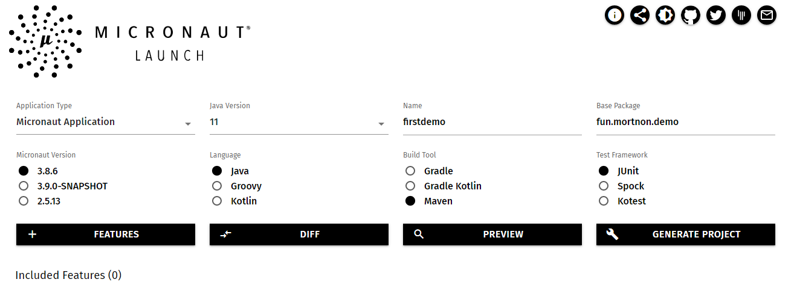
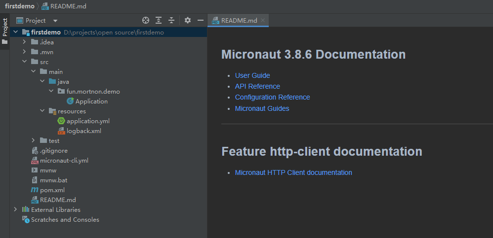
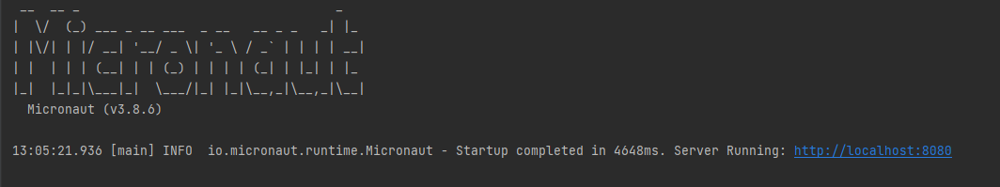
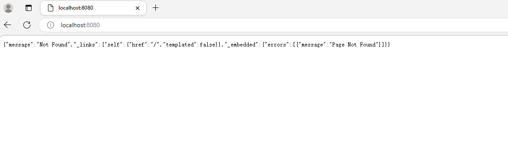
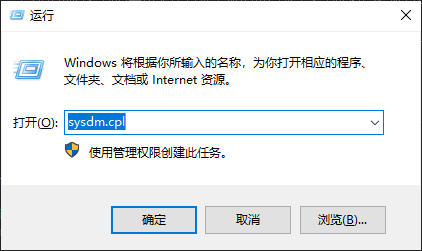
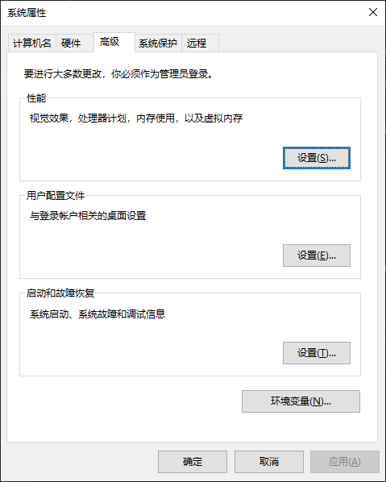
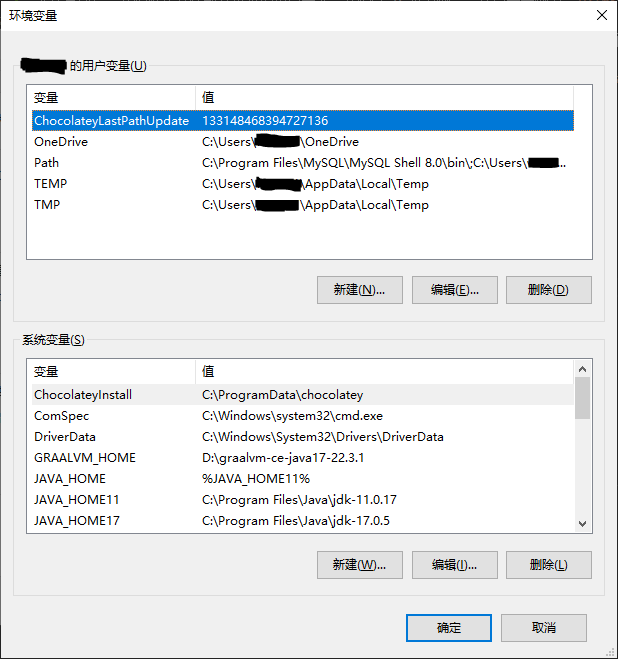
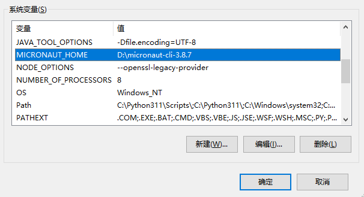
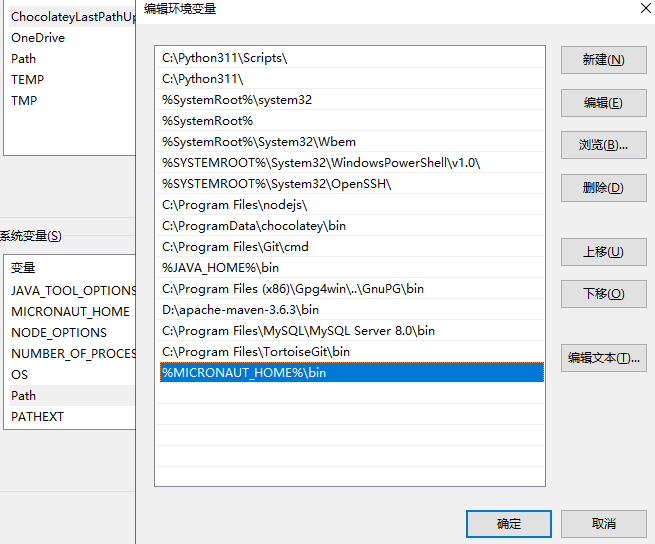

# 2. 第一个应用

经过第 1 章的介绍，我们大体了解了 Micronaut 是什么、能做什么，但是还不知道怎么做，从本章开始，我们将逐渐学会怎么使用 Micronaut。

在面对 Micronaut 这一个新框架时，我们常常会问到的第一个问题多半是：如何创建一个基于 Micronaut 的项目？

Micronaut 网站为我们在线提供了 Launch 支持，在这个网页上我们直接填写信息、选择配置来生成项目骨架或获取相应的 CLI 命令。

我们还可以使用官方提供的 CLI 用于项目的创建，可以通过安装 SDKMan、Homebrew、Macports 或者 Chocolatey 工具来安装 CLI 工具。在 Windows 环境下，如果你不熟悉这些工具，还可以直接下载 CLI 工具，配置后使用。

另外，虽然我们可以直接创建一个 Gradle 或 Maven 的空项目，然后再配置 Gradle 或者 Maven 的依赖项来使用 Micronaut，但使用标准工具会更方便。

以下，我们以 Windows 环境为例，分别讲解 Launch 和 CLI 如何创建项目。

## Launch

Micronaut Launch 的地址为：https://micronaut.io/launch 。

它当前支持生成多种应用类型：Micronut 应用、命令行应用、无服务器的函数应用、gRPC 应用以及消息驱动应用；开发语言支持 Java、Groovy 和 Kotlin，Java 当前支持 Java 8 、11 和 17 三个版本；构建工具可以选择 Gradle、Gradle Kotlin 或 Maven；测试框架支持 JUnit、Spock 和 Kotest。

我们只要选择应用类型、开发语言、Micronaut 版本、附加特性，再指定编译工具和测试框架，然后填写项目名字和基础包名，最后点击生成项目，就可以下载生成的项目压缩文件。

**图 1**



此处，我们选择生成 Micronaut Applicaton，即 Web 应用，Micronaut 版本选择当前最新的 3.8.7，不选择其他特性，开发语言选择 Java 11，编译工具选择 Maven，测试框架选择 JUnit，项目名字填写为 “firstdemo”，基础包名填写为 “fun.mortnon.demo”。然后我们点击 “Generate Project” 生成项目，选择“Download Zip”，即下载生成项目的压缩包。

压缩包下载成功后，我们解压压缩包后使用集成开发工具打开项目，此处我们选择 IntillJ IDEA。打开项目后，我们等待依赖项加载完成。最终项目结构如图 2 所示。

**图 2**



我们可以看到最外层有一个 pom.xml，表明这是一个包管理器为 Maven 的应用。源码 src 目录下，只有一个 Java 文件： Application.java。

打开 Application.java，我们直接按 IDEA 提示，点击运行按钮来运行项目。接着我们就可以看到项目开始编译，编译完成后，项目开始启动，最先可以看到 Micronaut 的 banner，最后我们可以看到应用启动完成，访问路径为 http://localhost:8080，如图 3。

**图 3**



我们在浏览器尝试访问 http://localhost:8080，可以看到一个报错信息，告诉我们没有对应的页面，如图 4。原因是我们没有实现 / 路径对应的代码，但能得到报错信息，说明项目的基本运行是没有问题的。

**图 4**



到目前为止，我们就将第一个应用运行起来了。

## CLI

上面我们介绍了通过 Launch 创建项目，下载项目，最终运行项目的完整过程。本节我们介绍一下在本地安装 CLI 工具来创建项目的方法。以下我们以 Windows 操作系统为例。

在 [Micronaut Launch 安装文档](..//launch/installation) 中我们知道，在 Windows 系统中，有 SDKman、Chocolatey 、本地二进制以及源码编译的方式，我们讲解一下本地二进制安装 CLI 来创建项目。

首先，我们从 http://micronaut.io/download.html 获取下载地址，目前下载的最新版本为 3.8.7，文件名为 `micronaut-cli-3.8.7.zip`。下载完成后，我们解压文件到某个盘的根目录下，我们以 D 盘为例，最终目录示例为 `D:\micronaut-cli-3.8.7`。

然后我们配置环境变量，Windows 7 操作系统，我们在“计算机”上点击右键，选择“属性”，再点击“高级系统设置”，即可进入“系统属性”界面。

Windows 10 操作系统，我们按组合键 “Windows图案” + “R”，打开“运行”，输入命令 `sysdm.cpl`，如图 5，然后按回车键，进入“系统属性”界面。

**图 5**



在“系统属性”界面中，我们点击标签“高级”，如图 6，然后点击“环境变量”进入环境变量界面，如图 7。

**图 6**



**图 7**



在环境变量界面中，我们要添加和修改两个环境变量，如表 1：

**表 1**

|环境变量名|值|
|--|--|
|新建 `MICRONAUT_HOME`|`D:\micronaut-cli-3.8.7`|
|编辑 `PATH`|`%MICRONAUT_HOME%\bin`|

操作完成后，如图 8 和图 9：

**图 8**



**图 9**



以上环境变量添加完成后，我们保存相应配置，然后我们打开一个命令提示符，输出 CLI 命令 `mn`，如果配置正确，将会进入如下的交互界面。

```bash
mn>
```

我们类比 Launch 中的项目配置，生成一个 Micronaut Applicaton，即 Web 应用，Micronaut 版本选择当前最新的 3.8.7，不选择其他特性，开发语言 Java 11，编译工具选择 Maven，测试框架选择 JUnit，项目名字为 “firstdemo”，基础包名为 “fun.mortnon.demo”，命令如下：

```bash
mn create-app --build=maven --jdk=11 --lang=java --test=junit fun.mortnon.demo.firstdemo
```

我们打开命令提示符，将目录切换到“D:\projects>”，然后执行命令，命令执行成功后，显示如下信息：

```bash
D:\projects>mn create-app --build=maven --jdk=11 --lang=java --test=junit fun.mortnon.demo.firstdemo
Picked up JAVA_TOOL_OPTIONS: -Dfile.encoding=UTF-8
| Application created at D:\projects\firstdemo
D:\projects>
```

最后我们参照 Lanuch 中的操作，打开项目，最终也能将第一个应用运行起来。
