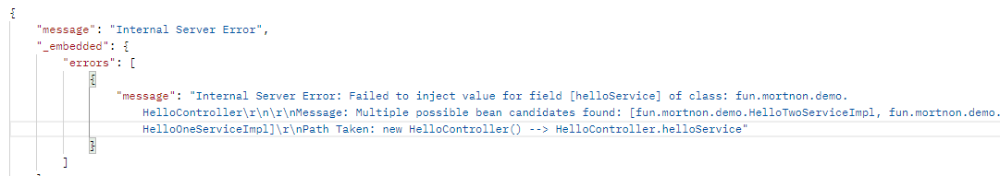
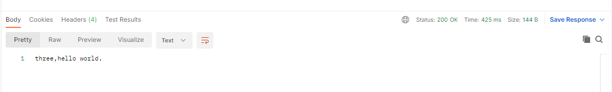

# 2.4 多态下的依赖注入

在上一节的例子中，我们直接声明了一个服务类 `HelloService`，但在实际项目中，我们可能会遇到多态的情况，这种情况下，我们就需要定义接口，并在使用不同的实例时，通过注解标识当前注入的是哪个实现类。

我们将上一节的 `HelloService` 类抽取为接口，然后继承实现两个类：`OneHelloService` 和 `TwoHelloService`。代码如下：

*HelloService 接口*

```java
package fun.mortnon.demo;

import jakarta.inject.Singleton;

/**
 * @author dev2007
 * @date 2023/5/26
 */
public interface HelloService {
    String hello();

    String echo(String txt);
}

```

*OneHelloService 类*

```java
package fun.mortnon.demo;

import jakarta.inject.Singleton;

/**
 * @author dev2007
 * @date 2023/5/29
 */
@Singleton
public class OneHelloService implements HelloService {
    @Override
    public String hello() {
        return "one,hello world";
    }

    @Override
    public String echo(String txt) {
        return "one response:" + txt;
    }
}

```

*TwoHelloService 类*

```java
package fun.mortnon.demo;

import jakarta.inject.Singleton;

/**
 * @author dev2007
 * @date 2023/5/29
 */
@Singleton
public class TwoHelloService implements HelloService {
    @Override
    public String hello() {
        return "two,hello world.";
    }

    @Override
    public String echo(String txt) {
        return "two response:" + txt;
    }
}

```

增加以上代码后，`HelloCtroller` 代码不变，项目成功启动后，我们访问接口 `localhost:8080/hello` 将会报错，报错如下：



报错信息中表明，当前 `helloService` 有多个可选的实现，所以它无法确认应该用哪个实例注入。

Micronaut 提供了多种方法用于明确注入的实例。

## @Named

`@Named` 使用方法在 `HelloController` 中如下：

```java
@Named("One")
private HelloService helloService;
```

它形成的识别规则为：

`@Named` 限定符（**One**）+ **HelloService**（不区分大小写）== 对应 bean 的简单名称（**OneHelloService**）

只要这个规则匹配到了实例，注入成功，就不会再报错。

但这种方法很考验接口和类的命名，需要正好让 `@Named` 的限定符加上接口名字的与实现类的名字一致。在实际项目中，这会让接口和类的命名变得非常古怪（比如示例中的 `HelloService` 和 `OneHelloService`），一般不太这样使用。

更直接使用方法是：直接对实现类添加 `@Named`，给实现类指定一个限定符。代码示例如下：

*OneHelloService 类*

```java
package fun.mortnon.demo;

import jakarta.inject.Named;
import jakarta.inject.Singleton;

/**
 * @author dev2007
 * @date 2023/5/29
 */
@Singleton
@Named("HelloOne")
public class OneHelloService implements HelloService {
    @Override
    public String hello() {
        return "one,hello world";
    }

    @Override
    public String echo(String txt) {
        return "one response:" + txt;
    }
}
```

*HelloController*

```java
package fun.mortnon.demo;

import io.micronaut.http.MediaType;
import io.micronaut.http.annotation.*;
import jakarta.inject.Inject;
import jakarta.inject.Named;

/**
 * @author dev2007
 * @date 2023/3/24
 */
@Controller
public class HelloController {

    @Inject
    @Named("HelloOne")
    private HelloService helloService;

    @Get("/hello")
    @Produces(MediaType.TEXT_PLAIN)
    public String hello() {
        return helloService.hello();
    }

    @Post("/echo")
    @Consumes(MediaType.TEXT_PLAIN)
    public String echo(String txt) {
        return helloService.echo(txt);
    }
}

```

以上代码中，我们对实现类 `OneHelloService` 添加了注解 `@Named("HelloOne")`，在注入时，也使用了同样的注解：

```java
    @Inject
    @Named("HelloOne")
    private HelloService helloService;
```

这样框架就可以通过名字直接找到对应的实现，生成实例了。

## @Qualifier

另一种区分实例的方法是通过注解 `@Qualifier`，我们新建两个 `HelloService` 的实现类 `HelloThreeServiceImpl` 和 `HelloFourServiceImpl` 进行说明。代码如下：

*HelloThreeServiceImpl 类*

```java
package fun.mortnon.demo;

import jakarta.inject.Singleton;

/**
 * @author dev2007
 * @date 2023/5/29
 */
@Singleton
public class HelloThreeServiceImpl implements HelloService {
    @Override
    public String hello() {
        return "three,hello world.";
    }

    @Override
    public String echo(String txt) {
        return "three response：" + txt;
    }
}

```

*HelloFourServiceImpl 类*

```java
package fun.mortnon.demo;

import jakarta.inject.Singleton;

/**
 * @author dev2007
 * @date 2023/5/29
 */
@Singleton
public class HelloFourServiceImpl implements HelloService {
    @Override
    public String hello() {
        return "four,hello world.";
    }

    @Override
    public String echo(String txt) {
        return "four response:" + txt;
    }
}

```

以上两个实现类，`HelloController` 代码不变的情况下，我们是没有方法识别出使用它们的实例的。我们新建一个注解 `HelloQualifier`，使用注解 `@Qualifier`，代码如下：

*HelloQualifier 注解*

```java
package fun.mortnon.demo;

import jakarta.inject.Qualifier;

import java.lang.annotation.Retention;

import static java.lang.annotation.RetentionPolicy.RUNTIME;

/**
 * @author dev2007
 * @date 2023/5/29
 */
@Qualifier
@Retention(RUNTIME)
public @interface HelloQualifier {
    String value();
}

```

然后我们使用自己创建的注解对上面两个实现类进行注解标识，代码如下：

*HelloThreeServiceImpl 类*

```java
package fun.mortnon.demo;

import jakarta.inject.Singleton;

/**
 * @author dev2007
 * @date 2023/5/29
 */
@Singleton
@HelloQualifier("Three")
public class HelloThreeServiceImpl implements HelloService {
    @Override
    public String hello() {
        return "three,hello world.";
    }

    @Override
    public String echo(String txt) {
        return "three response：" + txt;
    }
}

```

*HelloFourServiceImpl 类*

```java
package fun.mortnon.demo;

import jakarta.inject.Singleton;

/**
 * @author dev2007
 * @date 2023/5/29
 */
@Singleton
@HelloQualifier("four")
public class HelloFourServiceImpl implements HelloService {
    @Override
    public String hello() {
        return "four,hello world.";
    }

    @Override
    public String echo(String txt) {
        return "four response:" + txt;
    }
}

```

最后我们在 `HelloController` 中新增一个 `HelloService` 的注入，用于对比之前的方法，然后将方法中的实例修改为新的实例，`HelloController` 代码如下：

```java
package fun.mortnon.demo;

import io.micronaut.http.MediaType;
import io.micronaut.http.annotation.*;
import jakarta.inject.Inject;
import jakarta.inject.Named;

/**
 * @author dev2007
 * @date 2023/3/24
 */
@Controller
public class HelloController {

    @Inject
    @Named("HelloOne")
    private HelloService helloService;

    @Inject
    @HelloQualifier("Three")
    private HelloService helloThreeService;

    @Get("/hello")
    @Produces(MediaType.TEXT_PLAIN)
    public String hello() {
        return helloThreeService.hello();
    }

    @Post("/echo")
    @Consumes(MediaType.TEXT_PLAIN)
    public String echo(String txt) {
        return helloThreeService.echo(txt);
    }
}

```

以上修改完成后，我们成功运行项目，然后访问 `localhost:8080/hello`，得到响应结果如下：



响应证明实例确实为 `HelloThreeServiceImpl` 的实例。

## 更多

除了以上最常用的两种方法，Micronaut 还提供了基于泛型的 bean 的识别、主备选 bean 的支持，以及支持任意 bean 注入等。这些特性可以在某些场景下使用，用于解决我们的业务涉及到的技术问题，在需要时参照官方文档使用即可。
