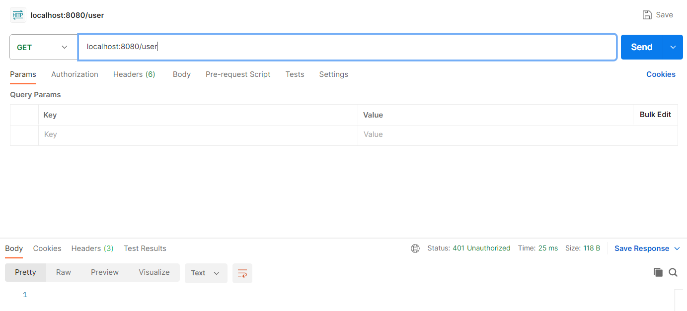
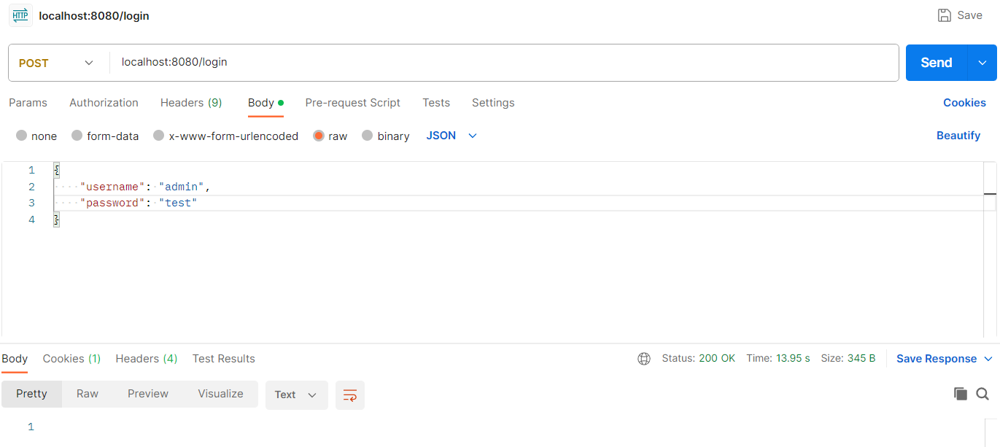
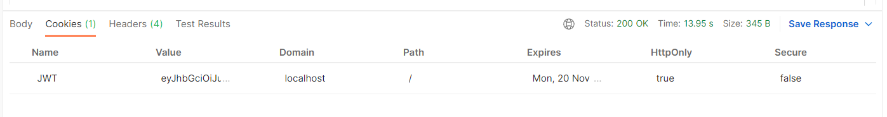
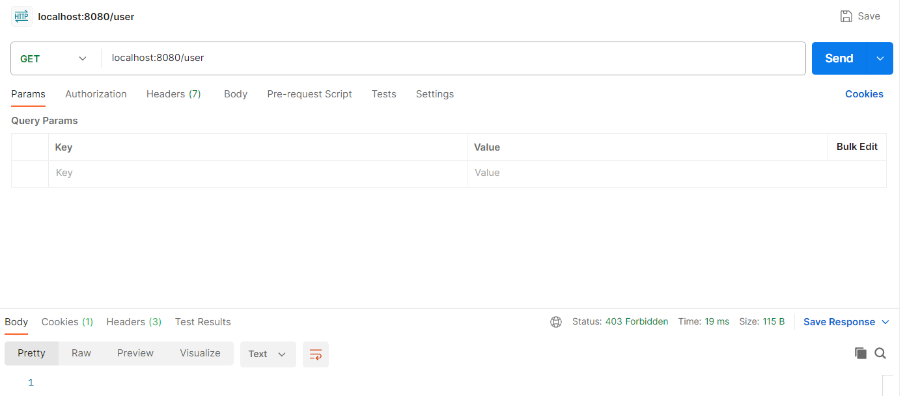
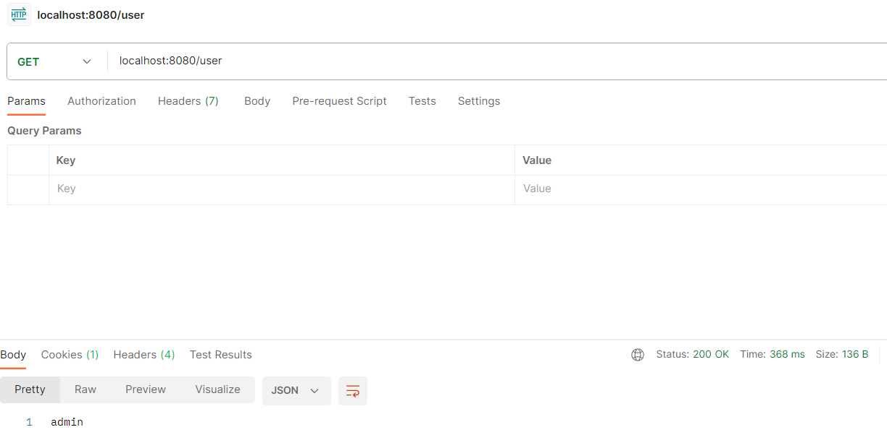

# 4.1 Cookie 认证

在上一节，我们知道 Micronaut 安全框架中支持 Cookie 的方式进行认证。

Cookie 认证方式是指在认证成功后将凭据存放在 Cookie 中，在之后对 API 的访问中，浏览器将会自动传递 Cookie，我们的服务或应用可以直接从 Cookie 中获取相应的凭证进行鉴权。

Micronaut 安全框架中，Cookie 认证方式的认证接口实现类和注解实现类分别为`JwtCookieLoginHandler` 和 `JwtCookieClearerLogoutHandler`。

## 添加依赖

我们先在 `pom.xml` 中添加相应的依赖项：

```xml
    <dependency>
      <groupId>io.micronaut.security</groupId>
      <artifactId>micronaut-security-jwt</artifactId>
      <version>3.9.4</version>
    </dependency>
```

添加以上依赖后，会自动连带添加依赖 `micornaut-security`。而在 `micronaut-security` 中还提供了默认的 `LoginController` 和 `LogoutController`。

`LoginController` 中提供了默认的登录 API `/login`，而 `LogoutController` 中则提供了默认的注销 API `/logout` 。

另外，我们后面还会实现一个 `AuthenticationProvider`，其中认证方法使用了响应式声明，由于没有其他依赖连带引入响应式框架，所以我们这里还需要引入响应式的依赖，如下：

```xml
        <dependency>
            <groupId>io.micronaut.reactor</groupId>
            <artifactId>micronaut-reactor</artifactId>
        </dependency>
```

## 配置 `application.yml`

在 `application.yml` 中，我们需要显示的标明现在使用的是 `cookie` 认证方式，并且我们仅验证相关 API 的调用，不通过网页进行认证 URL 的跳转，所以我们把认证的跳转配置也关闭，配置如下：

```yml
micronaut:
  application:
    name: firstdemo
  server:
    port: 8080
    netty:
      max-header-size: 500KB
  security:
    authentication: cookie
    redirect:
      enabled: false
netty:
  default:
    allocator:
      max-order: 3

```

## 实现认证逻辑

在 `LogintController` 中，默认通过 `Authenticator` 调用登录逻辑。而在 `Authenticator` 中，则是遍历项目中所有 `AuthenticationProvider` 的实现类来对用户进行认证。

所以，我们如果要实现自己的登录逻辑，比如从数据库中读取用户名和密码与 `/login` API 传递的数据进行校验，我们只需要实现 `AuthenticationProvider` 即可，不需要在其他地方添加调用逻辑，非常方便。

## 实现 `AuthenticationProvider`

我们接着实现一个 `AuthenticationProvider`，我们简单的判断：只要传递的用户名是 admin，就允许用户登录。代码如下：

```java
package fun.mortnon.demo;

import io.micronaut.http.HttpRequest;
import io.micronaut.security.authentication.AuthenticationFailureReason;
import io.micronaut.security.authentication.AuthenticationProvider;
import io.micronaut.security.authentication.AuthenticationRequest;
import io.micronaut.security.authentication.AuthenticationResponse;
import jakarta.inject.Singleton;
import org.reactivestreams.Publisher;
import reactor.core.publisher.Mono;

@Singleton
public class MyAuthenticationProvider implements AuthenticationProvider {
    @Override
    public Publisher<AuthenticationResponse> authenticate(HttpRequest<?> httpRequest, AuthenticationRequest<?, ?> authenticationRequest) {
        return Mono.<AuthenticationResponse>create(emitter -> {
            String userName = (String) authenticationRequest.getIdentity();
            if ("admin".equals(userName)) {
                emitter.success(AuthenticationResponse.success(userName));
            } else {
                emitter.error(AuthenticationResponse.exception(AuthenticationFailureReason.USER_NOT_FOUND));
            }
        });
    }
}

```

以上代码中，我们基于框架的接口方法进行实现，当用户名匹配时，返回登录成功，并带上用户名；反之返回登录失败，并带上用户名未找到的信息。接口里的方法响应定义为响应式的 `Publisher`，所以实现代码中，我们参照官方的 demo，使用了 `Mono` 。

## 业务 API

实现认证器后，我们在不做其他定制化开发的情况下，我们就可以通过 `/login` 进行登录了，为了验证业务 API 能否能正确的认证控制，我们先开发一个 `UserController`，并定义一个 API `/user` 用于获取用户信息，`UserController` 代码如下：

```java
package fun.mortnon.demo;

import io.micronaut.http.annotation.Controller;
import io.micronaut.http.annotation.Get;
import io.micronaut.security.authentication.Authentication;

@Controller
public class UserController {

    @Get("/user")
    public String getUserName(Authentication authentication) {
        return authentication.getName();
    }
}

```

以上代码中，我们在接口 `/user` 中返回认证通过的用户名。

## 验证

以上代码开发完成后，我们在 IDEA 中运行项目，然后先通过 PostMan 尝试访问一下 `/user` 接口，效果如下图 1：

**图 1**



从图中可以看到，在引入了 Micronaut 安全框架相关依赖后，我们直接访问 API 会得到未授权响应码 401。

接着，我们先进行登录操作，通过 PostMan 访问接口 `/login`，该登录接口是在 Micronaut 安全框架中的默认实现，类为 `LoginController`，访问后效果如下图 2：

**图 2**



请求体我们按照默认实现，提供了 `username` 和 `password`，并且按照我们之前认证器的实现，只要用户名为 `admin` 即可认证通过。

认证通过后，我们还可以看到响应中携带了 Cookie，但不同于 cookie 的认证方式，我们可以看到凭证是存储于 session，如下图 3：

**图 3**



有了这个凭证后，我们再访问接口 `/user` ，此时就不会报认证失败 401，但转而报禁止访问 403，如下图 4：

**图 4**



403 代表鉴权没有通过，原因是我们在控制器 `UserController` 的注解中，没有标明认证方式，我们修改如下：

```java
package fun.mortnon.demo;

import io.micronaut.http.annotation.Controller;
import io.micronaut.http.annotation.Get;
import io.micronaut.security.annotation.Secured;
import io.micronaut.security.authentication.Authentication;
import io.micronaut.security.rules.SecurityRule;

@Secured(SecurityRule.IS_AUTHENTICATED)
@Controller
public class UserController {

    @Get("/user")
    public String getUserName(Authentication authentication) {
        return authentication.getName();
    }
}

```

可以看到，我们为控制器添加了一个注解 `@Secured(SecurityRule.IS_AUTHENTICATED)`，该注解表明控制器中的接口需要认证才能访问。这个时候我们再通过 PostMan 访问接口 `/user`，可以正确得到用户名，如下图 5：

**图 5**



## 小结

通过以上代码实现，我们初步了解了 Micronaut 安全框架引入依赖、配置认证方式、实现认证器的方式，并基于 session 认证方式进行了初步的认证控制。

接下来，我们将继续介绍 session 认证方式的配置和使用。
