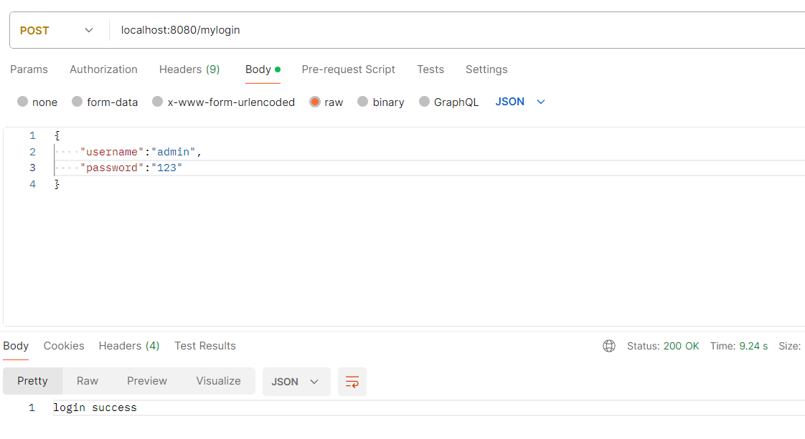

# 4.4 自定义登录逻辑

在本章的前几节中，我们实战了 Cookie 认证、Session 认证和 Bearer 认证以及 OAuth 2.0 认证。

本节中，我们将介绍一下 Micronaut 的基本认证逻辑以及如何自定义实现认证。

## 认证逻辑

在 Micronaut 这些认证对应的组件中，都有对应的认证处理器（LoginHandler）或注销处理器（LogoutHandler）。

比如下面的 `AccessRefreshTokenLoginHandler` 就是 JWT 认证中的一个认证处理器:

```java
/*
 * Copyright 2017-2020 original authors
 *
 * Licensed under the Apache License, Version 2.0 (the "License");
 * you may not use this file except in compliance with the License.
 * You may obtain a copy of the License at
 *
 * https://www.apache.org/licenses/LICENSE-2.0
 *
 * Unless required by applicable law or agreed to in writing, software
 * distributed under the License is distributed on an "AS IS" BASIS,
 * WITHOUT WARRANTIES OR CONDITIONS OF ANY KIND, either express or implied.
 * See the License for the specific language governing permissions and
 * limitations under the License.
 */
package io.micronaut.security.token.jwt.bearer;

import io.micronaut.context.annotation.Requires;
import io.micronaut.http.HttpRequest;
import io.micronaut.http.HttpResponse;
import io.micronaut.http.MutableHttpResponse;
import io.micronaut.security.authentication.Authentication;
import io.micronaut.security.authentication.AuthenticationException;
import io.micronaut.security.authentication.AuthenticationResponse;
import io.micronaut.security.config.SecurityConfigurationProperties;
import io.micronaut.security.handlers.LoginHandler;
import io.micronaut.security.token.jwt.generator.AccessRefreshTokenGenerator;
import io.micronaut.security.token.jwt.render.AccessRefreshToken;
import jakarta.inject.Singleton;
import java.util.Optional;

/**
 * Implementation of {@link LoginHandler} for Token Based Authentication.
 *
 * @author Sergio del Amo
 * @since 1.0
 */
@Requires(property = SecurityConfigurationProperties.PREFIX + ".authentication", value = "bearer")
@Singleton
public class AccessRefreshTokenLoginHandler implements LoginHandler {

    protected final AccessRefreshTokenGenerator accessRefreshTokenGenerator;

    /**
     * @param accessRefreshTokenGenerator AccessRefresh Token generator
     */
    public AccessRefreshTokenLoginHandler(AccessRefreshTokenGenerator accessRefreshTokenGenerator) {
        this.accessRefreshTokenGenerator = accessRefreshTokenGenerator;
    }

    @Override
    public MutableHttpResponse<?> loginSuccess(Authentication authentication, HttpRequest<?> request) {
        Optional<AccessRefreshToken> accessRefreshTokenOptional = accessRefreshTokenGenerator.generate(authentication);
        if (accessRefreshTokenOptional.isPresent()) {
            return HttpResponse.ok(accessRefreshTokenOptional.get());
        }
        return HttpResponse.serverError();
    }

    @Override
    public MutableHttpResponse<?> loginRefresh(Authentication authentication, String refreshToken, HttpRequest<?> request) {
        Optional<AccessRefreshToken> accessRefreshToken = accessRefreshTokenGenerator.generate(refreshToken, authentication);
        if (accessRefreshToken.isPresent()) {
            return HttpResponse.ok(accessRefreshToken.get());
        }
        return HttpResponse.serverError();
    }

    @Override
    public MutableHttpResponse<?> loginFailed(AuthenticationResponse authenticationFailed, HttpRequest<?> request) {
        throw new AuthenticationException(authenticationFailed.getMessage().orElse(null));
    }
}

```

我们可以看到以上这个认证处理器实现了接口 `LoginHandler`，如果我们想全新实现自己的认证处理器，可以实现这个接口。

在之前的几节中，我们知道 Micronaut 默认通过 `Authenticator` 调用登录逻辑。而在 `Authenticator` 中，则是遍历项目中所有 `AuthenticationProvider` 的实现类来对用户进行认证。

 `LoginHandler` 则是将认证入口（登录 API） 的响应与 `Authenticator` 串联起来的一层。

在 Micronaut 的认证组件中，自带了 `/login` API 及对应的认证逻辑实现。

大体逻辑如下：

- 用户访问 `LoginController` 中实现的认证入口 `/login`
- 认证逻辑调用 `Authenticator` 的认证方法 `authenticate`
- 在 `authenticate` 中，将查找 `AuthenticationProvider` 的实现类
- 执行 `AuthenticationProvider` 实现类中 `authenticate` 方法进行认证，得到认证结果
- `/login` 认证逻辑中获得认证结果后，查找 `LoginHandler` 的实现类
- 认证逻辑调用 `LoginHandler` 实现类对应的认证成功方法 `loginSuccess` 生成认证成功的 Http 响应；或者调用认证失败方法 `loginFailed` 生成认证失败的 Http 响应

以上逻辑其实就是我们常见的认证处理逻辑，但是 Micronaut 对经常会进行自定义实现的部分进行了拆分，便于认证逻辑的组合实现。

接下来我们基于 `4.3 Bearer 认证` 的代码，实现一个简单的自定义认证。

## 自定义认证

首先，我们在配置文件 `applicaiton.yaml` 中添加配置，关闭默认的认证接口 `/login` 和注销接口 `/logout`，如下：

```yaml
  security:
    authentication: bearer
    redirect:
      enabled: false
    endpoints:
      login:
        enabled: false
      logout:
        enabled: false
```

接着，我们实现一个自定义的 `LoginController`，大体结构与默认的实现一致，如下：

```java
package fun.mortnon.demo;

import io.micronaut.context.event.ApplicationEventPublisher;
import io.micronaut.core.async.annotation.SingleResult;
import io.micronaut.http.*;
import io.micronaut.http.annotation.Body;
import io.micronaut.http.annotation.Consumes;
import io.micronaut.http.annotation.Controller;
import io.micronaut.http.annotation.Post;
import io.micronaut.security.annotation.Secured;
import io.micronaut.security.authentication.Authentication;
import io.micronaut.security.authentication.Authenticator;
import io.micronaut.security.authentication.UsernamePasswordCredentials;
import io.micronaut.security.event.LoginFailedEvent;
import io.micronaut.security.event.LoginSuccessfulEvent;
import io.micronaut.security.handlers.LoginHandler;
import io.micronaut.security.rules.SecurityRule;
import org.reactivestreams.Publisher;
import reactor.core.publisher.Flux;
import reactor.core.publisher.Mono;

import javax.validation.Valid;

/**
 * @author dev2007
 * @date 2024/2/26
 */
@Secured(SecurityRule.IS_ANONYMOUS)
@Controller
public class MyLoginController {
    protected final Authenticator authenticator;
    protected final LoginHandler loginHandler;
    protected final ApplicationEventPublisher eventPublisher;

    public MyLoginController(Authenticator authenticator,
                             LoginHandler loginHandler,
                             ApplicationEventPublisher eventPublisher) {
        this.authenticator = authenticator;
        this.loginHandler = loginHandler;
        this.eventPublisher = eventPublisher;
    }

    @Consumes({MediaType.APPLICATION_FORM_URLENCODED, MediaType.APPLICATION_JSON})
    @Post("/mylogin")
    @SingleResult
    public Publisher<MutableHttpResponse<?>> login(@Valid @Body UsernamePasswordCredentials usernamePasswordCredentials, HttpRequest<?> request) {

        return Flux.from(authenticator.authenticate(request, usernamePasswordCredentials))
                .map(authenticationResponse -> {
                    if (authenticationResponse.isAuthenticated() && authenticationResponse.getAuthentication().isPresent()) {
                        Authentication authentication = authenticationResponse.getAuthentication().get();
                        eventPublisher.publishEvent(new LoginSuccessfulEvent(authentication));
                        return loginHandler.loginSuccess(authentication, request);
                    } else {
                        eventPublisher.publishEvent(new LoginFailedEvent(authenticationResponse));
                        return loginHandler.loginFailed(authenticationResponse, request);
                    }
                }).switchIfEmpty(Mono.defer(() -> Mono.just(HttpResponse.status(HttpStatus.UNAUTHORIZED))));
    }
}


```

代码与默认的实现基本一致，只是 API 变更为 `/mylogin`。那我们什么时候需要自定义实现一个 `/login` 呢？

当我们需要在普通的登录逻辑前后增加一些额外的逻辑时就需要自定义实现，如：校验验证码是否正确。

同时，我们还要注意，我们添加了一个注解 `@Secured(SecurityRule.IS_ANONYMOUS)`，该注解用于说明此 Controller 中的 API 不进行鉴权。因为我们是一个登录接口，只有它认证成功后，其他接口才能进行鉴权判断，所以必须要加此注解。

然后，我们实现一个 `LoginHandler` 的实现类 `MyLoginHandler`，如下：

```java
package fun.mortnon.demo;

import io.micronaut.context.annotation.Replaces;
import io.micronaut.http.HttpRequest;
import io.micronaut.http.HttpResponse;
import io.micronaut.http.MutableHttpResponse;
import io.micronaut.security.authentication.Authentication;
import io.micronaut.security.token.jwt.bearer.AccessRefreshTokenLoginHandler;
import io.micronaut.security.token.jwt.generator.AccessRefreshTokenGenerator;
import io.micronaut.security.token.jwt.render.AccessRefreshToken;
import jakarta.inject.Singleton;

import java.util.Optional;

/**
 * @author dev2007
 * @date 2024/2/26
 */
@Singleton
@Replaces(AccessRefreshTokenLoginHandler.class)
public class MyLoginHandler extends AccessRefreshTokenLoginHandler {
    /**
     * @param accessRefreshTokenGenerator AccessRefresh Token generator
     */
    public MyLoginHandler(AccessRefreshTokenGenerator accessRefreshTokenGenerator) {
        super(accessRefreshTokenGenerator);
    }

    @Override
    public MutableHttpResponse<?> loginSuccess(Authentication authentication, HttpRequest<?> request) {
        Optional<AccessRefreshToken> accessRefreshTokenOptional = accessRefreshTokenGenerator.generate(authentication);
        if (accessRefreshTokenOptional.isPresent()) {
            return HttpResponse.ok("login success");
        }
        return HttpResponse.serverError();
    }
}

```

在这里，我们继承了 `AccessRefreshTokenLoginHandler`，并使用 `@Replaces(AccessRefreshTokenLoginHandler.class)` 替代了原有的实现。原因是：配置文件中的 `micronaut.security.authentication=bearer` 触发了 `AccessRefreshTokenLoginHandler` 的实例化，如果我们要全新实现一个 `LoginHandler` 就需要修改这个配置，相对比较麻烦，所以此处选择了直接替代的方式。

在 `MyLoginHandler` 中，我们修改了响应体，当认证成功时，将会响应一个字符串 `login success`。

`AuthenticationProvider` 的实现复用之前写好，当用户名为 `admin` 时即认证通过。

最后，我们运行项目后，使用 PostMan 工具进行 API 验证，结果如下图 1：

**图 1**



响应体的内容与代码一致，证明代码实现逻辑正确。

## 小结

本节中，我们完整的实现一个简单的 Micronaut 认证逻辑，基于这个实现，我们可以实现其他更复杂的的逻辑。如果你在实现认证、鉴权相关遇到了问题，可以再多看看本章的开头内容，或者看看官方当中相关的配置说明，也许直接搜索组件源码也是个不错的方法。

下一章中，我们将实战一下常见的中间件的使用方法。
