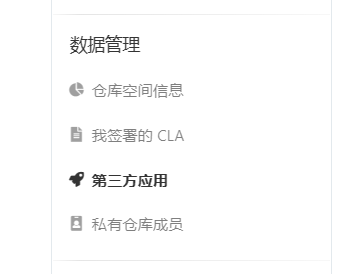
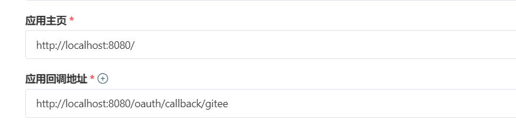
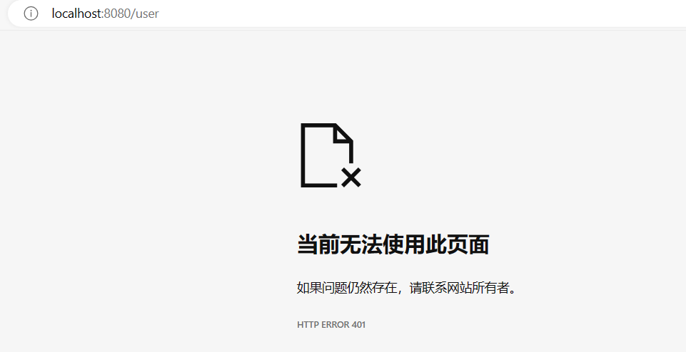
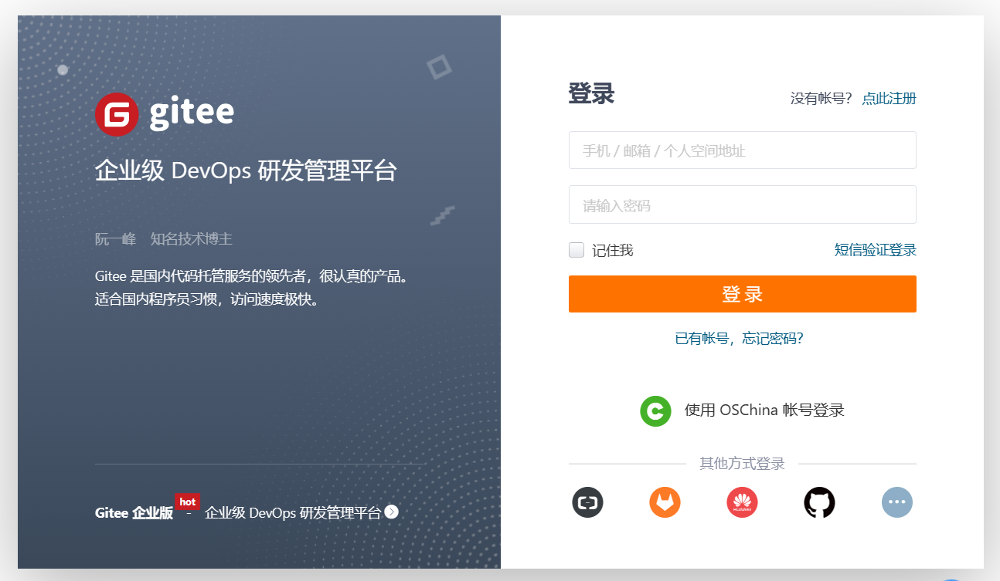
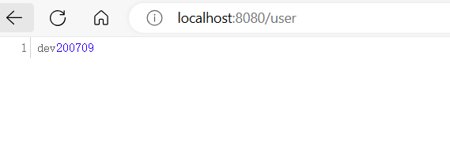

# 4.4 OAuth 2.0 认证

在前面几节中，我们实战了 Cookie 认证、Session 认证和 Bearer认证。这些认证差异主要在于令牌的传递方式，而令牌的生成方式在很多方式中，我们都会选用 JWT。

OAuth 2.0 认证与前三种认证方式的不同点，主要在于认证是由 OAuth 2.0 服务端提供的，认证通过后，再由本地应用生成相应的令牌。而本地令牌的生成则和前三种认证方式类似。

## 服务端配置

首先，我们选择 gitee 作为实战的服务端。我们登录 gitee 账号后，进入账号设置，找到 `第三方应用`，如下图 1：

**图 1**



然后我们创建一个第三方应用，并配置客户端的相关信息，如下图 2：

**图 2**



按照 Micronaut 安全框架的设计，用于服务端回调的客户端 URL 为：`/oauth/callback/{provider}`，我们在项目中配置客户端 `provider` 名称为 `gitee`，所以在 gitee 的配置界面中，我们配置回调地址为：`http://localhost:8080/oauth/callback/gitee`。

其他 gitee OAuth 2.0 服务端的 API，可以在[此处](https://gitee.com/api/v5/oauth_doc#/)查看，这些 API 将在项目中配置使用。

## 添加依赖

我们首先在 `pom.xml` 中添加 OAuth 2.0 相关依赖，如下：

```xml
        <dependency>
            <groupId>io.micronaut.security</groupId>
            <artifactId>micronaut-security-oauth2</artifactId>
        </dependency>
```

我们计划认证方式选用 Cookie，所以我们仅添加 OAuth 2.0 相关依赖即可。

## 配置 `applicaiton.yml`

在 `application.yml` 中，我们指定认证方式为 `cookie`，然后配置 OAuth 2.0 服务端相关的 API。相关配置如下：

```yml
  security:
    authentication: cookie
    redirect:
      login-success: /user
    oauth2:
      clients:
        gitee:
          client-id: da28980047eb2c732b8bcee4be567c6a4f38c6459587063f2607084c9c33b957
          client-secret: 4cd81eac1dae28b698044ed5b55e2580da94aca7d872e11e5b47d6c8a3b0a26d
          authorization:
            url: https://gitee.com/oauth/authorize
          token:
            url: https://gitee.com/oauth/token
            auth-method: client-secret-basic
```

我们可以看到，我们定义一个客户端，名为 `gitee`，然后配置了 OAuth 2.0 认证的相关 API。

- `authorization`：用于获得 code
- `token`：使用 code 换取 token

有了 token 以后，就可以通过服务端用户 API 获取用户相关信息，最终完成认证。

特别需要注意的是 `client-id` 和 `client-secret` 是在服务端创建应用时生成的，而 `auth-method` 有两个值：`client-secret-basic` 和 `client-secret-post`，这两个值如何选用由 token URL 中 client-secret 的传递方式决定，如果通过 URL 参数传递，选用 `client-secret-basic`，如果通过请求体传递，选用 `client-secret-post`。

另外，由于 OAuth 2.0 的认证过程需要从客户端跳转到服务端认证后，再跳转回来，为了更好的演示认证后的结果，我们将 `redirect.login-success` 配置为 `/user`，这样认证通过后就可以通过 `/user` 获取相应的数据。

## 用户信息获取方法

在 Micronaut 框架中，类似于 Spring Boot 的 RestTemplate，我们可以直接声明一个 HttpCient 用于访问相应的 API 并获得相应数据。我们配置一个 HttpClient `GiteeApiClient` 用于获取 gitee 服务端用户信息，代码如下：

```java
package fun.mortnon.demo;

import io.micronaut.http.annotation.Get;
import io.micronaut.http.annotation.Header;
import io.micronaut.http.annotation.PathVariable;
import io.micronaut.http.client.annotation.Client;
import org.reactivestreams.Publisher;

@Header(name = "User-Agent", value = "Micronaut")
@Client("https://gitee.com/api/v5")
public interface GiteeApiClient {
    @Get("/user")
    Publisher<GiteeUser> getUser(@PathVariable("access_token") String authorization);
}

```

在以上代码中，我们配置了用户信息获取 API 为：`https://gitee.com/api/v5/user`，而同时使用 `@PathVariable` 声明了一个路径变量 `access_token`，这样最终的调用 API 为 `https://gitee.com/api/v5/user?access_token=xxxx`。这个 API 格式由服务端的实现决定，如果是其他服务端，需要参照其他服务端的 API 文档进行配置，比如有些服务端是通过请求头传递 `access_token` 的，则需要使用 `@Header` 进行声明。

## 实现 `GiteeUser`

在以上 `GiteeApiClient` 代码中，我们还看到，请求响应的用户数据类为 `GiteeUser`，我们接着看一下这个类的定义。

```java
package fun.mortnon.demo;

import com.fasterxml.jackson.databind.PropertyNamingStrategies;
import com.fasterxml.jackson.databind.annotation.JsonNaming;
import io.micronaut.core.annotation.Introspected;

@Introspected
@JsonNaming(PropertyNamingStrategies.SnakeCaseStrategy.class)
public class GiteeUser {
    private String login;
    private String name;
    private String url;

    public String getLogin() {
        return login;
    }

    public void setLogin(String login) {
        this.login = login;
    }

    public String getName() {
        return name;
    }

    public void setName(String name) {
        this.name = name;
    }

    public String getUrl() {
        return url;
    }

    public void setUrl(String url) {
        this.url = url;
    }
}

```

以上代码中，我们看到定义了很多用户的属性，这些属性都来自于服务端的 API 定义，我们此处仅选用了几个属性，并没有全部在代码中实现。

Gitee 相关的用户 API 可以查看：https://gitee.com/api/v5/swagger#/getV5User

## 实现一个 `OauthAuthenticationMapper`

我们需要通过一个映射器将整个 OAuth 2.0 认证流程联结起来，标准流程就如 `application.yml` 配置中提到的：

1. 通过 `authorization` URL 用于获得 code
2. 通过 `token` URL，使用 code 换取 token
3. 通过 `user` URL，使用 token 获得用户数据

而我们开发一个 `OauthAuthenticationMapper` 的实现类 `GiteeAuthenticationMapper`，代码如下：

```java
package fun.mortnon.demo;

import io.micronaut.security.authentication.AuthenticationResponse;
import io.micronaut.security.oauth2.endpoint.authorization.state.State;
import io.micronaut.security.oauth2.endpoint.token.response.OauthAuthenticationMapper;
import io.micronaut.security.oauth2.endpoint.token.response.TokenResponse;
import jakarta.inject.Inject;
import jakarta.inject.Named;
import jakarta.inject.Singleton;
import org.reactivestreams.Publisher;
import reactor.core.publisher.Flux;

import java.util.Collections;
import java.util.List;

@Named("gitee")
@Singleton
public class GiteeAuthenticationMapper implements OauthAuthenticationMapper {
    @Inject
    private GiteeApiClient apiClient;

    @Override
    public Publisher<AuthenticationResponse> createAuthenticationResponse(TokenResponse tokenResponse, State state) {
        return Flux.from(apiClient.getUser(tokenResponse.getAccessToken()))
                .map(user -> {
                    List<String> roles = Collections.singletonList("ROLE_GITEE");
                    return AuthenticationResponse.success(user.getLogin(), roles);
                });
    }
}

```

需要注意的是 `@Named("gitee")` 必须要声明，且名字要与 `application.yml` 中定义的客户端名称一致。另外，`createAuthenticationResponse` 方法中，将会在获得用户信息后生成一个认证响应，在示例代码中我们直接生成了认证成功。

## 实现 `UserController`

最后我们再实现一个 `UserController`，用于获得认证成功后的用户信息。代码如下：

```java
package fun.mortnon.demo;

import io.micronaut.http.annotation.Controller;
import io.micronaut.http.annotation.Get;
import io.micronaut.security.annotation.Secured;
import io.micronaut.security.authentication.Authentication;
import io.micronaut.security.rules.SecurityRule;

@Secured(SecurityRule.IS_AUTHENTICATED)
@Controller
public class UserController {

    @Get("/user")
    public String getUserName(Authentication authentication) {
        return authentication.getName();
    }
}

```

## 验证

在以上代码开发完成后，我们运行 IDEA，我们直接在浏览器中访问 URL：`http://localhost:8080/user`，由于没有登录，此时我们将会看到响应为 `401`，如图 4：

**图 4**



然后在浏览器中访问 URL：`http://localhost:8080/oauth/login/gitee`，此时将进入 OAuth 2.0 认证流程，跳转到 gitee 的认证界面，如下图 5：

**图 5**



我们输入 gitee 的账号名和密码，登录成功后，界面将按我们在 `application.yml` 中的配置，跳转到 `/user` 接口，此时我们将看到认证后获得的用户信息，如下图 6：



## 小结

本节中，我们实现了基于 OAuth 2.0 的认证，到此我们将所有 Micronaut 安全框架常用的几种认证方式，基于这些认证方式，我们就可以实现自己的 RBAC体系。

下一节，我们将学习如何实现自定义的一整套登录逻辑。
