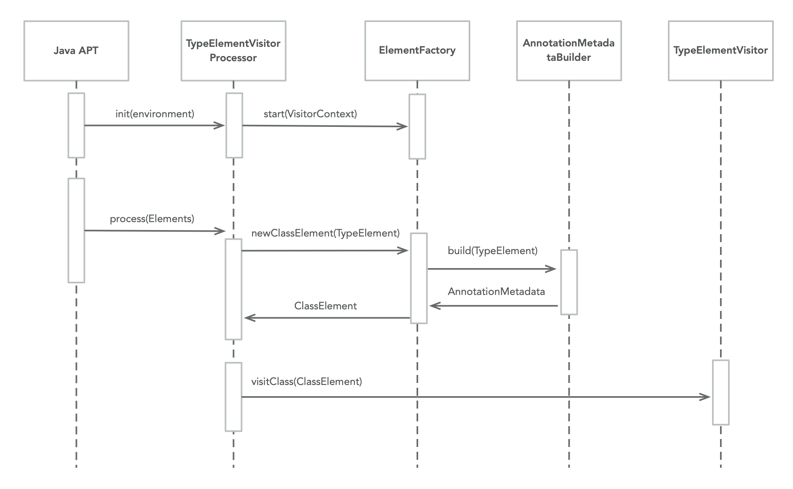
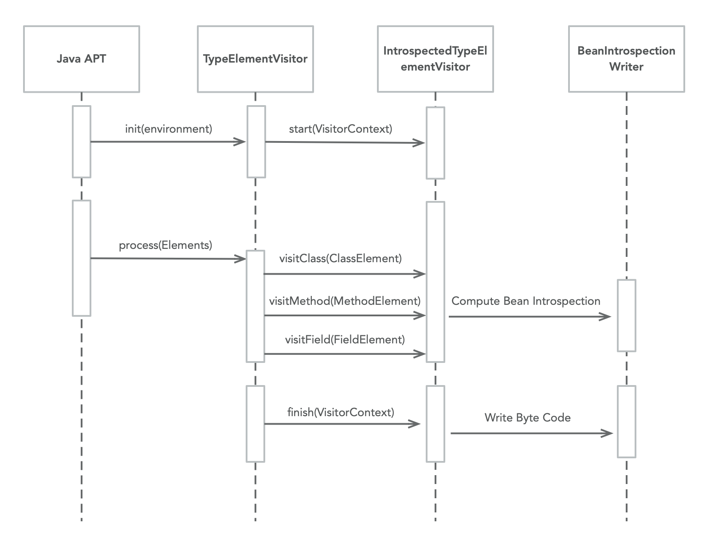
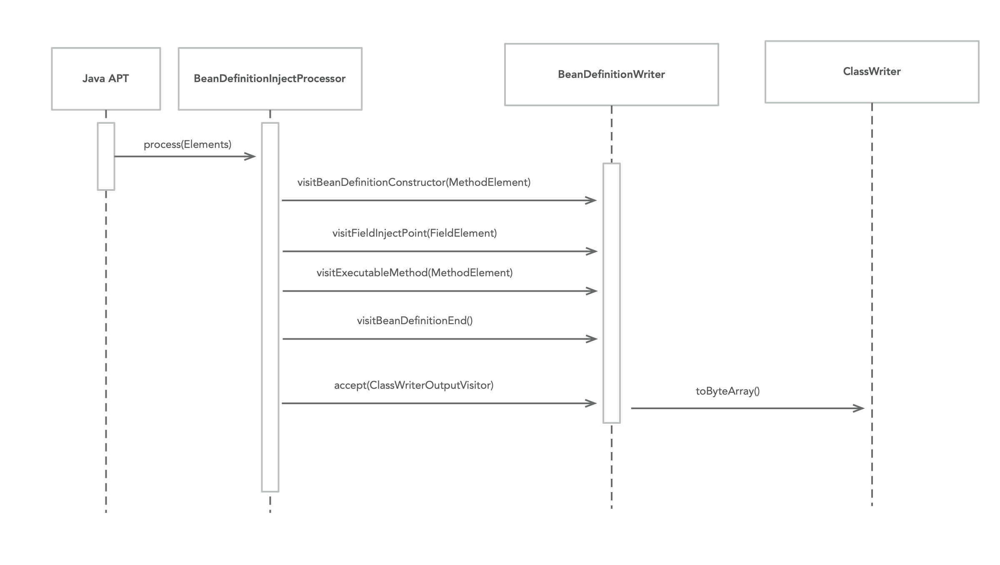
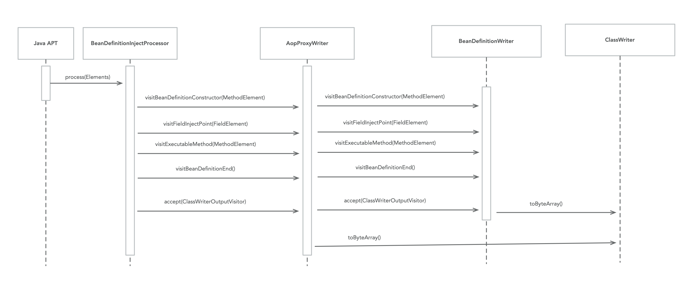
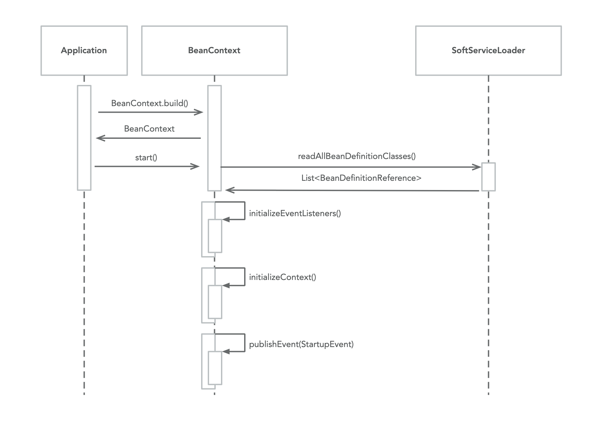
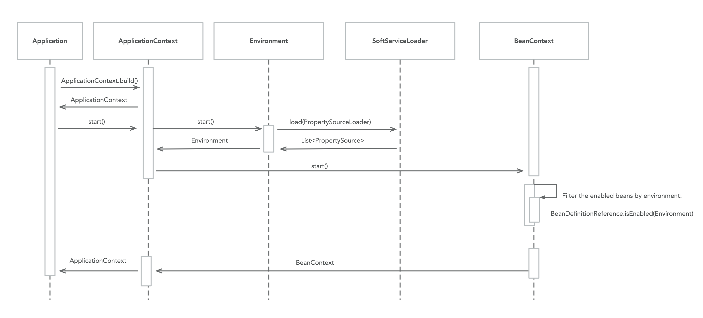
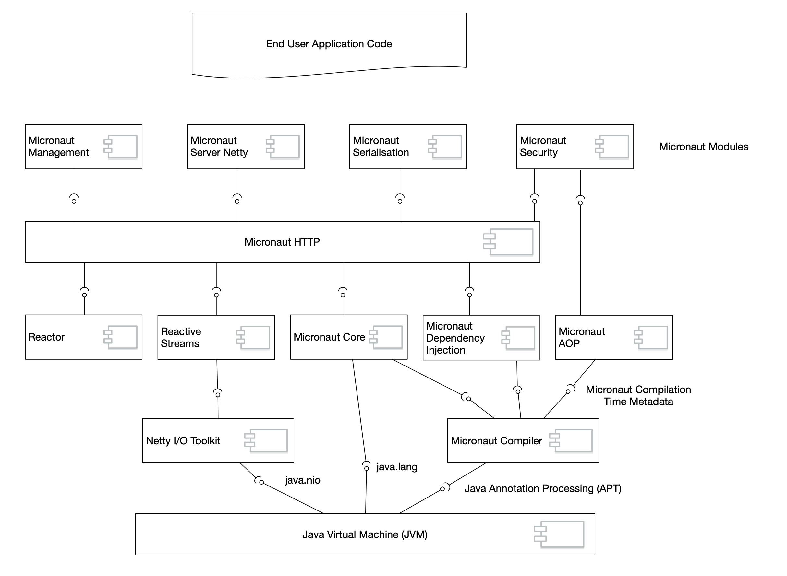
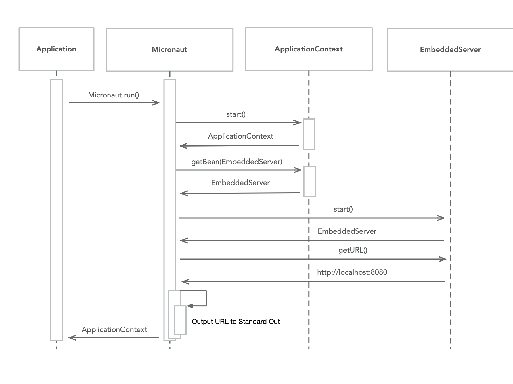
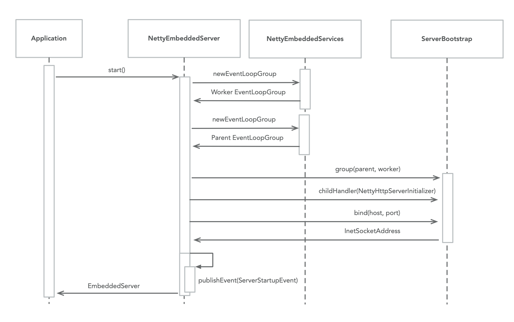
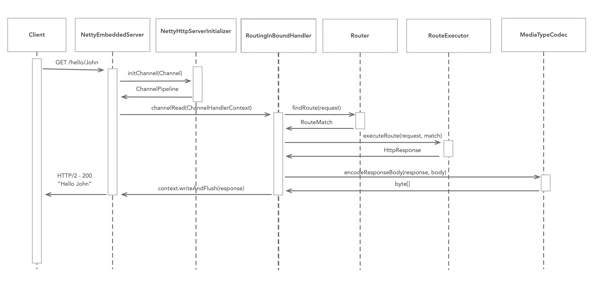

# 20. 附录

## 20.1 Micronaut 架构

下面的文档描述了 Micronaut 的架构，是为那些想了解 Micronaut 内部运作及其架构的人设计的。本文档不作为最终用户开发者文档，而是为那些对 Micronaut 内部运作感兴趣的人准备的。

本文档分为几个部分，分别介绍编译器、自省、应用容器、依赖注入等。

:::caution 警告
由于本文档涵盖 Micronaut 的内部运作，许多被引用和描述的 API 被视为内部的、非公开的 API，并用 [@Internal](https://micronaut-projects.github.io/micronaut-docs-mn3/3.9.4/api/io/micronaut/core/annotation/Internal.html) 进行注解。内部 API 可能会在 Micronaut 的补丁发布之间发生变化，不在 Micronaut 语义版本发布政策的覆盖范围内。
:::

### 20.1.1 编译器

Micronaut 编译器是对现有语言编译器的一系列扩展：

- Java —— [Java 注解处理（APT）API](https://docs.oracle.com/en/java/javase/17/docs/api/java.compiler/javax/annotation/processing/package-summary.html) 用于 Java 和 Kotlin 代码（未来版本的 Micronaut 将支持 Kotlin 的 KSP）。
- Groovy —— Groovy [AST 转换](https://docs.groovy-lang.org/latest/html/api/org/codehaus/groovy/transform/ASTTransformation.html)用于参与编译 Groovy 代码。

为了使本文档简单明了，其余章节将介绍与 Java 编译器的交互。

Micronaut 编译器会访问终端用户代码，并生成额外的字节码，这些字节码与用户代码位于相同的包结构中。

使用 [TypeElementVisitor](https://micronaut-projects.github.io/micronaut-docs-mn3/3.9.4/api/io/micronaut/inject/visitor/TypeElementVisitor.html) 的实现访问用户源代码的 AST，这些实现通过[标准 Java 服务加载器机制](https://docs.oracle.com/en/java/javase/17/docs/api/java.base/java/util/ServiceLoader.html)加载。

每个 [TypeElementVisitor](https://micronaut-projects.github.io/micronaut-docs-mn3/3.9.4/api/io/micronaut/inject/visitor/TypeElementVisitor.html) 实现都可以覆盖一个或多个接收 Element 实例的 `visit*` 方法。

[Element API](https://docs.micronaut.io/latest/api/io/micronaut/inject/ast/package-summary.html) 为给定元素（类、方法、字段等）的 AST 和 [AnnotationMetadata](https://micronaut-projects.github.io/micronaut-docs-mn3/3.9.4/api/io/micronaut/core/annotation/AnnotationMetadata.html) 计算提供了语言中立的抽象。

### 20.1.2 注解元数据

Micronaut 是基于注解的编程模型的实现。也就是说，注解构成了该框架 API 设计的基本组成部分。

鉴于这一设计决定，我们制定了一个编译时模型，以解决在运行时评估注解的难题。

[AnnotationMetadata](https://micronaut-projects.github.io/micronaut-docs-mn3/3.9.4/api/io/micronaut/core/annotation/AnnotationMetadata.html) API 是框架组件在编译时和运行时都要使用的结构。`AnnotationMetadata` 表示特定类型、字段、构造函数、方法或 bean 属性的注解信息的计算融合，既包括源代码中声明的注解，也包括可在运行时用于实现框架逻辑的合成元注解。

在 [Micronaut 编译器](#2011-编译器)中使用 [Element API](https://docs.micronaut.io/latest/api/io/micronaut/inject/ast/package-summary.html) 为给定元素（类、方法、字段等） 访问源代码时，会为每个 [ClassElement](https://micronaut-projects.github.io/micronaut-docs-mn3/3.9.4/api/io/micronaut/inject/ast/ClassElement.html)、[FieldElement](https://micronaut-projects.github.io/micronaut-docs-mn3/3.9.4/api/io/micronaut/inject/ast/FieldElement.html)、[MethodElement](https://micronaut-projects.github.io/micronaut-docs-mn3/3.9.4/api/io/micronaut/inject/ast/MethodElement.html)、[ConstructorElement](https://micronaut-projects.github.io/micronaut-docs-mn3/3.9.4/api/io/micronaut/inject/ast/ConstructorElement.html) 和 [PropertyElement](https://micronaut-projects.github.io/micronaut-docs-mn3/3.9.4/api/io/micronaut/inject/ast/PropertyElement.html) 计算一个 [AnnotationMetadata](https://micronaut-projects.github.io/micronaut-docs-mn3/3.9.4/api/io/micronaut/core/annotation/AnnotationMetadata.html) 实例。

`AnnotationMetadata` API 试图解决以下难题：

- 注解可以从类型和接口继承到实现中。为避免在运行时遍历类/接口层次结构，Micronaut 将在构建时计算继承注解并处理成员覆盖规则。
- 注解可以与其他注解一起注解。这些注解通常被称为元注解（meta-annotations）或原型（stereotypes）。`AnnotationMetadata` API 提供了一些方法，用于了解特定注解是否被声明为元注解，以及查找哪些注解与其他注解进行了元注解。
- 通常需要将不同来源的注解元数据融合在一起。例如，对于 JavaBean 属性，你希望将来自私有字段、公共 getter 和公共 setter 的元数据合并到一个视图中，否则你就必须在运行时运行逻辑，以某种方式将来自 3 个不同来源的元数据合并在一起。
- 可重复注解会合并并规范化。如果是继承的注解，则会从父接口或类中合并注解，提供一个单一的 API 来评估可重复注解，而不需要运行时逻辑来执行规范化。

当访问一个类型的源代码时，会通过 [ElementFactory](https://micronaut-projects.github.io/micronaut-docs-mn3/3.9.4/api/io/micronaut/inject/ast/ElementFactory.html) API 构建一个 [ClassElement](https://micronaut-projects.github.io/micronaut-docs-mn3/3.9.4/api/io/micronaut/inject/ast/ClassElement.html) 实例。

[ElementFactory](https://micronaut-projects.github.io/micronaut-docs-mn3/3.9.4/api/io/micronaut/inject/ast/ElementFactory.html) 使用 [AbstractAnnotationMetadataBuilder](https://micronaut-projects.github.io/micronaut-docs-mn3/3.9.4/api/io/micronaut/inject/annotation/AbstractAnnotationMetadataBuilder.html) 的实例，该实例包含语言特定的实现，可为 AST 中的底层本地类型构建 `AnnotationMedata`。就 Java 而言，这就是 `javax.model.element.TypeElement`。

基本流程可视化如下：



此外，[AbstractAnnotationMetadataBuilder](https://micronaut-projects.github.io/micronaut-docs-mn3/3.9.4/api/io/micronaut/inject/annotation/AbstractAnnotationMetadataBuilder.html) 还将通过标准 Java 服务加载器机制加载以下类型的一个或多个实例，以便操作 `AnnotationMetadata` 中注解的表示方式：

- [AnnotationMapper](https://micronaut-projects.github.io/micronaut-docs-mn3/3.9.4/api/io/micronaut/inject/annotation/AnnotationMapper.html) —— 该类型可将一个注解的值映射到另一个注解，同时在 `AnnotationMetadata` 中保留原始注解。
- [AnnotationTransformer](https://micronaut-projects.github.io/micronaut-docs-mn3/3.9.4/api/io/micronaut/inject/annotation/AnnotationTransformer.html) —— 一种可以将一个注解的值转换为另一个注解的类型，从而将原始注解从 `AnnotationMetadata` 中删除。
- [AnnotationRemapper](https://micronaut-projects.github.io/micronaut-docs-mn3/3.9.4/api/io/micronaut/inject/annotation/AnnotationRemapper.html) —— 一种可以转换给定包中所有注解的值的类型，可以消除 `AnnotationMetadata` 中的原始注解。

请注意，在编译时，[AnnotationMetadata](https://micronaut-projects.github.io/micronaut-docs-mn3/3.9.4/api/io/micronaut/core/annotation/AnnotationMetadata.html) 是可变的，[TypeElementVisitor](https://micronaut-projects.github.io/micronaut-docs-mn3/3.9.4/api/io/micronaut/inject/visitor/TypeElementVisitor.html) 的实现可以通过调用 [Element API](https://micronaut-projects.github.io/micronaut-docs-mn3/3.9.4/api/io/micronaut/inject/ast/Element.html) 的 `annotate(..)` 方法来进一步更改 [AnnotationMetadata](https://micronaut-projects.github.io/micronaut-docs-mn3/3.9.4/api/io/micronaut/core/annotation/AnnotationMetadata.html)。但是，在运行时，[AnnotationMetadata](https://micronaut-projects.github.io/micronaut-docs-mn3/3.9.4/api/io/micronaut/core/annotation/AnnotationMetadata.html) 是不可变的和固定的。这种设计的目的是允许编译器进行扩展，并使 Micronaut 能够解释不同的基于注解的源代码级编程模型。

在实践中，这可以有效地将源代码级注解模型与运行时使用的注解模型解耦，从而可以使用不同的注解来表示相同的注解。

例如，`jakarata.inject.Inject` 或 Spring 的 `@Autowired` 可作为 `javax.inject.Inject` 的同义词得到支持，方法是将源代码级注解转换为 `javax.inject.Inject`，这是在运行时代表的唯一注解。

最后，Java 中的注解还允许定义默认值。这些默认值不会保留在 `AnnotationMetadata` 的单个实例中，而是存储在一个共享的、静态的全应用程序映射中，供以后检索已知应用程序使用的注解时使用。

### 20.1.3 Bean 自省

[Bean 自省](/core/ioc#315-bean-自省)的目标是提供一种替代反射和 JDK [自省 API](https://docs.oracle.com/en/java/javase/17/docs/api/java.desktop/java/beans/Introspector.html) 的方法，后者在 Java 的最新版本中与 `java.desktop` 模块相结合。

Java 中的许多库都需要以编程方式发现哪些方法以某种方式代表了类的属性，虽然 [JavaBeans 规范](https://en.wikipedia.org/wiki/JavaBeans)试图建立一个标准的约定，但语言本身已经发展到包括其他构造（如将属性表示为组件的记录）。

此外，其他语言（如 Kotlin 和 Groovy）也对类属性提供了本地支持，这些都需要在框架级别上提供支持。

[IntrospectedTypeElementVisitor](https://micronaut-projects.github.io/micronaut-docs-mn3/3.9.4/api/io/micronaut/inject/beans/visitor/IntrospectedTypeElementVisitor.html) 访问类型上 [@Introspected](https://micronaut-projects.github.io/micronaut-docs-mn3/3.9.4/api/io/micronaut/core/annotation/Introspected.html) 注解的声明，并在编译时生成与每个注解类型相关联的 [BeanIntrospection](https://micronaut-projects.github.io/micronaut-docs-mn3/3.9.4/api/io/micronaut/core/beans/BeanIntrospection.html) 实现：



这种生成是通过 `io.micronaut.inject.beans.visitor.BeanIntrospectionWriter` 实现的，它是一个内部类，使用 ASM 字节码生成库生成两个额外的类。

例如，给定一个名为 `example.Person` 的类，生成的类是：

- `example.$Person$IntrospectionRef` —— [BeanIntrospectionReference](https://micronaut-projects.github.io/micronaut-docs-mn3/3.9.4/api/io/micronaut/core/beans/BeanIntrospectionReference.html) 的实现，允许应用程序软加载自省，而无需加载所有元数据或类本身（在自省类本身不在类路径上的情况下）。由于引用是通过 ServiceLoader 加载的，因此在编译时还会在生成的 `META-INF/services/io.micronaut.core.beans.BeanIntrospectionReference` 中生成一个指向该类型的条目。
- `example.$Person$Introspection` —— [BeanIntrospection](https://micronaut-projects.github.io/micronaut-docs-mn3/3.9.4/api/io/micronaut/core/beans/BeanIntrospection.html) 的实现，包含实际运行时的自省信息。

以下示例演示了 [BeanIntrospection](https://micronaut-projects.github.io/micronaut-docs-mn3/3.9.4/api/io/micronaut/core/beans/BeanIntrospection.html) API 的用法：

import Tabs from '@theme/Tabs';
import TabItem from '@theme/TabItem';

<Tabs>
  <TabItem value="Java" label="Java" default>

```java
final BeanIntrospection<Person> introspection = BeanIntrospection.getIntrospection(Person.class); // (1)
Person person = introspection.instantiate("John"); // (2)
System.out.println("Hello " + person.getName());

final BeanProperty<Person, String> property = introspection.getRequiredProperty("name", String.class); // (3)
property.set(person, "Fred"); // (4)
String name = property.get(person); // (5)
System.out.println("Hello " + person.getName());
```

  </TabItem>
  <TabItem value="Groovy" label="Groovy">

```groovy
final BeanIntrospection<Person> introspection = BeanIntrospection.getIntrospection(Person.class); // (1)
Person person = introspection.instantiate("John"); // (2)
System.out.println("Hello " + person.getName());

final BeanProperty<Person, String> property = introspection.getRequiredProperty("name", String.class); // (3)
property.set(person, "Fred"); // (4)
String name = property.get(person); // (5)
System.out.println("Hello " + person.getName());
```

  </TabItem>
  <TabItem value="Kotlin" label="Kotlin">

```kt
val introspection = BeanIntrospection.getIntrospection(Person::class.java) // (1)
val person : Person = introspection.instantiate("John") // (2)
print("Hello ${person.name}")

val property : BeanProperty<Person, String> = introspection.getRequiredProperty("name", String::class.java) // (3)
property.set(person, "Fred") // (4)
val name = property.get(person) // (5)
print("Hello ${person.name}")
```

  </TabItem>
</Tabs>

1. [BeanIntrospection](https://micronaut-projects.github.io/micronaut-docs-mn3/3.9.4/api/io/micronaut/core/beans/BeanIntrospection.html) 按类型查找。此时，将在通过服务加载器加载的 [BeanIntrospectionReference](https://micronaut-projects.github.io/micronaut-docs-mn3/3.9.4/api/io/micronaut/core/beans/BeanIntrospectionReference.html) 实例中搜索自省。
2. `instantiate` 方法允许创建实例
3. Bean 的属性可以通过一个可用的方法加载，在本例中就是 `getRequiredProperty`。
4. 引用的 [BeanProperty](https://micronaut-projects.github.io/micronaut-docs-mn3/3.9.4/api/io/micronaut/core/beans/BeanProperty.html) 可用于写入可变属性
5. 以及读取可读属性

:::tip 注意
`Person` 类只有在调用 `getBeanType()` 方法时才会被初始化。如果该类不存在于 classpath 中，则会出现 `NoClassDefFoundError`，为避免出现这种情况，开发人员可以在尝试获取类型之前，调用 [BeanIntrospectionReference](https://micronaut-projects.github.io/micronaut-docs-mn3/3.9.4/api/io/micronaut/core/beans/BeanIntrospectionReference.html) 上的 `isPresent()` 方法。
:::

[BeanIntrospection](https://micronaut-projects.github.io/micronaut-docs-mn3/3.9.4/api/io/micronaut/core/beans/BeanIntrospection.html) 的实现有两个关键功能：

1. 自省会保存关于特定类型的属性和构造函数参数的 Bean 元数据，这些元数据已从实际实现中抽象出来（JavaBean 属性、Java 17+ Record、Kotlin 数据类、Groovy 属性等），而且还提供了对 [AnnotationMetadata](https://micronaut-projects.github.io/micronaut-docs-mn3/3.9.4/api/io/micronaut/core/annotation/AnnotationMetadata.html) 的访问，而无需使用反射来加载注解本身。
2. 自省功能使我们能够在不使用 Java 反射的情况下，纯粹根据构建时生成的信息子集实例化和读写 bean 属性。

通过覆盖 [AbstractInitializableBeanIntrospection](https://micronaut-projects.github.io/micronaut-docs-mn3/3.9.4/api/io/micronaut/inject/beans/AbstractInitializableBeanIntrospection.html) 的 `dispatchOne` 方法，可以生成优化的无反射方法调度，例如：

```java
protected final Object dispatchOne(int propertyIndex, Object bean, Object value
) {
    switch(propertyIndex) { (1)
    case 0:
        return ((Person) bean).getName(); (2)
    case 1:
        ((Person) bean).setName((String) value); (3)
        return null;
    default:
        throw this.unknownDispatchAtIndexException(propertyIndex); (4)
    }
}
```

1. 每个读取或写入方法都有一个索引
2. 在读取方法中，索引用于直接获取值，而无需依赖反射
3. 索引用于写方法，以便在不使用反射的情况下设置属性
4. 如果索引处不存在属性，则会出现异常，但这只是实现细节，代码路径不应该到此为止。

:::tip 注意
使用带有索引的调度方法是为了避免为每个方法生成一个类（这将消耗更多内存）或引入 lambdas 的开销。
:::

为了实现类型实例化，`io.micronaut.inject.beans.visitor.BeanIntrospectionWriter` 还将生成 `instantiateInternal` 方法的实现，其中包含根据已知有效参数类型实例化指定类型的免反射代码：

```java
public Object instantiateInternal(Object[] args) {
    return new Person(
        (String)args[0],
        (Integer)args[1]
    );
}
```

### 20.1.4 Bean 定义

Micronaut 是 JSR-330 依赖注入规范的实现。

依赖注入（或反转控制）是 Java 中广泛采用的一种常见模式，它允许松散地解耦组件，从而使应用程序易于扩展和测试。
在这种模式下，对象的连接方式与对象本身是通过一个单独的编程模型来解耦的。在 Micronaut 中，该模型基于 JSR-330 规范中定义的注解，以及位于 [io.micronaut.context.annotation](https://docs.micronaut.io/latest/api/io/micronaut/context/annotation/package-summary.html)  包中的一组扩展注解。

[Micronaut 编译器](#2011-编译器)会访问这些注解，并遍历源代码语言 AST，建立一个模型，用于在运行时将对象连接起来。

:::tip 注意
值得注意的是，实际的对象布线会推迟到运行时进行。
:::

对于 Java 代码，Java 编译器会为每个注解了 bean 定义注解的类调用 [BeanDefinitionInjectProcessor](https://micronaut-projects.github.io/micronaut-docs-mn3/3.9.4/api/io/micronaut/annotation/processing/BeanDefinitionInjectProcessor.html)（这是一个 Java 注解处理器）。

:::tip 注意
构成 Bean 定义注解的因素很复杂，因为它要考虑到元注解，但一般来说，它是指任何注解，注解中带有 JSR-330 Bean  `@Scope`
:::

`BeanDefinitionInjectProcessor` 将访问用户代码源中的每个 Bean，并使用 ASM 字节代码生成库生成额外的字节代码，该库与注解类位于同一软件包中。

:::tip 注意
由于历史原因，依赖注入处理器没有使用 [TypeElementVisitor](https://micronaut-projects.github.io/micronaut-docs-mn3/3.9.4/api/io/micronaut/inject/visitor/TypeElementVisitor.html) API，但将来可能会使用。
:::

字节代码生成在 [BeanDefinitionWriter](https://micronaut-projects.github.io/micronaut-docs-mn3/3.9.4/api/io/micronaut/inject/writer/BeanDefinitionWriter.html) 中实现，其中包含 "访问 "Bean 定义方式（[BeanDefinition](https://micronaut-projects.github.io/micronaut-docs-mn3/3.9.4/api/io/micronaut/inject/BeanDefinition.html)）不同方面的方法。

下图说明了流程：



例如，给定以下类型：

<Tabs>
  <TabItem value="Java" label="Java" default>

```java
@Singleton
public class Vehicle {
    private final Engine engine;

    public Vehicle(Engine engine) {// (3)
        this.engine = engine;
    }

    public String start() {
        return engine.start();
    }
}
```

  </TabItem>
  <TabItem value="Groovy" label="Groovy">

```groovy
@Singleton
class Vehicle {
    final Engine engine

    Vehicle(Engine engine) { // (3)
        this.engine = engine
    }

    String start() {
        engine.start()
    }
}
```

  </TabItem>
  <TabItem value="Kotlin" label="Kotlin">

```kt
@Singleton
class Vehicle(private val engine: Engine) { // (3)
    fun start(): String {
        return engine.start()
    }
}
```

  </TabItem>
</Tabs>

生成以下内容：

- `example.$Vehicle$Definition$Reference` 类实现了 [BeanDefinitionReference](https://micronaut-projects.github.io/micronaut-docs-mn3/3.9.4/api/io/micronaut/inject/BeanDefinitionReference.html) 接口，允许应用程序软加载 Bean 定义，而无需加载所有元数据或类本身（在反省类本身不在类路径上的情况下）。由于引用是通过 ServiceLoader 加载的，因此在编译时也会在生成的 `META-INF/services/io.micronaut.inject.BeanDefinitionReference` 中生成一个引用该类型的条目。
- 一个 `example.$Vehicle$Definition` 包含实际的 [BeanDefinition](https://micronaut-projects.github.io/micronaut-docs-mn3/3.9.4/api/io/micronaut/inject/BeanDefinition.html) 信息。

[BeanDefinition](https://micronaut-projects.github.io/micronaut-docs-mn3/3.9.4/api/io/micronaut/inject/BeanDefinition.html) 是一种持有特定类型元数据的类型，其中包括：

- 类级 [AnnotationMetadata](https://micronaut-projects.github.io/micronaut-docs-mn3/3.9.4/guide/index.html#annotationArch)
- 计算的 JSR-330 `@Scope` 和 `@Qualifier`
- 可用 [InjectionPoint](https://micronaut-projects.github.io/micronaut-docs-mn3/3.9.4/api/io/micronaut/inject/InjectionPoint.html) 实例的知识
- 对定义的任何 [ExecutableMethod](https://micronaut-projects.github.io/micronaut-docs-mn3/3.9.4/api/io/micronaut/inject/ExecutableMethod.html) 的引用

`此外，BeanDefinition` 还包含一些逻辑，这些逻辑知道如何将 Bean 连接在一起，包括如何构建类型以及注入字段和/或方法。
在编译过程中，ASM 字节代码库被用来填充 `BeanDefinition` 的细节，包括一个构建方法，在前面的示例中，它看起来像：

```java
public Vehicle build(
    BeanResolutionContext resolution, (1)
    BeanContext context,
    BeanDefinition definition) {
    Vehicle bean = new Vehicle(
        (Engine) super.getBeanForConstructorArgument( (2)
            resolution,
            context,
            0, (3)
            (Qualifier)null)
    );
    return bean;
}
```

1. 传递 `BeanResolutionContext` 是为了跟踪循环 Bean 引用并改进错误报告。
2. 通过调用 [AbstractInitializableBeanDefinition](https://micronaut-projects.github.io/micronaut-docs-mn3/3.9.4/api/io/micronaut/context/AbstractInitializableBeanDefinition.html) 的方法实例化该类型并查找每个构造函数参数。
3. 在这种情况下，将跟踪构造函数参数的索引

:::tip 注意
当 Java 字段或方法具有 `private` 访问权限时，需要进行特殊处理。在这种情况下，Micronaut 别无选择，只能使用 Java 反射来执行依赖注入。
:::

**配置属性处理**

[Micronaut 编译器](#2011-编译器)对使用元注解 [@ConfigurationReader](https://micronaut-projects.github.io/micronaut-docs-mn3/3.9.4/api/io/micronaut/context/annotation/ConfigurationReader.html)（如 [@ConfigurationProperties](https://micronaut-projects.github.io/micronaut-docs-mn3/3.9.4/api/io/micronaut/context/annotation/ConfigurationProperties.html) 和 [@EachProperty](https://micronaut-projects.github.io/micronaut-docs-mn3/3.9.4/api/io/micronaut/context/annotation/EachProperty.html)）声明的 Bean 的处理与其他 Bean 不同。

为了支持将 [应用配置](/core/config) 与使用上述注解之一注解的类型绑定，每个被发现的可变 Bean 属性都使用 [@Property](https://micronaut-projects.github.io/micronaut-docs-mn3/3.9.4/api/io/micronaut/context/annotation/Property.html) 注解动态注解，并标注经过计算和规范化的属性名称。

例如，给定以下类型：

*@ConfigurationProperties 示例*

<Tabs>
  <TabItem value="Java" label="Java" default>

```java
import io.micronaut.context.annotation.ConfigurationProperties;

import javax.validation.constraints.Min;
import javax.validation.constraints.NotBlank;
import java.util.Optional;

@ConfigurationProperties("my.engine") // (1)
public class EngineConfig {

    public String getManufacturer() {
        return manufacturer;
    }

    public void setManufacturer(String manufacturer) {
        this.manufacturer = manufacturer;
    }

    public int getCylinders() {
        return cylinders;
    }

    public void setCylinders(int cylinders) {
        this.cylinders = cylinders;
    }

    public CrankShaft getCrankShaft() {
        return crankShaft;
    }

    public void setCrankShaft(CrankShaft crankShaft) {
        this.crankShaft = crankShaft;
    }

    @NotBlank // (2)
    private String manufacturer = "Ford"; // (3)

    @Min(1L)
    private int cylinders;

    private CrankShaft crankShaft = new CrankShaft();

    @ConfigurationProperties("crank-shaft")
    public static class CrankShaft { // (4)

        private Optional<Double> rodLength = Optional.empty(); // (5)

        public Optional<Double> getRodLength() {
            return rodLength;
        }

        public void setRodLength(Optional<Double> rodLength) {
            this.rodLength = rodLength;
        }
    }
}
```

  </TabItem>
  <TabItem value="Groovy" label="Groovy">

```groovy
import io.micronaut.context.annotation.ConfigurationProperties

import javax.validation.constraints.Min
import javax.validation.constraints.NotBlank

@ConfigurationProperties('my.engine') // (1)
class EngineConfig {

    @NotBlank // (2)
    String manufacturer = "Ford" // (3)

    @Min(1L)
    int cylinders

    CrankShaft crankShaft = new CrankShaft()

    @ConfigurationProperties('crank-shaft')
    static class CrankShaft { // (4)
        Optional<Double> rodLength = Optional.empty() // (5)
    }
}
```

  </TabItem>
  <TabItem value="Kotlin" label="Kotlin">

```kt
import io.micronaut.context.annotation.ConfigurationProperties
import java.util.Optional
import javax.validation.constraints.Min
import javax.validation.constraints.NotBlank

@ConfigurationProperties("my.engine") // (1)
class EngineConfig {

    @NotBlank // (2)
    var manufacturer = "Ford" // (3)

    @Min(1L)
    var cylinders: Int = 0

    var crankShaft = CrankShaft()

    @ConfigurationProperties("crank-shaft")
    class CrankShaft { // (4)
        var rodLength: Optional<Double> = Optional.empty() // (5)
    }
}
```

  </TabItem>
</Tabs>

`setManufacturer(String)` 方法将注解为 `@Property(name="my.engine.manufacturer")`，其值将从配置的[环境](/core/config#41-环境)中解析。

随后，[AbstractInitializableBeanDefinition](https://micronaut-projects.github.io/micronaut-docs-mn3/3.9.4/api/io/micronaut/context/AbstractInitializableBeanDefinition.html) 的 `injectBean` 方法将被重写，重写后的逻辑将处理从当前 [BeanContext](https://micronaut-projects.github.io/micronaut-docs-mn3/3.9.4/api/io/micronaut/context/BeanContext.html) 中查找规范化属性名称 `my.engine.manufacturer`，并在该值存在时以无反射方式注入该值。

:::tip 注意
属性名称被规范化为烤串风格（小写连字符分隔），这也是用于存储其值的格式。
:::

*配置属性注入*

```java
@Generated
protected Object injectBean(
    BeanResolutionContext resolution,
    BeanContext context,
    Object bean) {
    if (this.containsProperties(resolution, context)) { (1)
        EngineConfig engineConfig = (EngineConfig) bean;
        if (this.containsPropertyValue(resolution, context, "my.engine.manufacturer")) { (2)
            String value = (String) super.getPropertyValueForSetter( (3)
                resolution,
                context,
                "setManufacturer",
                Argument.of(String.class, "manufacturer"), (4)
                "my.engine.manufacturer", (5)
                (String)null (6)
            )
            engineConfig.setManufacturer(value);
        }
    }
}
```

1. 添加了顶层检查，以查看是否存在带有 [@ConfigurationProperties](https://micronaut-projects.github.io/micronaut-docs-mn3/3.9.4/api/io/micronaut/context/annotation/ConfigurationProperties.html) 注解中定义的前缀的属性。
2. 检查属性是否实际存在
3. 如果存在，则通过调用 [AbstractInitializableBeanDefinition](https://micronaut-projects.github.io/micronaut-docs-mn3/3.9.4/api/io/micronaut/context/AbstractInitializableBeanDefinition.html) 的 `getPropertyValueForSetter` 方法来查找属性值。
4. 创建 [Argument](https://micronaut-projects.github.io/micronaut-docs-mn3/3.9.4/api/io/micronaut/core/type/Argument.html) 实例，用于转换为目标类型（本例中为 `String`）。[Argument](https://micronaut-projects.github.io/micronaut-docs-mn3/3.9.4/api/io/micronaut/core/type/Argument.html) 还可能包含泛型信息。
5. 属性的计算和规范化路径
6. 默认值（如果使用 [Bindable](https://micronaut-projects.github.io/micronaut-docs-mn3/3.9.4/api/io/micronaut/core/bind/annotation/Bindable.html) 注解指定了默认值）。

### 20.1.5 AOP 代理

Micronaut 支持基于注解的面向方面编程（AOP），允许通过使用用户代码中定义的拦截器来装饰或引入类型行为。

:::tip 注意
[AOP terminogy](https://en.wikipedia.org/wiki/Aspect-oriented_programming) 的使用源于 AspectJ 和 Spring 中的历史使用。
:::

框架定义的任何注解都可以使用 [@InterceptorBinding](https://micronaut-projects.github.io/micronaut-docs-mn3/3.9.4/api/io/micronaut/aop/InterceptorBinding.html) 注解进行元注解，该注解支持不同类型的拦截，包括：

- `AROUND` —— 注解可用于装饰现有的方法调用
- `AROUND_CONSTRUCT` —— 注解可用于拦截任何类型的构造
- `INTRODUCTION` —— 注解可用于为抽象或接口类型"引入"新行为
- `POST_CONSTRUCT` —— 注解可用于拦截对象实例化后调用的 `@PostConstruct` 调用。
- `PRE_DESTROY` —— 注解可用于拦截 `@PreDestroy` 调用，这些调用是在对象即将被处理后调用的。

一个或多个[Interceptor](https://micronaut-projects.github.io/micronaut-docs-mn3/3.9.4/api/io/micronaut/aop/Interceptor.html) 实例可与 [@InterceptorBinding](https://micronaut-projects.github.io/micronaut-docs-mn3/3.9.4/api/io/micronaut/aop/InterceptorBinding.html) 关联，允许用户实现应用交叉关注的行为。

在实现层面，[Micronaut 编译器](#2011-编译器)将访问使用 [@InterceptorBinding](https://micronaut-projects.github.io/micronaut-docs-mn3/3.9.4/api/io/micronaut/aop/InterceptorBinding.html) 元注解的类型，并构建一个新的 [AopProxyWriter](https://micronaut-projects.github.io/micronaut-docs-mn3/3.9.4/api/io/micronaut/aop/writer/AopProxyWriter.html) 实例，该实例使用 ASM 字节码生成库生成注解类型的子类（或接口的实现）。

:::tip 注意
Micronaut 在任何时候都不会修改现有的用户字节代码，通过使用构建时生成的代理，Micronaut 可以生成额外的代码，与用户代码一起使用，并增强行为。不过，这种方法也有局限性，例如，它要求注解类型为非最终类型，而且 AOP 建议不能应用于最终类型或有效的最终类型，如 Java 17 记录。
:::

例如，给定以下注解：

*关于建议注解示例*

<Tabs>
  <TabItem value="Java" label="Java" default>

```java
import io.micronaut.aop.Around;
import java.lang.annotation.*;
import static java.lang.annotation.ElementType.*;
import static java.lang.annotation.RetentionPolicy.RUNTIME;

@Documented
@Retention(RUNTIME) // (1)
@Target({TYPE, METHOD}) // (2)
@Around // (3)
public @interface NotNull {
}
```

  </TabItem>
  <TabItem value="Groovy" label="Groovy">

```groovy
import io.micronaut.aop.Around;
import java.lang.annotation.*;
import static java.lang.annotation.ElementType.*;
import static java.lang.annotation.RetentionPolicy.RUNTIME;

@Documented
@Retention(RUNTIME) // (1)
@Target({TYPE, METHOD}) // (2)
@Around // (3)
public @interface NotNull {
}
```

  </TabItem>
  <TabItem value="Kotlin" label="Kotlin">

```kt
import io.micronaut.aop.Around
import java.lang.annotation.*
import static java.lang.annotation.ElementType.*
import static java.lang.annotation.RetentionPolicy.RUNTIME

@Documented
@Retention(RUNTIME) // (1)
@Target([TYPE, METHOD]) // (2)
@Around // (3)
@interface NotNull {
}
```

  </TabItem>
</Tabs>

1. 注解的保留策略必须是 `RUNTIME`
2. 一般来说，你希望能在类或方法级别应用建议，因此目标类型是 `TYPE` 和 `METHOD`。
3. 这里使用了 [@Around](https://micronaut-projects.github.io/micronaut-docs-mn3/3.9.4/api/io/micronaut/aop/Around.html) 注解，该注解本身带有 `@InterceptorBinding(kind=AROUND)`，可以看作是为 `AROUND` 建议定义 [@InterceptorBinding](https://micronaut-projects.github.io/micronaut-docs-mn3/3.9.4/api/io/micronaut/aop/InterceptorBinding.html) 的简单快捷方式。

例如，当在类型或方法上使用该注解时：

*环绕通知使用示例*

<Tabs>
  <TabItem value="Java" label="Java" default>

```java
import jakarta.inject.Singleton;

@Singleton
public class NotNullExample {

    @NotNull
    void doWork(String taskName) {
        System.out.println("Doing job: " + taskName);
    }
}
```

  </TabItem>
  <TabItem value="Groovy" label="Groovy">

```groovy
import jakarta.inject.Singleton

@Singleton
class NotNullExample {

    @NotNull
    void doWork(String taskName) {
        println "Doing job: $taskName"
    }
}
```

  </TabItem>
  <TabItem value="Kotlin" label="Kotlin">

```kt
import jakarta.inject.Singleton

@Singleton
class NotNullExample {

    @NotNull
    void doWork(String taskName) {
        println "Doing job: $taskName"
    }
}
```

  </TabItem>
</Tabs>

编译器将访问该类型，[AopProxyWriter](https://micronaut-projects.github.io/micronaut-docs-mn3/3.9.4/api/io/micronaut/aop/writer/AopProxyWriter.html) 将使用 ASM 字节码生成库生成额外的字节码。

在编译过程中，[AopProxyWriter](https://micronaut-projects.github.io/micronaut-docs-mn3/3.9.4/api/io/micronaut/aop/writer/AopProxyWriter.html) 实例实质上是 [BeanDefinitionWriter](https://micronaut-projects.github.io/micronaut-docs-mn3/3.9.4/guide/index.html#iocArch) 的代理（参阅 [Bean 定义](#2014-bean-定义)），用额外的行为来装饰现有的字节码生成。

下图对此进行了说明：



[BeanDefinitionWriter](https://micronaut-projects.github.io/micronaut-docs-mn3/3.9.4/api/io/micronaut/inject/writer/BeanDefinitionWriter.html) 将为每个 Bean 生成常规类，包括：

- `$NotNullExample$Definition.class` —— 未装饰的原始 Bean 定义（参阅 [Bean 定义](#2014-bean-定义)）
- `$NotNullExample$Definition$Exec.class` —— [ExecutableMethodsDefinition](https://micronaut-projects.github.io/micronaut-docs-mn3/3.9.4/api/io/micronaut/inject/ExecutableMethodsDefinition.html) 的实现，包含无需使用反射即可分派到每个拦截方法的逻辑。

[AopProxyWriter](https://micronaut-projects.github.io/micronaut-docs-mn3/3.9.4/api/io/micronaut/aop/writer/AopProxyWriter.html) 将装饰这一行为，并生成 3 个附加类：

- `$NotNullExample$Definition$Intercepted.class` —— 被装饰类的子类，该类持有对应用的 [MethodInterceptor](https://micronaut-projects.github.io/micronaut-docs-mn3/3.9.4/api/io/micronaut/aop/MethodInterceptor.html) 实例的引用，并覆盖所有拦截方法，构建 [MethodInterceptorChain](https://micronaut-projects.github.io/micronaut-docs-mn3/3.9.4/api/io/micronaut/aop/chain/MethodInterceptorChain.html) 实例并调用应用的拦截器。
- `$NotNullExample$Definition$Intercepted$Definition.class` —— [BeanDefinition](https://micronaut-projects.github.io/micronaut-docs-mn3/3.9.4/api/io/micronaut/inject/BeanDefinition.html)，它是原始未装饰 Bean 定义的子类。(参阅 [Bean 定义](#2014-bean-定义)）
- `$NotNullExample$Definition$Intercepted$Definition$Reference.class` —— 一个 [BeanDefinitionReference](https://micronaut-projects.github.io/micronaut-docs-mn3/3.9.4/api/io/micronaut/inject/BeanDefinitionReference.html)，它能够软加载被拦截的 [BeanDefinition](https://micronaut-projects.github.io/micronaut-docs-mn3/3.9.4/api/io/micronaut/inject/BeanDefinition.html)。(参阅 [Bean 定义](#2014-bean-定义)）。

生成的大部分类都是用于加载和解析 [BeanDefinition](https://micronaut-projects.github.io/micronaut-docs-mn3/3.9.4/api/io/micronaut/inject/BeanDefinition.html) 的元数据。实际的构建代理是以 `$Intercepted` 结尾的类。该类实现了 [Intercepted](https://micronaut-projects.github.io/micronaut-docs-mn3/3.9.4/api/io/micronaut/aop/Intercepted.html) 接口，并对代理类型进行了子类化，覆盖了所有非最终和非私有方法，以调用 [MethodInterceptorChain](https://micronaut-projects.github.io/micronaut-docs-mn3/3.9.4/api/io/micronaut/aop/chain/MethodInterceptorChain.html)。

实现过程中会创建一个构造函数，用于为拦截类型的依赖布线：

*拦截类型构造函数*

```java
@Generated
class $NotNullExample$Definition$Intercepted
extends NotNullExample implements Intercepted { (1)
    private final Interceptor[][] $interceptors = new Interceptor[1][];
    private final ExecutableMethod[] $proxyMethods = new ExecutableMethod[1];

    public $NotNullExample$Definition$Intercepted(
        BeanResolutionContext resolution,
        BeanContext context,
        Qualifier qualifier,
        List<Interceptor> interceptors) {
        Exec executableMethods = new Exec(true); (2)
        this.$proxyMethods[0] = executableMethods.getExecutableMethodByIndex(0); (3)
        this.$interceptors[0] = InterceptorChain
            .resolveAroundInterceptors(
                context,
                this.$proxyMethods[0],
                interceptors
        );  (4)
    }
}
```

1. `@Generated` 子类从装饰类型扩展而来，并实现了 [Intercepted](https://micronaut-projects.github.io/micronaut-docs-mn3/3.9.4/api/io/micronaut/aop/Intercepted.html) 接口
2. 构造 [ExecutableMethodsDefinition](https://micronaut-projects.github.io/micronaut-docs-mn3/3.9.4/api/io/micronaut/inject/ExecutableMethodsDefinition.html) 的实例，以解析原始方法的无反射调度器。
3. 一个名为 `$proxyMethods` 的内部数组保存着用于代理调用的每个 [ExecutableMethod](https://micronaut-projects.github.io/micronaut-docs-mn3/3.9.4/api/io/micronaut/inject/ExecutableMethod.html) 实例的引用。
4. 一个名为 `$interceptors` 的内部数组保存了适用于每个方法的 [Interceptor](https://micronaut-projects.github.io/micronaut-docs-mn3/3.9.4/api/io/micronaut/aop/Interceptor.html) 实例的引用，因为 [@InterceptorBinding](https://micronaut-projects.github.io/micronaut-docs-mn3/3.9.4/api/io/micronaut/aop/InterceptorBinding.html) 可以是类型或方法级别的，因此每个方法的拦截器实例可能都不同。

被代理类型的每个非最终和非私有方法，只要有 [@InterceptorBinding](https://micronaut-projects.github.io/micronaut-docs-mn3/3.9.4/api/io/micronaut/aop/InterceptorBinding.html) 关联（无论是类型级还是方法级），就会被代理原始方法的逻辑重写，例如：

```java
@Overrides
public void doWork(String taskName) {
    ExecutableMethod method = this.$proxyMethods[0];
    Interceptor[] interceptors = this.$interceptors[0]; (1)
    MethodInterceptorChain chain = new MethodInterceptorChain( (2)
        interceptors,
        this,
        method,
        new Object[]{taskName}
    );
    chain.proceed(); (3)
}
```

1. 方法的 [ExecutableMethod](https://micronaut-projects.github.io/micronaut-docs-mn3/3.9.4/api/io/micronaut/inject/ExecutableMethod.html) 和 [Interceptor ](https://micronaut-projects.github.io/micronaut-docs-mn3/3.9.4/api/io/micronaut/aop/Interceptor.html) 实例数组。
2. 使用拦截器、被拦截实例的引用、方法和参数构建新的 [MethodInterceptorChain](https://micronaut-projects.github.io/micronaut-docs-mn3/3.9.4/api/io/micronaut/aop/chain/MethodInterceptorChain.html)。
3. 在 [MethodInterceptorChain](https://micronaut-projects.github.io/micronaut-docs-mn3/3.9.4/api/io/micronaut/aop/chain/MethodInterceptorChain.html) 上调用 `proceed()` 方法。

请注意，[@Around](https://micronaut-projects.github.io/micronaut-docs-mn3/3.9.4/api/io/micronaut/aop/Around.html) 注解的默认行为是通过生成的允许访问超级实现的合成桥接方法（在上述 NotNullExample 中）调用超级实现，从而调用目标类型的原始重载方法。

在这种安排下，代理和代理目标是同一个对象，在上述情况中，拦截器被调用，调用 proceed() 时通过调用 super.doWork() 调用原始实现。
不过，这种行为可以使用 @Around 注解进行自定义。

通过设置 `@Around(proxyTarget=true)`，生成的代码还将实现 [InterceptedProxy](https://micronaut-projects.github.io/micronaut-docs-mn3/3.9.4/api/io/micronaut/aop/InterceptedProxy.html) 接口，该接口定义了一个名为 `interceptedTarget()` 的方法，用于解析代理应将方法调用委托给的目标对象。

:::tip 注意
默认行为（`proxyTarget=false`）的内存效率更高，因为只需要一个 [BeanDefinition](https://micronaut-projects.github.io/micronaut-docs-mn3/3.9.4/api/io/micronaut/inject/BeanDefinition.html) 和一个代理类型实例。
:::

对代理目标的评估是急迫的，在代理首次创建时进行，但也可以通过设置 `@Around(lazy=true, proxyTarget=true)` 使其变为懒惰的，在这种情况下，只有在调用代理方法时才会检索代理。

下图说明了 `proxyTarget=true` 与代理目标之间的行为差异：


图中左侧的序列（`proxyTarget=false`）通过调用 `super` 来调用代理方法，而右侧的序列则从 [BeanContext](https://micronaut-projects.github.io/micronaut-docs-mn3/3.9.4/api/io/micronaut/context/BeanContext.html) 中查找代理目标，并调用目标上的方法。

最后一个自定义选项是 `@Around(hotswap=true)`，它会触发编译器在编译时生成一个实现 [HotSwappableInterceptedProxy](https://micronaut-projects.github.io/micronaut-docs-mn3/3.9.4/api/io/micronaut/aop/HotSwappableInterceptedProxy.html) 的代理，该代理定义了一个名为 `swap(..)` 的方法，允许将代理的目标与一个新实例交换（为了保证线程安全，生成的代码使用了 `ReentrantReadWriteLock`）。

**安全考虑**

通过 `AROUND` 通知进行的方法拦截通常用于定义逻辑，以解决交叉问题，其中之一就是安全问题。

当多个 [Interceptor](https://micronaut-projects.github.io/micronaut-docs-mn3/3.9.4/api/io/micronaut/aop/Interceptor.html) 实例适用于一个方法时，从安全角度考虑，这些拦截器必须按特定顺序执行。

[Interceptor](https://micronaut-projects.github.io/micronaut-docs-mn3/3.9.4/api/io/micronaut/aop/Interceptor.html) 接口扩展了 [Ordered](https://micronaut-projects.github.io/micronaut-docs-mn3/3.9.4/api/io/micronaut/core/order/Ordered.html) 接口，使开发人员能够通过覆盖 `getOrder()` 方法来控制拦截器的顺序。

在[MethodInterceptorChain](https://micronaut-projects.github.io/micronaut-docs-mn3/3.9.4/api/io/micronaut/aop/chain/MethodInterceptorChain.html) 构造时，如果存在多个拦截器，它们将按照 `HIGHEST` 优先级拦截器优先执行的顺序排列。

[InterceptPhase](https://micronaut-projects.github.io/micronaut-docs-mn3/3.9.4/api/io/micronaut/aop/InterceptPhase.html) 枚举定义了各种常量，可用于正确声明 `getOrder()` 的值（例如，安全性通常属于 `VALIDATE` 阶段），以帮助开发人员定义自己的[环绕通知](/core/aop#51-环绕通知)。

:::note 提示
可为 `io.micronaut.aop.chain` 包启用跟踪级日志记录，以调试已解决的拦截器顺序。
:::

### 20.1.6 应用上下文

一旦 [Micronaut 编译器](#2011-编译器)的工作完成并生成了所需的类，就需要 [BeanContext](https://micronaut-projects.github.io/micronaut-docs-mn3/3.9.4/api/io/micronaut/context/BeanContext.html) 来加载这些类以便在运行时执行。

[标准的 Java 服务加载器机制](https://docs.oracle.com/en/java/javase/17/docs/api/java.base/java/util/ServiceLoader.html)用于定义 [BeanDefinitionReference](https://micronaut-projects.github.io/micronaut-docs-mn3/3.9.4/api/io/micronaut/inject/BeanDefinitionReference.html) 的实例，而实例本身则使用 [SoftServiceLoader](https://micronaut-projects.github.io/micronaut-docs-mn3/3.9.4/api/io/micronaut/core/io/service/SoftServiceLoader.html) 加载，这是一种更宽松的实现方式，允许在加载前检查服务是否实际存在，还允许并行加载服务。

[BeanContext](https://micronaut-projects.github.io/micronaut-docs-mn3/3.9.4/api/io/micronaut/context/BeanContext.html) 执行以下步骤：

1. 并行软加载所有 [BeanDefinitionReference](https://micronaut-projects.github.io/micronaut-docs-mn3/3.9.4/api/io/micronaut/inject/BeanDefinitionReference.html) 实例
2. 实例化所有注解为 [@Context](https://micronaut-projects.github.io/micronaut-docs-mn3/3.9.4/api/io/micronaut/context/annotation/Context.html) 的 Bean（作用域为整个上下文的 Bean）
3. 为每个已处理的 [ExecutableMethod](https://micronaut-projects.github.io/micronaut-docs-mn3/3.9.4/api/io/micronaut/inject/ExecutableMethod.html) 运行 [ExecutableMethodProcessor](https://micronaut-projects.github.io/micronaut-docs-mn3/3.9.4/api/io/micronaut/context/processor/ExecutableMethodProcessor.html)。如果一个方法的元注解为 `@Executable(processOnStartup = true)`，则该方法被视为 "已处理 "方法
4. 在上下文启动时发布 [StartupEvent](https://micronaut-projects.github.io/micronaut-docs-mn3/3.9.4/api/io/micronaut/context/event/StartupEvent.html) 类型的事件。

基本流程如下：



[ApplicationContext](https://micronaut-projects.github.io/micronaut-docs-mn3/3.9.4/api/io/micronaut/context/ApplicationContext.html) 是 [BeanContext](https://micronaut-projects.github.io/micronaut-docs-mn3/3.9.4/api/io/micronaut/context/BeanContext.html) 的专门版本，它增加了一个或多个活动环境（由 [Environment](https://micronaut-projects.github.io/micronaut-docs-mn3/3.9.4/api/io/micronaut/context/env/Environment.html) 封装）的概念，以及基于此环境的[有条件 Bean 加载](/core/ioc#39-条件-bean)。

[Environment](https://micronaut-projects.github.io/micronaut-docs-mn3/3.9.4/api/io/micronaut/context/env/Environment.html) 是从一个或多个定义的 [PropertySource](https://micronaut-projects.github.io/micronaut-docs-mn3/3.9.4/api/io/micronaut/context/env/PropertySource.html) 实例中加载的，这些 PropertySource 实例是通过加载 [PropertySourceLoader](https://micronaut-projects.github.io/micronaut-docs-mn3/3.9.4/api/io/micronaut/context/env/PropertySourceLoader.html) 实例的[标准 Java 服务加载器机制](https://docs.oracle.com/en/java/javase/17/docs/api/java.base/java/util/ServiceLoader.html)发现的。

开发人员可以通过添加额外的实现和相关的 `META-INF/services/io.micronaut.context.env.PropertySourceLoader` 文件引用该类，扩展 Micronaut 以通过完全自定义的机制加载 [PropertySource](https://micronaut-projects.github.io/micronaut-docs-mn3/3.9.4/api/io/micronaut/context/env/PropertySource.html)。

[BeanContext](https://micronaut-projects.github.io/micronaut-docs-mn3/3.9.4/api/io/micronaut/context/BeanContext.html) 和 [ApplicationContext](https://micronaut-projects.github.io/micronaut-docs-mn3/3.9.4/api/io/micronaut/context/ApplicationContext.html) 之间的高级区别如下所示：



如上所述，[ApplicationContext](https://micronaut-projects.github.io/micronaut-docs-mn3/3.9.4/api/io/micronaut/context/ApplicationContext.html) 会加载环境，该[Environment](https://micronaut-projects.github.io/micronaut-docs-mn3/3.9.4/api/io/micronaut/context/env/Environment.html)用于多种用途，包括：

- 通过 [Bean Requirement](/core/ioc#39-条件-bean) 启用和禁用 Bean
- 允许通过 [@Value](/core/config#43-配置注入) 或 [@Property](https://micronaut-projects.github.io/micronaut-docs-mn3/3.9.4/api/io/micronaut/context/annotation/Property.html) 对配置进行依赖注入
- 允许绑定[配置属性](/core/config#44-配置属性)

### 20.1.7 HTTP 服务器

Micronaut HTTP 服务器可被视为 Micronaut 模块——它是 Micronaut 的一个组件，建立在包括[依赖注入](#2014-bean-定义)和 [ApplicationContext](#2016-应用上下文) 生命周期在内的基本构件之上。

HTTP 服务器包括一组抽象接口和公共代码，分别包含在 `micronaut-http` 和 `micronaut-http-server` 模块中（前者包括客户端和服务器共享的 HTTP 基元）。

这些接口的默认实现基于 [Netty I/O 工具包](https://netty.io/)，其架构如下图所示：


Netty 应用程序接口一般是一种非常低级的 I/O 网络应用程序接口，供集成商用来构建客户端和服务器，以提供更高的抽象层。Micronaut HTTP 服务器就是这样一个抽象层。

下面描述了 Micronaut HTTP 服务器的结构图及其实现中使用的组件：



运行服务器的主要入口是 [Micronaut](https://micronaut-projects.github.io/micronaut-docs-mn3/3.9.4/api/io/micronaut/runtime/Micronaut.html) 类，它实现了 [ApplicationContextBuilder](https://micronaut-projects.github.io/micronaut-docs-mn3/3.9.4/api/io/micronaut/context/ApplicationContextBuilder.html)。通常情况下，开发人员会在应用程序的主入口点中加入以下调用：

*定义 `main` 入口点*

```java
public static void main(String[] args) {
    Micronaut.run(Application.class, args);
}
```

:::tip 注意
传递的参数会转换为 [CommandLinePropertySource](https://micronaut-projects.github.io/micronaut-docs-mn3/3.9.4/api/io/micronaut/context/env/CommandLinePropertySource.html)，并可通过 [@Value](/core/config#43-配置注入) 进行依赖注入。
:::

执行运行将以默认设置启动 Micronaut [ApplicationContext](#2016-应用上下文)，然后搜索一个 [EmbeddedServer](https://micronaut-projects.github.io/micronaut-docs-mn3/3.9.4/api/io/micronaut/runtime/server/EmbeddedServer.html) 类型的 bean，这是一个接口，用于公开可运行服务器的信息，包括主机和端口信息。这种设计将 Micronaut 与实际服务器的实现分离开来，虽然默认的服务器是 Netty（如上所述），但第三方只需提供 [EmbeddedServer](https://micronaut-projects.github.io/micronaut-docs-mn3/3.9.4/api/io/micronaut/runtime/server/EmbeddedServer.html) 的实现即可实现其他服务器。

服务器启动顺序图如下：



在 Netty 实现中，[EmbeddedServer](https://micronaut-projects.github.io/micronaut-docs-mn3/3.9.4/api/io/micronaut/runtime/server/EmbeddedServer.html) 接口由 [NettyHttpServer](https://micronaut-projects.github.io/micronaut-docs-mn3/3.9.4/api/io/micronaut/http/server/netty/NettyHttpServer.html) 实现。

**服务器配置**

[NettyHttpServer](https://micronaut-projects.github.io/micronaut-docs-mn3/3.9.4/api/io/micronaut/http/server/netty/NettyHttpServer.html) 读取[服务器配置](/core/httpserver/serverConfiguration)，其中包括：

- [NettyHttpServerConfiguration](https://micronaut-projects.github.io/micronaut-docs-mn3/3.9.4/api/io/micronaut/http/server/netty/configuration/NettyHttpServerConfiguration.html) —— [HttpServerConfiguration](https://micronaut-projects.github.io/micronaut-docs-mn3/3.9.4/api/io/micronaut/http/server/HttpServerConfiguration.html) 的扩展版本，定义了主机、端口等之外的 Netty 特定配置选项。
- [EventLoopGroupConfiguration](https://micronaut-projects.github.io/micronaut-docs-mn3/3.9.4/api/io/micronaut/http/netty/channel/EventLoopGroupConfiguration.html) —— 配置一个或多个 Netty [EventLoopGroup](https://netty.io/4.1/api/io/netty/channel/EventLoopGroup.html)，可将其配置为服务器独有或与一个或多个 HTTP 客户端共享。
- [ServerSslConfiguration](https://micronaut-projects.github.io/micronaut-docs-mn3/3.9.4/api/io/micronaut/http/ssl/ServerSslConfiguration.html) —— 为 [ServerSslBuilder](https://micronaut-projects.github.io/micronaut-docs-mn3/3.9.4/api/io/micronaut/http/server/netty/ssl/ServerSslBuilder.html) 提供配置，以配置用于 HTTPS 的 Netty [SslContext](https://netty.io/4.1/api/io/netty/handler/ssl/SslContext.html)。

**服务器配置安全注意事项**

Netty 的 [SslContext](https://netty.io/4.1/api/io/netty/handler/ssl/SslContext.html) 提供了一个抽象概念，允许使用 JDK 提供的 `javax.net.ssl.SSLContext` 或 [OpenSslEngine](https://netty.io/4.1/api/io/netty/handler/ssl/OpenSslEngine.html)，后者要求开发人员额外添加 netty-tcnative 作为依赖项（`netty-tcnative` 是 [Tomcat 的 OpenSSL 绑定](https://tomcat.apache.org/native-doc/)的 fork）。

[ServerSslConfiguration](https://micronaut-projects.github.io/micronaut-docs-mn3/3.9.4/api/io/micronaut/http/ssl/ServerSslConfiguration.html) 允许将应用程序配置到磁盘上存在有效证书的安全可读位置，以便通过从磁盘加载配置来正确配置 `javax.net.ssl.TrustManagerFactory` 和 `javax.net.ssl.KeyManagerFactory`。

**网络服务器初始化**

[NettyHttpServer](https://micronaut-projects.github.io/micronaut-docs-mn3/3.9.4/api/io/micronaut/http/server/netty/NettyHttpServer.html) 执行 `start()` 序列时，将执行以下步骤：
1. 读取 [EventLoopGroupConfiguration](https://micronaut-projects.github.io/micronaut-docs-mn3/3.9.4/api/io/micronaut/http/netty/channel/EventLoopGroupConfiguration.html)，并创建启动 Netty 服务器所需的父和工作 [EventLoopGroup](https://netty.io/4.1/api/io/netty/channel/EventLoopGroup.html) 实例。
2. 计算要使用的特定平台 [https://netty.io/4.1/api/io/netty/channel/socket/ServerSocketChannel.html](https://netty.io/4.1/api/io/netty/channel/socket/ServerSocketChannel.html)（取决于操作系统，可以是 Epoll 或 KQueue，如果无法进行本地绑定，则退回到 Java NIO）
3. 创建用于初始化 [SocketChannel](https://netty.io/4.1/api/io/netty/channel/socket/SocketChannel.html)（客户端与服务器之间的连接）的 [ServerBootstrap](https://netty.io/4.1/api/io/netty/bootstrap/ServerBootstrap.html) 实例。
4. `SocketChannel` 由 Netty [ChannelInitializer](https://netty.io/4.1/api/io/netty/channel/ChannelInitializer.html) 初始化，该初始化程序会创建自定义的 Netty [ChannelPipeline](https://netty.io/4.1/api/io/netty/channel/ChannelPipeline.html)，用于根据配置将 HTTP/1.1 或 HTTP/2 请求发送到服务器。
5. Netty [ServerBootstrap](https://netty.io/4.1/api/io/netty/bootstrap/ServerBootstrap.html) 绑定到一个或多个配置的端口，从而有效地让服务器接收请求。
6. 两个 [Bean 事件](/core/ioc#314-bean-事件)会被触发，首先是 [ServerStartupEvent](https://micronaut-projects.github.io/micronaut-docs-mn3/3.9.4/api/io/micronaut/runtime/server/event/ServerStartupEvent.html)，表示服务器已启动，最后是 [ServiceReadyEvent](https://micronaut-projects.github.io/micronaut-docs-mn3/3.9.4/api/io/micronaut/discovery/event/ServiceReadyEvent.html)，只有在设置了 micronaut.application.name 属性的情况下才会触发。

启动顺序如下图所示：



`NettyHttpServerInitializer` 类用于初始化处理传入 HTTP/1.1 或 HTTP/2 请求的 [ChannelPipeline](https://netty.io/4.1/api/io/netty/channel/ChannelPipeline.html)。

**通道管道安全注意事项**

用户可以通过实现一个实现 [ChannelPipelineCustomizer](https://micronaut-projects.github.io/micronaut-docs-mn3/3.9.4/api/io/micronaut/http/netty/channel/ChannelPipelineCustomizer.html) 接口的 Bean 并在管道中添加一个新的 Netty [ChannelHandler](https://netty.io/4.1/api/io/netty/channel/ChannelHandler.html) 来定制 `ChannelPipeline`。

添加 `ChannelHandler` 可执行传入和传出数据包的线级日志等任务，并可在需要线级安全要求（如验证传入请求体或传出响应体的字节）时使用。

**Netty 服务器路由**

Micronaut 定义了一组 [HTTP 注解](https://docs.micronaut.io/latest/api/io/micronaut/http/annotation/package-summary.html)，允许将用户代码绑定到传入的 [HttpRequest](https://micronaut-projects.github.io/micronaut-docs-mn3/3.9.4/api/io/micronaut/http/HttpRequest.html) 实例，并自定义由此产生的 [HttpResponse](https://micronaut-projects.github.io/micronaut-docs-mn3/3.9.4/api/io/micronaut/http/HttpResponse.html)。

一个或多个已配置的 [RouteBuilder](https://micronaut-projects.github.io/micronaut-docs-mn3/3.9.4/api/io/micronaut/web/router/RouteBuilder.html) 实现会构建 [UriRoute](https://micronaut-projects.github.io/micronaut-docs-mn3/3.9.4/api/io/micronaut/web/router/UriRoute.html) 实例，[Router](https://micronaut-projects.github.io/micronaut-docs-mn3/3.9.4/api/io/micronaut/web/router/Router.html) 组件会使用 UriRoute 来路由传入请求的注解类方法，如：

<Tabs>
  <TabItem value="Java" label="Java" default>

```java
<Tabs>
  <TabItem value="Java" label="Java" default>

```java
import io.micronaut.http.MediaType;
import io.micronaut.http.annotation.Controller;
import io.micronaut.http.annotation.Get;

@Controller("/hello") // (1)
public class HelloController {

    @Get(produces = MediaType.TEXT_PLAIN) // (2)
    public String index() {
        return "Hello World"; // (3)
    }
}
```

  </TabItem>
  <TabItem value="Groovy" label="Groovy">

```groovy
import io.micronaut.http.MediaType;
import io.micronaut.http.annotation.Controller;
import io.micronaut.http.annotation.Get;

@Controller("/hello") // (1)
public class HelloController {

    @Get(produces = MediaType.TEXT_PLAIN) // (2)
    public String index() {
        return "Hello World"; // (3)
    }
}
```
  </TabItem>
  <TabItem value="Kotlin" label="Kotlin">

```kt
import io.micronaut.http.MediaType
import io.micronaut.http.annotation.Controller
import io.micronaut.http.annotation.Get

@Controller("/hello") // (1)
class HelloController {

    @Get(produces = [MediaType.TEXT_PLAIN]) // (2)
    fun index(): String {
        return "Hello World" // (3)
    }
}
```

  </TabItem>
</Tabs>

[请求绑定注解](/core/httpserver/binding)可用于将方法参数绑定到 HTTP 主体、头信息、参数等，框架会在数据传递到接收方法之前自动进行正确的转义处理。

Netty 接收传入的请求，并通过 `NettyHttpServerInitializer` 初始化 `ChannelPipeline`。传入的原始数据包被转换成 Netty [HttpRequest](https://netty.io/4.1/api/io/netty/handler/codec/http/HttpRequest.html)，随后被封装在 Micronaut [NettyHttpRequest](https://micronaut-projects.github.io/micronaut-docs-mn3/3.9.4/api/io/micronaut/http/server/netty/NettyHttpRequest.html) 中，后者对底层 Netty 请求进行了抽象。

`NettyHttpRequest` 会通过 Netty [ChannelHandler](https://netty.io/4.1/api/io/netty/channel/ChannelHandler.html) 实例链，直到到达 RoutingInBoundHandler，后者使用上述 [Router](https://micronaut-projects.github.io/micronaut-docs-mn3/3.9.4/api/io/micronaut/web/router/Router.html) 将请求与注解为 [@Controller](https://micronaut-projects.github.io/micronaut-docs-mn3/3.9.4/api/io/micronaut/http/annotation/Controller.html) 类型的方法相匹配。

`RoutingInBoundHandler` 委托 [RouteExecutor](https://micronaut-projects.github.io/micronaut-docs-mn3/3.9.4/api/io/micronaut/http/server/RouteExecutor.html) 实际执行路由，RouteExecutor 负责处理分派到注解的 [@Controller](https://micronaut-projects.github.io/micronaut-docs-mn3/3.9.4/api/io/micronaut/http/annotation/Controller.html) 类型方法的所有逻辑。

执行路由后，如果返回值不是空值，就会从 [MediaTypeCodecRegistry](https://micronaut-projects.github.io/micronaut-docs-mn3/3.9.4/api/io/micronaut/http/codec/MediaTypeCodecRegistry.html) 为响应的 [Content-Type](https://developer.mozilla.org/en-US/docs/Web/HTTP/Headers/Content-Type)（默认为 `application/json`）查找合适的[MediaTypeCodec](https://micronaut-projects.github.io/micronaut-docs-mn3/3.9.4/api/io/micronaut/http/codec/MediaTypeCodec.html)。`MediaTypeCodec` 用于将返回值编码为 `byte[]`，并将其作为 [HttpResponse](https://micronaut-projects.github.io/micronaut-docs-mn3/3.9.4/api/io/micronaut/http/HttpResponse.html) 的响应体。

下图说明了传入请求的流程：



`RouteExecutor` 将构建一个 [FilterChain](https://micronaut-projects.github.io/micronaut-docs-mn3/3.9.4/api/io/micronaut/http/filter/FilterChain.html)，以便在执行注解 [@Controller](https://micronaut-projects.github.io/micronaut-docs-mn3/3.9.4/api/io/micronaut/http/annotation/Controller.html) 类型的目标方法之前执行一个或多个 [HttpServerFilter](https://micronaut-projects.github.io/micronaut-docs-mn3/3.9.4/api/io/micronaut/http/filter/HttpServerFilter.html)。

一旦执行了所有 [HttpServerFilter](https://micronaut-projects.github.io/micronaut-docs-mn3/3.9.4/api/io/micronaut/http/filter/HttpServerFilter.html) 实例，[RouteExecutor](https://micronaut-projects.github.io/micronaut-docs-mn3/3.9.4/api/io/micronaut/http/server/RouteExecutor.html) 将尝试满足目标方法参数的要求，包括任何[请求绑定注解](/core/httpserver/binding)。如果无法满足参数要求，则会向调用客户端返回 `HTTP 400 - Bad Request` [HttpStatus](https://micronaut-projects.github.io/micronaut-docs-mn3/3.9.4/api/io/micronaut/http/HttpStatus.html) 响应。

**Netty 服务器路由安全注意事项**

开发人员可以使用 [HttpServerFilter](https://micronaut-projects.github.io/micronaut-docs-mn3/3.9.4/api/io/micronaut/http/filter/HttpServerFilter.html) 实例来控制对服务器资源的访问。如果不使用 [FilterChain](https://micronaut-projects.github.io/micronaut-docs-mn3/3.9.4/api/io/micronaut/http/filter/FilterChain.html)，就会向客户端返回一个替代响应（如 `403 - Forbidden`），禁止访问敏感资源。

请注意，[HttpServerFilter](https://micronaut-projects.github.io/micronaut-docs-mn3/3.9.4/api/io/micronaut/http/filter/HttpServerFilter.html) 接口是从 [Ordered](https://micronaut-projects.github.io/micronaut-docs-mn3/3.9.4/api/io/micronaut/core/order/Ordered.html) 接口扩展而来的，因为在 [FilterChain](https://micronaut-projects.github.io/micronaut-docs-mn3/3.9.4/api/io/micronaut/http/filter/FilterChain.html) 中经常会存在多个过滤器。通过实现 `getOrder()` 方法，开发人员可以返回一个适当的优先级来控制排序。此外，[ServerFilterPhase](https://micronaut-projects.github.io/micronaut-docs-mn3/3.9.4/api/io/micronaut/http/filter/ServerFilterPhase.html) 枚举还提供了一组常量，开发人员可用于正确定位过滤器，其中包括通常放置安全规则的 `SECURITY` 阶段。

## 20.2 常见问题（FAQ）

下面的部分涵盖了你在考虑使用或使用 Micronaut 时可能会遇到的常见问题。

**Micronaut 会修改我的字节码吗？**

不会。Micronaut 不会转换类或修改由你编写的代码生成的字节码。Micronaut 会在编译时生成额外的类，这些类与你原来未修改的类在同一个包中。

**为什么 Micronaut 不使用 Spring？**

当问及 Micronaut 为什么不使用 Spring 时，通常是指 Spring 依赖注入容器。

:::tip 注意
Spring 生态系统非常广泛，你可以在 Micronaut 中直接使用许多 Spring 库，而无需使用 Spring 容器。
:::

Micronaut 本身具有符合 [JSR-330](https://www.jcp.org/en/jsr/detail?id=330) 标准的本地依赖注入功能，其原因是 Spring（以及任何基于反射的 DI/AOP 容器）中这些功能的成本太高，不仅会消耗内存，还会影响启动时间。为了在运行时支持依赖注入，Spring：

- [读取字节码](https://github.com/spring-projects/spring-framework/tree/master/spring-core/src/main/java/org/springframework/core/type/classreading)，在运行时找到的每个 Bean 的字节码。
- [合成新注解](https://github.com/spring-projects/spring-framework/blob/a691065d05741a4f1ca17925c8a5deec0f378c8b/spring-core/src/main/java/org/springframework/core/annotation/AnnotationUtils.java#L1465)，为每个 Bean 方法、构造函数、字段等的每个注解合成新注解，以支持注解元数据。
- [构建反射元数据](https://github.com/spring-projects/spring-framework/blob/master/spring-beans/src/main/java/org/springframework/beans/CachedIntrospectionResults.java)，为每个 Bean 的每个方法、构造函数、字段等构建反射元数据。

这样做的结果是，随着应用程序加入更多功能，启动时间和内存消耗会逐渐减少。

对于微服务和无服务器功能来说，保持较低的启动时间和内存消耗至关重要，上述行为是使用 Spring 容器所不希望看到的，因此 Micronaut 的设计者选择不使用 Spring。

**Micronaut 支持 Scala 吗？**

Micronaut 支持任何支持注解处理器 API 的 JVM 语言。Scala 目前不支持此 API。不过，Groovy 也不支持该 API，我们已经构建了处理 Groovy AST 的特殊支持。如果开发了类似于 `inject-groovy` 的模块，将来可能会在技术上支持 Scala，但目前还不支持 Scala。

**除了微服务，Micronaut 还能用于其他目的吗？**

可以。Micronaut 非常模块化，你可以在应用程序中加入 `micronaut-inject-java`（或针对 Groovy 的 `micronaut-inject-groovy`）依赖，选择只使用依赖注入和 AOP 实现。

事实上，Micronaut 对[无服务器计算](/core/serverlessFunctions)的支持正是采用了这种方法。

**Micronaut 的依赖注入和 AOP 实现有哪些优势？**

Micronaut 在编译时处理你的类并生成所有元数据。这样就不需要反射、缓存反射元数据，也不需要在运行时分析你的类，所有这些都会导致启动性能降低和内存消耗增加。

此外，Micronaut 还能在编译时构建无反射的 AOP 代理，从而提高性能、减少堆栈跟踪大小并降低内存消耗。

**为什么 Micronaut 有自己的 Consul 和 Eureka 客户端实现？**

现有的大多数 Consul 和 Eureka 客户端都是阻塞式的，包含许多外部依赖项，会使你的 JAR 文件膨胀。

Micronaut 的 [DiscoveryClient](https://micronaut-projects.github.io/micronaut-docs-mn3/3.9.4/api/io/micronaut/discovery/DiscoveryClient.html) 使用 Micronaut 的本地 HTTP 客户端，大大减少了对外部依赖的需求，并为两个发现服务器提供了反应式 API。

**为什么在加载我的Bean（Groovy）时会出现NoSuchMethodError？**

Groovy 默认导入 `groovy.lang` 包中的类，包括一个名为 `@Singleton` 的 AST 转换类，该类通过添加私有构造函数和静态检索方法，使你的类成为单例。该注解很容易与用于在 Micronaut 中定义单例 Bean 的 `javax.inject.Singleton` 注解混淆。请确保在 Groovy 类中使用正确的注解。

**为什么启动应用程序所需的时间比应该的要长很多？**

Micronaut 的启动时间通常非常快。但在应用程序层面，启动时间可能会受到影响。如果你发现启动缓慢，请检查应用程序启动监听器或 `@Context` 作用域 Bean，它们会减慢启动速度。

某些网络问题也会导致启动缓慢。例如，在 Mac 上，`/etc/hosts` 文件配置错误就会导致问题。参阅以下 [stackoverflow 答案](https://stackoverflow.com/a/39698914/1264846)。

## 20.3 使用快照

Micronaut 的里程碑和稳定版本发布到 Maven Central。

下面的代码段展示了如何在 Gradle 中使用 Micronaut SNAPSHOT 版本。最新的快照总是下一个补丁版本加上 1，再加上 `-SNAPSHOT` 后缀。例如，如果最新版本是 "1.0.1"，当前快照就是 "1.0.2-SNAPSHOT"。

```groovy
ext {
    micronautVersion = '2.4.0-SNAPSHOT'
}
repositories {
    mavenCentral() (1)
    maven { url "https://s01.oss.sonatype.org/content/repositories/snapshots/" } (2)
}
```

1. Micronaut 可在 Maven Central 上发布
2。 Micronaut 快照可在 Sonatype OSS Snapshots 上获取。

如果使用 Maven，请编辑 `pom.xml`：

```xml
<?xml version="1.0" encoding="UTF-8"?>
  ...

  <parent>
    <groupId>io.micronaut</groupId>
    <artifactId>micronaut-parent</artifactId>
    <version>2.4.0-SNAPSHOT</version>
  </parent>

  <properties>
    <micronaut.version>2.4.0-SNAPSHOT</micronaut.version> (1)
    ...
  </properties>

  <repositories>
    <repository>
      <id>sonatype-snapshots</id>
      <url>https://s01.oss.sonatype.org/content/repositories/snapshots/</url> (2)
    </repository>
  </repositories>

  ...
</project>
```

1. 设置快照版本。
2. Micronaut 快照可从 Sonatype OSS 快照中获取

:::tip 注意
以前快照发布到 Bintray，但由于 JFrog 关闭了该服务，快照现在发布到 Sonatype。
:::

## 20.4 常见问题

以下部分涉及开发人员在使用 Micronaut 时遇到的常见问题。

**依赖注入失效**

依赖注入失效的最常见原因是没有配置适当的注解处理器，或 IDE 配置不正确。有关如何在你的语言中进行设置，参阅[语言支持](/core/languageSupport)部分。

**加载 Bean 时出现 NoSuchMethodError（Groovy）**

默认情况下，Groovy 会导入 `groovy.lang` 包中的类，其中包括一个名为 `Singleton` 的类。这是一个 AST 转换注解，通过添加私有构造函数和静态检索方法，使你的类成为单例。该注解很容易与用于在 Micronaut 中定义单例 Bean 的 `javax.inject.Singleton` 注解混淆。请确保在你的 Groovy 类中使用正确的注解。

**启动应用程序所需的时间比正常情况下长很多（*nix 操作系统）**

这可能是由于与 `java.net.InetAddress.getLocalHost()` 调用相关的错误导致了长时间的延迟。解决方法是编辑 `/etc/hosts` 文件，添加包含主机名的条目。要查找主机名，请在终端运行 `hostname`。然后编辑 `/etc/hosts` 文件，添加或更改如下示例中的条目，将 `<hostname>` 替换为主机名。

```bash
127.0.0.1       localhost <hostname>
::1             localhost <hostname>
```

要了解有关此问题的更多信息，参阅此 [stackoverflow 答案](https://stackoverflow.com/a/39698914/1264846)。

## 20.5 重大更改

本节记录 Micronaut 版本之间的重大更改。

### 3.9.0

自 Micronaut Framework 3.9.0 起，CORS `allowed-origins` 配置不支持正则表达式，以防止意外暴露你的 API。如果希望支持正则表达式，可以使用 `allowed-origins-regex`。

---

### 3.8.7

Micronaut Framework 3.8.7 更新至 [SnakeYAML 2.0](https://bitbucket.org/snakeyaml/snakeyaml/wiki/Changes)，解决了 [CVE-2022-1471](https://nvd.nist.gov/vuln/detail/CVE-2022-1471) 问题。如果 Micronaut Framework 依赖于易受攻击的依赖项，即使该框架未受影响，许多组织的政策也禁止其团队使用该框架。Micronaut Framework 不受 [CVE-2022-1471](https://nvd.nist.gov/vuln/detail/CVE-2022-1471) 影响。Micronaut Framework 使用 SnakeYAML 在 Micronaut 应用程序中加载配置。只有一个 [SnakeYAML 实例](https://github.com/micronaut-projects/micronaut-core/blob/3.7.x/inject/src/main/java/io/micronaut/context/env/yaml/YamlPropertySourceLoader.java#L56)使用[安全构造函数](https://github.com/micronaut-projects/micronaut-core/blob/3.8.x/inject/src/main/java/io/micronaut/context/env/yaml/CustomSafeConstructor.java)。使用 SnakeYaml 的 SafeConstructor 是防止此问题的推荐方法：

```
我们建议在解析不受信任的内容时使用 SnakeYaml 的 SafeConsturctor 来限制反序列化。
```

---

### 3.3.0

- [环境端点](/core/management/providedEndpoints#15210-环境端点)现在默认为禁用。要启用它，必须更新端点配置：

<Tabs>
  <TabItem value="Properties" label="Properties">

```properties
endpoints.env.enabled=true
```

  </TabItem>
  <TabItem value="Yaml" label="Yaml">

```yaml
endpoints:
  env:
    enabled: true
```

  </TabItem>
    <TabItem value="Toml" label="Toml">

```toml
[endpoints]
  [endpoints.env]
    enabled=true
```

  </TabItem>
    <TabItem value="Groovy" label="Groovy">

```groovy
endpoints {
  env {
    enabled = true
  }
}
```

  </TabItem>
    <TabItem value="Hoon" label="Hoon">

```hocon
{
  endpoints {
    env {
      enabled = true
    }
  }
}
```

  </TabItem>
    <TabItem value="JSON" label="JSON">

```json
{
  "endpoints": {
    "env": {
      "enabled": true
    }
  }
}
```

  </TabItem>
</Tabs>

这样就可以使用该功能，但会屏蔽所有值。要恢复以前的功能，你可以添加一个实现 [EnvironmentEndpointFilter](https://micronaut-projects.github.io/micronaut-docs-mn3/3.9.4/api/io/micronaut/management/endpoint/env/EnvironmentEndpointFilter.html) 的 Bean：

*传统环境过滤 Bean*

```java
@Singleton
public class LegacyEnvEndpointFilter implements EnvironmentEndpointFilter {
    @Override
    public void specifyFiltering(@NotNull EnvironmentFilterSpecification specification) {
        specification.legacyMasking();
    }
}
```

有关更多过滤选项，参阅[文档](/core/management/providedEndpoints#15210-环境端点)。

---

### 3.2.4

- [ProxyHttpClient](https://micronaut-projects.github.io/micronaut-docs-mn3/3.9.4/api/io/micronaut/http/client/ProxyHttpClient.html) 现在会[根据 RFC](https://www.w3.org/Protocols/rfc2616/rfc2616-sec14.html#sec14.23) 发送代理服务的 Host 头信息，而不是源服务的 Host 头信息。

### 3.2.0

- HTTP 客户端现在默认进行 SSL 证书验证。通过将 `micronaut.http.client.ssl.insecureTrustAllCertificates` 属性设置为 `true`，可以重新启用旧的不安全行为，但如果使用自签名证书，请考虑使用信任存储。

- Maven GraalVM 本地镜像插件有了新的 GAV 坐标。如果你已在 `pom.xml` 中声明了该插件，请将坐标更新为：

```xml
<plugin>
    <groupId>org.graalvm.buildtools</groupId>
    <artifactId>native-maven-plugin</artifactId>
...
</plugin>
```

- `WebSocketClient.create` 已修改为接受 `URI` 参数而非 `URL`。旧的 `URL` 方法仍然存在，但在使用  `null`（如 `WebSocketClient.create(null)`）调用时，方法调用现在变得含糊不清。请将其转换为 `URI`：`WebSocketClient.create((URI) null)`。同样的情况也适用于接受附加 `HttpClientConfiguration` 参数的创建方法。

---

### 3.1.0

如果服务器配置为绑定到随机端口，且服务器尚未启动，则不再支持从 Netty 嵌入式服务器检索端口。

---

### 3.0.0

**核心变更**

**注解继承**

Micronaut 3.0 中最重要的变化可能是如何从父类、方法和接口继承注解。

Micronaut 2.x 并不尊重 [AnnotatedElement](https://docs.oracle.com/javase/8/docs/api/java/lang/reflect/AnnotatedElement.html) 中定义的规则，而是从父接口和类型中继承所有注解，而不管是否存在 [Inherited](https://docs.oracle.com/javase/8/docs/api/java/lang/annotation/Inherited.html) 注解。

在 Micronaut 3.x 及以上版本中，现在只有明确使用 [Inherited](https://docs.oracle.com/javase/8/docs/api/java/lang/annotation/Inherited.html) 元注解的注解才能从父类和接口继承。这适用于一种类型扩展另一种类型的情况，也适用于一种方法覆盖另一种方法的情况。

Micronaut 的许多核心注解都已注解为 `@Inherited`，因此无需更改，但一些 Micronaut 外部或由用户代码定义的注解则需要更改代码或注解。
一般来说，你想覆盖的行为在 Micronaut 3.x 及以上版本中默认是不继承的，包括 [Bean Scopes](/core/ioc#37-作用域)、[Bean Qualifiers](/core/ioc#35-bean-限定符)、[Bean Conditions](/core/ioc#39-条件-bean)、[Validation Rules](/core/aop#55-验证通知) 等。

下表总结了 Micronaut 的核心注解，以及哪些是可以继承的，哪些是不可以继承的：

*表 1.Micronaut 3.x 及以上版本中的注解继承*

|注解|继承性|
|--|--|
|[@Adapter](https://micronaut-projects.github.io/micronaut-docs-mn3/3.9.4/api/io/micronaut/aop/Adapter.html)|✅|
|[@Around](https://micronaut-projects.github.io/micronaut-docs-mn3/3.9.4/api/io/micronaut/aop/Around.html)|❌|
|[@AroundConstruct](https://micronaut-projects.github.io/micronaut-docs-mn3/3.9.4/api/io/micronaut/aop/AroundConstruct.html)|❌|
|[@InterceptorBean](https://micronaut-projects.github.io/micronaut-docs-mn3/3.9.4/api/io/micronaut/aop/InterceptorBean.html)|❌|
|[@InterceptorBinding](https://micronaut-projects.github.io/micronaut-docs-mn3/3.9.4/api/io/micronaut/aop/InterceptorBinding.html)|❌|
|[@Introduction](https://micronaut-projects.github.io/micronaut-docs-mn3/3.9.4/api/io/micronaut/aop/Introduction.html)|❌|
|[@Blocking](https://micronaut-projects.github.io/micronaut-docs-mn3/3.9.4/api/io/micronaut/core/annotation/Blocking.html)|✅|
|[@Creator](https://micronaut-projects.github.io/micronaut-docs-mn3/3.9.4/api/io/micronaut/core/annotation/Creator.html)|❌|
|[@EntryPoint](https://micronaut-projects.github.io/micronaut-docs-mn3/3.9.4/api/io/micronaut/core/annotation/EntryPoint.html)|✅|
|[@Experimental](https://micronaut-projects.github.io/micronaut-docs-mn3/3.9.4/api/io/micronaut/core/annotation/Experimental.html)（源码级）|❌|
|[@Indexes](https://micronaut-projects.github.io/micronaut-docs-mn3/3.9.4/api/io/micronaut/core/annotation/Indexes.html) 与 [@Indexed](https://micronaut-projects.github.io/micronaut-docs-mn3/3.9.4/api/io/micronaut/core/annotation/Indexed.html)|✅|
|[@Internal](https://micronaut-projects.github.io/micronaut-docs-mn3/3.9.4/api/io/micronaut/core/annotation/Internal.html)|✅|
|[@Introspected](https://micronaut-projects.github.io/micronaut-docs-mn3/3.9.4/api/io/micronaut/core/annotation/Introspected.html)|✅|
|[@NonBlocking](https://micronaut-projects.github.io/micronaut-docs-mn3/3.9.4/api/io/micronaut/core/annotation/NonBlocking.html)|✅|
|[@Nullable](https://micronaut-projects.github.io/micronaut-docs-mn3/3.9.4/api/io/micronaut/core/annotation/Nullable.html)|❌|
|[@NonNull](https://micronaut-projects.github.io/micronaut-docs-mn3/3.9.4/api/io/micronaut/core/annotation/NonNull.html)|❌|
|[@Order](https://micronaut-projects.github.io/micronaut-docs-mn3/3.9.4/api/io/micronaut/core/annotation/Order.html)|❌|
|[@ReflectiveAccess](https://micronaut-projects.github.io/micronaut-docs-mn3/3.9.4/api/io/micronaut/core/annotation/ReflectiveAccess.html)|❌|
|[@TypeHint](https://micronaut-projects.github.io/micronaut-docs-mn3/3.9.4/api/io/micronaut/core/annotation/TypeHint.html)|❌|
|[@SingleResult](https://micronaut-projects.github.io/micronaut-docs-mn3/3.9.4/api/io/micronaut/core/async/annotation/SingleResult.html)|✅|
|[@Bindable](https://micronaut-projects.github.io/micronaut-docs-mn3/3.9.4/api/io/micronaut/core/bind/annotation/Bindable.html)|✅|
|[@Format](https://micronaut-projects.github.io/micronaut-docs-mn3/3.9.4/api/io/micronaut/core/convert/format/Format.html)|✅|
|[@MapFormat](https://micronaut-projects.github.io/micronaut-docs-mn3/3.9.4/api/io/micronaut/core/convert/format/MapFormat.html)|✅|
|[@ReadableBytes](https://micronaut-projects.github.io/micronaut-docs-mn3/3.9.4/api/io/micronaut/core/convert/format/ReadableBytes.html)|✅|
|[@Version](https://micronaut-projects.github.io/micronaut-docs-mn3/3.9.4/api/io/micronaut/core/version/annotation/Version.html)|❌|
|[@AliasFor](https://micronaut-projects.github.io/micronaut-docs-mn3/3.9.4/api/io/micronaut/context/annotation/AliasFor.html)|❌|
|[@Any](https://micronaut-projects.github.io/micronaut-docs-mn3/3.9.4/api/io/micronaut/context/annotation/Any.html)|❌|
|[@Bean](https://micronaut-projects.github.io/micronaut-docs-mn3/3.9.4/api/io/micronaut/context/annotation/Bean.html)|❌|
|[@BootstrapContextCompatible](https://micronaut-projects.github.io/micronaut-docs-mn3/3.9.4/api/io/micronaut/context/annotation/BootstrapContextCompatible.html)|✅|
|[@ConfigurationBuilder](https://micronaut-projects.github.io/micronaut-docs-mn3/3.9.4/api/io/micronaut/context/annotation/ConfigurationBuilder.html)|❌|
|[@ConfigurationInject](https://micronaut-projects.github.io/micronaut-docs-mn3/3.9.4/api/io/micronaut/context/annotation/ConfigurationInject.html)|❌|
|[@ConfigurationProperties](https://micronaut-projects.github.io/micronaut-docs-mn3/3.9.4/api/io/micronaut/context/annotation/ConfigurationProperties.html)|❌|
|[@ConfigurationReader](https://micronaut-projects.github.io/micronaut-docs-mn3/3.9.4/api/io/micronaut/context/annotation/ConfigurationReader.html)|❌|
|[@Context](https://micronaut-projects.github.io/micronaut-docs-mn3/3.9.4/api/io/micronaut/context/annotation/Context.html)|❌|
|[@DefaultImplementation](https://micronaut-projects.github.io/micronaut-docs-mn3/3.9.4/api/io/micronaut/context/annotation/DefaultImplementation.html)|✅|
|[@DefaultScope](https://micronaut-projects.github.io/micronaut-docs-mn3/3.9.4/api/io/micronaut/context/annotation/DefaultScope.html)|❌|
|[@EachBean](https://micronaut-projects.github.io/micronaut-docs-mn3/3.9.4/api/io/micronaut/context/annotation/EachBean.html)|❌|
|[@Executable](https://micronaut-projects.github.io/micronaut-docs-mn3/3.9.4/api/io/micronaut/context/annotation/Executable.html)|✅|
|[@Factory](https://micronaut-projects.github.io/micronaut-docs-mn3/3.9.4/api/io/micronaut/context/annotation/Factory.html)|❌|
|[@NonBinding](https://micronaut-projects.github.io/micronaut-docs-mn3/3.9.4/api/io/micronaut/context/annotation/NonBinding.html)|❌|
|[@Parallel](https://micronaut-projects.github.io/micronaut-docs-mn3/3.9.4/api/io/micronaut/context/annotation/Parallel.html)|❌|
|[@Parameter](https://micronaut-projects.github.io/micronaut-docs-mn3/3.9.4/api/io/micronaut/context/annotation/Parameter.html)|❌|
|[@Primary](https://micronaut-projects.github.io/micronaut-docs-mn3/3.9.4/api/io/micronaut/context/annotation/Primary.html)|❌|
|[@Property](https://micronaut-projects.github.io/micronaut-docs-mn3/3.9.4/api/io/micronaut/context/annotation/Property.html)|❌|
|[@PropertySource](https://micronaut-projects.github.io/micronaut-docs-mn3/3.9.4/api/io/micronaut/context/annotation/PropertySource.html)|❌|
|[@Prototype](https://micronaut-projects.github.io/micronaut-docs-mn3/3.9.4/api/io/micronaut/context/annotation/Prototype.html)|❌|
|[@Replaces](https://micronaut-projects.github.io/micronaut-docs-mn3/3.9.4/api/io/micronaut/context/annotation/Replaces.html)|❌|
|[@Requirements](https://micronaut-projects.github.io/micronaut-docs-mn3/3.9.4/api/io/micronaut/context/annotation/Requirements.html)|❌|
|[@Requires](https://micronaut-projects.github.io/micronaut-docs-mn3/3.9.4/api/io/micronaut/context/annotation/Requires.html)|❌|
|[@Secondary](https://micronaut-projects.github.io/micronaut-docs-mn3/3.9.4/api/io/micronaut/context/annotation/Secondary.html)|❌|
|[@Type](https://micronaut-projects.github.io/micronaut-docs-mn3/3.9.4/api/io/micronaut/context/annotation/Type.html)|❌|
|[@Value](https://micronaut-projects.github.io/micronaut-docs-mn3/3.9.4/api/io/micronaut/context/annotation/Value.html)|❌|
|[@Controller](https://micronaut-projects.github.io/micronaut-docs-mn3/3.9.4/api/io/micronaut/http/annotation/Controller.html)|❌|
|[@Body](https://micronaut-projects.github.io/micronaut-docs-mn3/3.9.4/api/io/micronaut/http/annotation/Body.html)|✅|
|[@Consumes](https://micronaut-projects.github.io/micronaut-docs-mn3/3.9.4/api/io/micronaut/http/annotation/Consumes.html)|✅|
|[@CookieValue](https://micronaut-projects.github.io/micronaut-docs-mn3/3.9.4/api/io/micronaut/http/annotation/CookieValue.html)|✅|
|[@CustomHttpMethod](https://micronaut-projects.github.io/micronaut-docs-mn3/3.9.4/api/io/micronaut/http/annotation/CustomHttpMethod.html)|✅|
|[@Delete](https://micronaut-projects.github.io/micronaut-docs-mn3/3.9.4/api/io/micronaut/http/annotation/Delete.html)|✅|
|[@Error](https://micronaut-projects.github.io/micronaut-docs-mn3/3.9.4/api/io/micronaut/http/annotation/Error.html)|✅|
|[@Filter](https://micronaut-projects.github.io/micronaut-docs-mn3/3.9.4/api/io/micronaut/http/annotation/Filter.html)|❌|
|[@FilterMatcher](https://micronaut-projects.github.io/micronaut-docs-mn3/3.9.4/api/io/micronaut/http/annotation/FilterMatcher.html)|❌|
|[@Get](https://micronaut-projects.github.io/micronaut-docs-mn3/3.9.4/api/io/micronaut/http/annotation/Get.html)|✅|
|[@Head](https://micronaut-projects.github.io/micronaut-docs-mn3/3.9.4/api/io/micronaut/http/annotation/Head.html)|✅|
|[@Header](https://micronaut-projects.github.io/micronaut-docs-mn3/3.9.4/api/io/micronaut/http/annotation/Header.html)|✅|
|[@Headers](https://micronaut-projects.github.io/micronaut-docs-mn3/3.9.4/api/io/micronaut/http/annotation/Headers.html)|✅|
|[@HttpMethodMapping](https://micronaut-projects.github.io/micronaut-docs-mn3/3.9.4/api/io/micronaut/http/annotation/HttpMethodMapping.html)|✅|
|[@Options](https://micronaut-projects.github.io/micronaut-docs-mn3/3.9.4/api/io/micronaut/http/annotation/Options.html)|✅|
|[@Part](https://micronaut-projects.github.io/micronaut-docs-mn3/3.9.4/api/io/micronaut/http/annotation/Part.html)|✅|
|[@Patch](https://micronaut-projects.github.io/micronaut-docs-mn3/3.9.4/api/io/micronaut/http/annotation/Patch.html)|✅|
|[@PathVariable](https://micronaut-projects.github.io/micronaut-docs-mn3/3.9.4/api/io/micronaut/http/annotation/PathVariable.html)|✅|
|[@Post](https://micronaut-projects.github.io/micronaut-docs-mn3/3.9.4/api/io/micronaut/http/annotation/Post.html)|✅|
|[@Produces](https://micronaut-projects.github.io/micronaut-docs-mn3/3.9.4/api/io/micronaut/http/annotation/Produces.html)|✅|
|[@Put](https://micronaut-projects.github.io/micronaut-docs-mn3/3.9.4/api/io/micronaut/http/annotation/Put.html)|✅|
|[@QueryValue](https://micronaut-projects.github.io/micronaut-docs-mn3/3.9.4/api/io/micronaut/http/annotation/QueryValue.html)|✅|
|[@RequestAttribute](https://micronaut-projects.github.io/micronaut-docs-mn3/3.9.4/api/io/micronaut/http/annotation/RequestAttribute.html)|✅|
|[@RequestAttributes](https://micronaut-projects.github.io/micronaut-docs-mn3/3.9.4/api/io/micronaut/http/annotation/RequestAttributes.html)|✅|
|[@RequestBean](https://micronaut-projects.github.io/micronaut-docs-mn3/3.9.4/api/io/micronaut/http/annotation/RequestBean.html)|✅|
|[@Status](https://micronaut-projects.github.io/micronaut-docs-mn3/3.9.4/api/io/micronaut/http/annotation/Status.html)|✅|
|[@Trace](https://micronaut-projects.github.io/micronaut-docs-mn3/3.9.4/api/io/micronaut/http/annotation/Trace.html)|✅|
|[@UriMapping](https://micronaut-projects.github.io/micronaut-docs-mn3/3.9.4/api/io/micronaut/http/annotation/UriMapping.html)|✅|
|[@Client](https://micronaut-projects.github.io/micronaut-docs-mn3/3.9.4/api/io/micronaut/http/client/annotation/Client.html)|❌|
|[@JacksonFeatures](https://micronaut-projects.github.io/micronaut-docs-mn3/3.9.4/api/io/micronaut/jackson/annotation/JacksonFeatures.html)|❌|
|[@Delete](https://micronaut-projects.github.io/micronaut-docs-mn3/3.9.4/api/io/micronaut/management/endpoint/annotation/Delete.html)|✅|
|[@Endpoint](https://micronaut-projects.github.io/micronaut-docs-mn3/3.9.4/api/io/micronaut/management/endpoint/annotation/Endpoint.html)|❌|
|[@Read](https://micronaut-projects.github.io/micronaut-docs-mn3/3.9.4/api/io/micronaut/management/endpoint/annotation/Read.html)|✅|
|[@Sensitive](https://micronaut-projects.github.io/micronaut-docs-mn3/3.9.4/api/io/micronaut/management/endpoint/annotation/Sensitive.html)|✅|
|[@Selector](https://micronaut-projects.github.io/micronaut-docs-mn3/3.9.4/api/io/micronaut/management/endpoint/annotation/Selector.html)|✅|
|[@Write](https://micronaut-projects.github.io/micronaut-docs-mn3/3.9.4/api/io/micronaut/management/endpoint/annotation/Write.html)|✅|
|[@Liveness](https://micronaut-projects.github.io/micronaut-docs-mn3/3.9.4/api/io/micronaut/management/health/indicator/annotation/Liveness.html)|❌|
|[@Readiness](https://micronaut-projects.github.io/micronaut-docs-mn3/3.9.4/api/io/micronaut/management/health/indicator/annotation/Readiness.html)|❌|
|[@MessageBody](https://micronaut-projects.github.io/micronaut-docs-mn3/3.9.4/api/io/micronaut/messaging/annotation/MessageBody.html)|✅|
|[@MessageHeader](https://micronaut-projects.github.io/micronaut-docs-mn3/3.9.4/api/io/micronaut/messaging/annotation/MessageHeader.html)|✅|
|[@MessageHeaders](https://micronaut-projects.github.io/micronaut-docs-mn3/3.9.4/api/io/micronaut/messaging/annotation/MessageHeaders.html)|✅|
|[@MessageListener](https://micronaut-projects.github.io/micronaut-docs-mn3/3.9.4/api/io/micronaut/messaging/annotation/MessageListener.html)|❌|
|[@MessageMapping](https://micronaut-projects.github.io/micronaut-docs-mn3/3.9.4/api/io/micronaut/messaging/annotation/MessageMapping.html)|✅|
|[@MessageProducer](https://micronaut-projects.github.io/micronaut-docs-mn3/3.9.4/api/io/micronaut/messaging/annotation/MessageProducer.html)|❌|
|[@SendTo](https://micronaut-projects.github.io/micronaut-docs-mn3/3.9.4/api/io/micronaut/messaging/annotation/SendTo.html)|✅|
|[@CircuitBreaker](https://micronaut-projects.github.io/micronaut-docs-mn3/3.9.4/api/io/micronaut/retry/annotation/CircuitBreaker.html)|❌|
|[@Fallback](https://micronaut-projects.github.io/micronaut-docs-mn3/3.9.4/api/io/micronaut/retry/annotation/Fallback.html)|❌|
|[@Recoverable](https://micronaut-projects.github.io/micronaut-docs-mn3/3.9.4/api/io/micronaut/retry/annotation/Recoverable.html)|❌|
|[@Retryable](https://micronaut-projects.github.io/micronaut-docs-mn3/3.9.4/api/io/micronaut/retry/annotation/Retryable.html)|❌|
|[@Refreshable](https://micronaut-projects.github.io/micronaut-docs-mn3/3.9.4/api/io/micronaut/runtime/context/scope/Refreshable.html)|❌|
|[@ScopedProxy](https://micronaut-projects.github.io/micronaut-docs-mn3/3.9.4/api/io/micronaut/runtime/context/scope/ScopedProxy.html)|❌|
|[@ThreadLocal](https://micronaut-projects.github.io/micronaut-docs-mn3/3.9.4/api/io/micronaut/runtime/context/scope/ThreadLocal.html)|❌|
|[@EventListener](https://micronaut-projects.github.io/micronaut-docs-mn3/3.9.4/api/io/micronaut/runtime/event/annotation/EventListener.html)|✅|
|[@RequestScope](https://micronaut-projects.github.io/micronaut-docs-mn3/3.9.4/api/io/micronaut/runtime/http/scope/RequestScope.html)|❌|
|[@Async](https://micronaut-projects.github.io/micronaut-docs-mn3/3.9.4/api/io/micronaut/scheduling/annotation/Async.html)|❌|
|[@ExecuteOn](https://micronaut-projects.github.io/micronaut-docs-mn3/3.9.4/api/io/micronaut/scheduling/annotation/ExecuteOn.html)|❌|
|[@Scheduled](https://micronaut-projects.github.io/micronaut-docs-mn3/3.9.4/api/io/micronaut/scheduling/annotation/Scheduled.html)|❌|
|[@SessionValue](https://micronaut-projects.github.io/micronaut-docs-mn3/3.9.4/api/io/micronaut/session/annotation/SessionValue.html)|✅|
|[@ContinueSpan](https://micronaut-projects.github.io/micronaut-tracing/latest/api/io/micronaut/tracing/annotation/ContinueSpan.html)|✅|
|[@NewSpan](https://micronaut-projects.github.io/micronaut-tracing/latest/api/io/micronaut/tracing/annotation/NewSpan.html)|✅|
|[@SpanTag](https://micronaut-projects.github.io/micronaut-tracing/latest/api/io/micronaut/tracing/annotation/SpanTag.html)|✅|
|[@Validated](https://micronaut-projects.github.io/micronaut-docs-mn3/3.9.4/api/io/micronaut/validation/Validated.html)|✅|
|[@ClientWebSocket](https://micronaut-projects.github.io/micronaut-docs-mn3/3.9.4/api/io/micronaut/websocket/annotation/ClientWebSocket.html)|❌|
|[@OnClose](https://micronaut-projects.github.io/micronaut-docs-mn3/3.9.4/api/io/micronaut/websocket/annotation/OnClose.html)|✅|
|[@OnError](https://micronaut-projects.github.io/micronaut-docs-mn3/3.9.4/api/io/micronaut/websocket/annotation/OnError.html)|✅|
|[@OnMessage](https://micronaut-projects.github.io/micronaut-docs-mn3/3.9.4/api/io/micronaut/websocket/annotation/OnMessage.html)|✅|
|[@OnOpen](https://micronaut-projects.github.io/micronaut-docs-mn3/3.9.4/api/io/micronaut/websocket/annotation/OnOpen.html)|✅|
|[@ServerWebSocket](https://micronaut-projects.github.io/micronaut-docs-mn3/3.9.4/api/io/micronaut/websocket/annotation/ServerWebSocket.html)|❌|
|[@WebSocketComponent](https://micronaut-projects.github.io/micronaut-docs-mn3/3.9.4/api/io/micronaut/websocket/annotation/WebSocketComponent.html)|❌|
|[@WebSocketMapping](https://micronaut-projects.github.io/micronaut-docs-mn3/3.9.4/api/io/micronaut/websocket/annotation/WebSocketMapping.html)|✅|

在升级应用程序时，如果你实现了一个接口或子类化了一个超类并重载了一个方法，你可能需要采取行动。

例如，在 `javax.validation` 中定义的注解默认情况下不会被继承，因此必须在任何重载或实现的方法中再次定义这些注解。

如果需要重新定义验证规则，这种行为可以提供更大的灵活性。请注意，仍然可以通过元注解来继承验证规则。有关详细信息，参阅[注解继承](/core/ioc#317-bean-注解元数据)部分。

**错误响应格式**

`jackson.always-serialize-errors-as-list` 的默认值现在为 `true`。这意味着默认情况下，Hateoas JSON 错误将始终是一个列表。例如：

*错误响应示例*

```json
{
  ...
  "_embedded": {
    "errors": [
      {
        "message": "Person.name: must not be blank"
      }
    ]
  }
}
```

要恢复到以前的行为，即在消息字段中填入单个错误，而不是包含 _embedded.error，请将配置设置设为 false。

**删除运行时的 classpath 扫描**

不再可能使用环境接口的扫描方法在运行时扫描类路径。

由于扫描是在构建时通过 Bean 自省实现的，因此该功能已不再需要。

**注入注解**

Micronaut 现在提供 `jakarta.inject` 注解作为传递依赖，而不是 `javax.inject` 注解。要继续使用旧注解，请添加以下依赖。

<Tabs>
  <TabItem value="Gradle" label="Gradle">

```groovy
implementation("javax.inject:javax.inject:1")
```

  </TabItem>
  <TabItem value="Maven" label="Maven">

```xml
<dependency>
    <groupId>javax.inject</groupId>
    <artifactId>javax.inject</artifactId>
    <version>1</version>
</dependency>
```

  </TabItem>
</Tabs>

**可为 Null 注解**

Micronaut 不再导出任何第三方对无效性注解的依赖。Micronaut 现在为此提供了自己的注解（[Nullable](https://micronaut-projects.github.io/micronaut-docs-mn3/3.9.4/api/io/micronaut/core/annotation/Nullable.html) 和 [NonNull](https://micronaut-projects.github.io/micronaut-docs-mn3/3.9.4/api/io/micronaut/core/annotation/NonNull.html)），用于我们的 API。要继续使用其他无效性注解，只需添加相关依赖即可。

在内部，Micronaut 使用第三方注解，这可能会在你的项目中显示为警告：

```bash
warning: unknown enum constant When.MAYBE
  reason: class file for javax.annotation.meta.When not found
```

该警告是无害的，可以忽略。要消除此警告，请在项目的编译专用 classpath 中添加以下依赖项：

<Tabs>
  <TabItem value="Gradle" label="Gradle">

```groovy
compileOnly("com.google.code.findbugs:jsr305")
```

  </TabItem>
  <TabItem value="Maven" label="Maven">

```xml
<dependency>
    <groupId>com.google.code.findbugs</groupId>
    <artifactId>jsr305</artifactId>
</dependency>
```

  </TabItem>
</Tabs>

**服务器过滤器行为**

在 Micronaut 2 中，服务器过滤器可以在出现异常时被多次调用，如果错误是在路由执行前产生的，则有时根本不会被调用。这也允许过滤器处理路由抛出的异常。在 Micronaut 3 中，过滤器已改为在任何情况下对每个请求都只调用一次。异常不再传播到过滤器，而是通过反应流传递由此产生的错误响应。

在因异常而创建响应的情况下，原始原因现在被存储为响应属性（[EXCEPTION](https://micronaut-projects.github.io/micronaut-docs-mn3/3.9.4/api/io/micronaut/http/HttpAttributes.html#EXCEPTION)）。过滤器可以读取该属性，以了解错误 HTTP 响应的上下文。

[OncePerRequestHttpServerFilter](https://micronaut-projects.github.io/micronaut-docs-mn3/3.9.4/api/io/micronaut/http/filter/OncePerRequestHttpServerFilter.html) 类现已废弃，将在下一个主要版本中删除。[OncePerRequestHttpServerFilter](https://micronaut-projects.github.io/micronaut-docs-mn3/3.9.4/api/io/micronaut/http/filter/OncePerRequestHttpServerFilter.html) 会在执行过滤器时存储一个请求属性，某些功能可能依赖于该属性的存在。该类仍将创建该属性，但建议在过滤器类中创建自定义属性，并使用该属性代替 [OncePerRequestHttpServerFilter](https://micronaut-projects.github.io/micronaut-docs-mn3/3.9.4/api/io/micronaut/http/filter/OncePerRequestHttpServerFilter.html) 创建的属性。

在写入响应时，行为也会发生细微的变化。在进行底层 `onNext` 调用后，对响应的任何修改都不会产生任何影响，因为响应已经被写入。

**HTTP 编译时验证**

HTTP 相关类的编译时验证已移至其自身的模块中。要继续验证控制器、websocket 服务器类，请在注解处理器类路径中添加 `http-validation`。

<Tabs>
  <TabItem value="Gradle" label="Gradle">

```groovy
annotationProcessor("io.micronaut:micronaut-http-validation")
```

  </TabItem>
  <TabItem value="Maven" label="Maven">

```xml
<dependency>
    <groupId>io.micronaut</groupId>
    <artifactId>micronaut-http-validation</artifactId>
</dependency>
```

  </TabItem>
</Tabs>

**去大写策略**

在许多情况下（其中一种常见情况是内省），getter 名称（如 `getXForwarded()` ）会导致 bean 属性为 `XForwarded`。现在的名称将是 `xForwarded`。这会影响框架中使用 `XForwarded` 等名称的许多地方。

**@Order 默认值**

以前 `@Order` 注解的默认顺序值是最低优先级。现在是 0。

**类重命名**

- `RxJavaRouteDataCollector` 已更名为 `DefaultRouteDataCollector`。
- `RxJavaBeanDefinitionDataCollector.html` 已更名为 `DefaultBeanDefinitionDataCollector`。
- `RxJavaHealthAggregator` 已更名为 `DefaultHealthAggregator`。

**弃用删除**

已移除 Micronaut 先前版本中被弃用的类、构造函数等。

**反射 bean Map**

在 Micronaut 中的很多地方，都需要获取对象的映射表示。在以前的版本中，如果类没有注解 `@Introspected`，就会使用基于反射的策略来获取该信息。该功能已被移除，现在需要用 `@Introspected` 对以这种方式使用的类进行注解。任何类如果作为参数传递或从任何控制器或客户端返回，都可能受到影响。

**Cookie 安全配置**

以前，只有当请求被确定为通过 https 发送时，cookie 的 `secure` 配置才会受到重视。由于包括代理在内的多种因素，HTTPS 请求可能被当作 HTTP 请求呈现给服务器。在这种情况下，该设置不起任何作用。现在，无论请求的状态如何，都会遵守该设置。如果未设置该设置，在请求被确定为 HTTPS 时，cookie 将是安全的。

**服务器错误路由优先级**

以前，如果路由无法满足，或抛出了 `HttpStatusException`，在处理特定异常的路由之前，会先搜索相关 HTTP 状态的路由。在 Micronaut 3 中，先搜索处理异常的路由，然后再搜索处理 HTTP 状态的路由。

**状态路由默认响应状态**

状态错误路由现在会默认生成与 `@Error` 注解中指定的 HTTP 状态相同的响应。在以前的版本中，创建的是 200 OK 响应。例如：

```java
@Error(status = HttpStatus.UNSUPPORTED_MEDIA_TYPE)
String unsupportedMediaTypeHandler() {
    return "not supported";
}
```

上述方法将导致 HTTP 状态 415 的响应，正文为 "不支持"。在此之前，它的响应状态是 HTTP 状态 200，正文是 "不支持"。要指定所需的响应状态，要么用 @Status 对方法进行注解，要么返回一个 HttpResponse。

**不再可能注入 `Provider` 的 `List`**

在 Micronaut 2.x 中，注入 `List<javax.inject.Provider>` 是可能的，尽管这是未被记录的行为。在 Micronaut 3.x 中，不再可能注入 `Provider` 实体列表，你应该使用 [BeanProvider](https://micronaut-projects.github.io/micronaut-docs-mn3/3.9.4/api/io/micronaut/context/BeanProvider.html) API，它提供了 `stream()` 和 `iterator()` 方法来提供相同的功能。

**注入 ExecutorService**

在 Micronaut 以前的版本中，注入 [ExecutorService](https://docs.oracle.com/javase/8/docs/api/java/util/concurrent/ExecutorService.html) 时不需要任何限定符，默认的 Netty 事件循环组就会被注入。由于事件循环不应用于一般用途，因此现在注入默认会失败，并出现非唯一 bean 异常。注入点应符合所需的执行器服务。

**不可注入从工厂返回的子类**

通过工厂生成的 Bean 不再可能注入内部实现类型。从工厂返回的类型或其任何超类型都可以注入。

例如：

```java
import java.util.concurrent.ForkJoinPool;
import java.util.concurrent.ExecutorService;
import javax.inject.Singleton;

public class ExecutorFactory {
    @Singleton
    public ExecutorService executorService() {
        return ForkJoinPool.commonPool();
    }
}
```

在上述案例中，如果 `ExecutorService` 已在之前的逻辑中从上下文中获取，那么调用 `context.getBean(ForkJoinPool.class)` 就会找到已创建的 Bean。这种行为是不一致的，因为如果 bean 尚未创建，那么这种查找将不起作用。在 Micronaut 3 中，为了保持一致，这种情况已不复存在。

不过，你可以通过更改工厂返回实现类型来恢复这种行为：

```java
import java.util.concurrent.ForkJoinPool;
import java.util.concurrent.ExecutorService;
import javax.inject.Singleton;
public class ExecutorFactory {

    @Singleton
    public ForkJoinPool executorService() {
        return ForkJoinPool.commonPool();
    }
}
```

**不再可能为从带有构造函数参数的工厂生成的 Bean 定义 AOP 建议**

在 Micronaut 以前的版本中，可以为返回具有构造函数参数的类的工厂方法定义 AOP 建议。这可能会导致未定义的行为，因为生成的代理的参数可能与手动构造的代理目标不同，而框架会注入依赖关系。

以下定义在 Micronaut 3 及以上版本中无效，会导致编译错误：

```java
import io.micronaut.context.annotation.*;
import io.micronaut.runtime.context.scope.*;

@Factory
class ExampleFactory {

    @ThreadLocal
    Test test() {
        return new Test("foo");
    }
}

class Test {
    // illegally defines constructor arguments
    Test(String name) {}
}
```

**`javax.inject.Provider` 的实现不再生成工厂**

在 Micronaut 2.x 中，如果你定义了一个实现了 javax.inject.Provider 接口的 Bean，那么 get 方法的返回类型也会自动变成一个 Bean。

例如：

```java
import javax.inject.Provider;
import javax.inject.Singleton;

@Singleton
public class AProvider implements Provider<A> {
    @Override
    public A get() {
        return new AImpl();
    }
}
```

在上述示例中，Micronaut 会自动公开 `A` 类型的 Bean。现在已不再支持这种行为，而应使用 [@Factory](https://micronaut-projects.github.io/micronaut-docs-mn3/3.9.4/api/io/micronaut/context/annotation/Factory.html) 注解来表达相同的行为。例如：

```java
import io.micronaut.context.annotation.Factory;
import javax.inject.Provider;
import javax.inject.Singleton;

@Factory
public class AProvider implements Provider<A> {
    @Override
    @Singleton
    public A get() {
        return new AImpl();
    }
}
```

**为控制器和消息监听器生成更少的可执行方法**

Micronaut 以前的版本将 [@Executable](https://micronaut-projects.github.io/micronaut-docs-mn3/3.9.4/api/io/micronaut/context/annotation/Executable.html) 注解指定为 [@Controller](https://micronaut-projects.github.io/micronaut-docs-mn3/3.9.4/api/io/micronaut/http/annotation/Controller.html)、[@Filter](https://micronaut-projects.github.io/micronaut-docs-mn3/3.9.4/api/io/micronaut/http/annotation/Filter.html) 和 [@MessageListener](https://micronaut-projects.github.io/micronaut-docs-mn3/3.9.4/api/io/micronaut/messaging/annotation/MessageListener.html) 注解的元注解。这导致使用这些注解的类的所有非私有方法都会生成可执行方法。

在 Micronaut 3.x 及以上版本中，[@Executable](https://micronaut-projects.github.io/micronaut-docs-mn3/3.9.4/api/io/micronaut/context/annotation/Executable.html) 已被移到 [@HttpMethodMapping](https://micronaut-projects.github.io/micronaut-docs-mn3/3.9.4/api/io/micronaut/http/annotation/HttpMethodMapping.html) 和 [@MessageMapping](https://micronaut-projects.github.io/micronaut-docs-mn3/3.9.4/api/io/micronaut/messaging/annotation/MessageMapping.html) 的元注解中，以减少内存消耗并提高效率。

如果你依赖于这些可执行方法的存在，则必须在你的类中用 [@Executable](https://micronaut-projects.github.io/micronaut-docs-mn3/3.9.4/api/io/micronaut/context/annotation/Executable.html) 明确注解方法，以恢复这种行为。

**GraalVM 变化**

在 Micronaut 以前的版本中，使用 `@Introspected` 对类进行注解会自动将其添加到 GraalVM `reflect-config.json` 文件中。该注解最初的用途是生成 [Bean 自省元数据](/core/ioc#315-bean-自省)，以便 Micronaut 可以实例化类并调用获取器和设置器，而无需使用反射。

从 Micronaut 3.x 开始，`@Introspected` 注解不再将类添加到 GraalVM `reflect-config.json` 文件中，因为在大多数情况下这并不是真正必要的。如果需要声明通过反射访问类，请使用 `@ReflectiveAccess` 注解。

另一个变化是关于编译时创建的 GraalVM 资源。在 Micronaut 以前的版本中，添加对 `i`o.micronaut:micronaut-graal` 的依赖会触发生成 GraalVM `resource-config.json`，其中包含了 `src/main/resources` 中的所有资源，因此它们会被包含在本地镜像中。从 Micronaut 3.x 开始，这将在 Gradle 或 Maven 插件中完成。

**异常处理器移动**

`microronaut-server-netty` 中的两个异常处理程序现在被移到了 `micronaut-server`，因为它们不是 Netty 特有的。它们的包也因此发生了变化。

*表 2.软件包变更*

|旧|新|
|--|--|
|http-server-netty/src/main/java/io/micronaut/http/server/netty/converters/DuplicateRouteHandler.java|http-server/src/main/java/io/micronaut/http/server/exceptions/DuplicateRouteHandler.java|
|http-server-netty/src/main/java/io/micronaut/http/server/netty/converters/UnsatisfiedRouteHandler.java|http-server/src/main/java/io/micronaut/http/server/exceptions/UnsatisfiedRouteHandler.java|

**模块变更**

**Micronaut Cassandra 的新包**

Micronaut Cassandra 中的类已从 `io.micronaut.configuration.cassandra` 移至 `io.micronaut.cassandra` 包。

**Micronaut 安全性**

Micronaut 安全模块中的许多 API 都发生了变化。详情参阅 [Micronaut 安全](/security)文档。

**Groovy 变更**

在之前的版本中，缺失属性不会像 Java 代码那样将字段值设置为 `null`，而在第 3 版中，它应该以同样的方式运行。

请重构以使用 `@Value` 注解中的默认值：

```groovy
@Nullable
@Value('${greeting}')
protected String before = "Default greeting"

@Nullable
@Value('${greeting:Default greeting}')
protected String after
```

> [英文链接](https://micronaut-projects.github.io/micronaut-docs-mn3/3.9.4/guide/index.html#appendix)

