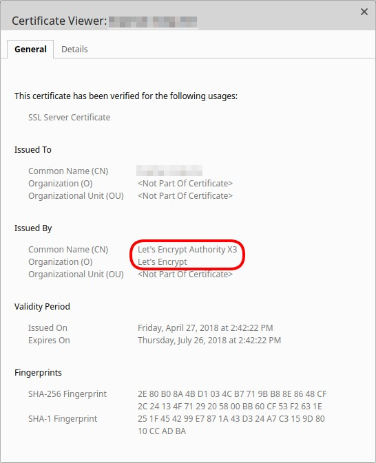

# 6.29 配置 HTTP 服务器

HTTP 服务器有许多配置选项。它们被定义在 [NettyHttpServerConfiguration](https://micronaut-projects.github.io/micronaut-docs-mn3/3.9.4/api/io/micronaut/http/server/netty/configuration/NettyHttpServerConfiguration.html) 配置类中，它扩展了 [HttpServerConfiguration](https://micronaut-projects.github.io/micronaut-docs-mn3/3.9.4/api/io/micronaut/http/server/HttpServerConfiguration.html)。

下面的例子显示了如何通过 `application.yml` 来调整服务器的配置选项：

*配置 HTTP 服务器设置*

```yaml
micronaut:
  server:
    maxRequestSize: 1MB
    host: localhost (1)
    netty:
      maxHeaderSize: 500KB (2)
      worker:
        threads: 8 (3)
      childOptions:
        autoRead: true (4)
```

1. 默认情况下，Micronaut 绑定了所有网络接口。使用 `localhost` 只绑定到回环网络接口。
2. 报头的最大尺寸
3. Netty 工作线程的数量
4. 自动读取请求正文

*表 1.为 [NettyHttpServerConfiguration](https://micronaut-projects.github.io/micronaut-docs-mn3/3.9.4/api/io/micronaut/http/server/netty/configuration/NettyHttpServerConfiguration.html) 配置属性*

|属性|类型|描述|
|--|--|--|
|micronaut.server.netty.child-options|java.util.Map|设置 Netty 的子 worker 选项。|
|micronaut.server.netty.options|java.util.Map|设置 channel 选项。|
|micronaut.server.netty.max-initial-line-length|int|设置 HTTP 请求的最大初始行长。默认值（4096）。|
|micronaut.server.netty.max-header-size|int|设置任何一个报头的最大尺寸。默认值（8192）。|
|micronaut.server.netty.max-chunk-size|int|设置任何单一请求块的最大尺寸。默认值（8192）。|
|micronaut.server.netty.max-h2c-upgrade-request-size|int|设置HTTP1.1请求主体的最大尺寸，用于将连接升级到HTTP2明文（h2c）。这个初始请求不能被流化，而是被完全缓冲，所以默认值（8192）是相对较小的。*如果这个值对你的使用情况来说太小，可以考虑使用一个空的初始 "升级请求"（例如{@code OPTIONS /}），或者切换到正常的 HTTP2。* *不影响正常的HTTP2（TLS）。*|
|micronaut.server.netty.chunked-supported|boolean|设置是否支持分块传输编码。默认值（true）。|
|micronaut.server.netty.validate-headers|boolean|设置是否验证传入的头文件。默认值（true）。|
|micronaut.server.netty.initial-buffer-size|int|设置初始缓冲区大小。默认值（128）。|
|micronaut.server.netty.log-level|io.netty.handler.logging.LogLevel|设置 Netty 日志级别。|
|micronaut.server.netty.compression-threshold|int|设置请求体的最小尺寸，以便进行压缩。默认值（1024）。|
|micronaut.server.netty.compression-level|int|设置压缩级别（0-9）。默认值（6）。|
|micronaut.server.netty.use-native-transport|boolean|设置是否使用 netty 的本地传输（epoll或kqueue），如果有的话。默认值（false）。|
|micronaut.server.netty.fallback-protocol|java.lang.String|设置通过 ALPN 谈判时使用的回避协议。|
|micronaut.server.netty.keep-alive-on-server-error|boolean|是否在内部服务器错误时发送连接保持活力。默认值（{@value DEFAULT_KEEP_ALIVE_ON_SERVER_ERROR}）。|
|micronaut.server.netty.pcap-logging-path-pattern|java.lang.String|用于记录传入的连接到 pcap 的路径模式。这是一个不支持的选项：行为可能会改变，也可能完全消失，恕不另行通知。|
|micronaut.server.netty.listeners|java.util.List|设置显式的netty监听器配置，如果它们应该是隐式的，则设置{@code null}。|

**使用本地传输**

与基于 NIO 的传输相比，本地 Netty 传输增加了特定平台的功能，产生更少的垃圾，并普遍提高了性能。

要启用本地传输，首先要添加一个依赖项：

对于 x86 的 macOS：

import Tabs from '@theme/Tabs';
import TabItem from '@theme/TabItem';

<Tabs>
  <TabItem value="Gradle" label="Gradle">

```groovy
runtimeOnly("io.netty:netty-transport-native-kqueue::osx-x86_64")
```

  </TabItem>
  <TabItem value="Maven" label="Maven">

```xml
<dependency>
    <groupId>io.netty</groupId>
    <artifactId>netty-transport-native-kqueue</artifactId>
    <scope>runtime</scope>
    <classifier>osx-x86_64</classifier>
</dependency>
```

  </TabItem>
</Tabs>

对于 M1 的 macOS：

<Tabs>
  <TabItem value="Gradle" label="Gradle">

```groovy
runtimeOnly("io.netty:netty-transport-native-kqueue::osx-aarch_64")
```

  </TabItem>
  <TabItem value="Maven" label="Maven">

```xml
<dependency>
    <groupId>io.netty</groupId>
    <artifactId>netty-transport-native-kqueue</artifactId>
    <scope>runtime</scope>
    <classifier>osx-aarch_64</classifier>
</dependency>
```

  </TabItem>
</Tabs>

对于 x86 的 Linux：

<Tabs>
  <TabItem value="Gradle" label="Gradle">

```groovy
runtimeOnly("io.netty:netty-transport-native-epoll::linux-x86_64")
```

  </TabItem>
  <TabItem value="Maven" label="Maven">

```xml
<dependency>
    <groupId>io.netty</groupId>
    <artifactId>netty-transport-native-epoll</artifactId>
    <scope>runtime</scope>
    <classifier>linux-x86_64</classifier>
</dependency>
```

  </TabItem>
</Tabs>

对于 ARM64 的 Linux：

<Tabs>
  <TabItem value="Gradle" label="Gradle">

```groovy
runtimeOnly("io.netty:netty-transport-native-epoll::linux-aarch_64")
```

  </TabItem>
  <TabItem value="Maven" label="Maven">

```xml
<dependency>
    <groupId>io.netty</groupId>
    <artifactId>netty-transport-native-epoll</artifactId>
    <scope>runtime</scope>
    <classifier>linux-aarch_64</classifier>
</dependency>
```

  </TabItem>
</Tabs>

然后配置默认的事件循环组，使其倾向于本地传输：

*配置默认的事件循环组，使其更倾向于本地传输*

```yaml
micronaut:
  netty:
    event-loops:
      default:
        prefer-native-transport: true
```

:::tip 注意
Netty 启用了简单的抽样资源泄漏检测，报告是否有泄漏，其代价是少量的开销。你可以通过设置属性 `netty.resource-leak-detector-level` 来禁用它或启用更高级的检测：`SIMPLE` (默认)、`DISABLED`、`PARANOID` 或 `ADVANCED`。
:::

## 6.29.1 配置服务器线程池

HTTP 服务器是建立在 [Netty](https://netty.io/) 上的，它被设计成一个事件循环模型的非阻塞 I/O 工具箱。

Netty worker 的事件循环使用 "default" 命名的事件循环组。这可以通过 `micronaut.netty.event-loops.default` 进行配置。

:::danger 危险
`micronaut.server.netty.worker` 下的事件循环配置只在事件循环组被设置为不对应于任何 `micronaut.netty.event-loops` 配置的名称时使用。这一行为已被废弃，并将在未来的版本中被移除。使用 `micronaut.netty.event-loops.*` 进行任何事件循环组配置，而不是通过  `event-loop-group` 设置名称。这不适用于父事件循环配置（`micronaut.server.netty.parent`）。
:::

*表 1.为 [Worker](https://micronaut-projects.github.io/micronaut-docs-mn3/3.9.4/api/io/micronaut/http/server/netty/configuration/NettyHttpServerConfiguration.Worker.html) 配置属性*

|属性|类型|描述|
|--|--|--|
|micronaut.server.netty.worker|[NettyHttpServerConfiguration$Worker](https://micronaut-projects.github.io/micronaut-docs-mn3/3.9.4/api/io/micronaut/http/server/netty/configuration/NettyHttpServerConfiguration.Worker.html)|设置 worker 事件循环配置。|
|micronaut.server.netty.worker.event-loop-group|java.lang.String|设置使用的名字。|
|micronaut.server.netty.worker.threads|int|设置事件循环组的线程数量。|
|micronaut.server.netty.worker.io-ratio|java.lang.Integer|设置 I/O 率。|
|micronaut.server.netty.worker.executor|java.lang.String|设置执行器名字。|
|micronaut.server.netty.worker.prefer-native-transport|boolean|设置是否偏爱本地传输（如果有的话）|
|micronaut.server.netty.worker.shutdown-quiet-period|java.time.Duration|设置关机静默期|
|micronaut.server.netty.worker.shutdown-timeout|java.time.Duration|设置关机超时（必须>= shutdownQuietPeriod）。|

:::note 提示
父事件循环可以用 `micronaut.server.netty.parent` 配置，配置选项相同。
:::

服务器也可以被配置为使用不同的命名 worker 事件循环：

*为服务器使用不同的事件循环*

```yaml
micronaut:
  server:
    netty:
      worker:
        event-loop-group: other
  netty:
    event-loops:
      other:
        num-threads: 10
```

:::tip 注意
线程数的默认值是系统属性 `io.netty.eventLoopThreads` 的值，如果没有指定，则是可用处理器 × 2。
:::

关于配置事件循环，见下表：

*表 2. [DefaultEventLoopGroupConfiguration](https://micronaut-projects.github.io/micronaut-docs-mn3/3.9.4/api/io/micronaut/http/netty/channel/DefaultEventLoopGroupConfiguration.html) 的配置属性*

|属性|类型|描述|
|--|--|--|
|micronaut.netty.event-loops.*.num-threads|int||
|micronaut.netty.event-loops.*.io-ratio|java.lang.Integer||
|micronaut.netty.event-loops.*.prefer-native-transport|boolean||
|micronaut.netty.event-loops.*.executor|java.lang.String||
|micronaut.netty.event-loops.*.shutdown-quiet-period|java.time.Duration||
|micronaut.netty.event-loops.*.shutdown-timeout|java.time.Duration||

### 6.29.1.1 阻塞操作

当处理阻塞操作时，Micronaut 默认将阻塞操作转移到一个非绑定的、缓存的 I/O 线程池。你可以使用名为 `io` 的 [ExecutorConfiguration](https://micronaut-projects.github.io/micronaut-docs-mn3/3.9.4/api/io/micronaut/scheduling/executor/ExecutorConfiguration.html) 来配置 I/O 线程池。比如说：

*配置服务器 I/O 线程池*

```yaml
micronaut:
  executors:
    io:
      type: fixed
      nThreads: 75
```

上述配置创建了一个有 75 个线程的固定线程池。

### 6.29.1.2 @Blocking

你可以使用 [@Blocking](https://micronaut-projects.github.io/micronaut-docs-mn3/3.9.4/api/io/micronaut/core/annotation/Blocking.html) 注解来标记方法为阻塞。

如果你将 `micronaut.server.thread-selection` 设置为 `AUTO`，Micronaut 框架就会将带有 `@Blocking` 注解的方法的执行卸载到 IO 线程池中（参阅：[TaskExecutors](https://micronaut-projects.github.io/micronaut-docs-mn3/3.9.4/api/io/micronaut/scheduling/TaskExecutors.html)）。

:::tip 注意
`@Blocking` 只有在你使用 `AUTO` 线程选择时才有效。从 Micronaut 2.0 开始，Micronaut 框架默认为手动选择线程。我们推荐使用 [@ExecuteOn](https://micronaut-projects.github.io/micronaut-docs-mn3/3.9.4/api/io/micronaut/scheduling/annotation/ExecuteOn.html) 注解来在不同的线程池中执行阻塞操作。`@ExecutesOn` 对 `MANUAL` 和 `AUTO` 线程选择都有效。
:::

有一些地方，Micronaut 框架内部使用了 [@Blocking](https://micronaut-projects.github.io/micronaut-docs-mn3/3.9.4/api/io/micronaut/core/annotation/Blocking.html)：

|阻塞类型|描述|
|--|--|
|[BlockingHttpClient](https://docs.micronaut.io/latest/api/io/micronaut/http/client/BlockingHttpClient.html)|用于测试，为 [HttpClient](https://micronaut-projects.github.io/micronaut-docs-mn3/3.9.4/api/io/micronaut/http/client/HttpClient.html) 操作的一个子集提供阻塞版本。|
|[IOUtils](https://docs.micronaut.io/latest/api/io/micronaut/http/client/BlockingHttpClient.html)|以阻塞方式读取一个 `BufferedReader` 的内容，并将其作为一个 `String` 返回。|
|[BootstrapPropertySourceLocator](https://docs.micronaut.io/latest/api/io/micronaut/context/env/BootstrapPropertySourceLocator.html)|解决当前 `Environment` 的远程或本地 [PropertySource](https://micronaut-projects.github.io/micronaut-docs-mn3/3.9.4/api/io/micronaut/context/env/PropertySource.html) 实例。|

:::note 提示
[Micronaut Data](/data/introduction.html) 也在内部利用 `@Blocking` 来进行一些交易操作、CRUD 拦截器和仓库。
:::

## 6.29.2 配置 Netty 客户端管道

你可以通过编写一个监听 [Registry](https://micronaut-projects.github.io/micronaut-docs-mn3/3.9.4/api/io/micronaut/http/client/netty/NettyClientCustomizer.Registry.html) 创建的 [Bean 事件监听器](/core/ioc#314-bean-事件)来定制 Netty 客户端管道。

[ChannelPipelineCustomizer](https://micronaut-projects.github.io/micronaut-docs-mn3/3.9.4/api/io/micronaut/http/netty/channel/ChannelPipelineCustomizer.html) 接口为 Micronaut 注册的各种处理程序的名称定义了常量。

作为一个例子，下面的代码样本演示了注册 [Logbook](https://github.com/zalando/logbook) 库，其中包括额外的 Netty 处理程序来执行请求和响应的记录：

*为 Logbook 定制 Netty 服务器管道*

<Tabs>
  <TabItem value="Java" label="Java" default>

```java
import io.micronaut.context.annotation.Requires;
import io.micronaut.context.event.BeanCreatedEvent;
import io.micronaut.context.event.BeanCreatedEventListener;
import io.micronaut.http.client.netty.NettyClientCustomizer;
import io.micronaut.http.netty.channel.ChannelPipelineCustomizer;
import io.netty.channel.Channel;
import io.netty.channel.ChannelPipeline;
import jakarta.inject.Singleton;
import org.zalando.logbook.Logbook;
import org.zalando.logbook.netty.LogbookClientHandler;

@Requires(beans = Logbook.class)
@Singleton
public class LogbookNettyClientCustomizer
    implements BeanCreatedEventListener<NettyClientCustomizer.Registry> { // (1)
    private final Logbook logbook;

    public LogbookNettyClientCustomizer(Logbook logbook) {
        this.logbook = logbook;
    }

    @Override
    public NettyClientCustomizer.Registry onCreated(
        BeanCreatedEvent<NettyClientCustomizer.Registry> event) {

        NettyClientCustomizer.Registry registry = event.getBean();
        registry.register(new Customizer(null)); // (2)
        return registry;
    }

    private class Customizer implements NettyClientCustomizer { // (3)
        private final Channel channel;

        Customizer(Channel channel) {
            this.channel = channel;
        }

        @Override
        public NettyClientCustomizer specializeForChannel(Channel channel, ChannelRole role) {
            return new Customizer(channel); // (4)
        }

        @Override
        public void onStreamPipelineBuilt() {
            channel.pipeline().addLast( // (5)
                "logbook",
                new LogbookClientHandler(logbook)
            );
        }
    }
}
```

  </TabItem>
  <TabItem value="Groovy" label="Groovy">

```groovy
import io.micronaut.context.event.BeanCreatedEvent
import io.micronaut.context.event.BeanCreatedEventListener
import io.micronaut.http.client.netty.NettyClientCustomizer
import io.netty.channel.Channel
import jakarta.inject.Singleton
import org.zalando.logbook.Logbook
import org.zalando.logbook.netty.LogbookClientHandler


@Requires(beans = Logbook.class)
@Singleton
class LogbookNettyClientCustomizer
        implements BeanCreatedEventListener<NettyClientCustomizer.Registry> { // (1)
    private final Logbook logbook;

    LogbookNettyClientCustomizer(Logbook logbook) {
        this.logbook = logbook
    }

    @Override
    NettyClientCustomizer.Registry onCreated(
            BeanCreatedEvent<NettyClientCustomizer.Registry> event) {

        NettyClientCustomizer.Registry registry = event.getBean()
        registry.register(new Customizer(null)) // (2)
        return registry
    }

    private class Customizer implements NettyClientCustomizer { // (3)
        private final Channel channel

        Customizer(Channel channel) {
            this.channel = channel
        }

        @Override
        NettyClientCustomizer specializeForChannel(Channel channel, ChannelRole role) {
            return new Customizer(channel) // (4)
        }

        @Override
        void onStreamPipelineBuilt() {
            channel.pipeline().addLast( // (5)
                    "logbook",
                    new LogbookClientHandler(logbook)
            )
        }
    }
}
```

  </TabItem>
  <TabItem value="Kotlin" label="Kotlin">

```kt
import io.micronaut.context.annotation.Requires
import io.micronaut.context.event.BeanCreatedEvent
import io.micronaut.context.event.BeanCreatedEventListener
import io.micronaut.http.client.netty.NettyClientCustomizer
import io.micronaut.http.client.netty.NettyClientCustomizer.ChannelRole
import io.netty.channel.Channel
import jakarta.inject.Singleton
import org.zalando.logbook.Logbook
import org.zalando.logbook.netty.LogbookClientHandler

@Requires(beans = [Logbook::class])
@Singleton
class LogbookNettyClientCustomizer(private val logbook: Logbook) :
    BeanCreatedEventListener<NettyClientCustomizer.Registry> { // (1)

    override fun onCreated(event: BeanCreatedEvent<NettyClientCustomizer.Registry>): NettyClientCustomizer.Registry {
        val registry = event.bean
        registry.register(Customizer(null)) // (2)
        return registry
    }

    private inner class Customizer constructor(private val channel: Channel?) :
        NettyClientCustomizer { // (3)

        override fun specializeForChannel(channel: Channel, role: ChannelRole) = Customizer(channel) // (4)

        override fun onStreamPipelineBuilt() {
            channel!!.pipeline().addLast( // (5)
                "logbook",
                LogbookClientHandler(logbook)
            )
        }
    }
}
```

  </TabItem>
</Tabs>

1. `LogbookNettyClientCustomizer` 监听一个 [Registry](https://micronaut-projects.github.io/micronaut-docs-mn3/3.9.4/api/io/micronaut/http/client/netty/NettyClientCustomizer.Registry.html)，并要求定义一个 `Logbook` Bean。
2. 根定制器在没有通道的情况下被初始化并注册
3. 实际的自定义器实现了 [NettyClientCustomizer](https://micronaut-projects.github.io/micronaut-docs-mn3/3.9.4/api/io/micronaut/http/client/netty/NettyClientCustomizer.html)。
4. 当一个新的通道被创建时，一个新的、专门的自定义器将为该通道创建。
5. 当客户端发出信号说流管道已经完全构建完成时，日志处理程序被注册。

:::danger 危险
LogBook 有一个[重大的错误](https://github.com/zalando/logbook/issues/1216)，限制了它在 netty 上的作用。
:::

## 6.29.3 配置 Netty 服务器管道

你可以通过编写一个监听 [Registry](https://micronaut-projects.github.io/micronaut-docs-mn3/3.9.4/api/io/micronaut/http/server/netty/NettyServerCustomizer.Registry.html) 创建的 [Bean 事件监听器](/core/ioc#314-bean-事件) 来定制 Netty 服务器管道。

[ChannelPipelineCustomizer](https://micronaut-projects.github.io/micronaut-docs-mn3/3.9.4/api/io/micronaut/http/netty/channel/ChannelPipelineCustomizer.html) 接口为 Micronaut 注册的各种处理程序的名称定义了常量。

作为一个例子，下面的代码示例演示了注册 [Logbook](https://github.com/zalando/logbook) 库，其中包括额外的 Netty 处理程序，以执行请求和响应日志：

*为 Logbook 定制 Netty 服务器管道*

<Tabs>
  <TabItem value="Java" label="Java" default>

```java
import io.micronaut.context.annotation.Requires;
import io.micronaut.context.event.BeanCreatedEvent;
import io.micronaut.context.event.BeanCreatedEventListener;
import io.micronaut.http.netty.channel.ChannelPipelineCustomizer;
import io.micronaut.http.server.netty.NettyServerCustomizer;
import io.netty.channel.Channel;
import org.zalando.logbook.Logbook;
import org.zalando.logbook.netty.LogbookServerHandler;

import jakarta.inject.Singleton;

@Requires(beans = Logbook.class)
@Singleton
public class LogbookNettyServerCustomizer
    implements BeanCreatedEventListener<NettyServerCustomizer.Registry> { // (1)
    private final Logbook logbook;

    public LogbookNettyServerCustomizer(Logbook logbook) {
        this.logbook = logbook;
    }

    @Override
    public NettyServerCustomizer.Registry onCreated(
        BeanCreatedEvent<NettyServerCustomizer.Registry> event) {

        NettyServerCustomizer.Registry registry = event.getBean();
        registry.register(new Customizer(null)); // (2)
        return registry;
    }

    private class Customizer implements NettyServerCustomizer { // (3)
        private final Channel channel;

        Customizer(Channel channel) {
            this.channel = channel;
        }

        @Override
        public NettyServerCustomizer specializeForChannel(Channel channel, ChannelRole role) {
            return new Customizer(channel); // (4)
        }

        @Override
        public void onStreamPipelineBuilt() {
            channel.pipeline().addBefore( // (5)
                ChannelPipelineCustomizer.HANDLER_HTTP_STREAM,
                "logbook",
                new LogbookServerHandler(logbook)
            );
        }
    }
}
```

  </TabItem>
  <TabItem value="Groovy" label="Groovy">

```groovy
import io.micronaut.context.annotation.Requires
import io.micronaut.context.event.BeanCreatedEvent
import io.micronaut.context.event.BeanCreatedEventListener
import io.micronaut.http.netty.channel.ChannelPipelineCustomizer
import io.micronaut.http.server.netty.NettyServerCustomizer
import io.netty.channel.Channel
import org.zalando.logbook.Logbook
import org.zalando.logbook.netty.LogbookServerHandler

import jakarta.inject.Singleton

@Requires(beans = Logbook.class)
@Singleton
class LogbookNettyServerCustomizer
        implements BeanCreatedEventListener<NettyServerCustomizer.Registry> { // (1)
    private final Logbook logbook;

    LogbookNettyServerCustomizer(Logbook logbook) {
        this.logbook = logbook
    }

    @Override
    NettyServerCustomizer.Registry onCreated(
            BeanCreatedEvent<NettyServerCustomizer.Registry> event) {

        NettyServerCustomizer.Registry registry = event.getBean()
        registry.register(new Customizer(null)) // (2)
        return registry
    }

    private class Customizer implements NettyServerCustomizer { // (3)
        private final Channel channel

        Customizer(Channel channel) {
            this.channel = channel
        }

        @Override
        NettyServerCustomizer specializeForChannel(Channel channel, ChannelRole role) {
            return new Customizer(channel) // (4)
        }

        @Override
        void onStreamPipelineBuilt() {
            channel.pipeline().addBefore( // (5)
                    ChannelPipelineCustomizer.HANDLER_HTTP_STREAM,
                    "logbook",
                    new LogbookServerHandler(logbook)
            )
        }
    }
}
```

  </TabItem>
  <TabItem value="Kotlin" label="Kotlin">

```kt
import io.micronaut.context.annotation.Requires
import io.micronaut.context.event.BeanCreatedEvent
import io.micronaut.context.event.BeanCreatedEventListener
import io.micronaut.http.netty.channel.ChannelPipelineCustomizer
import io.micronaut.http.server.netty.NettyServerCustomizer
import io.micronaut.http.server.netty.NettyServerCustomizer.ChannelRole
import io.netty.channel.Channel
import jakarta.inject.Singleton
import org.zalando.logbook.Logbook
import org.zalando.logbook.netty.LogbookServerHandler

@Requires(beans = [Logbook::class])
@Singleton
class LogbookNettyServerCustomizer(private val logbook: Logbook) :
    BeanCreatedEventListener<NettyServerCustomizer.Registry> { // (1)

    override fun onCreated(event: BeanCreatedEvent<NettyServerCustomizer.Registry>): NettyServerCustomizer.Registry {
        val registry = event.bean
        registry.register(Customizer(null)) // (2)
        return registry
    }

    private inner class Customizer constructor(private val channel: Channel?) :
        NettyServerCustomizer { // (3)

        override fun specializeForChannel(channel: Channel, role: ChannelRole) = Customizer(channel) // (4)

        override fun onStreamPipelineBuilt() {
            channel!!.pipeline().addBefore( // (5)
                ChannelPipelineCustomizer.HANDLER_HTTP_STREAM,
                "logbook",
                LogbookServerHandler(logbook)
            )
        }
    }
}
```

  </TabItem>
</Tabs>

1. `LogbookNettyServerCustomizer` 监听 [Registry](https://micronaut-projects.github.io/micronaut-docs-mn3/3.9.4/api/io/micronaut/http/server/netty/NettyServerCustomizer.Registry.html)，并要求定义一个 `Logbook` bean
2. 根定制器在没有通道的情况下被初始化并注册
3. 实际的自定义器实现了 [NettyServerCustomizer](https://micronaut-projects.github.io/micronaut-docs-mn3/3.9.4/api/io/micronaut/http/server/netty/NettyServerCustomizer.html)。
4. 当一个新的通道被创建时，一个新的、专门的自定义器将为该通道创建。
5. 当服务器发出信号说流管道已经完全构建完成时，日志处理程序被注册。

:::danger 危险
LogBook 有一个[重大的错误](https://github.com/zalando/logbook/issues/1216)，限制了它在 netty 上的作用。
:::

## 6.29.4 高级监听器配置

你也可以不配置单个端口，而是手动指定每个监听器。

```yaml
micronaut:
  server:
    netty:
      listeners:
        httpListener: # listener name can be an arbitrary value
          host: 127.0.0.1 # optional, by default binds to all interfaces
          port: 8086
          ssl: false
        httpsListener:
          port: 8087
          ssl: true
```

如果你手动指定监听器，其他配置如 `micronaut.server.port` 将被忽略。

可以为每个听众单独启用或禁用 SSL。当启用时，SSL 将被配置成[上述的样子](/core/httpserver/serverConfiguration.html#6296-用-HTTPS-保证服务器的安全)。

嵌入式服务器还支持使用 netty 绑定到 unix 域套接字。这需要以下的依赖：

<Tabs>
  <TabItem value="Gradle" label="Gradle">

```groovy
implementation("io.netty:netty-transport-native-unix-common")
```

  </TabItem>
  <TabItem value="Maven" label="Maven">

```xml
<dependency>
    <groupId>io.netty</groupId>
    <artifactId>netty-transport-native-unix-common</artifactId>
</dependency>
```

  </TabItem>
</Tabs>

服务器还必须被配置为[使用本地传输](/core/serverConfiguration.html)（epoll 或 kqueue）。

```yaml
micronaut:
  server:
    netty:
      listeners:
        unixListener: # listener name can be an arbitrary value
          family: UNIX
          path: /run/micronaut.socket
          ssl: true
```

:::tip 注意
要使用抽象域套接字而不是普通的套接字，在路径前加一个 NUL 字符，如 `"\0/run/micronaut.socket"`
:::

## 6.29.5 配置 CORS

Micronaut 支持开箱即用的 CORS（[跨源资源共享](https://www.w3.org/TR/cors/)）。默认情况下，CORS 请求被拒绝。

### 6.29.5.1 通过配置实现 CORS

要启用 CORS 请求的处理，请修改你的配置。例如用 `application.yml`：

*CORS 配置实例*

```yaml
micronaut:
  server:
    cors:
      enabled: true
```

通过只启用 CORS 处理，采取了一个 "广泛开放 "的策略，允许来自任何来源的请求。

要改变所有来源或特定来源的设置，改变配置以提供一个或多个 "配置"。通过提供任何配置，默认的"广泛开放"配置就没有被配置。

*COR S配置*

```yaml
micronaut:
  server:
    cors:
      enabled: true
      configurations:
        all:
          ...
        web:
          ...
        mobile:
          ...
```

在上面的例子中，提供了三个配置。他们的名字（`all`、`web`、`mobile`）并不重要，在 Micronaut 中没有任何意义。它们的存在纯粹是为了能够轻松识别配置的目标用户。

相同的配置属性可以应用于每个配置。参见 [CorsOriginConfiguration](https://micronaut-projects.github.io/micronaut-docs-mn3/3.9.4/api/io/micronaut/http/server/cors/CorsOriginConfiguration.html)，了解可以定义的属性。每个配置提供的值将默认为相应字段的默认值。

当一个 CORS 请求被提出时，配置被搜索允许的源，这些源完全匹配或通过正则表达式匹配请求的源。

### 6.29.5.2 允许的源

要想让一个给定的配置允许任何来源，不要在你的配置中包括 `allowedOrigins` 键。

对于多个有效的起源，将配置的 `allowedOrigins` 键设置为一个字符串的列表。每个值可以是一个静态值（`http://www.foo.com`）或一个正则表达式（`^http(|s)://www.google\.com$`）。

正则表达式被传递给 [Pattern#compile](https://docs.oracle.com/javase/8/docs/api/java/util/regex/Pattern.html#compile-java.lang.String-)，并通过 [Matcher#matches](https://docs.oracle.com/javase/8/docs/api/java/util/regex/Matcher.html#matches--) 与请求来源进行比较。

*CORS 配置实例*

```yaml
micronaut:
  server:
    cors:
      enabled: true
      configurations:
        web:
          allowedOrigins:
            - http://foo.com
            - ^http(|s):\/\/www\.google\.com$
```

### 6.29.5.3 允许的方法

要允许任何给定配置的请求方法，不要在你的配置中包括 `allowedMethods` 键。

对于多个允许的方法，将配置的 `allowedMethods` 键设置为一个字符串列表。

*CORS 配置实例*

```yaml
micronaut:
  server:
    cors:
      enabled: true
      configurations:
        web:
          allowedMethods:
            - POST
            - PUT
```

### 6.29.5.4 允许的头

要允许任何给定配置的请求头，不要在你的配置中包括 `allowedHeaders` 键。

对于多个允许的头，将配置的 `allowedHeaders` 键设置为一个字符串列表。

*CORS 配置示例*

```yaml
micronaut:
  server:
    cors:
      enabled: true
      configurations:
        web:
          allowedHeaders:
            - Content-Type
            - Authorization
```

### 6.29.5.5 暴露的头

要配置通过 `Access-Control-Expose-Headers` 头在 CORS 请求的响应中发送的头信息，在你的配置中包括 `exposedHeaders` 键的字符串列表。默认情况下，没有一个是暴露的。

*CORS 配置示例*

```yaml
micronaut:
  server:
    cors:
      enabled: true
      configurations:
        web:
          exposedHeaders:
            - Content-Type
            - Authorization
```

### 6.29.5.6 允许的凭证

CORS 请求默认允许凭证。要禁止凭证，请将 `allowCredentials` 选项设置为 `false`。

*CORS 配置示例*

```yaml
micronaut:
  server:
    cors:
      enabled: true
      configurations:
        web:
          allowCredentials: false
```

### 6.29.5.7 最大年龄

默认情况下，预检请求可以被缓存的最大年龄是 30 分钟。要改变这种行为，请指定一个以秒为单位的值。

*CORS 配置示例*

```yaml
micronaut:
  server:
    cors:
      enabled: true
      configurations:
        web:
          maxAge: 3600 # 1 hour
```

### 6.29.5.8 多个标头值

默认情况下，当一个头有多个值时，会发送多个头，每个都有一个值。可以通过设置一个配置选项来改变这种行为，即发送一个带有逗号分隔的数值列表的单一头文件。

```yaml
micronaut:
  server:
    cors:
      single-header: true
```

## 6.29.6 用 HTTPS 保证服务器安全

Micronaut 支持开箱即用的 HTTPS。默认情况下，HTTPS 被禁用，所有的请求都使用 HTTP。要启用 HTTPS 支持，请修改你的配置。例如，使用 `application.yml`：

*HTTPS 配置示例*

```yaml
micronaut:
  server:
    ssl:
      enabled: true
      buildSelfSigned: true (1)
```

1. Micronaut 将创建一个自签名的证书。

:::note 提示
默认情况下，支持 HTTPS 的 Micronaut 在 8443 端口启动，但你可以通过 `micronaut.server.ssl.port` 属性改变端口。
:::

对于生成自签名的证书，Micronaut HTTP 服务器将使用 netty。netty 使用两种方法中的一种来生成证书。

如果你使用一个预先生成的证书（为了安全，你应该这样做），这些步骤是不必要的。

- Netty 可以使用 JDK 内部的 `sun.security.x509` 包。在较新的 JDK 版本中，这个包受到限制，可能无法使用。你可能需要添加  `--add-exports=java.base/sun.security.x509=ALL-UNNAMED` 作为 VM 参数。

- 另外，netty 将使用 Bouncy Castle BCPKIX API。这需要一个额外的依赖：

<Tabs>
  <TabItem value="Gradle" label="Gradle">

```groovy
implementation("org.bouncycastle:bcpkix-jdk15on")
```

  </TabItem>
  <TabItem value="Maven" label="Maven">

```xml
<dependency>
    <groupId>org.bouncycastle</groupId>
    <artifactId>bcpkix-jdk15on</artifactId>
</dependency>
```

  </TabItem>
</Tabs>

:::caution 警告
这种配置将在浏览器中产生一个警告。
:::


### 使用有效的 x509 证书

也可以将 Micronaut 配置为使用现有的有效 x509 证书，例如用 [Let's Encrypt](https://letsencrypt.org/) 创建的一个。你将需要 `server.crt` 和 `server.key` 文件，并将它们转换为 PKCS #12 文件。

```bash
$ openssl pkcs12 -export \
                 -in server.crt \ (1)
                 -inkey server.key \ (2)
                 -out server.p12 \ (3)
                 -name someAlias \ (4)
                 -chain -CAfile ca.crt -caname root
```

1. 原始的 `server.crt` 文件
2. 原始的 `server.key` 文件
3. 要创建的 `server.p12` 文件
4. 证书的别名

在创建 `server.p12` 文件的过程中，有必要定义一个密码，以后在 Micronaut 中使用该证书时将需要这个密码。

现在修改你的配置：

*HTTPS 配置示例*

```yaml
micronaut:
  ssl:
    enabled: true
    key-store:
      path: classpath:server.p12 (1)
      password: mypassword (2)
      type: PKCS12
```

1. `p12` 文件。它也可以被引用为 `file:/path/to/the/file`。
2. 输出时定义的密码

有了这个配置，如果我们启动 Micronaut 并连接到 https://localhost:8443，我们仍然会在浏览器中看到警告，但如果我们检查证书，我们可以检查到它是由 Let's Encrypt 生成的。



最后，我们可以通过在 `/etc/hosts` 文件中为域名添加一个别名来测试该证书对浏览器是否有效：

```bash
$ cat /etc/hosts
...
127.0.0.1   my-domain.org
...
```

现在我们可以连接到 `https://my-domain.org:8443`：


---

### 使用 Java Keystore （JKS）

不推荐使用这种类型的证书，因为其格式是专有的 —— PKCS12 格式是首选。不管怎么样，Micronaut也支持它。

将 `p12` 证书转换为 JKS 证书：

```bash
$ keytool -importkeystore \
          -deststorepass newPassword -destkeypass newPassword \ (1)
          -destkeystore server.keystore \ (2)
          -srckeystore server.p12 -srcstoretype PKCS12 -srcstorepass mypassword \ (3)
          -alias someAlias (4)
```

1. 有必要定义 keystore 的密码
2. 要创建的文件
3. 之前创建的 PKCS12 文件，以及创建时定义的密码
4. 之前使用的别名

如果 `srcstorepass` 或 `alias` 与 `p12` 文件中定义的不一样，转换将失败。

现在修改你的配置：

*HTTPS 配置示例*

```yaml
micronaut:
  ssl:
    enabled: true
    key-store:
      path: classpath:server.keystore
      password: newPassword
      type: JKS
```

启动 Micronaut，应用程序将使用 keystore 中的证书在 `https://localhost:8443` 上运行。

---

### 刷新/重载 HTTPS 证书

过期后保持 HTTPS 证书的更新可能是一个挑战。一个很好的解决方案是[自动化证书管理环境](https://en.wikipedia.org/wiki/Automated_Certificate_Management_Environment)（ACME）和 [Micronaut ACME](/acme/introduction.html) 模块，它提供了对自动刷新证书机构的支持。

如果不可能使用一个证书颁发机构，你需要从磁盘中手动更新证书，那么你应该使用 Micronaut 对[应用事件](/core/ioc#314-bean-事件)的支持，发射一个 [RefreshEvent](https://micronaut-projects.github.io/micronaut-docs-mn3/3.9.4/api/io/micronaut/runtime/context/scope/refresh/RefreshEvent.html)，其中包含定义 HTTPS 配置的密钥，Micronaut 将从磁盘中重新加载证书并将新的配置应用到服务器上。

:::tip 注意
你也可以使用[刷新管理端点](/core/management/providedEndpoints.html#1525-刷新端点)，但这只适用于磁盘上证书的物理位置发生变化的情况。
:::

例如，下面将从磁盘上重新加载先前列出的 HTTPS 配置，并将其应用于新传入的请求（例如，这段代码可以为一个轮询证书变化的计划工作而运行）：

*手动刷新 HTTPS 配置*

```java
import jakarta.inject.Inject;
import io.micronaut.context.event.ApplicationEventPublisher;
import io.micronaut.runtime.context.scope.refresh.RefreshEvent;
import java.util.Collections;
...

@Inject ApplicationEventPublisher<RefreshEvent> eventPublisher;

...

eventPublisher.publishEvent(new RefreshEvent(
    Collections.singletonMap("micronaut.ssl", "*")
));
```

## 6.27 启用 HTTP 和 HTTPS

Micronaut 支持同时绑定 HTTP 和 HTTPS。要启用双协议支持，请修改你的配置。例如使用 `application.yml`：

*双协议配置示例*

```yaml
micronaut:
  server:
    ssl:
      enabled: true
      build-self-signed: true (1)
    dual-protocol : true (2)
```

1. 你必须配置 SSL 以使 HTTPS 工作。在这个例子中，我们只是使用了一个自签名的证书，但其他配置参阅[用 HTTPS 保护服务器](core/httpserver/serverConfiguration.html#6296-用-HTTPS-保证服务器的安全)。
2. 启用 HTTP 和 HTTPS 是一项选择功能——设置 `dualProtocol` 标志可以启用它。在默认情况下，Micronaut 只启用一个

也可以将所有的 HTTP 请求自动重定向到 HTTPS。除了前面的配置，你需要启用这个选项。例如使用 `application.yml`：

*启用 HTTP 到 HTTPS 重定向*

```yaml
micronaut:
  server:
    ssl:
      enabled: true
      build-self-signed: true
    dual-protocol : true
    http-to-https-redirect: true (1)
```

1. 启用 HTTP 到 HTTPS 的重定向

## 6.29.8 启用访问记录器

根据 [apache mod_log_config](https://httpd.apache.org/docs/current/mod/mod_log_config.html) 和 [Tomcat Access Log Valve](https://tomcat.apache.org/tomcat-10.0-doc/config/valve.html#Access_Logging) 的精神，可以为 HTTP 服务器启用一个访问记录器（这对 HTTP/1 和 HTTP/2 都有效）。

要启用和配置访问记录器，在 `application.yml` 中设置：

*启用访问日志记录器*

```yaml
micronaut:
  server:
    netty:
      access-logger:
        enabled: true # Enables the access logger
        logger-name: my-access-logger # A logger name, optional, default is `HTTP_ACCESS_LOGGER`
        log-format: common # A log format, optional, default is Common Log Format
```

**过滤访问日志**

如果你希望不记录某些路径的访问，你可以在配置中指定正则表达式过滤器：

*过滤访问日志*

```yaml
micronaut:
  server:
    netty:
      access-logger:
        enabled: true # Enables the access logger
        logger-name: my-access-logger # A logger name, optional, default is `HTTP_ACCESS_LOGGER`
        log-format: common # A log format, optional, default is Common Log Format
        exclusions:
          - /health
          - /path/.+
```

**日志备份配置**

除了启用访问记录器，你还必须为指定或默认的记录器名称添加一个记录器。例如使用默认的日志记录器名称为 logback：

*Logback 配置*

```xml
<appender
    name="httpAccessLogAppender"
    class="ch.qos.logback.core.rolling.RollingFileAppender">
    <append>true</append>
    <file>log/http-access.log</file>
    <rollingPolicy class="ch.qos.logback.core.rolling.TimeBasedRollingPolicy">
        <!-- daily rollover -->
        <fileNamePattern>log/http-access-%d{yyyy-MM-dd}.log
        </fileNamePattern>
        <maxHistory>7</maxHistory>
    </rollingPolicy>
    <encoder>
        <charset>UTF-8</charset>
        <pattern>%msg%n</pattern>
    </encoder>
    <immediateFlush>true</immediateFlush>
</appender>

<logger name="HTTP_ACCESS_LOGGER" additivity="false" level="info">
    <appender-ref ref="httpAccessLogAppender" />
</logger>
```

该模式应该只有消息标记，因为其他元素将被访问记录器处理。

**日志格式**

语法是基于 [Apache httpd 日志格式](https://httpd.apache.org/docs/current/mod/mod_log_config.html)。

这些是支持的标记：

- `%a` —— 远程 IP 地址
- `%A` —— 本地 IP 地址
- `%b` —— 发送的字节，不包括 HTTP 头，如果没有发送字节，则为'-'。
- `%B` —— 已发送的字节，不包括 HTTP 头信息
- `%h` —— 远程主机名称
- `%H` —— 请求协议
- `%{<header>}i` —— 请求头。如果省略参数(`%i`)，则打印所有头文件。
- `%{<header>}o` —— 响应头。如果省略该参数（`%o`），则打印所有头信息。
- `%{<cookie>}C` —— 请求 cookie（COOKIE）。如果省略该参数（`%C`），则打印所有 cookie。
- `%{<cookie>}C` —— 响应 cookie（SET_COOKIE）。如果省略该参数(`%c`)，将打印所有的 cookie。
- `%l` —— 来自 identd 的远程逻辑用户名（总是返回'-'）。
- `%m` —— 请求方法
- `%p` —— 本地端口
- `%q` —— 查询字符串（不包括"?"字符）。
- `%r` —— 请求的第一行
- `%s` —— 响应的HTTP状态代码
- `%{<format>}t` —— 日期和时间。如果省略该参数，则使用通用日志格式（"'['dd/MMM/yyyy:HH:mm:ss Z']""）。
    - 如果格式以 begin 开头：(默认情况下)，时间是在请求处理的开始阶段进行。如果以 end 开头：则是日志条目被写入的时间，接近于请求处理的结束。
    - 该格式应遵循 `DateTimeFormatter` 的语法。
- `%{property}u` —— 远程认证的用户。当 **micronaut-session** 在 classpath 上时，如果省略参数，则返回 session id，否则返回指定的属性，打印出'-'
- `%U` —— 请求的 URI
- `%v` —— 本地服务器名称
- `%D` —— 处理请求的时间，以毫秒计
- `%T` —— 处理请求的时间，以秒为单位

此外，你还可以使用以下常见模式的别名：

- `common` —— `%h` `%l` `%u` `%t` `"%r"` `%s` `%b` 用于[通用日志格式](https://httpd.apache.org/docs/2.4/logs.html#common)（CLF）。
- `combined` —— `%h` `%l` `%u` `%t` `"%r"` `%s` `%b` `"%{Refer}i"` `"%{User-Agent}i"` 用于[组合日志格式](https://httpd.apache.org/docs/2.4/logs.html#combined)。

## 6.29.9 启动次要服务器

Micronaut 支持通过 [NettyEmbeddedServerFactory](https://micronaut-projects.github.io/micronaut-docs-mn3/3.9.4/api/io/micronaut/http/server/netty/NettyEmbeddedServerFactory.html) 接口以编程方式创建额外的 Netty 服务器。

这在某些情况下是很有用的，例如，你需要通过不同的端口暴露不同的服务器，并可能有不同的配置（HTTPS，线程资源等）。

下面的例子演示了如何定义一个 [Factory Bean](/core/ioc#38-bean-工厂)，使用程序化创建的配置启动一个额外的服务器：

*以编程方式创建次要服务器*

<Tabs>
  <TabItem value="Java" label="Java" default>

```java
import java.util.Collections;
import io.micronaut.context.annotation.Bean;
import io.micronaut.context.annotation.Context;
import io.micronaut.context.annotation.Factory;
import io.micronaut.context.annotation.Requires;
import io.micronaut.context.env.Environment;
import io.micronaut.core.util.StringUtils;
import io.micronaut.discovery.ServiceInstanceList;
import io.micronaut.discovery.StaticServiceInstanceList;
import io.micronaut.http.server.netty.NettyEmbeddedServer;
import io.micronaut.http.server.netty.NettyEmbeddedServerFactory;
import io.micronaut.http.server.netty.configuration.NettyHttpServerConfiguration;
import io.micronaut.http.ssl.ServerSslConfiguration;
import jakarta.inject.Named;

@Factory
public class SecondaryNettyServer {
    public static final String SERVER_ID = "another"; // (1)

    @Named(SERVER_ID)
    @Context
    @Bean(preDestroy = "close") // (2)
    @Requires(beans = Environment.class)
    NettyEmbeddedServer nettyEmbeddedServer(NettyEmbeddedServerFactory serverFactory) { // (3)
        // configure server programmatically
        final NettyHttpServerConfiguration configuration =
                new NettyHttpServerConfiguration(); // (4)
        final ServerSslConfiguration sslConfiguration = new ServerSslConfiguration(); // (5)
        sslConfiguration.setBuildSelfSigned(true);
        sslConfiguration.setEnabled(true);
        sslConfiguration.setPort(-1); // random port
        final NettyEmbeddedServer embeddedServer = serverFactory.build(configuration, sslConfiguration); // (6)
        embeddedServer.start(); // (7)
        return embeddedServer; // (8)
    }

    @Bean
    ServiceInstanceList serviceInstanceList( // (9)
            @Named(SERVER_ID) NettyEmbeddedServer nettyEmbeddedServer) {
        return new StaticServiceInstanceList(
                SERVER_ID,
                Collections.singleton(nettyEmbeddedServer.getURI())
        );
    }
}
```

  </TabItem>
  <TabItem value="Groovy" label="Groovy">

```groovy
import io.micronaut.context.annotation.Bean
import io.micronaut.context.annotation.Context
import io.micronaut.context.annotation.Factory
import io.micronaut.context.annotation.Requires
import io.micronaut.context.env.Environment
import io.micronaut.core.util.StringUtils
import io.micronaut.discovery.ServiceInstanceList
import io.micronaut.discovery.StaticServiceInstanceList
import io.micronaut.http.server.netty.NettyEmbeddedServer
import io.micronaut.http.server.netty.NettyEmbeddedServerFactory
import io.micronaut.http.server.netty.configuration.NettyHttpServerConfiguration
import io.micronaut.http.ssl.ServerSslConfiguration
import jakarta.inject.Named

@Factory
class SecondaryNettyServer {
    static final String SERVER_ID = "another" // (1)

    @Named(SERVER_ID)
    @Context
    @Bean(preDestroy = "stop") // (2)
    @Requires(beans = Environment.class)
    NettyEmbeddedServer nettyEmbeddedServer(NettyEmbeddedServerFactory serverFactory) { // (3)
        def configuration =
                new NettyHttpServerConfiguration() // (4)
        def sslConfiguration = new ServerSslConfiguration() // (5)
        sslConfiguration.setBuildSelfSigned(true)
        sslConfiguration.enabled = true
        sslConfiguration.port = -1 // random port
        // configure server programmatically
        final NettyEmbeddedServer embeddedServer = serverFactory.build(configuration, sslConfiguration) // (5)
        embeddedServer.start() // (6)
        return embeddedServer // (7)
    }

    @Bean
    ServiceInstanceList serviceInstanceList( // (8)
                                             @Named(SERVER_ID) NettyEmbeddedServer nettyEmbeddedServer) {
        return new StaticServiceInstanceList(
                SERVER_ID,
                [ nettyEmbeddedServer.URI ]
        )
    }
}
```

  </TabItem>
  <TabItem value="Kotlin" label="Kotlin">

```kt
import io.micronaut.context.annotation.Bean
import io.micronaut.context.annotation.Context
import io.micronaut.context.annotation.Factory
import io.micronaut.context.annotation.Requires
import io.micronaut.context.env.Environment
import io.micronaut.core.util.StringUtils
import io.micronaut.discovery.ServiceInstanceList
import io.micronaut.discovery.StaticServiceInstanceList
import io.micronaut.http.server.netty.NettyEmbeddedServer
import io.micronaut.http.server.netty.NettyEmbeddedServerFactory
import io.micronaut.http.server.netty.configuration.NettyHttpServerConfiguration
import io.micronaut.http.ssl.ServerSslConfiguration
import jakarta.inject.Named

@Factory
class SecondaryNettyServer {
    companion object {
        const val SERVER_ID = "another" // (1)
    }

    @Named(SERVER_ID)
    @Context
    @Bean(preDestroy = "close") // (2)
    @Requires(beans = [Environment::class])
    fun nettyEmbeddedServer(
        serverFactory: NettyEmbeddedServerFactory // (3)
    ) : NettyEmbeddedServer {
        val configuration = NettyHttpServerConfiguration() // (4)
        val sslConfiguration = ServerSslConfiguration() // (5)

        sslConfiguration.setBuildSelfSigned(true)
        sslConfiguration.isEnabled = true
        sslConfiguration.port = -1 // random port

        // configure server programmatically
        val embeddedServer = serverFactory.build(configuration, sslConfiguration) // (6)
        embeddedServer.start() // (7)
        return embeddedServer // (8)
    }

    @Bean
    fun serviceInstanceList( // (9)
        @Named(SERVER_ID) nettyEmbeddedServer: NettyEmbeddedServer
    ): ServiceInstanceList {
        return StaticServiceInstanceList(
            SERVER_ID, setOf(nettyEmbeddedServer.uri)
        )
    }
}
```

  </TabItem>
</Tabs>

1. 为服务器定义一个独特的名字
2. 使用服务器名称定义一个 [@Context](https://micronaut-projects.github.io/micronaut-docs-mn3/3.9.4/api/io/micronaut/context/annotation/Context.html) 范围内的 Bean，并包括 `preDestroy="close"`，以确保服务器在上下文关闭时被关闭。
3. 将 [NettyEmbeddedServerFactory](https://micronaut-projects.github.io/micronaut-docs-mn3/3.9.4/api/io/micronaut/http/server/netty/NettyEmbeddedServerFactory.html) 注入到一个[工厂 bean](/core/ioc#38-bean-工厂) 中。
4. 以编程方式创建 [NettyHttpServerConfiguration](https://micronaut-projects.github.io/micronaut-docs-mn3/3.9.4/api/io/micronaut/http/server/netty/configuration/NettyHttpServerConfiguration.html)
5. 可以选择创建 [ServerSslConfiguration](https://micronaut-projects.github.io/micronaut-docs-mn3/3.9.4/api/io/micronaut/http/ssl/ServerSslConfiguration.html)
6. 使用构建方法来构建服务器实例
7. 用 `start` 方法启动服务器
8. 将服务器实例作为一个托管豆返回
9. 如果你想通过服务器名称来注入 [HTTP 客户端](/core/httpClient.html)，可以选择定义 [ServiceInstanceList](https://micronaut-projects.github.io/micronaut-docs-mn3/3.9.4/api/io/micronaut/discovery/ServiceInstanceList.html) 的一个实例

有了这个类，当 [ApplicationContext](https://micronaut-projects.github.io/micronaut-docs-mn3/3.9.4/api/io/micronaut/context/ApplicationContext.html) 启动时，服务器也将以适当的配置启动。

由于在第8步中定义了 [ServiceInstanceList](https://micronaut-projects.github.io/micronaut-docs-mn3/3.9.4/api/io/micronaut/discovery/ServiceInstanceList.html)，你就可以在测试中注入一个客户端来测试次要服务器：

*注入服务器或客户端*

<Tabs>
  <TabItem value="Java" label="Java" default>

```java
@Client(path = "/", id = SecondaryNettyServer.SERVER_ID)
@Inject
HttpClient httpClient; // (1)

@Named(SecondaryNettyServer.SERVER_ID)
EmbeddedServer embeddedServer; // (2)
```

  </TabItem>
  <TabItem value="Groovy" label="Groovy">

```groovy
@Client(path = "/", id = SecondaryNettyServer.SERVER_ID)
@Inject
HttpClient httpClient // (1)

@Named(SecondaryNettyServer.SERVER_ID)
EmbeddedServer embeddedServer // (2)
```

  </TabItem>
  <TabItem value="Kotlin" label="Kotlin">

```kt
@Inject
@field:Client(path = "/", id = SecondaryNettyServer.SERVER_ID)
lateinit var httpClient : HttpClient // (1)

@Inject
@field:Named(SecondaryNettyServer.SERVER_ID)
lateinit var embeddedServer : EmbeddedServer // (2)
```

  </TabItem>
</Tabs>

1. 使用服务器名称按 ID 注入一个客户端
2. 使用 `@Named` 注解作为限定词来注入嵌入式服务器实例

> [英文链接](https://docs.micronaut.io/3.9.4/guide/index.html#serverConfiguration)

