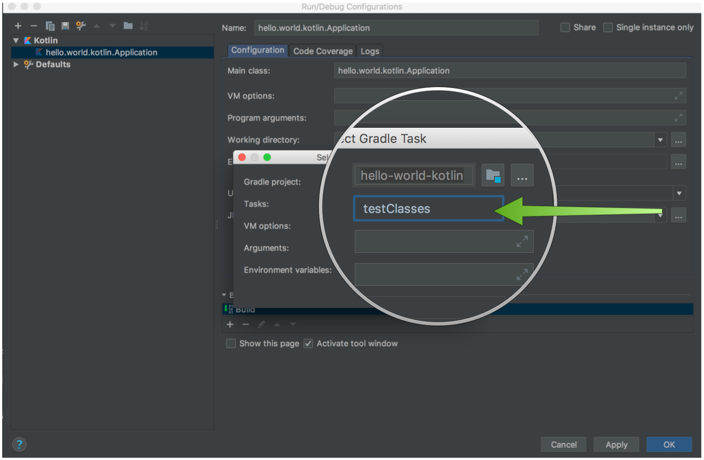
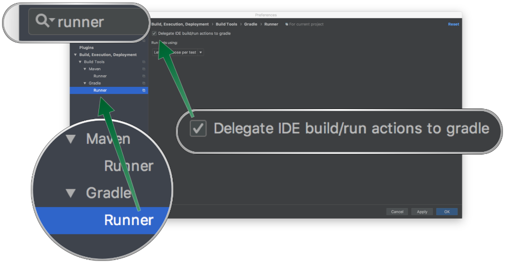

# 14.3 Kotlin 版 Micronaut

:::note 提示
Micronaut 的[命令行界面](/core/cli.html)包含对 Kotlin 的特殊支持。要创建 Kotlin 应用程序，请使用 `kotlin` 语言选项。例如：
:::

*创建 Micronaut Kotlin 应用程序*

```bash
$ mn create-app hello-world --lang kotlin
```

Micronaut 对 Kotlin 的支持建立在 [Kapt](https://kotlinlang.org/docs/reference/kapt.html) 编译器插件的基础上，其中包括对 Java 注解处理器的支持。要在 Micronaut 应用程序中使用 Kotlin，需要添加适当的依赖项，以便在 kt 源文件上配置和运行 Kapt。Kapt 会为你的 Kotlin 类创建 Java "存根 "类，然后由 Micronaut 的 Java 注解处理器进行处理。存根不包含在最终编译的应用程序中。

:::note 提示
从[官方文档](https://kotlinlang.org/docs/reference/kapt.html)中了解有关 kapt 及其功能的更多信息。
:::

使用 Gradle 时，Micronaut 注解处理器在 `kapt` 作用域中声明。例如

*示例 build.gradle*

```groovy
dependencies {
    compile "org.jetbrains.kotlin:kotlin-stdlib-jdk8:$kotlinVersion" (1)
    compile "org.jetbrains.kotlin:kotlin-reflect:$kotlinVersion"
    kapt "io.micronaut:micronaut-inject-java" (2)

    kaptTest "io.micronaut:micronaut-inject-java" (3)
    ...
}
```

1. 添加 Kotlin 标准库
2. 在 `kapt` 作用域下添加 `micronaut-inject-java` 依赖，以便处理 `src/main` 中的类
3. 在 `kaptTest` 作用域下添加 `micronaut-inject-java` 依赖，以便处理 `src/test` 中的类。

有了类似上述的 `build.gradle` 文件，现在就可以使用运行任务（由应用程序插件提供）运行 Micronaut 应用程序了：

```bash
$ ./gradlew run
```

下面是一个用 Kotlin 编写的控制器示例：

*src/main/kotlin/example/HelloController.kt*

```kt
package example

import io.micronaut.http.annotation.*

@Controller("/")
class HelloController {

    @Get("/hello/{name}")
    fun hello(name: String): String {
        return "Hello $name"
    }
}
```

## 14.3.1 Kotlin、Kapt 和 IntelliJ

到目前为止，IntelliJ 的内置编译器并不直接支持 Kapt 和注解处理。因此，在运行测试或应用程序类之前，必须配置 Intellij 以运行 Gradle（或 Maven）编译作为构建步骤。

首先，编辑测试或应用程序的运行配置，选择 "运行 Gradle 任务 "作为构建步骤：


然后添加 `classes` 任务作为应用程序或测试的 `testClasses` 任务：



现在，当你运行测试或启动应用程序时，Micronaut 会在编译时生成类。

或者，也可以完全将 [IntelliJ 的构建/运行操作委托给 Gradle](https://www.jetbrains.com/help/idea/gradle.html#delegate_build_gradle)：



## 14.3.2 利用 Gradle 和 Kapt 进行增量注解处理

要使用 Kapt 启用 Gradle 增量注解处理，必须向 Kapt 发送[使用 Gradle 进行增量注解处理](/core/languageSupport/java#1412-使用-gradle-进行增量注解处理)中指定的参数。

下面的示例演示了如何为 `com.example` 和 `io.example` 包下定义的注解启用和配置增量注解处理：

*在 Kapt 中启用增量注解处理*

```kt
kapt {
    arguments {
        arg("micronaut.processing.incremental", true)
        arg("micronaut.processing.annotations", "com.example.*,io.example.*")
    }
}
```

:::caution 警告
如果不启用自定义注解处理功能，Micronaut 将忽略这些注解，这可能会导致应用程序崩溃。
:::

## 14.3.3 Kotlin 和 AOP 通知

Micronaut 提供不使用反射的编译时 AOP API。当你使用任何 Micronaut [AOP 通知](/core/aop)时，它会在编译时创建一个子类来提供 AOP 行为。这可能会造成问题，因为 Kotlin 类默认为最终类。如果应用程序是使用 Micronaut CLI 创建的，那么 Kotlin [all-open](https://kotlinlang.org/docs/reference/compiler-plugins.html#all-open-compiler-plugin) 插件会为你配置，当使用 AOP 注解时，它会自动将你的类更改为开放类。要自行配置，可将 [Around](https://kotlinlang.org/docs/reference/compiler-plugins.html#all-open-compiler-plugin) 类添加到支持的注解列表中。

如果你不想或无法使用全开放插件，则必须将使用 AOP 注解的类声明为开放类：

```java
import io.micronaut.http.annotation.Controller
import io.micronaut.http.annotation.Get
import io.micronaut.http.HttpStatus
import io.micronaut.validation.Validated
import javax.validation.constraints.NotBlank

@Validated
@Controller("/email")
open class EmailController { (1)

    @Get("/send")
    fun index(@NotBlank recipient: String, (1)
              @NotBlank subject: String): HttpStatus {
        return HttpStatus.OK
    }
}
```

1. 如果使用 `@Validated` AOP 通知，则需要在类和方法级别使用 `open`。

:::tip 注意
`all-open` 插件不处理方法。如果在方法上声明 AOP 注解，则必须手动将其声明为 `open`。
:::

## 14.3.4 Kotlin 和保留参数名称

与 Java 一样，使用 Kotlin 时，方法参数的参数名数据不会在编译时保留。如果不明确定义参数名，而依赖于已编译的外部 JAR，这可能会给 Micronaut 带来问题。

要使用 Kotlin 保留参数名称数据，请在 `build.gradle` 中设置 `javaParameters` 选项为 `true`：

*在 Gradle 中配置*

```groovy
compileTestKotlin {
    kotlinOptions {
        jvmTarget = '1.8'
        javaParameters = true
    }
}
```

:::tip 注意
如果使用带有默认方法的接口，请添加 `freeCompilerArgs = ["-Xjvm-default=all"]` 以便 Micronaut 能识别它们。
:::

如果使用 Maven，则相应配置 Micronaut Maven 插件：

*在 Maven 中配置*

```xml
<project xmlns="http://maven.apache.org/POM/4.0.0" xmlns:xsi="http://www.w3.org/2001/XMLSchema-instance"
         xsi:schemaLocation="http://maven.apache.org/POM/4.0.0 http://maven.apache.org/xsd/maven-4.0.0.xsd">
  <!-- ... -->
  <build>
    <plugins>
      <!-- ... -->
      <plugin>
        <artifactId>kotlin-maven-plugin</artifactId>
        <groupId>org.jetbrains.kotlin</groupId>
        <configuration>
            <javaParameters>true</javaParameters>
            <!-- ... -->
        </configuration>
        <!-- ... -->
      </plugin>
      <!-- ... -->
    </plugins>
  </build>
</project>
```

## 14.3.5 协程支持

Kotlin 例程允许你使用命令式代码创建异步应用程序。Micronaut 控制器动作可以是 `suspend` 函数：

1. 该函数被标记为 `suspend`，但实际上它不会被挂起。
2. 函数被标记为 `suspend`。

1. 调用 `delay` 以确保函数被挂起，并从不同的线程返回响应。

1. 当我们只想返回状态时，`suspend` 函数也能发挥作用。

流式服务器和客户端也可以使用 `Flow` 类型。例如，流控制器可以返回 `Flow`：

1. 定义了一个方法 `streamHeadlinesWithFlow`，该方法产生 `application/x-json-stream`
2. 使用 `flow` 创建一个 `Flow`
3. 该 `Flow` 发出 100 条信息
4. 使用 `emit` `suspend` 函数发送信息
5. 消息之间有一秒钟的 *delay*

流客户端可以简单地返回一个 `Flow`，例如

1. `@Get` 方法被定义为处理 `APPLICATION_JSON_STREAM` 类型的响应
2. 返回类型是 `Flow`

## 14.3.6 协程跟踪上下文传播

Micronaut 支持跟踪上下文传播。如果从控制器动作到所有服务都使用挂起函数，就不需要做任何特殊处理。但是，在常规函数中创建例程时，跟踪传播不会自动发生。你必须使用 `HttpCoroutineContextFactory<CoroutineTracingDispatcher>` 来创建一个新的 `CoroutineTracingDispatcher`，并将其用作 `CoroutineContext`。

下面的示例展示了这种情况：

```kt
@Controller
class SimpleController(
    private val coroutineTracingDispatcherFactory: HttpCoroutineContextFactory<CoroutineTracingDispatcher>
) {
    @Get("/runParallelly")
    fun runParallelly(): String = runBlocking {
        val a = async(Dispatchers.Default + coroutineTracingDispatcherFactory.create()) {
            val traceId = MDC.get("traceId")
            println("$traceId: Calculating sth...")
            calculateSth()
        }
        val b = async(Dispatchers.Default + coroutineTracingDispatcherFactory.create()) {
            val traceId = MDC.get("traceId")
            println("$traceId: Calculating sth else...")
            calculateSthElse()
        }

        a.await() + b.await()
    }
}
```

## 14.3.7 响应式上下文传播

Micronaut 支持从 Reactor 的上下文到 coroutine 上下文的上下文传播。要启用这种传播，你需要加入以下依赖：

import Tabs from '@theme/Tabs';
import TabItem from '@theme/TabItem';

<Tabs>
  <TabItem value="Gradle" label="Gradle">

```groovy
implementation("org.jetbrains.kotlinx:kotlinx-coroutines-reactor")
```

  </TabItem>
  <TabItem value="Maven" label="Maven">

```xml
<dependency>
    <groupId>org.jetbrains.kotlinx</groupId>
    <artifactId>kotlinx-coroutines-reactor</artifactId>
</dependency>
```

  </TabItem>
</Tabs>

有关如何使用该库的详细信息，参阅官方[文档](https://kotlin.github.io/kotlinx.coroutines/kotlinx-coroutines-reactor/kotlinx.coroutines.reactor/-reactor-context/index.html)。

下面的示例展示了如何从 HTTP 过滤器向控制器的例程传播 Reactor 上下文：

通过检索 coroutine 上下文中的 `ReactorContext` 访问 Reactor 上下文：

可以使用 coroutines Reactor 集成来使用悬浮函数创建过滤器：

> [英文链接](https://micronaut-projects.github.io/micronaut-docs-mn3/3.9.4/guide/index.html#kotlin)
