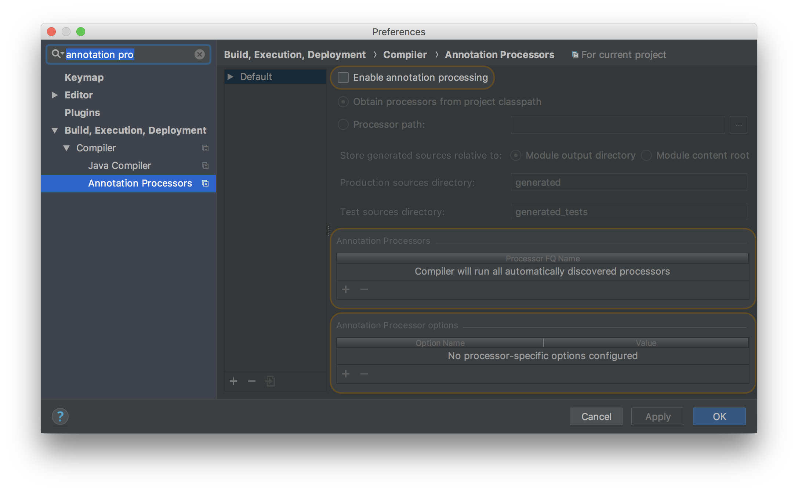

# 2. 快速开始

以下部分将引导你快速入门，了解如何使用 Micronaut 设置基本的“Hello World”应用程序。

开始之前，请确保安装了 Java 8 或更高版本的 JDK，建议你使用[合适的 IDE](#设置一个-IDE)，如 IntelliJ IDEA。

## 2.1 安装 CLI

Micronaut CLI 是创建 Micronaut 应用程序的可选但方便的方法。在 Unix 系统上安装 Micronaut CLI 的最佳方法是使用 [SDKMAN](http://sdkman.io/)，它大大简化了多个 Micronaut 版本的安装和管理。

要查看所有可用的安装方法，请查看 [Micronaut Starter](/launch/installation.html) 文档。

## 2.2 创建服务器应用程序

使用 Micronaut CLI，你可以在 Groovy、Java 或 Kotlin（默认为 Java）中创建一个新的 Micronaut 应用程序。

以下命令使用 Gradle 在 Java 中创建一个新的 “Hello World” 服务器应用程序：

:::tip 注意
通过我们的 CLI 生成的应用程序包括 Gradle 或 Maven 包装器，因此甚至不需要在你的机器上安装 Gradle 或 Maven 即可开始运行应用程序。只需使用 mvnw 或 gradlew 命令，如下所述。
:::

```bash
$ mn create-app hello-world
```

:::tip 注意
提供 `--build maven` 以创建基于 maven 的构建
:::

如果没有安装 CLI，也可以通过访问 [Micronaut Launch](https://launch.micronaut.io/) 并单击“Generate Project（生成项目）”按钮或在 Unix 系统上使用以下 `curl` 命令来创建相同的应用程序：

```bash
curl https://launch.micronaut.io/hello-world.zip -o hello-world.zip
unzip hello-world.zip
cd hello-world
```

:::tip 注意
添加 `?build=maven` 到传递给 `curl` 的 URL 中以生成一个 Maven 项目。
:::

前面的步骤在一个名为 `hello-world` 的目录中创建了一个新的 Java 应用程序，该目录具有 Gradle 构建。你可以使用 `./gradlew run` 运行应用程序：

```bash
$ ./gradlew run
> Task :run
[main] INFO  io.micronaut.runtime.Micronaut - Startup completed in 540ms. Server Running: http://localhost:28933
```

如果你创建了基于 Maven 的项目，请使用 `./mvnw mn:run` 替代。

:::tip 注意
对于 Windows，命令前的 `./` 不需要。
:::

默认情况下，Micronaut HTTP 服务器配置为在端口 8080 上运行。有关更多选项，参阅[在特定端口上运行服务器](/core/httpserver.html#62-在特定端口上运行服务器)一节。

要创建响应“Hello World”的服务，首先需要一个控制器。以下是一个示例：

import Tabs from '@theme/Tabs';
import TabItem from '@theme/TabItem';

<Tabs>
  <TabItem value="Java" label="Java" default>

```java
import io.micronaut.http.MediaType;
import io.micronaut.http.annotation.Controller;
import io.micronaut.http.annotation.Get;

@Controller("/hello") // (1)
public class HelloController {

    @Get(produces = MediaType.TEXT_PLAIN) // (2)
    public String index() {
        return "Hello World"; // (3)
    }
}
```

  </TabItem>
  <TabItem value="Groovy" label="Groovy">

```groovy
import io.micronaut.http.MediaType
import io.micronaut.http.annotation.Controller
import io.micronaut.http.annotation.Get

@Controller('/hello') // (1)
class HelloController {

    @Get(produces = MediaType.TEXT_PLAIN) // (2)
    String index() {
        'Hello World' // (3)
    }
}
```

  </TabItem>
  <TabItem value="Ktolin" label="Ktolin">

```kt
import io.micronaut.http.MediaType
import io.micronaut.http.annotation.Controller
import io.micronaut.http.annotation.Get

@Controller("/hello") // (1)
class HelloController {

    @Get(produces = [MediaType.TEXT_PLAIN]) // (2)
    fun index(): String {
        return "Hello World" // (3)
    }
}
```

  </TabItem>
</Tabs>

1. [@Controller](https://micronaut-projects.github.io/micronaut-docs-mn3/3.9.4/api/io/micronaut/http/annotation/Controller.html) 注解定义类作为控制器，并映射到路径 `/hello`
2. [@Get](https://micronaut-projects.github.io/micronaut-docs-mn3/3.9.4/api/io/micronaut/http/annotation/Get.html) 注解映射 `index` 方法到使用 HTTP GET 所有请求
3. 字符串 “Hello World” 作为响应返回

如果使用 Java，请将前一个文件放在 `src/main/Java/hello/world` 中。

如果使用 Groovy，请将前一个文件放在 `src/main/Groovy/hello/world` 中。

如果使用 Kotlin，请将上一个文件放在 `src/main/Kotlin/hello/world` 中。

如果启动应用程序并向 `/hello` URI 发送 `GET` 请求，将返回文本 “Hello World”：

```bash
$ curl http://localhost:8080/hello
Hello World
```

## 2.3 设置 IDE

上一节中创建的应用程序包含一个位于 `src/main/java` 中的主类，如下所示：

<Tabs>
  <TabItem value="java" label="Java" default>

```java
import io.micronaut.runtime.Micronaut;

public class Application {

    public static void main(String[] args) {
        Micronaut.run(Application.class);
    }
}
```

  </TabItem>
  <TabItem value="groovy" label="Groovy">

```groovy
import io.micronaut.runtime.Micronaut

class Application {

    static void main(String... args) {
        Micronaut.run Application
    }
}
```

  </TabItem>
  <TabItem value="kt" label="Kotlin">

```kt
import io.micronaut.runtime.Micronaut

object Application {

    @JvmStatic
    fun main(args: Array<String>) {
        Micronaut.run(Application.javaClass)
    }
}
```

  </TabItem>
</Tabs>

这是通过 Gradle/Maven 或部署启动应用程序时运行的类。你也可以直接在 IDE 中运行主类。

### 2.3.1 IntelliJ IDEA

要将 Micronaut 项目导入 IntelliJ IDEA，请打开 `build.gradle` 或 `pom.xml` 文件，并按照说明导入项目。

对于 IntelliJ IDEA，如果计划使用 IntelliJ 编译器，请在“构建，执行，部署→ 编译器→ 通过勾选“启用注解处理”复选框来启用注解处理”：



一旦在 IntelliJ 中启用了注解处理，就可以直接在 IDE 中运行应用程序和测试，而不需要外部构建工具（如 Gradle 或 Maven）。

### 2.3.2 Eclipse

要使用 Eclipse IDE，建议你使用 [Gradle BuildShip](https://projects.eclipse.org/projects/tools.buildship) for Gradle 或 [M2Eclipse](https://www.eclipse.org/m2e/) for Maven 将 Micronaut 项目导入 Eclipse。

:::tip 注意
Micronaut 需要 Eclipse IDE 4.9 或更高版本
:::

**Eclipse 和 Gradle**

使用 Gradle BuildShip 设置 Eclipse 4.9 或更高版本后，首先从项目的根目录运行 `gradle eclipse` 任务，然后通过选择 `File → Import` 导入项目，选择 `Gradle → Existing Gradle Project` 并导航到项目的根目录（`build.Gradle` 文件所在的位置）。

**Eclipse 和 Maven**

对于带有 Maven 的 Eclipse 4.9 及以上版本，你需要以下 Eclipse 插件：
- [M2Eclipse for Maven](https://www.eclipse.org/m2e/)
- [Maven 集成  Eclipse JDT Annotation Processor Toolkit](https://github.com/jbosstools/m2e-apt)

安装这些文件后，通过选择 `File → Import` 导入项目，并选择 `Maven → Existing Maven Project` 并导航到项目的根目录（`pom.xml` 文件所在的位置）。

然后通过打开 `Eclipse → Preferences` 启用注解处理，并导航到 `Maven → Annotation Processing` 和选择选项 `Automatically configure JDT APT`。

### 2.3.3 Visual Studio Code

可以通过以下两种方式之一在 Visual Studio Code 中设置 Micronaut。

**选项1） GraalVM Extension Pack for Java**

首选的方法是使用随 [Apache NetBeans](https://netbeans.apache.org/) 语言服务器提供的 [GraalVM Extension Pack for Java](https://marketplace.visualstudio.com/items?itemName=oracle-labs-graalvm.graalvm-pack)。

:::tip 注意
不可能同时安装官方 Java 扩展包和 GraalVM Extension Pack for Java，因此如果你更喜欢前者，请跳过本节，转到选项2）
:::

[GraalVM Tools for Java](https://marketplace.visualstudio.com/items?itemName=oracle-labs-graalvm.graalvm) 是首选，因为它们委托给构建系统来运行应用程序和测试，这意味着与基于 Eclipse 编译器的 [Java Extension Pack](https://marketplace.visualstudio.com/items?itemName=vscjava.vscode-java-pack) 相比，在如何配置 javac 进行注解处理方面没有额外的设置或差异。

GraalVM 扩展包还包括 [GraalVM Tools for Micronaut](https://marketplace.visualstudio.com/items?itemName=oracle-labs-graalvm.micronaut) 扩展，其功能包括：
- 应用程序创建向导
- YAML 配置的代码完成
- 用于构建、部署和创建本地映像集的托盘命令

**选项2）Red Hat/Microsoft Java Extension Pack**

首先安装 [Java Extension Pack](https://marketplace.visualstudio.com/items?itemName=vscjava.vscode-java-pack)。

:::tip 注意
你还可以选择安装 [STS](https://marketplace.visualstudio.com/items?itemName=Pivotal.vscode-spring-boot) 以启用 `application.yml` 的代码完成。
:::

如果使用 Gradle，则在 VSC 中打开项目之前，从终端窗口运行以下命令：

```bash
./gradlew eclipse
```

:::tip 注意
如果事先不运行上述命令，则注解处理将无法正确配置，应用程序将无法工作。
:::

安装扩展包后，只需键入 `code.`。在任何项目目录中，项目将自动设置。

:::tip 注意
对于 macOS，你需要[按照以下说明](https://code.visualstudio.com/docs/setup/mac)安装 `code` 命令
:::

## 2.4 创建一个客户端

如前所述，Micronaut 包括 [HTTP 服务器](/core/httpserver.html)和 [HTTP 客户端](/core/httpclient.html)。提供了一个[低级 HTTP 客户端](/core/httpclient.html#71-使用低级-HTTP-客户端)，你可以使用它来测试上一节中创建的 `HelloController`。

*Testing Hello World*

<Tabs>
  <TabItem value="java" label="Java" default>

```java
import io.micronaut.http.HttpRequest;
import io.micronaut.http.client.HttpClient;
import io.micronaut.http.client.annotation.Client;
import io.micronaut.runtime.server.EmbeddedServer;
import io.micronaut.test.extensions.junit5.annotation.MicronautTest;
import org.junit.jupiter.api.Test;

import jakarta.inject.Inject;

import static org.junit.jupiter.api.Assertions.assertEquals;

@MicronautTest
public class HelloControllerSpec {

    @Inject
    EmbeddedServer server; // (1)

    @Inject
    @Client("/")
    HttpClient client; // (2)

    @Test
    void testHelloWorldResponse() {
        String response = client.toBlocking() // (3)
                .retrieve(HttpRequest.GET("/hello"));
        assertEquals("Hello World", response); // (4)
    }
}
```

  </TabItem>
  <TabItem value="groovy" label="Groovy">

```groovy
import io.micronaut.http.HttpRequest
import io.micronaut.http.client.HttpClient
import io.micronaut.http.client.annotation.Client
import io.micronaut.runtime.server.EmbeddedServer
import io.micronaut.test.extensions.spock.annotation.MicronautTest
import spock.lang.Specification

import jakarta.inject.Inject

@MicronautTest
class HelloControllerSpec extends Specification {

    @Inject
    EmbeddedServer embeddedServer // (1)

    @Inject
    @Client("/")
    HttpClient client // (2)

    void "test hello world response"() {
        expect:
            client.toBlocking() // (3)
                    .retrieve(HttpRequest.GET('/hello')) == "Hello World" // (4)
    }
}
```
  </TabItem>
  <TabItem value="kotlin" label="Kotlin">

```kt
import io.micronaut.http.client.HttpClient
import io.micronaut.http.client.annotation.Client
import io.micronaut.runtime.server.EmbeddedServer
import io.micronaut.test.extensions.junit5.annotation.MicronautTest
import org.junit.jupiter.api.Assertions.assertEquals
import org.junit.jupiter.api.Test
import jakarta.inject.Inject

@MicronautTest
class HelloControllerSpec {

    @Inject
    lateinit var server: EmbeddedServer // (1)

    @Inject
    @field:Client("/")
    lateinit var client: HttpClient // (2)

    @Test
    fun testHelloWorldResponse() {
        val rsp: String = client.toBlocking() // (3)
                .retrieve("/hello")
        assertEquals("Hello World", rsp) // (4)
    }
}
```

  </TabItem>
</Tabs>

1. [EmbeddedServer](https://micronaut-projects.github.io/micronaut-docs-mn3/3.9.4/api/io/micronaut/runtime/server/EmbeddedServer.html) 配置为共享测试字段
2. 还定义了 [HttpClient](https://micronaut-projects.github.io/micronaut-docs-mn3/3.9.4/api/io/micronaut/http/client/HttpClient.html) 实例共享字段
3. 测试使用 `toBlocking()` 方法进行阻塞调用
4. `retrieve` 方法以字符串形式返回控制器响应

除了低级客户端之外，Micronaut 还具有一个[声明性的编译时 HTTP 客户端](/core/httpclient.html#73-带有-client-的声明性-http-客户端)，由[客户端](https://micronaut-projects.github.io/micronaut-docs-mn3/3.9.4/api/io/micronaut/http/client/annotation/Client.html)注解提供支持。

要创建客户端，请创建一个用 `@Client` 注解的接口，例如：

*src/main/java/hello/world/HelloClient.java*

<Tabs>
  <TabItem value="java" label="Java" default>

```java
import io.micronaut.http.MediaType;
import io.micronaut.http.annotation.Get;
import io.micronaut.http.client.annotation.Client;
import org.reactivestreams.Publisher;
import io.micronaut.core.async.annotation.SingleResult;

@Client("/hello") // (1)
public interface HelloClient {

    @Get(consumes = MediaType.TEXT_PLAIN) // (2)
    @SingleResult
    Publisher<String> hello(); // (3)
}
```

  </TabItem>
  <TabItem value="groovy" label="Groovy">

```groovy
import io.micronaut.http.annotation.Get
import io.micronaut.http.client.annotation.Client
import org.reactivestreams.Publisher
import io.micronaut.core.async.annotation.SingleResult

@Client("/hello") // (1)
interface HelloClient {

    @Get(consumes = MediaType.TEXT_PLAIN) // (2)
    @SingleResult
    Publisher<String> hello() // (3)
}
```

  </TabItem>
  <TabItem value="kotlin" label="Kotlin">

```kt
import io.micronaut.http.MediaType
import io.micronaut.http.annotation.Get
import io.micronaut.http.client.annotation.Client
import io.micronaut.core.async.annotation.SingleResult
import org.reactivestreams.Publisher

@Client("/hello") // (1)
interface HelloClient {

    @Get(consumes = [MediaType.TEXT_PLAIN]) // (2)
    @SingleResult
    fun hello(): Publisher<String>  // (3)
}
```

  </TabItem>
</Tabs>

1. `@Client` 注解与作为当前服务器的相对路径的值一起使用
2. 服务器上使用的 [@Get](https://micronaut-projects.github.io/micronaut-docs-mn3/3.9.4/api/io/micronaut/http/annotation/Get.html) 注解用于定义客户端映射
3. 返回带有 `SingleResult` 注解的 `Publisher`，并返回从服务器读取的值。

要测试 `HelloClient`，请从与服务器关联的 [ApplicationContext](https://micronaut-projects.github.io/micronaut-docs-mn3/3.9.4/api/io/micronaut/context/ApplicationContext.html) 中检索它：

*测试 HelloClient*

<Tabs>
  <TabItem value="java" label="Java" default>

```java
import io.micronaut.test.extensions.junit5.annotation.MicronautTest;
import org.junit.jupiter.api.Test;
import io.micronaut.core.async.annotation.SingleResult;

import jakarta.inject.Inject;
import reactor.core.publisher.Mono;

import static org.junit.jupiter.api.Assertions.assertEquals;

@MicronautTest // (1)
public class HelloClientSpec  {

    @Inject
    HelloClient client; // (2)

    @Test
    public void testHelloWorldResponse(){
        assertEquals("Hello World", Mono.from(client.hello()).block());// (3)
    }
}
```

  </TabItem>
  <TabItem value="groovy" label="Groovy">

```groovy
import io.micronaut.test.extensions.spock.annotation.MicronautTest
import reactor.core.publisher.Mono
import spock.lang.Specification

import jakarta.inject.Inject

@MicronautTest // (1)
class HelloClientSpec extends Specification {

    @Inject HelloClient client // (2)

    void "test hello world response"() {
        expect:
        Mono.from(client.hello()).block() == "Hello World" // (3)
    }

}
```

  </TabItem>
  <TabItem value="kotlin" label="Kotlin">

```kt
import io.micronaut.context.annotation.Property
import io.micronaut.test.extensions.junit5.annotation.MicronautTest
import org.junit.jupiter.api.Assertions.assertEquals
import org.junit.jupiter.api.Test
import jakarta.inject.Inject
import reactor.core.publisher.Mono


@MicronautTest // (1)
class HelloClientSpec {

    @Inject
    lateinit var client: HelloClient // (2)

    @Test
    fun testHelloWorldResponse() {
        assertEquals("Hello World", Mono.from(client.hello()).block())// (3)
    }
}
```

  </TabItem>
</Tabs>

1. `@MicronautTest` 注解定义测试
2. `HelloClient` 是从 [ApplicationContext](https://micronaut-projects.github.io/micronaut-docs-mn3/3.9.4/api/io/micronaut/context/ApplicationContext.html) 注入的
3. 使用 [Project Reactor](https://projectreactor.io/) `Mono::block` 方法调用客户端

[Client](https://micronaut-projects.github.io/micronaut-docs-mn3/3.9.4/api/io/micronaut/http/client/annotation/Client.html) 注解在编译时自动为你生成实现，而无需使用代理或运行时反射。

[Client](https://micronaut-projects.github.io/micronaut-docs-mn3/3.9.4/api/io/micronaut/http/client/annotation/Client.html) 注解非常灵活。有关详细信息，参阅 [Micronaut HTTP Client](/core/httpclient.html) 一节。

## 2.5 部署应用

要部署 Micronaut 应用程序，你可以通过运行 `./gradlew assemble` 或 `./mvnw package` 创建一个可执行 JAR 文件。

然后可以使用 `java -jar` 执行构建的 JAR 文件。例如：

```bash
$ java -jar build/libs/hello-world-0.1-all.jar
```

如果使用 `Gradle` 构建，或：

```bash
$ java -jar target/hello-world.jar
```

如果使用 Maven 构建。

可执行 JAR 可以在本地运行，也可以部署到支持可执行 JAR 的虚拟机或托管云服务。

要将分层应用程序发布到 Docker container registry，请在 Gradle 的 `build.gradle` 中配置 Docker 镜像名称：

```groovy
dockerBuild {
    images = ["[REPO_URL]/[NAMESPACE]/my-image:$project.version"]
}
```

然后使用 `dockerPush` 推送应用程序的构建镜像：

```bash
$ ./gradlew dockerPush
```

对于 Maven，在 POM 中定义以下插件：

```xml
<plugin>
  <groupId>com.google.cloud.tools</groupId>
  <artifactId>jib-maven-plugin</artifactId>
  <configuration>
    <to>
      <image>docker.io/my-company/my-image:${project.version}</image>
    </to>
  </configuration>
</plugin>
```

然后调用 `deploy` 生命周期阶段，将打包类型指定为 `docker` 或 `docker-native`：

```bash
$ ./mvnw deploy -Dpackaging=docker
```

> [英文链接](https://docs.micronaut.io/3.9.4/guide/index.html#quickStart)
