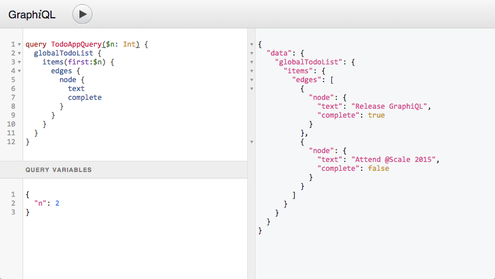

# Micronaut GraphQL

## 1. 简介

Micronau t通过 `micronaut-graphql` 模块支持 [GraphQL](https://graphql.org/)。

## 2. 发布历史

对于这个项目，你可以在这里找到一个发布列表（含发布说明）：

https://github.com/micronaut-projects/micronaut-graphql/releases

## 3. 快速开始

通过命令行工具创建你的应用程序：

```bash
mn create-app helloworld --features=graphql
```

如果你已经有一个应用程序，添加 micronaut graphql 的依赖：

import Tabs from '@theme/Tabs';
import TabItem from '@theme/TabItem';

<Tabs>
  <TabItem value="Gradle" label="Gradle">

```groovy
implementation("io.micronaut.graphql:micronaut-graphql:3.2.0")
```

  </TabItem>
  <TabItem value="Maven" label="Maven">

```xml
<dependency>
    <groupId>io.micronaut.graphql</groupId>
    <artifactId>micronaut-graphql</artifactId>
    <version>3.2.0</version>
</dependency>
```

  </TabItem>
</Tabs>

通过添加到 `application.yml` 来配置 `/graphql` 端点：

```yaml
graphql:
  enabled: true
  graphiql: # enables the /graphiql endpoint to test calls against your graph.
    enabled: true
```

然后在 `resources` 文件夹中，创建一个名为 `schema.graphqls` 的文件。这个文件将包含你的 GraphQL 模式的定义。在我们的例子中，它将包含以下内容：

```graphql
type Query {
    hello(name: String): String!
}
```

为 `hello` 查询创建一个 DataFetcher：

<Tabs>
  <TabItem value="Java" label="Java" default>

```java
import graphql.schema.DataFetcher;
import graphql.schema.DataFetchingEnvironment;
import jakarta.inject.Singleton;

@Singleton
public class HelloDataFetcher implements DataFetcher<String> {

    @Override
    public String get(DataFetchingEnvironment env) {
        String name = env.getArgument("name");
        if (name == null || name.trim().length() == 0) {
            name = "World";
        }
        return String.format("Hello %s!", name);
    }
}
```

  </TabItem>
  <TabItem value="Groovy" label="Groovy">

```groovy
import graphql.schema.DataFetcher
import graphql.schema.DataFetchingEnvironment
import groovy.transform.CompileStatic
import jakarta.inject.Singleton

@Singleton
@CompileStatic
class HelloDataFetcher implements DataFetcher<String> {

    @Override
    String get(DataFetchingEnvironment env) {
        String name = env.getArgument("name")
        name = name?.trim() ?: "World"
        return "Hello ${name}!"
    }
}
```

  </TabItem>
  <TabItem value="Kotlin" label="Kotlin">

```kt
import graphql.schema.DataFetcher
import graphql.schema.DataFetchingEnvironment
import jakarta.inject.Singleton

@Singleton
class HelloDataFetcher : DataFetcher<String> {

    override fun get(env: DataFetchingEnvironment): String {
        var name = env.getArgument<String>("name")
        if (name == null || name.trim().isEmpty()) {
            name = "World"
        }
        return "Hello $name!"
    }
}
```

  </TabItem>
</Tabs>

然后创建 GraphQL bean：

<Tabs>
  <TabItem value="Java" label="Java" default>

```java
import graphql.GraphQL;
import graphql.schema.GraphQLSchema;
import graphql.schema.idl.RuntimeWiring;
import graphql.schema.idl.SchemaGenerator;
import graphql.schema.idl.SchemaParser;
import graphql.schema.idl.TypeDefinitionRegistry;
import io.micronaut.context.annotation.Bean;
import io.micronaut.context.annotation.Factory;
import io.micronaut.core.io.ResourceResolver;
import jakarta.inject.Singleton;

import java.io.BufferedReader;
import java.io.InputStreamReader;

@Factory // 
public class GraphQLFactory {

    @Bean
    @Singleton
    public GraphQL graphQL(ResourceResolver resourceResolver, HelloDataFetcher helloDataFetcher) { // 

        SchemaParser schemaParser = new SchemaParser();
        SchemaGenerator schemaGenerator = new SchemaGenerator();

        // Parse the schema.
        TypeDefinitionRegistry typeRegistry = new TypeDefinitionRegistry();
        typeRegistry.merge(schemaParser.parse(new BufferedReader(new InputStreamReader(
                resourceResolver.getResourceAsStream("classpath:schema.graphqls").get()))));

        // Create the runtime wiring.
        RuntimeWiring runtimeWiring = RuntimeWiring.newRuntimeWiring()
                .type("Query", typeWiring -> typeWiring
                        .dataFetcher("hello", helloDataFetcher))
                .build();

        // Create the executable schema.
        GraphQLSchema graphQLSchema = schemaGenerator.makeExecutableSchema(typeRegistry, runtimeWiring);

        // Return the GraphQL bean.
        return GraphQL.newGraphQL(graphQLSchema).build();
    }
}
```

  </TabItem>
  <TabItem value="Groovy" label="Groovy">

```groovy
import graphql.GraphQL
import graphql.schema.idl.RuntimeWiring
import graphql.schema.idl.SchemaGenerator
import graphql.schema.idl.SchemaParser
import graphql.schema.idl.TypeDefinitionRegistry
import groovy.transform.CompileStatic
import io.micronaut.context.annotation.Bean
import io.micronaut.context.annotation.Factory
import io.micronaut.core.io.ResourceResolver
import jakarta.inject.Singleton

@Factory // 
@CompileStatic
class GraphQLFactory {

    @Bean
    @Singleton
    GraphQL graphQL(ResourceResolver resourceResolver, HelloDataFetcher helloDataFetcher) { // 

        def schemaParser = new SchemaParser()
        def schemaGenerator = new SchemaGenerator()

        // Parse the schema.
        def typeRegistry = new TypeDefinitionRegistry()
        typeRegistry.merge(schemaParser.parse(new BufferedReader(new InputStreamReader(
                resourceResolver.getResourceAsStream("classpath:schema.graphqls").get()))))

        // Create the runtime wiring.
        def runtimeWiring = RuntimeWiring.newRuntimeWiring()
                .type("Query", { typeWiring -> typeWiring
                        .dataFetcher("hello", helloDataFetcher) })
                .build()

        // Create the executable schema.
        def graphQLSchema = schemaGenerator.makeExecutableSchema(typeRegistry, runtimeWiring)

        // Return the GraphQL bean.
        return GraphQL.newGraphQL(graphQLSchema).build()
    }
}
```

  </TabItem>
  <TabItem value="Kotlin" label="Kotlin">

```kt
import graphql.GraphQL
import graphql.schema.idl.RuntimeWiring
import graphql.schema.idl.SchemaGenerator
import graphql.schema.idl.SchemaParser
import graphql.schema.idl.TypeDefinitionRegistry
import io.micronaut.context.annotation.Bean
import io.micronaut.context.annotation.Factory
import io.micronaut.core.io.ResourceResolver
import jakarta.inject.Singleton
import java.io.BufferedReader
import java.io.InputStreamReader

@Factory // 
class GraphQLFactory {

    @Bean
    @Singleton
    fun graphQL(resourceResolver: ResourceResolver, helloDataFetcher: HelloDataFetcher): GraphQL { // 

        val schemaParser = SchemaParser()
        val schemaGenerator = SchemaGenerator()

        // Parse the schema.
        val typeRegistry = TypeDefinitionRegistry();
        typeRegistry.merge(schemaParser.parse(BufferedReader(InputStreamReader(
                resourceResolver.getResourceAsStream("classpath:schema.graphqls").get()))))

        // Create the runtime wiring.
        val runtimeWiring = RuntimeWiring.newRuntimeWiring()
                .type("Query") { typeWiring -> typeWiring
                        .dataFetcher("hello", helloDataFetcher) }
                .build()

        // Create the executable schema.
        val graphQLSchema = schemaGenerator.makeExecutableSchema(typeRegistry, runtimeWiring)

        // Return the GraphQL bean.
        return GraphQL.newGraphQL(graphQLSchema).build()
    }
}
```

  </TabItem>
</Tabs>

你应该都准备好了。通过运行 `./gradlew run` 启动你的应用程序，打开你的浏览器到你的[本地 graphiql](http://localhost:8080/graphiql)，你应该能够运行以下查询：

无参查询：

```graphql
query {
    hello
}
```

返回：

```graphql
{
  "data": {
    "hello": "Hello World!"
  }
}
```

带参查询：

```graphql
query {
    hello(name: "Micronaut")
}
```

返回：

```graphql
{
  "data": {
    "hello": "Hello Micronaut!"
  }
}
```

## 4. 配置

需要 Micronaut 1.0.3 或以上版本，并且你的 classpath 上必须有 `micronaut-graphql` 依赖：

<Tabs>
  <TabItem value="Gradle" label="Gradle">

```groovy
implementation("io.micronaut.graphql:micronaut-graphql:3.2.0")
```

  </TabItem>
  <TabItem value="Maven" label="Maven">

```xml
<dependency>
    <groupId>io.micronaut.graphql</groupId>
    <artifactId>micronaut-graphql</artifactId>
    <version>3.2.0</version>
</dependency>
```

  </TabItem>
</Tabs>

`micronaut-graphql` 模块包括 `com.graphql-java:graphql-java` 依赖关系，并提供了 Micronaut `GraphQLController`，使查询通过 HTTP 执行。

正如 https://graphql.org/learn/serving-over-http 所述，支持以下 HTTP 请求：

- 带有 `query`、`operationName` 和 `variables` 查询参数的 `GET` 请求。`variables` 查询参数必须是 json 编码的。

- `POST` 请求，带有 `application/json` 请求体和 key `query`（字符串）、`operationName`（字符串）和 `variables`（Map）。

两者都产生一个 `application/json` 响应。

默认情况下，GraphQL 端点暴露在 `/graphql` 上，但这可以通过 `graphql.path` 应用程序属性改变。

*src/main/resources/application.yml*

```yaml
graphql:
  enabled: true 
  path: /graphql 
```

1. 启用/禁用 GraphQL 集成。默认为 `true`。
2. 配置 GraphQL 端点路径。默认为 `/graphql`。

你只需配置一个 `graphql.GraphQL` 类型的 bean，包含 GraphQL 模式和运行时布线。

### 4.1 配置 GraphQL Bean

`graphql.GraphQL` Bean 可以通过单独使用 [GraphQL Java](https://github.com/graphql-java/graphql-java) 实现来定义，或者与其他集成库（如 [GraphQL Java Tools](https://github.com/graphql-java-kickstart/graphql-java-tools) 或 [GraphQL SPQR](https://github.com/leangen/graphql-spqr)）相结合。正如前面提到的，第一个是作为过渡依赖添加的，其他集成库必须手动添加到 classpath 中。

下面是一个典型的例子，Micronaut [工厂](https://docs.micronaut.io/latest/api/io/micronaut/context/annotation/Factory.html)类使用 [GraphQL Java](https://github.com/graphql-java/graphql-java) 库配置 `graphql.GraphQL` [Bean](https://docs.micronaut.io/latest/api/io/micronaut/context/annotation/Bean.html)。

<Tabs>
  <TabItem value="Java" label="Java" default>

```java
import graphql.GraphQL;
import graphql.schema.GraphQLSchema;
import graphql.schema.idl.RuntimeWiring;
import graphql.schema.idl.SchemaGenerator;
import graphql.schema.idl.SchemaParser;
import graphql.schema.idl.TypeDefinitionRegistry;
import io.micronaut.context.annotation.Bean;
import io.micronaut.context.annotation.Factory;
import io.micronaut.core.io.ResourceResolver;
import jakarta.inject.Singleton;

import java.io.BufferedReader;
import java.io.InputStreamReader;

@Factory // 
public class GraphQLFactory {

    @Bean
    @Singleton
    public GraphQL graphQL(ResourceResolver resourceResolver, HelloDataFetcher helloDataFetcher) { // 

        SchemaParser schemaParser = new SchemaParser();
        SchemaGenerator schemaGenerator = new SchemaGenerator();

        // Parse the schema.
        TypeDefinitionRegistry typeRegistry = new TypeDefinitionRegistry();
        typeRegistry.merge(schemaParser.parse(new BufferedReader(new InputStreamReader(
                resourceResolver.getResourceAsStream("classpath:schema.graphqls").get()))));

        // Create the runtime wiring.
        RuntimeWiring runtimeWiring = RuntimeWiring.newRuntimeWiring()
                .type("Query", typeWiring -> typeWiring
                        .dataFetcher("hello", helloDataFetcher))
                .build();

        // Create the executable schema.
        GraphQLSchema graphQLSchema = schemaGenerator.makeExecutableSchema(typeRegistry, runtimeWiring);

        // Return the GraphQL bean.
        return GraphQL.newGraphQL(graphQLSchema).build();
    }
}
```

  </TabItem>
  <TabItem value="Groovy" label="Groovy">

```groovy
import graphql.GraphQL
import graphql.schema.idl.RuntimeWiring
import graphql.schema.idl.SchemaGenerator
import graphql.schema.idl.SchemaParser
import graphql.schema.idl.TypeDefinitionRegistry
import groovy.transform.CompileStatic
import io.micronaut.context.annotation.Bean
import io.micronaut.context.annotation.Factory
import io.micronaut.core.io.ResourceResolver
import jakarta.inject.Singleton

@Factory // 
@CompileStatic
class GraphQLFactory {

    @Bean
    @Singleton
    GraphQL graphQL(ResourceResolver resourceResolver, HelloDataFetcher helloDataFetcher) { // 

        def schemaParser = new SchemaParser()
        def schemaGenerator = new SchemaGenerator()

        // Parse the schema.
        def typeRegistry = new TypeDefinitionRegistry()
        typeRegistry.merge(schemaParser.parse(new BufferedReader(new InputStreamReader(
                resourceResolver.getResourceAsStream("classpath:schema.graphqls").get()))))

        // Create the runtime wiring.
        def runtimeWiring = RuntimeWiring.newRuntimeWiring()
                .type("Query", { typeWiring -> typeWiring
                        .dataFetcher("hello", helloDataFetcher) })
                .build()

        // Create the executable schema.
        def graphQLSchema = schemaGenerator.makeExecutableSchema(typeRegistry, runtimeWiring)

        // Return the GraphQL bean.
        return GraphQL.newGraphQL(graphQLSchema).build()
    }
}
```

  </TabItem>
  <TabItem value="Kotlin" label="Kotlin">

```kt
import graphql.GraphQL
import graphql.schema.idl.RuntimeWiring
import graphql.schema.idl.SchemaGenerator
import graphql.schema.idl.SchemaParser
import graphql.schema.idl.TypeDefinitionRegistry
import io.micronaut.context.annotation.Bean
import io.micronaut.context.annotation.Factory
import io.micronaut.core.io.ResourceResolver
import jakarta.inject.Singleton
import java.io.BufferedReader
import java.io.InputStreamReader

@Factory // 
class GraphQLFactory {

    @Bean
    @Singleton
    fun graphQL(resourceResolver: ResourceResolver, helloDataFetcher: HelloDataFetcher): GraphQL { // 

        val schemaParser = SchemaParser()
        val schemaGenerator = SchemaGenerator()

        // Parse the schema.
        val typeRegistry = TypeDefinitionRegistry();
        typeRegistry.merge(schemaParser.parse(BufferedReader(InputStreamReader(
                resourceResolver.getResourceAsStream("classpath:schema.graphqls").get()))))

        // Create the runtime wiring.
        val runtimeWiring = RuntimeWiring.newRuntimeWiring()
                .type("Query") { typeWiring -> typeWiring
                        .dataFetcher("hello", helloDataFetcher) }
                .build()

        // Create the executable schema.
        val graphQLSchema = schemaGenerator.makeExecutableSchema(typeRegistry, runtimeWiring)

        // Return the GraphQL bean.
        return GraphQL.newGraphQL(graphQLSchema).build()
    }
}
```

  </TabItem>
</Tabs>

1. 定义 `Factory` 注解以创建 Bean。
2. 定义 `GraphQL` bean，它包含运行时布线和可执行模式。

在仓库中提供了各种使用不同技术的[例子](https://github.com/micronaut-projects/micronaut-graphql/tree/master/examples)。

### 4.2 通过 websockets 配置 GraphQL

`micronaut-graphql` 模块捆绑了对 GraphQL over web sockets（https://github.com/apollographql/subscriptions-transport-ws/blob/master/PROTOCOL.md）的支持。

必须通过 `graphql.graphql-ws.enabled` 应用程序属性明确启用网络套接字上的 GraphQL。虽然服务器能够通过网络套接字处理查询和突变，但并非所有客户端都支持。一些客户端有办法为订阅配置不同的端点和/或一些过滤器，以便只使用 websocket 进行订阅。

以下配置属性可以被设置：

*src/main/resources/application.yml*

```yaml
graphql:
  graphql-ws:
    enabled: false 
    path: /graphql-ws 
    keep-alive-enabled: true 
    keep-alive-interval: 15s 
```

1. 启用/禁用通过网络套接字的 GraphQL。默认为 `false`。
2. 配置GraphQLWs端点路径。默认为 `/graphql-ws`。
3. 启用/禁用保持活力，这可能是为了防止客户重新连接而需要的。默认为 `true`。
4. 配置保持活力的时间间隔，特定的客户可能需要不同的值，或者可以设置得更高以减少一些负载 `15s`。

有一个例子介绍了[聊天](https://github.com/micronaut-projects/micronaut-graphql/tree/master/examples/chat)，它的特点是一个非常基本的聊天应用。对于真正的应用，订阅通常是基于一些发布/订阅的解决方案。一个使用 kafka 的订阅的例子可以在这里找到，[使用 micronaut 的 graphql-endpoint](https://github.com/openweb-nl/kafka-graphql-examples/tree/ge-micronaut/graphql-endpoint)。

### 4.3 配置 GraphiQL

`micronaut-graphql` 模块与 GraphiQL 捆绑在一起，这是一个用于探索 GraphQL 的浏览器 IDE。



GraphiQL 必须通过 `graphql.graphiql.enabled` 应用程序属性明确启用。

可以设置以下配置属性：

*src/main/resources/application.yml*

```yaml
graphql:
  graphiql:
    enabled: true 
    version: 0.13.2 
    path: /graphiql 
    template-path: classpath:graphiql/index.html 
    template-parameters: 
    page-title: GraphiQL 
```

1. 启用/禁用 GraphiQL。默认为 `false`。
2. 配置 GraphiQL 版本。默认为 `0.13.2`。
3. 配置 GraphiQL 的端点路径。默认为 `/graphiql`。
4. 配置 GraphiQL 模板路径。默认 `classpath:graphiql/index.html`。
5. 配置 GraphiQL 模板参数。默认为无。
6. 配置 GraphiQL 页面标题。默认为 `GraphiQL`。

开箱即用的 GraphiQL 页面除了 GraphiQL 版本、路径和页面标题外，并没有提供很多自定义功能。它还考虑到了 `graphql.path` 应用程序属性，以提供与配置的 GraphQL 端点路径的无缝集成。

如果需要进一步的定制，可以提供一个自定义的 GraphiQL [模板](https://github.com/micronaut-projects/micronaut-graphql/blob/serving-over-http/graphql/src/main/resources/graphiql/index.html)。可以通过在 `src/main/resources/graphiq/index.html` 提供自定义模板，或者通过 `graphiql.template-path` 应用程序属性指向不同的模板位置。在这种情况下，通过 `graphql.graphiql.template-parameters` 应用属性动态地替换模板中的额外参数也是很有用的。

## 5. 仓库

你可以在这个资源库中找到这个项目的源代码：

https://github.com/micronaut-projects/micronaut-graphql

> [英文链接](https://micronaut-projects.github.io/micronaut-graphql/latest/guide/#introduction)
