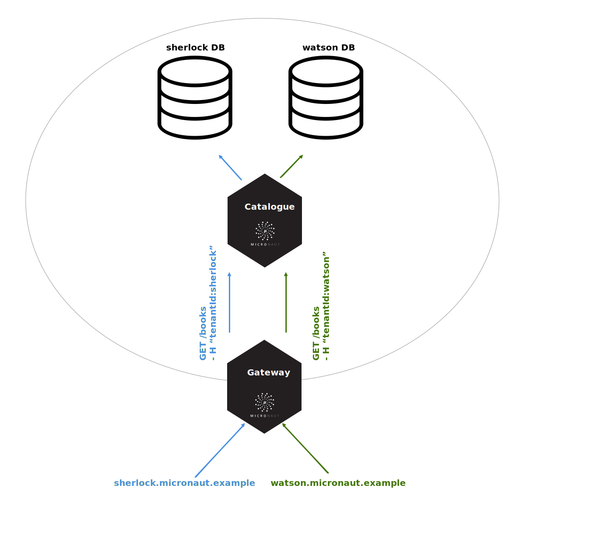

# Micronaut 多租户

帮助完成常见的任务，如解决多租户 Micronaut 应用程序的租户问题。

## 1. 发布历史

对于此项目，你可以在这里找到一个发布列表（含发布说明）：

https://github.com/micronaut-projects/micronaut-multitenancy/releases

## 2. 介绍

多租户，因为它与软件开发有关，当一个应用程序的单一实例被用来服务于多个客户（租户）时，每个租户的数据是与其他客户隔离的。

要使用 Micronaut 的多租户功能，你必须在你的 classpath 上有 `multitenancy` 依赖。

import Tabs from '@theme/Tabs';
import TabItem from '@theme/TabItem';

<Tabs>
  <TabItem value="Gradle" label="Gradle">

```groovy
implementation("io.micronaut.multitenancy:micronaut-multitenancy")
```

  </TabItem>
  <TabItem value="Maven" label="Maven">

```xml
<dependency>
    <groupId>io.micronaut.multitenancy</groupId>
    <artifactId>micronaut-multitenancy</artifactId>
</dependency>
```

  </TabItem>
</Tabs>

支持多租户的一个共同要求是能够解决当前租户的问题。Micronaut 带有以下内置的租户解析器：

|名字|描述|
|--|--|
|[CookieTenantResolver](https://micronaut-projects.github.io/micronaut-multitenancy/latest/api/io/micronaut/multitenancy/tenantresolver/CookieTenantResolver.html)|从一个 HTTP cookie 中解析当前租户。参阅 [CookieTenantResolver 配置属性](https://micronaut-projects.github.io/micronaut-multitenancy/latest/guide/configurationreference.html#io.micronaut.multitenancy.tenantresolver.CookieTenantResolverConfigurationProperties)。|
|[FixedTenantResolver](https://micronaut-projects.github.io/micronaut-multitenancy/latest/api/io/micronaut/multitenancy/tenantresolver/FixedTenantResolver.html)|针对一个固定的租户 ID 进行解析。参阅 [FixTenantResolver 配置属性](https://micronaut-projects.github.io/micronaut-multitenancy/latest/guide/configurationreference.html#io.micronaut.multitenancy.tenantresolver.FixedTenantResolverConfigurationProperties)。|
|[HttpHeaderTenantResolver](https://micronaut-projects.github.io/micronaut-multitenancy/latest/api/io/micronaut/multitenancy/tenantresolver/HttpHeaderTenantResolver.html)|从请求的 HTTP 头中解决当前租户的问题。参阅 [FixTenantResolver 配置属性](https://micronaut-projects.github.io/micronaut-multitenancy/latest/guide/configurationreference.html#io.micronaut.multitenancy.tenantresolver.HttpHeaderTenantResolverConfigurationProperties)。|
|[PrincipalTenantResolver](https://micronaut-projects.github.io/micronaut-multitenancy/latest/api/io/micronaut/multitenancy/tenantresolver/PrincipalTenantResolver.html)|从认证的用户名中解析当前租户。参阅 [PrincipalTenantResolver 配置属性](https://micronaut-projects.github.io/micronaut-multitenancy/latest/guide/configurationreference.html#io.micronaut.multitenancy.tenantresolver.PrincipalTenantResolverConfigurationProperties)。|
|[SessionTenantResolver](https://micronaut-projects.github.io/micronaut-multitenancy/latest/api/io/micronaut/multitenancy/tenantresolver/SessionTenantResolver.html)|从 HTTP 会话中解析当前租户。参阅 [SessionTenantResolver 配置属性](https://micronaut-projects.github.io/micronaut-multitenancy/latest/guide/configurationreference.html#io.micronaut.multitenancy.tenantresolver.SessionTenantResolverConfigurationProperties)。|
|[SubdomainTenantResolver](https://micronaut-projects.github.io/micronaut-multitenancy/latest/api/io/micronaut/multitenancy/tenantresolver/SubdomainTenantResolver.html)|从子域中解析租户 ID。参阅 [SubdomainTenantResolver 配置属性](https://micronaut-projects.github.io/micronaut-multitenancy/latest/guide/configurationreference.html#io.micronaut.multitenancy.tenantresolver.SubdomainTenantResolverConfigurationProperties)。|
|[SystemPropertyTenantResolver](https://micronaut-projects.github.io/micronaut-multitenancy/latest/api/io/micronaut/multitenancy/tenantresolver/SystemPropertyTenantResolver.html)|从一个系统属性中解析租户 ID。参阅 [SystemPropertyTenantResolver 配置属性](https://micronaut-projects.github.io/micronaut-multitenancy/latest/guide/configurationreference.html#io.micronaut.multitenancy.tenantresolver.SystemPropertyTenantResolverConfigurationProperties)。|

Micronaut 支持租户传播。作为一个例子，请看以下场景：



你希望对 `gateway` 微服务的传入请求能通过子域来解决租户 id。然而，你希望你对其他内部微服务的请求包括作为 HTTP 头的 `tenant Id`。

你在 `gateway` 微服务中的配置将看起来像：

```yaml
micronaut:
  multitenancy:
    propagation:
      enabled: true
      service-id-regex: 'catalogue'
    tenantresolver:
      subdomain:
        enabled: true
    tenantwriter:
      httpheader:
        enabled: true
```

在目录的微服务中，配置将看起来像：

```yaml
micronaut:
  multitenancy:
    tenantresolver:
      httpheader:
        enabled: true
```

为了传播租户，你将需要把解析的租户 id 写到发出的请求中。

目前，Micronaut 提供了两个内置的 [TenantWriter](https://micronaut-projects.github.io/micronaut-multitenancy/latest/api/io/micronaut/multitenancy/writer/TenantWriter.html) 实现：

|名字|描述|
|--|--|
|[CookieTenantWriter](https://micronaut-projects.github.io/micronaut-multitenancy/latest/api/io/micronaut/multitenancy/writer/CookieTenantWriter.html)|将当前租户写入你发出的请求中的一个 Cookie 中。参阅 [CookieTenantWriter 配置属性](https://micronaut-projects.github.io/micronaut-multitenancy/latest/guide/configurationreference.html#io.micronaut.multitenancy.writer.CookieTenantWriterConfigurationProperties)。|
|[HttpHeaderTenantWriter](https://micronaut-projects.github.io/micronaut-multitenancy/latest/api/io/micronaut/multitenancy/writer/HttpHeaderTenantWriter.html)|将当前租户写入 HTTP Header 中。参阅 [HttpHeaderTenantWriter 配置属性](https://micronaut-projects.github.io/micronaut-multitenancy/latest/guide/configurationreference.html#io.micronaut.multitenancy.writer.HttpHeaderTenantWriterConfigurationProperties)。|

## 3. 多租户 GORM

GORM 支持多租户，并与 Micronaut 多租户支持集成。

参阅 [Micronaut Groovy 模块](../groovy#51-多租户-GORM)以了解更多信息。

## 4. 仓库

你可以在这个仓库中找到这个项目的源代码：

https://github.com/micronaut-projects/micronaut-multitenancy

> [英文链接](https://micronaut-projects.github.io/micronaut-multitenancy/latest/guide/)
