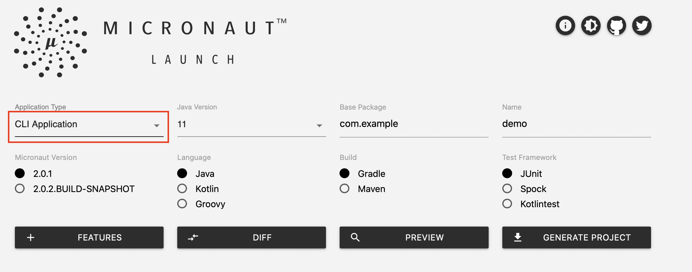
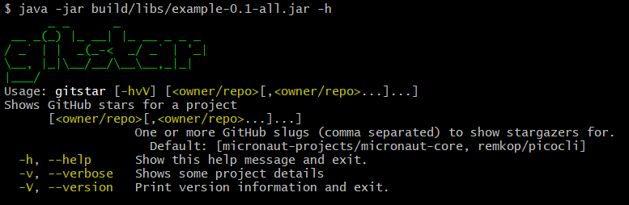

# Micronaut Picocli 配置

提供 Micronaut 和 Picocli 之间的集成。

## 1. 简介

[Picocli](https://github.com/remkop/picocli) 是一个命令行分析器，支持 ANSI 颜色、自动完成和嵌套子命令的使用帮助。它有一个注释应用程序接口（annotations API），用于创建几乎无需代码的命令行应用程序，还有一个编程应用程序接口（programmatic API），用于创建特定领域语言等动态用途。

摘自项目自述页面：

:::note
工作原理：注解你的类，然后 picocli 根据命令行参数初始化它，将输入转换为强类型数据。支持类似 git 的 [subcommands](http://picocli.info/#_subcommands)（和 [sub-subcommands](http://picocli.info/#_nested_sub_subcommands)）、任何选项前缀样式、POSIX 风格的[分组短选项](http://picocli.info/#_short_posix_options)、[密码选项](http://picocli.info/#_interactive_password_options)、自定义[类型转换器](http://picocli.info/#_custom_type_converters)等。解析器[跟踪](http://picocli.info/#_tracing)功能有助于排除故障。

它对[命名选项](http://picocli.info/#_options)和[位置参数](http://picocli.info/#_positional_parameters)进行了区分，并允许对两者进行强类型化。多值字段可指定参数的精确数量或[范围](http://picocli.info/#_arity)（如 `0..*`、`1..2`）。支持 [Map 选项](http://picocli.info/#_maps)，如 `-Dkey1=val1 -Dkey2=val2`，其中键和值均可强类型化。

它能生成简洁明了的[使用帮助](http://picocli.info/#_usage_help)和[版本帮助](http://picocli.info/#_version_help)，并尽可能使用 [ANSI 颜色](http://picocli.info/#_ansi_colors_and_styles)。基于 Picocli 的命令行应用程序可以使用 [TAB 自动完成](http://picocli.info/autocomplete.html)功能，以交互方式向用户显示可用的选项和子命令。Picocli 可为 bash 和 zsh 生成完成脚本，并提供一个 API，方便用户为自己的应用程序创建 [JLine](https://github.com/jline/jline3) `Completer`。
:::

Micronaut 专门支持定义 picocli `Command` 实例。使用 picocli 构建的 Micronaut 应用程序可以在有或没有 HTTP 服务器的情况下部署。
将 picocli 与 Micronaut 相结合，可轻松为你的微服务提供内容丰富、文档齐全的命令行界面。

## 2. 发布历史

关于此项目，你可以在此处找到发布版本列表（含发布说明）：

https://github.com/micronaut-projects/micronaut-picocli/releases

## 3. 创建 Micronaut Picocli 应用程序

你可以使用 Micronaut CLI 创建 Micronaut 命令行界面应用程序：

*示例 1.使用 CLI*

```bash
$ mn create-cli-app my-app
```

或使用 [Micronaut Launch](https://micronaut.io/launch/)



## 4. 设置 Picocli

要在现有项目中添加对 Picocli 的支持，首先应在构建配置中添加 picocli 依赖和 Micronaut picocli 配置。

import Tabs from '@theme/Tabs';
import TabItem from '@theme/TabItem';

<Tabs>
  <TabItem value="Gradle" label="Gradle">

```groovy
implementation("info.picocli:picocli")
```

  </TabItem>
  <TabItem value="Maven" label="Maven">

```xml
<dependency>
    <groupId>info.picocli</groupId>
    <artifactId>picocli</artifactId>
</dependency>
```

  </TabItem>
</Tabs>

<Tabs>
  <TabItem value="Gradle" label="Gradle">

```groovy
implementation("io.micronaut.picocli:micronaut-picocli:5.0.1")
```

  </TabItem>
  <TabItem value="Maven" label="Maven">

```xml
<dependency>
    <groupId>io.micronaut.picocli</groupId>
    <artifactId>micronaut-picocli</artifactId>
    <version>5.0.1</version>
</dependency>
```

  </TabItem>
</Tabs>

**配置 picocli**

Picocli 不需要配置。有关配置要注入的服务和资源，请参阅手册的其他章节。

## 5. 生成 Picocli 项目

要使用 Micronaut CLI 创建支持 picocli 的项目，请使用 `create-cli-app` 命令。这将添加 `picocli` 特性的依赖，并将生成项目的 `applicationType` 设置为 `cli`，这样 `create-command` 命令就可以用来生成附加命令。

项目的主类被设置为 `*Command` 类（基于项目名称，例如 `hello-world` 将生成 `HelloWorldCommand`）：

```bash
$ mn create-cli-app my-cli-app
```

生成的命令如下所示：

*my.cli.app.MyCliAppCommand.java 由 `create-cli-app` 生成*

```java
package my.cli.app;

import io.micronaut.configuration.picocli.PicocliRunner;
import io.micronaut.context.ApplicationContext;

import picocli.CommandLine;
import picocli.CommandLine.Command;
import picocli.CommandLine.Option;
import picocli.CommandLine.Parameters;

@Command(name = "my-cli-app", description = "...",
        mixinStandardHelpOptions = true) (1)
public class MyCliAppCommand implements Runnable { (2)

    @Option(names = {"-v", "--verbose"}, description = "...") (3)
    boolean verbose;

    public static void main(String[] args) throws Exception {
        PicocliRunner.run(MyCliAppCommand.class, args); (4)
    }

    public void run() { (5)
        // business logic here
        if (verbose) {
            System.out.println("Hi!");
        }
    }
}
```

1. picocli [@Command](https://picocli.info/apidocs/picocli/CommandLine.Command.html) 注解将该类指定为命令。`mixinStandardHelpOptions` 属性为其添加了 `--help` 和 `--version` 选项。
2. 通过实现 `Runnable` 或 `Callable`，你的应用程序可以在一行中执行 (<4>)，picocli 负责处理无效输入和使用帮助请求 (`<cmd> --help`) 或版本信息请求 (`<cmd>--version`)。
3. 选项示例。选项可以有任何名称，也可以是[任何类型](https://picocli.info/#_strongly_typed_everything)。生成的代码包含一个布尔标志选项示例，允许用户请求更详细的输出。
4. `PicocliRunner` 可让基于 picocli 的应用程序利用 Micronaut DI 容器。`PicocliRunner.run` 首先会创建一个注入了所有服务和资源的命令实例，然后解析命令行，同时处理无效输入和对使用帮助或版本信息的请求，最后调用运行方法。
5. 将应用程序的业务逻辑放在 `run` 或 `call` 方法中。

**运行应用程序**

现在，你可以构建项目并启动应用程序。构建将创建一个 `${project-name}-all.jar` 文件，其中包含 `build/libs` 中的所有依赖。从 Java 运行该 jar 将运行生成的 `MyCliAppCommand`。

```bash
$ java -jar build/libs/my-cli-app-0.1-all.jar -v
```

## 6. Picocli 快速入门

### 使用 @Command 创建 Picocli 命令

本节将展示一个快速示例，为与 GitHub API 通信的 HTTP 客户端提供命令行接口。

使用 Micronaut CLI 创建此示例项目时，请使用 `create-cli-app` 命令，并添加 `--features=http-client` 标志：

```bash
$ mn create-cli-app example.git-star --features http-client
```

这将在构建过程中添加 `io.micronaut:micronaut-http-client` 依赖。你也可以手动添加到构建中：

<Tabs>
  <TabItem value="Gradle" label="Gradle">

```groovy
implementation("io.micronaut:micronaut-http-client")
```

  </TabItem>
  <TabItem value="Maven" label="Maven">

```xml
<dependency>
    <groupId>io.micronaut</groupId>
    <artifactId>micronaut-http-client</artifactId>
</dependency>
```

  </TabItem>
</Tabs>

---

### HTTP 客户端示例

要创建一个 picocli `Command`，你需要创建一个带有 `@Option` 或 `@Parameters` 注解字段的类，以分别捕获命令行选项或位置参数的值。

例如，下面是一个围绕 GitHub API 的 picocli `@Command` 命令：

*带有注入式 HTTP 客户端的 picocli 命令示例*

```java
package example;

import io.micronaut.configuration.picocli.PicocliRunner;
import io.micronaut.context.ApplicationContext;
import io.micronaut.http.client.annotation.*;
import io.micronaut.http.client.*;
import io.reactivex.*;

import static io.micronaut.http.HttpRequest.*;

import picocli.CommandLine;
import picocli.CommandLine.Command;
import picocli.CommandLine.Option;
import picocli.CommandLine.Parameters;

import java.util.*;
import jakarta.inject.Inject;

@Command(name = "git-star", header = {
        "@|green       _ _      _             |@", (1)
        "@|green  __ _(_) |_ __| |_ __ _ _ _  |@",
        "@|green / _` | |  _(_-<  _/ _` | '_| |@",
        "@|green \\__, |_|\\__/__/\\__\\__,_|_|   |@",
        "@|green |___/                        |@"},
        description = "Shows GitHub stars for a project",
        mixinStandardHelpOptions = true, version = "git-star 0.1") (2)
public class GitStarCommand implements Runnable {

    @Client("https://api.github.com")
    @Inject RxHttpClient client; (3)

    @Option(names = {"-v", "--verbose"}, description = "Shows some project details")
    boolean verbose;

    @Parameters(description = {"One or more GitHub slugs (comma separated) to show stargazers for.",
                "  Default: ${DEFAULT-VALUE}"}, split = ",", paramLabel = "<owner/repo>") (4)
    List<String> githubSlugs = Arrays.asList("micronaut-projects/micronaut-core", "remkop/picocli");

    public static void main(String[] args) {
        int exitCode = PicocliRunner.execute(GitStarCommand.class, args);
        System.exit(exitCode);
    }

    public void run() { (5)
        for (String slug : githubSlugs) {
            Map m = client.retrieve(
                    GET("/repos/" + slug).header("User-Agent", "remkop-picocli"),
                    Map.class).blockingFirst();
            System.out.printf("%s has %s stars%n", slug, m.get("watchers"));

            if (verbose) {
                String msg = "Description: %s%nLicense: %s%nForks: %s%nOpen issues: %s%n%n";
                System.out.printf(msg, m.get("description"),
                                ((Map) m.get("license")).get("name"),
                                m.get("forks"), m.get("open_issues"));
            }
        }
    }
}
```

1. Header, footers 和 description 可以是多行的。你可以使用 `@|STYLE1[,STYLE2]... text|@` [标记符号](https://picocli.info/#_usage_help_with_styles_and_colors)在任何地方嵌入 ANSI 样式的文本。
2. 添加版本信息，以便在用户使用 `--version` 请求时显示。版本信息也可以动态提供，例如来自[清单文件](https://github.com/remkop/picocli/blob/master/picocli-examples/src/main/java/picocli/examples/VersionProviderDemo2.java)或联编生成的版本[属性文件](https://github.com/remkop/picocli/blob/master/picocli-examples/src/main/java/picocli/examples/VersionProviderDemo1.java)。
3. 注入 HTTP 客户端。在本例中，将硬编码到 GitHub API 端点。
4. 一个位置参数，可让用户选择一个或多个 GitHub 项目
5. 业务逻辑：显示用户请求的每个项目的信息。

为该命令生成的使用帮助信息如下：



## 7. 子命令

如果你的服务有很多功能，一种常见的模式是用子命令来控制服务的不同区域。为使 Micronaut 能正确地将服务和资源注入子命令，请确保从 `ApplicationContext` 获取子命令实例，而不是直接将其实例化。

最简单的方法是在顶层命令中声明子命令，就像下面这样：

*带有子命令的顶级命令*

```java
@Command(name = "topcmd", subcommands = {SubCmd1.class, SubCmd2.class}) (1)
class TopCommand implements Callable<Object> { (2)

    public static void main(String[] args) {
        PicocliRunner.execute(TopCommand.class, args); (3)
    }
    //...
}
```

1. 顶层命令有两个子命令，即 `SubCmd1` 和 `SubCmd2`。
2. 让层次结构中的所有命令都实现 `Runnable` 或 `Callable`。
3. 使用 `PicocliRunner` 启动应用程序。这将创建一个 `ApplicationContext`，用于实例化命令并执行依赖注入。

## 8. 定制 Picocli

有时你可能想设置解析器选项或自定义 picocli 行为。这可以很容易地通过 picocli `CommandLine` 对象上的设置方法来完成，但 `PicocliRunner` 并没有公开该对象。

在这种情况下，你可能想直接调用 picocli 而不是使用 `PicocliRunner`。下面的代码演示了如何做到这一点：

*在调用命令前自定义 picocli 解析器的示例*

```java
import io.micronaut.configuration.picocli.MicronautFactory;
import io.micronaut.context.ApplicationContext;
import io.micronaut.context.env.Environment;
import picocli.CommandLine;
import picocli.CommandLine.*;
import java.util.concurrent.Callable;

@Command(name = "configuration-example")
class ConfigDemo implements Callable<Object> {

    private static int execute(Class<?> clazz, String[] args) {
        try (ApplicationContext context = ApplicationContext.builder(
                clazz, Environment.CLI).start()) { (1)

            return new CommandLine(clazz, new MicronautFactory(context)). (2)
                 setCaseInsensitiveEnumValuesAllowed(true). (3)
                 setUsageHelpAutoWidth(true). (4)
                 execute(args); (5)
        }
    }

    public static void main(String[] args) {
        int exitCode = execute(ConfigDemo.class, args);
        System.exit(exitCode); (6)
    }
    // ...
}
```

1. 在 try-with-resources 语句中为 CLI 环境实例化一个新的 `ApplicationContext`，以便在方法返回前自动关闭上下文。
2. 将带有应用上下文的 `MicronautFactory` 传递给 picocli `CommandLine` 构造函数。这样就能将依赖注入到命令和子命令中。
3. 配置 picocli 命令行分析器的示例。
4. 配置 picocli 使用帮助信息的示例。
5. 执行命令并返回结果（关闭应用程序上下文）。
6. 可选择使用返回的退出代码调用 `System.exit`。

## 9. 仓库

你可以在此仓库中找到此项目的源代码：

https://github.com/micronaut-projects/micronaut-picocli

> [英文链接](https://micronaut-projects.github.io/micronaut-picocli/latest/guide/)
