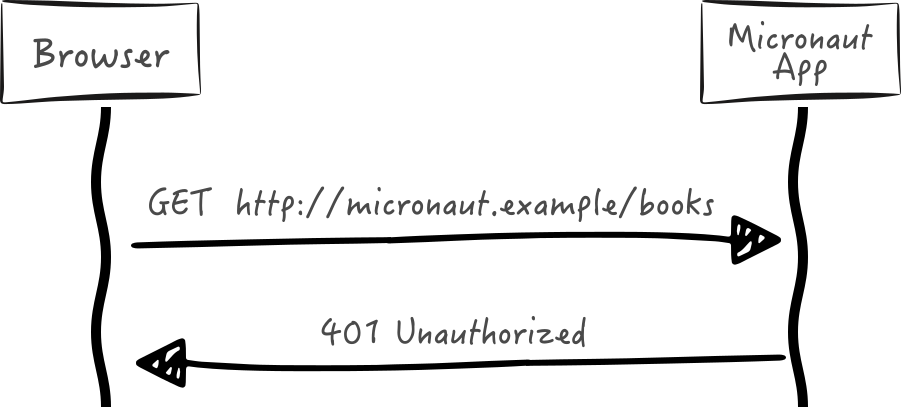

# 5. 入门

:::note 提示
*使用 CLI*

如果使用 Micronaut CLI 创建项目，请提供 security-jwt 或 security-session 功能，配置项目中的安全支持：

```bash
$ mn create-app my-app --features security-jwt
```
:::

要使用 Micronaut 的安全功能，你必须在类路径上安装安全依赖：

import Tabs from '@theme/Tabs';
import TabItem from '@theme/TabItem';

<Tabs>
  <TabItem value="Gradle" label="Gradle">

```groovy
annotationProcessor("io.micronaut.security:micronaut-security-annotations")
```

  </TabItem>
  <TabItem value="Maven" label="Maven">

```xml
<annotationProcessorPaths>
    <path>
        <groupId>io.micronaut.security</groupId>
        <artifactId>micronaut-security-annotations</artifactId>
    </path>
</annotationProcessorPaths>
```

  </TabItem>
</Tabs>

<Tabs>
  <TabItem value="Gradle" label="Gradle">

```groovy
implementation("io.micronaut.security:micronaut-security-jwt")
```

  </TabItem>
  <TabItem value="Maven" label="Maven">

```xml
<dependency>
    <groupId>io.micronaut.security</groupId>
    <artifactId>micronaut-security-jwt</artifactId>
</dependency>
```

  </TabItem>
</Tabs>

:::tip 注意
只有在使用 JSR 250 注解时才需要 `micronaut-security-annotations` 依赖
:::

默认情况下，对于任何端点调用，Micronaut 都会返回 HTTP 未授权状态 (401)。必须通过提供的机制明确允许路由。



> [英文链接](https://micronaut-projects.github.io/micronaut-security/latest/guide/index.html#gettingStarted)
