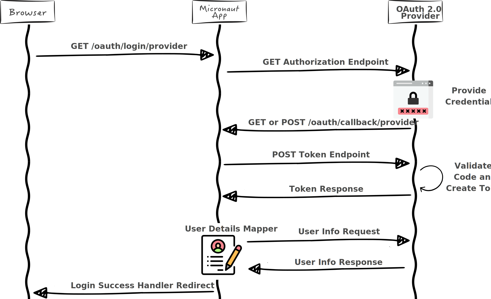
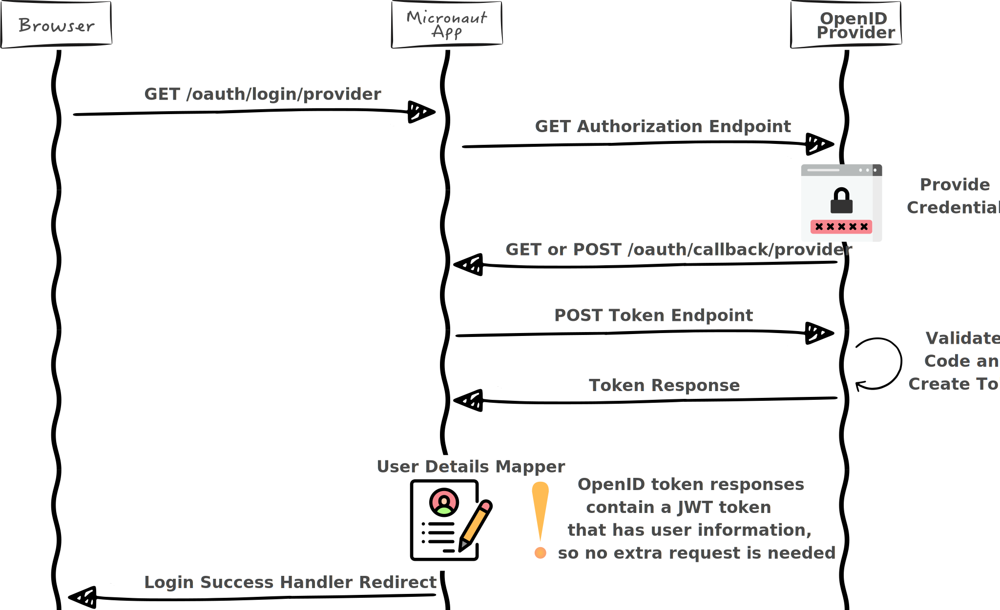
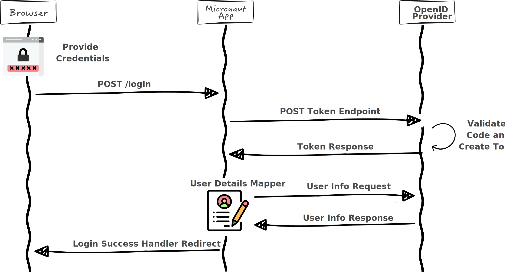
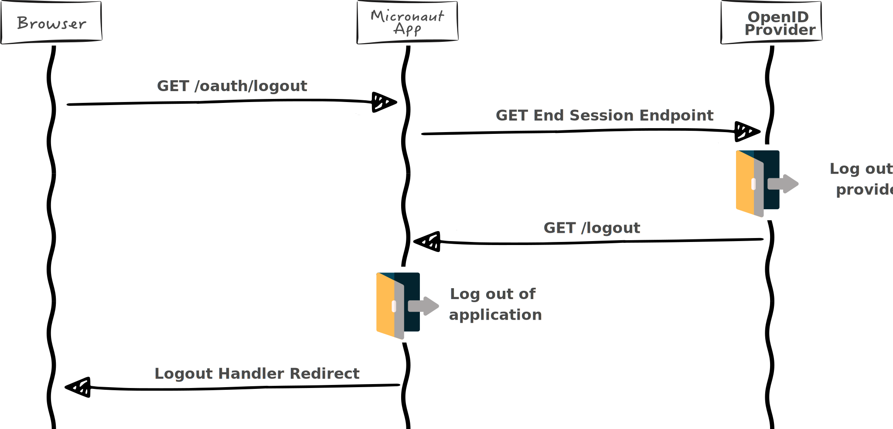

# 16. OAuth 2.0

Micronaut 支持使用 OAuth 2.0 服务器进行身份验证，包括支持 OpenID 标准。

最简单的入门方法是配置一个支持 OpenID 的提供商。[Okta](https://developer.okta.com/)、[Auth0](https://auth0.com/)、[AWS Cognito](https://aws.amazon.com/cognito)、[Keycloak](https://www.keycloak.org/) 和 [Google](https://www.keycloak.org/) 等平台都是常见的例子。

使用提供程序创建应用程序客户端后，就会得到一个客户端 ID 和一个客户端密钥。客户端 id 和秘密与发行方 URL 相结合，就可以启用 OpenID 提供商的验证码授予流程。

例如，将 Google 配置为提供者：

import Tabs from '@theme/Tabs';
import TabItem from '@theme/TabItem';

<Tabs>
  <TabItem value="Properties" label="Properties">

```properties
micronaut.security.oauth2.clients.google.client-secret=<<your client secret>>
micronaut.security.oauth2.clients.google.client-id=<<your client id>>
micronaut.security.oauth2.clients.google.openid.issuer=https://accounts.google.com
```

  </TabItem>
  <TabItem value="Yaml" label="Yaml">

```yaml
micronaut:
  security:
    oauth2:
      clients:
        google:
          client-secret: <<your client secret>>
          client-id: <<your client id>>
          openid:
            issuer: https://accounts.google.com
```

  </TabItem>
    <TabItem value="Toml" label="Toml">

```toml
[micronaut]
  [micronaut.security]
    [micronaut.security.oauth2]
      [micronaut.security.oauth2.clients]
        [micronaut.security.oauth2.clients.google]
          client-secret="<<your client secret>>"
          client-id="<<your client id>>"
          [micronaut.security.oauth2.clients.google.openid]
            issuer="https://accounts.google.com"
```

  </TabItem>
    <TabItem value="Groovy" label="Groovy">

```groovy
micronaut {
  security {
    oauth2 {
      clients {
        google {
          clientSecret = "<<your client secret>>"
          clientId = "<<your client id>>"
          openid {
            issuer = "https://accounts.google.com"
          }
        }
      }
    }
  }
}
```

  </TabItem>
    <TabItem value="Hoon" label="Hoon">

```hocon
{
  micronaut {
    security {
      oauth2 {
        clients {
          google {
            client-secret = "<<your client secret>>"
            client-id = "<<your client id>>"
            openid {
              issuer = "https://accounts.google.com"
            }
          }
        }
      }
    }
  }
}
```

  </TabItem>
    <TabItem value="JSON" label="JSON">

```json
{
  "micronaut": {
    "security": {
      "oauth2": {
        "clients": {
          "google": {
            "client-secret": "<<your client secret>>",
            "client-id": "<<your client id>>",
            "openid": {
              "issuer": "https://accounts.google.com"
            }
          }
        }
      }
    }
  }
}
```

  </TabItem>
</Tabs>

对于正常的 OAuth 2.0，需要采取不同的步骤才能实现授权码授予流程。

要实现完整的授权码流程，还需要一些额外的要求。上下文中必须有一个 [LoginHandler](https://micronaut-projects.github.io/micronaut-security/latest/api/io/micronaut/security/handlers/LoginHandler.html)，以确定登录失败或登录成功后如何做出响应。当然，也可以提供自定义实现。不过，有几种[登录处理器](/security/securityConfiguration#73-登录处理器)的实现是开箱即用的。

:::note 提示
阅读以下指南了解更多 使用 [Okta](https://guides.micronaut.io/latest/micronaut-oauth2-okta.html)、[Cognito](https://guides.micronaut.io/latest/micronaut-oauth2-cognito.html)、[Google](https://guides.micronaut.io/latest/micronaut-oauth2-oidc-google.html) **确保 Micronaut 应用程序的安全**。
:::

## 16.1 安装

<Tabs>
  <TabItem value="Gradle" label="Gradle">

```groovy
implementation("io.micronaut.security:micronaut-security-oauth2")
```

  </TabItem>
  <TabItem value="Maven" label="Maven">

```xml
<dependency>
    <groupId>io.micronaut.security</groupId>
    <artifactId>micronaut-security-oauth2</artifactId>
</dependency>
```

  </TabItem>
</Tabs>

要使用该库的 `BUILD-SNAPSHOT` 版本，查看[文档以使用快照](/core/appendix#203-使用快照)。

代码可在 [micronaut-security](https://github.com/micronaut-projects/micronaut-security/tree/master/security-oauth2) 仓库中找到。

## 16.2 OpenID 连接

:::note
OpenID Connect 1.0 是 OAuth 2.0 协议之上的一个简单身份层。它允许客户端根据授权服务器执行的认证来验证终端用户的身份，并以可互操作和类似 REST 的方式获取终端用户的基本配置文件（profile）信息。
:::

如果你是 OpenID Connect 的新用户，我们建议你观看 [OAuth 2.0 和 OpenID Connect](https://www.youtube.com/watch?v=996OiexHze0)，以便更好地理解。

:::tip 注意
要使用 OpenID 客户端流，你的构建中必须包含 `security-jwt` 依赖，因为 OpenID 依赖于 JWT 标记。
:::

<Tabs>
  <TabItem value="Gradle" label="Gradle">

```groovy
implementation("io.micronaut.security:micronaut-security-jwt")
```

  </TabItem>
  <TabItem value="Maven" label="Maven">

```xml
<dependency>
    <groupId>io.micronaut.security</groupId>
    <artifactId>micronaut-security-jwt</artifactId>
</dependency>
```

  </TabItem>
</Tabs>

:::danger 危险
尽管 OpenID 提供商会返回 JWT 标记，但默认情况下，该标记不会直接用于授权 Micronaut 的请求。如果应用程序使用 JWT，则会创建一个新的令牌。这样就能在自定义谁提供者、普通 OAuth 2.0 流程和 OpenID 流程之间实现标准化授权。它还允许根据 OpenID 认证结果进行纯会话授权。要直接使用提供程序令牌，请将谁模式设置为 `idtoken`。
:::

## 16.3 流量

### 16.3.1 授权码（Authorization Code）

授权码授予流程是 OAuth 2.0 和 OpenID 提供商最典型的认证流程。无论提供商是否支持 OpenID，该流程的主要步骤都是一样的，并在 [RFC6749 —— 授权码授予](https://tools.ietf.org/html/rfc6749#section-4.1)中作了说明。

OAuth 2.0 授权码流程需要一个回调端点。此外，登录端点也可用于触发流程。URI 是可配置的。

*表 1. [OauthConfigurationProperties](https://micronaut-projects.github.io/micronaut-security/latest/api/io/micronaut/security/oauth2/configuration/OauthConfigurationProperties.html) 的配置属性*

|属性|类型|描述|
|--|--|--|
|micronaut.security.oauth2.enabled|boolean|设置是否启用 OAuth 2.0 支持。默认值（`true`）。|
|micronaut.security.oauth2.login-uri|java.lang.String|用于启动 OAuth 2.0 授权码授予流程的 URI 模板。默认值（`/oauth/login{/provider}`）。|
|micronaut.security.oauth2.callback-uri|java.lang.String|OAuth 2.0 提供商可用于提交授权回调请求的 URI 模板。默认值（`/oauth/callback{/provider}`）。|
|micronaut.security.oauth2.default-provider|java.lang.String|OAuth 2.0 授权码授予流程的默认认证提供者。|

登录和回调的 URI 模板中有一个模板变量 `{provider}`。路由生成器会使用该变量为每个已配置的提供程序构建路由。在这种情况下，`provider` 这个名称比较特殊，不能更改。不过，只要提供程序变量是 URI **路径**的一部分，就可以以任何方式操作 URI。

例如，`/oauth/login{?provider}` 不是一个有效的配置，因为 Micronaut 在路由请求时不会考虑 URL 的查询段。提供者变量必须是**路径**的一部分。

:::note 提示
可以指定一个默认提供者。配置值必须与客户端名称之一匹配。默认提供程序具有相同的 uri 模板，但提供程序参数为空。默认情况下，这将导致 `/oauth/login` 重定向到默认提供者验证页面。
:::

**OAuth 登录和 CSRF**

为了防止强制登录攻击，你必须在 oauth 登录端点上实施 CSRF 保护。由于本库无法控制登录可能来自的表单，因此无法确保应用 CSRF。此外，在如何存储令牌或如何检索令牌方面也没有合理的默认设置。实施 CSRF 相对简单。

1. 当呈现用户可以选择通过 OAuth 登录的登录表单时，服务器应在服务器上特定于该用户的状态（会话）或客户端上的状态（仅 http cookie 等）或其他机制中存储一个值。
2. 该值会随响应一起发送，并随后包含在使用 OAuth 登录的请求中。该值可以作为查询参数或 cookie 等发送。
3. 编写服务器过滤器，比较用户特定状态中的值和请求中发送的值。如果两者不匹配，请求将被拒绝。

下面是一个示例：

<Tabs>
  <TabItem value="Java" label="Java" default>

```java
import io.micronaut.context.annotation.Requires;
import io.micronaut.core.async.publisher.Publishers;
import io.micronaut.http.HttpRequest;
import io.micronaut.http.HttpResponse;
import io.micronaut.http.HttpStatus;
import io.micronaut.http.MutableHttpResponse;
import io.micronaut.http.annotation.Filter;
import io.micronaut.http.cookie.Cookie;
import io.micronaut.http.filter.HttpServerFilter;
import io.micronaut.http.filter.ServerFilterChain;
import org.reactivestreams.Publisher;


@Filter(value = {"/oauth/login", "/oauth/login/*"})
public class OAuthCsrfFilter implements HttpServerFilter {

    @Override
    public Publisher<MutableHttpResponse<?>> doFilter(HttpRequest<?> request, ServerFilterChain chain) {
        String requestParameter = request.getParameters().get("_csrf");
        String cookieValue = request.getCookies().findCookie("_csrf").map(Cookie::getValue).orElse(null);

        if (cookieValue == null || !cookieValue.equals(requestParameter)) {
            return Publishers.just(HttpResponse.status(HttpStatus.FORBIDDEN));
        }

        return chain.proceed(request);
    }
}
```

  </TabItem>
  <TabItem value="Groovy" label="Groovy">

```groovy
import io.micronaut.context.annotation.Requires
import io.micronaut.core.async.publisher.Publishers
import io.micronaut.http.HttpRequest
import io.micronaut.http.HttpResponse
import io.micronaut.http.HttpStatus
import io.micronaut.http.MutableHttpResponse
import io.micronaut.http.annotation.Filter
import io.micronaut.http.filter.HttpServerFilter
import io.micronaut.http.filter.ServerFilterChain
import org.reactivestreams.Publisher


@Filter(value = ["/oauth/login", "/oauth/login/*"])
class OAuthCsrfFilter implements HttpServerFilter {

    @Override
    public Publisher<MutableHttpResponse<?>> doFilter(HttpRequest<?> request, ServerFilterChain chain) {
        String requestParameter = request.parameters.get("_csrf")
        String cookieValue = request.cookies.findCookie("_csrf").map({c -> c.getValue()}).orElse(null)

        if (cookieValue == null || cookieValue != requestParameter) {
            return Publishers.just(HttpResponse.status(HttpStatus.FORBIDDEN))
        }

        return chain.proceed(request)
    }
}
```

  </TabItem>
  <TabItem value="Kotlin" label="Kotlin">

```kt
import io.micronaut.context.annotation.Requires
import io.micronaut.core.async.publisher.Publishers
import io.micronaut.http.HttpRequest
import io.micronaut.http.HttpResponse
import io.micronaut.http.HttpStatus
import io.micronaut.http.MutableHttpResponse
import io.micronaut.http.annotation.Filter
import io.micronaut.http.cookie.Cookie
import io.micronaut.http.filter.HttpServerFilter
import io.micronaut.http.filter.ServerFilterChain
import org.reactivestreams.Publisher


@Filter(value = ["/oauth/login", "/oauth/login/*"])
class OAuthCsrfFilter : HttpServerFilter {

    override fun doFilter(request: HttpRequest<*>, chain: ServerFilterChain): Publisher<MutableHttpResponse<*>> {
        val requestParameter = request.parameters["_csrf"]
        val cookieValue = request.cookies.findCookie("_csrf").map { obj: Cookie -> obj.value }.orElse(null)

        return if (cookieValue == null || cookieValue != requestParameter) {
            Publishers.just(HttpResponse.status<Any>(HttpStatus.FORBIDDEN))
        } else {
            chain.proceed(request)
        }
    }
}
```

  </TabItem>
</Tabs>

#### 16.3.1.1 OAuth 2.0

使用此库可以简单地配置 OpenID 提供商的授权，因为 OpenID 规范了如何从提供商处检索用户信息。由于用户信息端点不是 OAuth 2.0 规范的一部分，因此需要由你来提供检索该信息的实现。

以下是授权代码授予流程如何与 OAuth 2.0 提供商协同工作的高级示意图。



##### 16.3.1.1.1 配置

允许使用 OAuth 2.0 提供程序进行授权的最低要求是：
- 配置授权端点
- 配置令牌端点
- 配置客户端 ID 和密码
- [OauthAuthenticationMapper](https://micronaut-projects.github.io/micronaut-security/latest/api/io/micronaut/security/oauth2/endpoint/token/response/OauthAuthenticationMapper.html) 的实现

配置非常简单。例如，配置 Github 的授权：

<Tabs>
  <TabItem value="Properties" label="Properties">

```properties
micronaut.security.oauth2.clients.github.client-id=<<my client id>>
micronaut.security.oauth2.clients.github.client-secret=<<my client secret>>
micronaut.security.oauth2.clients.github.scopes[0]=user:email
micronaut.security.oauth2.clients.github.scopes[1]=read:user
micronaut.security.oauth2.clients.github.authorization.url=https://github.com/login/oauth/authorize
micronaut.security.oauth2.clients.github.token.url=https://github.com/login/oauth/access_token
micronaut.security.oauth2.clients.github.token.auth-method=client-secret-post
```

  </TabItem>
  <TabItem value="Yaml" label="Yaml">

```yaml
micronaut:
  security:
    oauth2:
      clients:
        github:
          client-id: <<my client id>>
          client-secret: <<my client secret>>
          scopes:
            - user:email
            - read:user
          authorization:
            url: https://github.com/login/oauth/authorize
          token:
            url: https://github.com/login/oauth/access_token
            auth-method: client-secret-post
```

  </TabItem>
    <TabItem value="Toml" label="Toml">

```toml
[micronaut]
  [micronaut.security]
    [micronaut.security.oauth2]
      [micronaut.security.oauth2.clients]
        [micronaut.security.oauth2.clients.github]
          client-id="<<my client id>>"
          client-secret="<<my client secret>>"
          scopes=[
            "user:email",
            "read:user"
          ]
          [micronaut.security.oauth2.clients.github.authorization]
            url="https://github.com/login/oauth/authorize"
          [micronaut.security.oauth2.clients.github.token]
            url="https://github.com/login/oauth/access_token"
            auth-method="client-secret-post"
```

  </TabItem>
    <TabItem value="Groovy" label="Groovy">

```groovy
micronaut {
  security {
    oauth2 {
      clients {
        github {
          clientId = "<<my client id>>"
          clientSecret = "<<my client secret>>"
          scopes = ["user:email", "read:user"]
          authorization {
            url = "https://github.com/login/oauth/authorize"
          }
          token {
            url = "https://github.com/login/oauth/access_token"
            authMethod = "client-secret-post"
          }
        }
      }
    }
  }
}
```

  </TabItem>
    <TabItem value="Hoon" label="Hoon">

```hocon
{
  micronaut {
    security {
      oauth2 {
        clients {
          github {
            client-id = "<<my client id>>"
            client-secret = "<<my client secret>>"
            scopes = ["user:email", "read:user"]
            authorization {
              url = "https://github.com/login/oauth/authorize"
            }
            token {
              url = "https://github.com/login/oauth/access_token"
              auth-method = "client-secret-post"
            }
          }
        }
      }
    }
  }
}
```

  </TabItem>
    <TabItem value="JSON" label="JSON">

```json
{
  "micronaut": {
    "security": {
      "oauth2": {
        "clients": {
          "github": {
            "client-id": "<<my client id>>",
            "client-secret": "<<my client secret>>",
            "scopes": ["user:email", "read:user"],
            "authorization": {
              "url": "https://github.com/login/oauth/authorize"
            },
            "token": {
              "url": "https://github.com/login/oauth/access_token",
              "auth-method": "client-secret-post"
            }
          }
        }
      }
    }
  }
}
```

  </TabItem>
</Tabs>

- 配置客户端名称 `github` 是任意的
- 提供 `client-id` 和 `client-secret`
- 可选择指定所需的 `scopes`
- 提供 `authorization` 端点 URL
- 此外，`token` 端点 URL 和认证方法
- `auth-method` 是 [AuthenticationMethod](https://micronaut-projects.github.io/micronaut-security/latest/api/io/micronaut/security/oauth2/endpoint/AuthenticationMethod.html) 的一种。请选择你的提供商要求的方法。

[RFC 6749](https://tools.ietf.org/html/rfc6749#section-3.2.1) 没有明确定义认证方法，但大多数 OAuth 2.0 提供者都接受 `client-secret-basic` （使用用户名和密码的基本认证）或 `client-secret-post` （在请求正文中发送用户名和密码）。

:::note 提示
要在任何特定环境下禁用特定客户端，请在客户端配置中设置 `enabled: false`。
:::

##### 16.3.1.1.2 用户详细信息映射器

除配置外，用户还需要实现 [OauthAuthenticationMapper](https://micronaut-projects.github.io/micronaut-security/latest/api/io/micronaut/security/oauth2/endpoint/token/response/OauthAuthenticationMapper.html)。该实现的名称必须与客户端配置中的名称一致。

用户详情映射器的目的是将 [TokenResponse](https://micronaut-projects.github.io/micronaut-security/latest/api/io/micronaut/security/oauth2/endpoint/token/response/TokenResponse.html)转换为 [Authentication](https://micronaut-projects.github.io/micronaut-security/latest/api/io/micronaut/security/authentication/Authentication.html)。这就需要调用提供者公开的某个端点来检索用户信息。一旦收到这些信息，就可以根据要求填充用户详细信息。

用户详情映射器的常见需求可能是将来自 OAuth 2.0 提供者的数据与来自远程数据库的数据相结合，以及/或者创建新的用户记录。[Authentication](https://micronaut-projects.github.io/micronaut-security/latest/api/io/micronaut/security/authentication/Authentication.html) 对象存储三个基本属性：`username`、`roles` 和 `attributes`。用户详细信息中存储的所有数据都可以在接受 [Authentication](https://micronaut-projects.github.io/micronaut-security/latest/api/io/micronaut/security/authentication/Authentication.html) 的控制器中检索到。

例如，下面是 Github 的实现方式。

创建一个类来存储响应数据：

<Tabs>
  <TabItem value="Java" label="Java" default>

```java
import com.fasterxml.jackson.databind.PropertyNamingStrategies;
import com.fasterxml.jackson.databind.annotation.JsonNaming;
import io.micronaut.core.annotation.Introspected;

@Introspected
@JsonNaming(PropertyNamingStrategies.SnakeCaseStrategy.class)
public class GithubUser {

    private String login;
    private String name;
    private String email;

    // getters and setters ...
}
```

  </TabItem>
  <TabItem value="Groovy" label="Groovy">

```groovy
import com.fasterxml.jackson.databind.PropertyNamingStrategies;
import com.fasterxml.jackson.databind.annotation.JsonNaming
import io.micronaut.core.annotation.Introspected

@Introspected
@JsonNaming(PropertyNamingStrategies.SnakeCaseStrategy.class)
class GithubUser {

    String login
    String name
    String email
}
```

  </TabItem>
  <TabItem value="Kotlin" label="Kotlin">

```kt
import com.fasterxml.jackson.databind.PropertyNamingStrategies
import com.fasterxml.jackson.databind.annotation.JsonNaming
import io.micronaut.core.annotation.Introspected

@Introspected
@JsonNaming(PropertyNamingStrategies.SnakeCaseStrategy::class)
class GithubUser {

    lateinit var login: String
    var name: String? = null
    var email: String? = null
}
```

  </TabItem>
</Tabs>

创建一个 HTTP 客户端来发出请求：

<Tabs>
  <TabItem value="Java" label="Java" default>

```java
import io.micronaut.http.annotation.Get;
import io.micronaut.http.annotation.Header;
import io.micronaut.http.client.annotation.Client;
import org.reactivestreams.Publisher;

@Header(name = "User-Agent", value = "Micronaut")
@Client("https://api.github.com")
public interface GithubApiClient {

    @Get("/user")
    Publisher<GithubUser> getUser(@Header("Authorization") String authorization);
}
```

  </TabItem>
  <TabItem value="Groovy" label="Groovy">

```groovy
import io.micronaut.http.annotation.Header
import io.micronaut.http.client.annotation.Client
import org.reactivestreams.Publisher

@Header(name = "User-Agent", value = "Micronaut")
@Client("https://api.github.com")
interface GithubApiClient {

    @Get("/user")
    Publisher<GithubUser> getUser(@Header("Authorization") String authorization)
}
```

  </TabItem>
  <TabItem value="Kotlin" label="Kotlin">

```kt
import io.micronaut.http.annotation.Get
import io.micronaut.http.annotation.Header
import io.micronaut.http.client.annotation.Client
import org.reactivestreams.Publisher

@Header(name = "User-Agent", value = "Micronaut")
@Client("https://api.github.com")
interface GithubApiClient {

    @Get("/user")
    fun getUser(@Header("Authorization") authorization: String): Publisher<GithubUser>
}
```

  </TabItem>
</Tabs>

创建用户详细信息映射器，将其整合在一起：

<Tabs>
  <TabItem value="Java" label="Java" default>

```java
import io.micronaut.core.annotation.Nullable;
import io.micronaut.security.authentication.AuthenticationResponse;
import io.micronaut.security.oauth2.endpoint.authorization.state.State;
import io.micronaut.security.oauth2.endpoint.token.response.OauthAuthenticationMapper;
import io.micronaut.security.oauth2.endpoint.token.response.TokenResponse;
import jakarta.inject.Named;
import jakarta.inject.Singleton;
import java.util.Collections;
import java.util.List;
import org.reactivestreams.Publisher;
import reactor.core.publisher.Flux;

@Named("github") // (1)
@Singleton
class GithubAuthenticationMapper implements OauthAuthenticationMapper {

    private final GithubApiClient apiClient;

    GithubAuthenticationMapper(GithubApiClient apiClient) { // (2)
        this.apiClient = apiClient;
    }

    @Override
    public Publisher<AuthenticationResponse> createAuthenticationResponse(TokenResponse tokenResponse, @Nullable State state) { // (3)
        return Flux.from(apiClient.getUser("token " + tokenResponse.getAccessToken()))
                .map(user -> {
                    List<String> roles = Collections.singletonList("ROLE_GITHUB");
                    return AuthenticationResponse.success(user.getLogin(), roles); // (4)
                });
    }
}
```

  </TabItem>
  <TabItem value="Groovy" label="Groovy">

```groovy
import io.micronaut.security.authentication.AuthenticationResponse
import io.micronaut.security.oauth2.endpoint.authorization.state.State
import io.micronaut.security.oauth2.endpoint.token.response.OauthAuthenticationMapper
import io.micronaut.security.oauth2.endpoint.token.response.TokenResponse
import jakarta.inject.Named
import jakarta.inject.Singleton
import org.reactivestreams.Publisher
import reactor.core.publisher.Flux

@Named("github") // (1)
@Singleton
class GithubAuthenticationMapper implements OauthAuthenticationMapper {

    private final GithubApiClient apiClient

    GithubAuthenticationMapper(GithubApiClient apiClient) { // (2)
        this.apiClient = apiClient
    }

    @Override
    Publisher<AuthenticationResponse> createAuthenticationResponse(TokenResponse tokenResponse, @Nullable State state) { // (3)
        Flux.from(apiClient.getUser("token ${tokenResponse.accessToken}"))
            .map({ user ->
                AuthenticationResponse.success(user.login, ["ROLE_GITHUB"]) // (4)
            })
    }
}
```

  </TabItem>
  <TabItem value="Kotlin" label="Kotlin">

```kt
import io.micronaut.security.authentication.AuthenticationResponse
import io.micronaut.security.oauth2.endpoint.authorization.state.State
import io.micronaut.security.oauth2.endpoint.token.response.OauthAuthenticationMapper
import io.micronaut.security.oauth2.endpoint.token.response.TokenResponse
import jakarta.inject.Named
import jakarta.inject.Singleton
import org.reactivestreams.Publisher
import reactor.core.publisher.Flux

@Named("github") // (1)
@Singleton
internal class GithubAuthenticationMapper(private val apiClient: GithubApiClient) // (2)
    : OauthAuthenticationMapper {

    override fun createAuthenticationResponse(tokenResponse: TokenResponse, state: State?): Publisher<AuthenticationResponse> { // (3)
        return Flux.from(apiClient.getUser("token " + tokenResponse.accessToken))
                .map { user ->
                    AuthenticationResponse.success(user.login, listOf("ROLE_GITHUB")) // (4)
                }
    }
}
```

  </TabItem>
</Tabs>

1. bean 的命名限定符必须与配置中的名称相匹配。
2. 如何请求获取用户信息完全由你决定，但在本例中，我们使用的是声明式客户端。
3. 将标记端点响应传递给方法。
4. 用户信息将转换为 [Authentication](https://micronaut-projects.github.io/micronaut-security/latest/api/io/micronaut/security/authentication/Authentication.html) 信息。

:::note 提示
阅读使用 [Github](https://guides.micronaut.io/latest/micronaut-oauth2-github.html) 和 [LinkedIn](https://guides.micronaut.io/latest/micronaut-oauth2-linkedin.html) 确保 Micronaut 应用程序安全指南中的示例。
:::

#### 16.3.1.2 OpenID 连接

使用 Micronaut，添加对 OpenID 提供程序的授权代码流的支持非常简单。

以下是授权代码授予流程如何与 OpenID 提供商一起工作的高级示意图。



##### 16.3.1.2.1 配置

允许使用 OpenID 提供者进行授权的要求如下：
- 配置客户端 ID 和密码
- 配置签发人

<Tabs>
  <TabItem value="Properties" label="Properties">

```properties
micronaut.security.oauth2.clients.okta.client-id=<<my client id>>
micronaut.security.oauth2.clients.okta.client-secret=<<my client secret>>
micronaut.security.oauth2.clients.okta.openid.issuer=<<my openid issuer>>
```

  </TabItem>
  <TabItem value="Yaml" label="Yaml">

```yaml
micronaut:
    security:
        oauth2:
            clients:
                okta:
                    client-id: <<my client id>>
                    client-secret: <<my client secret>>
                    openid:
                        issuer: <<my openid issuer>>
```

  </TabItem>
    <TabItem value="Toml" label="Toml">

```toml
[micronaut]
  [micronaut.security]
    [micronaut.security.oauth2]
      [micronaut.security.oauth2.clients]
        [micronaut.security.oauth2.clients.okta]
          client-id="<<my client id>>"
          client-secret="<<my client secret>>"
          [micronaut.security.oauth2.clients.okta.openid]
            issuer="<<my openid issuer>>"
```

  </TabItem>
    <TabItem value="Groovy" label="Groovy">

```groovy
micronaut {
  security {
    oauth2 {
      clients {
        okta {
          clientId = "<<my client id>>"
          clientSecret = "<<my client secret>>"
          openid {
            issuer = "<<my openid issuer>>"
          }
        }
      }
    }
  }
}
```

  </TabItem>
    <TabItem value="Hoon" label="Hoon">

```hocon
{
  micronaut {
    security {
      oauth2 {
        clients {
          okta {
            client-id = "<<my client id>>"
            client-secret = "<<my client secret>>"
            openid {
              issuer = "<<my openid issuer>>"
            }
          }
        }
      }
    }
  }
}
```

  </TabItem>
    <TabItem value="JSON" label="JSON">

```json
{
  "micronaut": {
    "security": {
      "oauth2": {
        "clients": {
          "okta": {
            "client-id": "<<my client id>>",
            "client-secret": "<<my client secret>>",
            "openid": {
              "issuer": "<<my openid issuer>>"
            }
          }
        }
      }
    }
  }
}
```

  </TabItem>
</Tabs>

- 配置客户端名称。`okta` 是任意填写的
- 提供 `client-id` 和 `client-secret` 的值
- 指定一个 OpenID 提供者的发行者 URL

发行者 URL 将用于发现提供者公开的端点。


:::note 提示
要在任何给定环境中禁用特定客户端，请在客户端配置中设置 `enabled: false`。
:::

有关配置选项，参阅下表：

*表 1. [OauthClientConfigurationProperties$OpenIdClientConfigurationProperties](https://micronaut-projects.github.io/micronaut-security/latest/api/io/micronaut/security/oauth2/configuration/OauthClientConfigurationProperties.OpenIdClientConfigurationProperties.html) 的配置属性*

|属性|类型|描述|
|--|--|--|
|micronaut.security.oauth2.clients.*.openid.issuer|java.net.URL|使用 https 方案的 URL，不含查询或片段组件，Open ID 提供者将其断言为发行者标识符。|
|micronaut.security.oauth2.clients.*.openid.configuration-path|java.lang.String|发现 openid 配置的配置路径。默认值（`/.well-known/openid-configuration`）。
|micronaut.security.oauth2.clients.*.openid.jwks-uri|java.lang.String|JWKS 签名 URI。|

*表 2. [OauthClientConfigurationProperties$OpenIdClientConfigurationProperties$AuthorizationEndpointConfigurationProperties](https://micronaut-projects.github.io/micronaut-security/latest/api/io/micronaut/security/oauth2/configuration/OauthClientConfigurationProperties.OpenIdClientConfigurationProperties.AuthorizationEndpointConfigurationProperties.html) 的配置属性*

|属性|类型|描述|
|--|--|--|
|micronaut.security.oauth2.clients.*.openid.authorization.url|java.lang.String|端点 URL|
|micronaut.security.oauth2.clients.*.openid.authorization.response-type|[ResponseType](https://micronaut-projects.github.io/micronaut-security/latest/api/io/micronaut/security/oauth2/endpoint/authorization/request/ResponseType.html)|确定要使用的授权处理流程。默认值（`code`）。|
|micronaut.security.oauth2.clients.*.openid.authorization.response-mode|java.lang.String|用于从授权端点返回授权响应参数的机制。|
|micronaut.security.oauth2.clients.*.openid.authorization.display|[Display](https://micronaut-projects.github.io/micronaut-security/latest/api/io/micronaut/security/oauth2/endpoint/authorization/request/Display.html)|控制认证界面的显示方式。|
|micronaut.security.oauth2.clients.*.openid.authorization.prompt|[Prompt](https://micronaut-projects.github.io/micronaut-security/latest/api/io/micronaut/security/oauth2/endpoint/authorization/request/Prompt.html)|控制认证服务器提示用户的方式。|
|micronaut.security.oauth2.clients.*.openid.authorization.max-age|java.lang.Integer|最大验证年龄。|
|micronaut.security.oauth2.clients.*.openid.authorization.ui-localesjava.util.List|首选的本地认证语言。|
|micronaut.security.oauth2.clients.*.openid.authorization.acr-values|java.util.List|验证类参考值。|
|micronaut.security.oauth2.clients.*.openid.authorization.code-challenge-method|java.lang.String|用于 PKCE 的代码挑战方法。|

*表 3. [OauthClientConfigurationProperties$OpenIdClientConfigurationProperties$TokenEndpointConfigurationProperties](https://micronaut-projects.github.io/micronaut-security/latest/api/io/micronaut/security/oauth2/configuration/OauthClientConfigurationProperties.OpenIdClientConfigurationProperties.TokenEndpointConfigurationProperties.html) 的配置属性*

|属性|类型|描述|
|--|--|--|
|micronaut.security.oauth2.clients.*.openid.token.url|java.lang.String|端点 URL|
|microronaut.security.oauth2.clients.*.openid.token.auth-method|[AuthenticationMethod](https://micronaut-projects.github.io/micronaut-security/latest/api/io/micronaut/security/oauth2/endpoint/AuthenticationMethod.html)|验证方法|
|micronaut.security.oauth2.clients.*.openid.token.content-type|[MediaType](https://micronaut-projects.github.io/micronaut-security/latest/api/io/micronaut/http/MediaType.html)|令牌端点请求的内容类型。默认值（`application/x-www-form-urlencoded`）。|

*表 4. [OauthClientConfigurationProperties$OpenIdClientConfigurationProperties$EndSessionConfigurationProperties](https://micronaut-projects.github.io/micronaut-security/latest/api/io/micronaut/security/oauth2/configuration/OauthClientConfigurationProperties.OpenIdClientConfigurationProperties.EndSessionConfigurationProperties.html) 的配置属性*

|属性|类型|描述|
|--|--|--|
|micronaut.security.oauth2.clients.*.openid.end-session.url|java.lang.String|端点 URL|
|micronaut.security.oauth2.clients.*.openid.end-session.enabled|boolean|启用结束会话标志。默认值（`true`）。|


*表 5. [OauthClientConfigurationProperties$OpenIdClientConfigurationProperties$RegistrationEndpointConfigurationProperties](https://micronaut-projects.github.io/micronaut-security/latest/api/io/micronaut/security/oauth2/configuration/OauthClientConfigurationProperties.OpenIdClientConfigurationProperties.RegistrationEndpointConfigurationProperties.html) 的配置属性*

|属性|类型|描述|
|--|--|--|
|micronaut.security.oauth2.clients.*.openid.registration.url|java.lang.String|端点 URL|

*表 6. [OauthClientConfigurationProperties$OpenIdClientConfigurationProperties$UserInfoEndpointConfigurationProperties](https://micronaut-projects.github.io/micronaut-security/latest/api/io/micronaut/security/oauth2/configuration/OauthClientConfigurationProperties.OpenIdClientConfigurationProperties.UserInfoEndpointConfigurationProperties.html) 的配置属性*

|属性|类型|描述|
|--|--|--|
|micronaut.security.oauth2.clients.*.openid.user-info.url|java.lang.String|端点 URL|

##### 16.3.1.2.2 OAuth 2.0 认证映射器

由于 OpenID 标准会在令牌响应中返回一个 JWT 令牌，因此无需额外调用即可检索用户信息。此外，存储在 JWT 中的数据是标准化的，因此你可以使用相同的代码跨提供商检索该信息。

我们为你提供了 [OpenIdAuthenticationMapper](https://micronaut-projects.github.io/micronaut-security/latest/api/io/micronaut/security/oauth2/endpoint/token/response/OpenIdAuthenticationMapper.html) 的默认实现，以便将 JWT 令牌映射到 [Authentication](https://micronaut-projects.github.io/micronaut-security/latest/api/io/micronaut/security/authentication/Authentication.html)。默认实现将沿用任何特定的 OpenID JWT claim，也可能包括基于配置的其他 claim。源提供者名称将始终包含在 JWT 中，并带有 "oauth2Provider" 请求键。下表解释了附加 claim。

*表 1. [OauthConfigurationProperties$OpenIdConfigurationProperties$AdditionalClaimsConfigurationProperties](https://micronaut-projects.github.io/micronaut-security/latest/api/io/micronaut/security/oauth2/configuration/OauthConfigurationProperties.OpenIdConfigurationProperties.AdditionalClaimsConfigurationProperties.html) 的配置属性*

|属性|类型|描述|
|--|--|--|
|micronaut.security.oauth2.openid.additional-claims.jwt|boolean|如果提供者的原始 JWT 应包含在 Micronaut JWT 中，则设置为 `true`。默认值（`false`）。|
|micronaut.security.oauth2.openid.additional-claims.access-token|boolean|如果提供者的原始访问令牌应包含在 Micronaut JWT 中，则设置为 `true`。默认值（`false`）。|
|micronaut.security.oauth2.openid.additional-claims.refresh-token|boolean|如果提供者的原始刷新令牌应包含在 Micronaut JWT 中，则设置为 `true`。默认值（`false`）。|

:::danger 危险
众所周知，使用 cookie JWT 存储启用上述所有功能会导致 Keycloak 出现问题，因为它们的令牌非常大，并导致生成的 cookie 大于浏览器允许的范围。
:::

如果默认实现不够，则可以重写全局默认值或提供特定于提供程序的实现。

:::danger 危险
如果你希望使用自定义 `OpenIdAuthenticationMapper`，则不能使用 `micronaut.security.authentication = idtoken`。你应该使用 `micronaut.security.authentication = cookie` 或提供你自己的[登录处理器](/security/securityConfiguration#73-登录处理器)和[注销处理器](/security/securityConfiguration#74-注销处理器)实现。
:::

要覆盖全局默认映射器，请注册一个替换 [DefaultOpenIdAuthenticationMapper](https://micronaut-projects.github.io/micronaut-security/latest/api/io/micronaut/security/oauth2/endpoint/token/response/DefaultOpenIdAuthenticationMapper.html) 的 bean。

<Tabs>
  <TabItem value="Java" label="Java" default>

```java
import io.micronaut.context.annotation.Replaces;
import io.micronaut.core.annotation.NonNull;
import io.micronaut.core.annotation.Nullable;
import io.micronaut.security.authentication.AuthenticationResponse;
import io.micronaut.security.oauth2.endpoint.authorization.state.State;
import io.micronaut.security.oauth2.endpoint.token.response.DefaultOpenIdAuthenticationMapper;
import io.micronaut.security.oauth2.endpoint.token.response.OpenIdAuthenticationMapper;
import io.micronaut.security.oauth2.endpoint.token.response.OpenIdClaims;
import io.micronaut.security.oauth2.endpoint.token.response.OpenIdTokenResponse;
import jakarta.inject.Singleton;
import org.reactivestreams.Publisher;
import reactor.core.publisher.Flux;

@Singleton
@Replaces(DefaultOpenIdAuthenticationMapper.class)
public class GlobalOpenIdAuthenticationMapper implements OpenIdAuthenticationMapper {

    @Override
    @NonNull
    public Publisher<AuthenticationResponse> createAuthenticationResponse(String providerName, OpenIdTokenResponse tokenResponse, OpenIdClaims openIdClaims, @Nullable State state) {
        return Flux.just(AuthenticationResponse.success("name"));
    }
}
```

  </TabItem>
  <TabItem value="Groovy" label="Groovy">

```groovy
import io.micronaut.security.authentication.AuthenticationResponse
import io.micronaut.security.oauth2.endpoint.authorization.state.State
import io.micronaut.security.oauth2.endpoint.token.response.DefaultOpenIdAuthenticationMapper
import io.micronaut.security.oauth2.endpoint.token.response.OpenIdAuthenticationMapper
import io.micronaut.security.oauth2.endpoint.token.response.OpenIdClaims
import io.micronaut.security.oauth2.endpoint.token.response.OpenIdTokenResponse
import jakarta.inject.Singleton
import org.reactivestreams.Publisher
import reactor.core.publisher.Flux

@Singleton
@Replaces(DefaultOpenIdAuthenticationMapper.class)
class GlobalOpenIdAuthenticationMapper implements OpenIdAuthenticationMapper {

    @Override
    @NonNull
    Publisher<AuthenticationResponse> createAuthenticationResponse(String providerName, OpenIdTokenResponse tokenResponse, OpenIdClaims openIdClaims, @Nullable State state) {
        return Flux.just(AuthenticationResponse.success("name"));
    }
}
```

  </TabItem>
  <TabItem value="Kotlin" label="Kotlin">

```kt
import io.micronaut.context.annotation.Replaces
import io.micronaut.security.authentication.AuthenticationResponse
import io.micronaut.security.oauth2.endpoint.authorization.state.State
import io.micronaut.security.oauth2.endpoint.token.response.DefaultOpenIdAuthenticationMapper
import io.micronaut.security.oauth2.endpoint.token.response.OpenIdAuthenticationMapper
import io.micronaut.security.oauth2.endpoint.token.response.OpenIdClaims
import io.micronaut.security.oauth2.endpoint.token.response.OpenIdTokenResponse
import jakarta.inject.Singleton
import org.reactivestreams.Publisher
import reactor.core.publisher.Flux

@Singleton
@Replaces(DefaultOpenIdAuthenticationMapper::class)
class GlobalOpenIdAuthenticationMapper : OpenIdAuthenticationMapper {

    override fun createAuthenticationResponse(providerName: String, tokenResponse: OpenIdTokenResponse, openIdClaims: OpenIdClaims, state: State?): Publisher<AuthenticationResponse> {
        return Flux.just(AuthenticationResponse.success("name"));
    }
}
```

  </TabItem>
</Tabs>

要覆盖特定提供程序的用户详情映射行为，请注册一个带有命名限定符的 Bean，该限定符的值等于客户端配置中指定的名称。

<Tabs>
  <TabItem value="Java" label="Java" default>

```java
import io.micronaut.core.annotation.NonNull;
import io.micronaut.core.annotation.Nullable;
import io.micronaut.security.authentication.AuthenticationResponse;
import io.micronaut.security.oauth2.endpoint.authorization.state.State;
import io.micronaut.security.oauth2.endpoint.token.response.OpenIdAuthenticationMapper;
import io.micronaut.security.oauth2.endpoint.token.response.OpenIdClaims;
import io.micronaut.security.oauth2.endpoint.token.response.OpenIdTokenResponse;
import jakarta.inject.Named;
import jakarta.inject.Singleton;
import org.reactivestreams.Publisher;
import reactor.core.publisher.Flux;

@Singleton
@Named("okta") // (1)
public class OktaAuthenticationMapper implements OpenIdAuthenticationMapper {

    @Override
    @NonNull
    public Publisher<AuthenticationResponse> createAuthenticationResponse(String providerName, // (2)
                                                                          OpenIdTokenResponse tokenResponse, // (3)
                                                                          OpenIdClaims openIdClaims, // (4)
                                                                          @Nullable State state) { // (5)
        return Flux.just(AuthenticationResponse.success("name")); // (6)
    }
}
```

  </TabItem>
  <TabItem value="Groovy" label="Groovy">

```groovy
import io.micronaut.security.oauth2.endpoint.token.response.OpenIdAuthenticationMapper
import io.micronaut.security.oauth2.endpoint.token.response.OpenIdClaims
import io.micronaut.security.oauth2.endpoint.token.response.OpenIdTokenResponse
import jakarta.inject.Named
import jakarta.inject.Singleton
import org.reactivestreams.Publisher
import reactor.core.publisher.Flux

@Singleton
@Named("okta") // (1)
class OktaAuthenticationMapper implements OpenIdAuthenticationMapper {

    @Override
    @NonNull
    Publisher<AuthenticationResponse> createAuthenticationResponse(String providerName, // (2)
                                                                   OpenIdTokenResponse tokenResponse, // (3)
                                                                   OpenIdClaims openIdClaims, // (4)
                                                                   @Nullable State state) { // (5)
        Flux.just(AuthenticationResponse.success("name")); // (6)
    }
}
```

  </TabItem>
  <TabItem value="Kotlin" label="Kotlin">

```kt
import io.micronaut.security.authentication.AuthenticationResponse
import io.micronaut.security.oauth2.endpoint.authorization.state.State
import io.micronaut.security.oauth2.endpoint.token.response.OpenIdAuthenticationMapper
import io.micronaut.security.oauth2.endpoint.token.response.OpenIdClaims
import io.micronaut.security.oauth2.endpoint.token.response.OpenIdTokenResponse
import jakarta.inject.Named
import jakarta.inject.Singleton
import org.reactivestreams.Publisher
import reactor.core.publisher.Flux

@Singleton
@Named("okta") // (1)
class OktaAuthenticationMapper : OpenIdAuthenticationMapper {

    override fun createAuthenticationResponse(providerName: String, // (2)
                                              tokenResponse: OpenIdTokenResponse, // (3)
                                              openIdClaims: OpenIdClaims, // (4)
                                              state: State?) // (5)
            : Publisher<AuthenticationResponse> {
        return Flux.just(AuthenticationResponse.success("name")) // (6)
    }
}
```

  </TabItem>
</Tabs>

1. 添加的命名限定符与配置中的名称相匹配
2. 提供程序名称将传递给该方法。仅对全局版本有用
3. 提供完整的令牌响应
4. 提供 JWT 权利要求
5. OAuth 认证过程中使用的状态对象
6. 返回 [AuthenticationResponse](https://micronaut-projects.github.io/micronaut-security/latest/api/io/micronaut/security/authentication/AuthenticationResponse.html) 的实例

##### 16.3.1.2.3 参数

OpenID 授权请求规范允许在 OAuth 2.0 规范所包含的参数之外添加其他参数。其中一些参数可以由 bean 提供，本节将对其进行描述。其他参数可以通过配置来控制。

以下是授权请求参数的配置选项：

*表 1.[OauthClientConfigurationProperties$OpenIdClientConfigurationProperties$AuthorizationEndpointConfigurationProperties](https://micronaut-projects.github.io/micronaut-security/latest/api/io/micronaut/security/oauth2/configuration/OauthClientConfigurationProperties.OpenIdClientConfigurationProperties.AuthorizationEndpointConfigurationProperties.html) 的配置属性*

|属性|类型|描述|
|--|--|--|
|micronaut.security.oauth2.clients.*.openid.authorization.url|java.lang.String|端点 URL|
|micronaut.security.oauth2.clients.*.openid.authorization.response-type|[ResponseType](https://micronaut-projects.github.io/micronaut-security/latest/api/io/micronaut/security/oauth2/endpoint/authorization/request/ResponseType.html)|确定要使用的授权处理流程。默认值（`code`）。|
|micronaut.security.oauth2.clients.*.openid.authorization.response-mode|java.lang.String|用于从授权端点返回授权响应参数的机制。|
|micronaut.security.oauth2.clients.*.openid.authorization.display|[Display](https://micronaut-projects.github.io/micronaut-security/latest/api/io/micronaut/security/oauth2/endpoint/authorization/request/Display.html)|控制认证界面的显示方式。|
|micronaut.security.oauth2.clients.*.openid.authorization.prompt|[Prompt](https://micronaut-projects.github.io/micronaut-security/latest/api/io/micronaut/security/oauth2/endpoint/authorization/request/Prompt.html)|控制认证服务器提示用户的方式。|
|micronaut.security.oauth2.clients.*.openid.authorization.max-age|java.lang.Integer|最大验证年龄。|
|micronaut.security.oauth2.clients.*.openid.authorization.ui-locales|java.util.List|首选的认证语言。|
|micronaut.security.oauth2.clients.*.openid.authorization.acr-values|java.util.List|认证类别参考值。|
|micronaut.security.oauth2.clients.*.openid.authorization.code-challenge-method|java.lang.String|用于 PKCE 的代码挑战方法|

###### 16.3.1.2.3.1 Nonce

默认情况下，该库将在身份验证请求中包含 OpenID Connect 规范中描述的 nonce 参数。

由于 nonce 的验证需要将 nonce 暂时存储在某个地方，因此必须有一个 NoncePersistence Bean 来检索 nonce 以进行验证。

Micronaut 提供了两种 NoncePersistence 实现。一种实现是将其存储在 HTTP cookie 中（CookieNoncePersistence），另一种实现是将其与 HTTP 会话一起持久化（SessionNoncePersistence）。

你可以配置使用哪种实现：

*表 1. [DefaultNonceConfiguration](https://micronaut-projects.github.io/micronaut-security/latest/api/io/micronaut/security/oauth2/endpoint/nonce/DefaultNonceConfiguration.html) 的配置属性*

|属性|类型|描述|
|--|--|--|
|micronaut.security.oauth2.openid.nonce.persistence|java.lang.String|设置持久化 nonce 的机制，以便以后检索验证。支持的值（`session`、`cookie`）。默认值（`cookie`）。|
|micronaut.security.oauth2.openid.nonce.enabled|boolean|设置是否发送 nonce 参数。默认值（`true`）。|

如果使用在 HTTP cookie 中存储 nonce 的默认实现，则可以配置如何创建 cookie。请参阅以下配置选项：

*表 2. [CookieNoncePersistenceConfiguration](https://micronaut-projects.github.io/micronaut-security/latest/api/io/micronaut/security/oauth2/endpoint/nonce/persistence/cookie/CookieNoncePersistenceConfiguration.html) 的配置属性*

|属性|类型|描述|
|--|--|--|
|micronaut.security.oauth2.openid.nonce.cookie.cookie-domain|java.lang.String|设置此 Cookie 的域名。默认值（null）。|
|micronaut.security.oauth2.openid.nonce.cookie.cookie-secure|java.lang.Boolean|设置 cookie 是否安全。默认为请求的安全状态。|
|micronaut.security.oauth2.openid.nonce.cookie.cookie-name|java.lang.String|Cookie 名字。默认值 `DEFAULT_COOKIENAME`。|
|micronaut.security.oauth2.openid.nonce.cookie.cookie-path|java.lang.String|设置 cookie 的路径。默认值（`/`）。|
|micronaut.security.oauth2.openid.nonce.cookie.cookie-http-only|java.lang.Boolean|Cookie 是否只能通过 HTTP 访问。默认值（`true`）。|
|micronaut.security.oauth2.openid.nonce.cookie.cookie-max-age|java.time.Duration|设置 cookie 的最长时间。默认值（5 分钟）。|

要使用 ([SessionNoncePersistence](https://micronaut-projects.github.io/micronaut-security/latest/api/io/micronaut/security/oauth2/endpoint/nonce/persistence/session/SessionNoncePersistence.html))，它将在 HTTP 会话中存储 nonce：

1. 添加 `micronaut-session` 依赖

<Tabs>
  <TabItem value="Gradle" label="Gradle">

```groovy
implementation("io.micronaut.security:micronaut-session")
```

  </TabItem>
  <TabItem value="Maven" label="Maven">

```xml
<dependency>
    <groupId>io.micronaut.security</groupId>
    <artifactId>micronaut-session</artifactId>
</dependency>
```

  </TabItem>
</Tabs>

2. 将 nonce 持久性设置为 `session`

<Tabs>
  <TabItem value="Properties" label="Properties">

```properties
micronaut.security.oauth2.nonce.persistence=session
```

  </TabItem>
  <TabItem value="Yaml" label="Yaml">

```yaml
micronaut:
  security:
    oauth2:
      nonce:
        persistence: session
```

  </TabItem>
    <TabItem value="Toml" label="Toml">

```toml
[micronaut]
  [micronaut.security]
    [micronaut.security.oauth2]
      [micronaut.security.oauth2.nonce]
        persistence="session"
```

  </TabItem>
    <TabItem value="Groovy" label="Groovy">

```groovy
micronaut {
  security {
    oauth2 {
      nonce {
        persistence = "session"
      }
    }
  }
}
```

  </TabItem>
    <TabItem value="Hoon" label="Hoon">

```hocon
{
  micronaut {
    security {
      oauth2 {
        nonce {
          persistence = "session"
        }
      }
    }
  }
}
```

  </TabItem>
    <TabItem value="JSON" label="JSON">

```json
{
  "micronaut": {
    "security": {
      "oauth2": {
        "nonce": {
          "persistence": "session"
        }
      }
    }
  }
}
```

  </TabItem>
</Tabs>

:::tip 注意
你可以提供自己的 [NoncePersistence](https://micronaut-projects.github.io/micronaut-security/latest/api/io/micronaut/security/oauth2/endpoint/nonce/persistence/NoncePersistence.html) 实现
:::

:::caution 警告
如果 nonce 验证失败，用户将无法通过认证。
:::

**自定义**

可以为多个接口提供实现，以覆盖处理 nonce 参数的方式。

|接口|责任|默认实现|
|--|--|--|
|[NonceFactory](https://micronaut-projects.github.io/micronaut-security/latest/api/io/micronaut/security/oauth2/endpoint/nonce/NonceFactory.html)|生成 `java.lang.String` nonce 值。|[DefaultNonceFactory](https://micronaut-projects.github.io/micronaut-security/latest/api/io/micronaut/security/oauth2/endpoint/nonce/DefaultNonceFactory.html)|
|[OpenIdTokenResponseValidator](https://micronaut-projects.github.io/micronaut-security/latest/api/io/micronaut/security/oauth2/endpoint/token/response/validation/OpenIdTokenResponseValidator.html)|验证 OpenID 令牌响应（包括 nonce）。|[DefaultOpenIdTokenResponseValidator](https://micronaut-projects.github.io/micronaut-security/latest/api/io/micronaut/security/oauth2/endpoint/token/response/validation/DefaultOpenIdTokenResponseValidator.html)|
||验证令牌响应中的 nonce 声明|[NonceClaimValidator](https://micronaut-projects.github.io/micronaut-security/latest/api/io/micronaut/security/oauth2/endpoint/token/response/validation/NonceClaimValidator.html)|
|[NoncePersistence](https://micronaut-projects.github.io/micronaut-security/latest/api/io/micronaut/security/oauth2/endpoint/nonce/persistence/NoncePersistence.html)|存储待检索的 nonce，以便进行验证|[CookieNoncePersistence](https://micronaut-projects.github.io/micronaut-security/latest/api/io/micronaut/security/oauth2/endpoint/nonce/persistence/cookie/CookieNoncePersistence.html)|

要重写任何这些 Bean 的行为，请提供一个实现并替换默认实现。

###### 16.3.1.2.3.2 登录提示

本库默认不在授权请求中包含[登录提示](https://openid.net/specs/openid-connect-core-1_0.html#IDToken)。可以注册一个 [LoginHintResolver](https://micronaut-projects.github.io/micronaut-security/latest/api/io/micronaut/security/oauth2/endpoint/authorization/request/LoginHintResolver.html) Bean，在创建授权请求时调用该 Bean。

###### 16.3.1.2.3.3 ID 标记提示

本库默认不在授权请求中包含 [ID 令牌提示](https://openid.net/specs/openid-connect-core-1_0.html#IDToken)。可以注册一个 [IdTokenHintResolver](https://micronaut-projects.github.io/micronaut-security/latest/api/io/micronaut/security/oauth2/endpoint/authorization/request/IdTokenHintResolver.html) Bean，在创建授权请求时调用该 Bean。

##### 16.3.1.2.4 令牌验证

[OpenIdTokenResponseValidator](https://micronaut-projects.github.io/micronaut-security/latest/api/io/micronaut/security/oauth2/endpoint/token/response/validation/OpenIdTokenResponseValidator.html) Bean 负责验证 JWT 令牌。默认实现尽可能遵循 OpenID Connect 规范中描述的令牌验证指南。
默认情况下，GenericJwtClaimsValidator 和 OpenIdClaimsValidator 的所有实现都用于验证令牌。

要进行附加或自定义验证，请注册 OpenIdClaimsValidator Bean。

#### 16.3.1.3 状态参数

默认情况下，本库将在认证请求中包含 [RFC 6749](https://tools.ietf.org/html/rfc6749#section-4.1.1) 中描述的状态参数。将存储一个 JSON 序列化对象，其中包含一个用于验证的 nonce 值。

由于状态验证需要将状态临时存储在某个地方，因此必须有一个 [StatePersistence](https://micronaut-projects.github.io/micronaut-security/latest/api/io/micronaut/security/oauth2/endpoint/authorization/state/persistence/StatePersistence.html) bean 来检索状态以进行验证。默认实现将状态存储在 HTTP cookie 中。要配置如何创建 cookie，参阅以下配置选项：

*表 1. [CookieStatePersistenceConfiguration](https://micronaut-projects.github.io/micronaut-security/latest/api/io/micronaut/security/oauth2/endpoint/authorization/state/persistence/cookie/CookieStatePersistenceConfiguration.html) 的配置属性*

|属性|类型|描述|
|--|--|--|
|micronaut.security.oauth2.state.cookie.cookie-domain|java.lang.String|设置此 Cookie 的域名。默认值（null）。|
|micronaut.security.oauth2.state.cookie.cookie-secure|java.lang.Boolean|设置 cookie 是否安全。默认为请求的安全状态。|
|micronaut.security.oauth2.state.cookie.cookie-name|java.lang.String|Cookie 名称。默认值 `DEFAULT_COOKIENAME`。|
|micronaut.security.oauth2.state.cookie.cookie-path|java.lang.String|设置 cookie 的路径。默认值（`/`）。|
|micronaut.security.oauth2.state.cookie.cookie-http-only|java.lang.Boolean|Cookie 是否只能通过 HTTP 访问。默认值（`true`）。|
|micronaut.security.oauth2.state.cookie.cookie-max-age|java.time.Duration|设置 cookie 的最大年龄。默认值（5 分钟）。|

你可以提供自己的实现，不过，我们也提供了将状态存储在 http 会话中的状态持久化实现。

使用 http 会话启用状态持久化：

1.为 `micronaut-session` 添加一个依赖

<Tabs>
  <TabItem value="Gradle" label="Gradle">

```groovy
implementation("io.micronaut.security:micronaut-session")
```

  </TabItem>
  <TabItem value="Maven" label="Maven">

```xml
<dependency>
    <groupId>io.micronaut.security</groupId>
    <artifactId>micronaut-session</artifactId>
</dependency>
```

  </TabItem>
</Tabs>

2. 将状态持久性设置为 `session`

<Tabs>
  <TabItem value="Properties" label="Properties">

```properties
micronaut.security.oauth2.state.persistence=session
```

  </TabItem>
  <TabItem value="Yaml" label="Yaml">

```yaml
micronaut.security.oauth2.state.persistence: session
```

  </TabItem>
    <TabItem value="Toml" label="Toml">

```toml
"micronaut.security.oauth2.state.persistence"="session"
```

  </TabItem>
    <TabItem value="Groovy" label="Groovy">

```groovy
micronaut.security.oauth2.state.persistence = "session"
```

  </TabItem>
    <TabItem value="Hoon" label="Hoon">

```hocon
{
  "micronaut.security.oauth2.state.persistence" = "session"
}
```

  </TabItem>
    <TabItem value="JSON" label="JSON">

```json
{
  "micronaut.security.oauth2.state.persistence": "session"
}
```

  </TabItem>
</Tabs>

如果状态验证失败，用户将无法通过认证。

**自定义**

有几个接口可用于实现覆盖状态参数的处理方式。

|接口|责任|实现|
|--|--|--|
|[StateFactory](https://micronaut-projects.github.io/micronaut-security/latest/api/io/micronaut/security/oauth2/endpoint/authorization/state/StateFactory.html)|构建 [State](https://micronaut-projects.github.io/micronaut-security/latest/api/io/micronaut/security/oauth2/endpoint/authorization/state/State.html)|[DefaultStateFactory](https://micronaut-projects.github.io/micronaut-security/latest/api/io/micronaut/security/oauth2/endpoint/authorization/state/DefaultStateFactory.html)|
|[StateSerDes](https://micronaut-projects.github.io/micronaut-security/latest/api/io/micronaut/security/oauth2/endpoint/authorization/state/StateSerDes.html)|序列化和去序列化状态对象，供授权请求使用|[JacksonStateSerDes](https://micronaut-projects.github.io/micronaut-security/latest/api/io/micronaut/security/oauth2/endpoint/authorization/state/JacksonStateSerDes.html)|
|[StateValidator](https://micronaut-projects.github.io/micronaut-security/latest/api/io/micronaut/security/oauth2/endpoint/authorization/state/validation/StateValidator.html)|验证授权响应中收到的状态|[DefaultStateValidator](https://micronaut-projects.github.io/micronaut-security/latest/api/io/micronaut/security/oauth2/endpoint/authorization/state/validation/DefaultStateValidator.html)|
|[StatePersistence](https://micronaut-projects.github.io/micronaut-security/latest/api/io/micronaut/security/oauth2/endpoint/authorization/state/persistence/StatePersistence.html)|存储状态，以便稍后检索验证|[CookieStatePersistence](https://micronaut-projects.github.io/micronaut-security/latest/api/io/micronaut/security/oauth2/endpoint/authorization/state/persistence/cookie/CookieStatePersistence.html)|

要覆盖其中任何一个 Bean 的行为，请提供一个实现并替换默认实现。

#### 16.3.1.4 PKCE

通过设置` micronaut.security.oauth2.clients.*.openid.issuer` 使用 OpenID Connect [发现](#163121-配置)，并且授权服务器通过 `code_challenge_methods` 指定 `plain`、`S256` 或两者一起，Micronaut 安全性会自动在授权请求中发送代码挑战，如[代码交换证明密钥（PKCE）规范](https://www.rfc-editor.org/rfc/rfc7636)中指定的那样。

使用手动 OAuth 2.0 客户端配置，你可以通过设置 `micronaut.security.oauth2.clients.*.authorization.code-challenge-method` 来指定支持的挑战方法。

如果内置实现无法满足你的需求，你可以提供 [CodeVerifierGenerator](https://micronaut-projects.github.io/micronaut-security/latest/api/io/micronaut/security/oauth2/endpoint/authorization/pkce/CodeVerifierGenerator.html) 或 [PkceGenerator](https://micronaut-projects.github.io/micronaut-security/latest/api/io/micronaut/security/oauth2/endpoint/authorization/pkce/PkceGenerator.html) 的[替代](/core/ioc#310-bean-替换) bean。

### 16.3.2 客户证书

你可以获取 [ClientCredentialsClient](https://micronaut-projects.github.io/micronaut-security/latest/api/io/micronaut/security/oauth2/client/clientcredentials/ClientCredentialsClient.html) 类型的 bean，以便通过 OAuth 2.0 客户端的[客户凭据授予](https://tools.ietf.org/html/rfc6749#section-4.4)请求访问令牌。

例如：

<Tabs>
  <TabItem value="Properties" label="Properties">

```properties
micronaut.security.oauth2.clients.companyauthserver.client-id=XXX
micronaut.security.oauth2.clients.companyauthserver.client-secret=YYY
micronaut.security.oauth2.clients.companyauthserver.token.url=https://foo.bar/token
micronaut.security.oauth2.clients.companyauthserver.token.auth-method=client_secret_basic
micronaut.security.oauth2.clients.google.client-id=ZZZZ
micronaut.security.oauth2.clients.google.client-secret=PPPP
micronaut.security.oauth2.clients.google.openid.issuer=https://accounts.google.com
```

  </TabItem>
  <TabItem value="Yaml" label="Yaml">

```yaml
micronaut:
  security:
    oauth2:
      clients:
        companyauthserver:
          client-id: 'XXX'
          client-secret: 'YYY'
          token:
            url: "https://foo.bar/token"
            auth-method: "client_secret_basic"
        google:
          client-id: 'ZZZZ'
          client-secret: 'PPPP'
          openid:
            issuer: https://accounts.google.com
```

  </TabItem>
    <TabItem value="Toml" label="Toml">

```toml
[micronaut]
  [micronaut.security]
    [micronaut.security.oauth2]
      [micronaut.security.oauth2.clients]
        [micronaut.security.oauth2.clients.companyauthserver]
          client-id="XXX"
          client-secret="YYY"
          [micronaut.security.oauth2.clients.companyauthserver.token]
            url="https://foo.bar/token"
            auth-method="client_secret_basic"
        [micronaut.security.oauth2.clients.google]
          client-id="ZZZZ"
          client-secret="PPPP"
          [micronaut.security.oauth2.clients.google.openid]
            issuer="https://accounts.google.com"
```

  </TabItem>
    <TabItem value="Groovy" label="Groovy">

```groovy
micronaut {
  security {
    oauth2 {
      clients {
        companyauthserver {
          clientId = "XXX"
          clientSecret = "YYY"
          token {
            url = "https://foo.bar/token"
            authMethod = "client_secret_basic"
          }
        }
        google {
          clientId = "ZZZZ"
          clientSecret = "PPPP"
          openid {
            issuer = "https://accounts.google.com"
          }
        }
      }
    }
  }
}
```

  </TabItem>
    <TabItem value="Hoon" label="Hoon">

```hocon
{
  micronaut {
    security {
      oauth2 {
        clients {
          companyauthserver {
            client-id = "XXX"
            client-secret = "YYY"
            token {
              url = "https://foo.bar/token"
              auth-method = "client_secret_basic"
            }
          }
          google {
            client-id = "ZZZZ"
            client-secret = "PPPP"
            openid {
              issuer = "https://accounts.google.com"
            }
          }
        }
      }
    }
  }
}
```

  </TabItem>
    <TabItem value="JSON" label="JSON">

```json
{
  "micronaut": {
    "security": {
      "oauth2": {
        "clients": {
          "companyauthserver": {
            "client-id": "XXX",
            "client-secret": "YYY",
            "token": {
              "url": "https://foo.bar/token",
              "auth-method": "client_secret_basic"
            }
          },
          "google": {
            "client-id": "ZZZZ",
            "client-secret": "PPPP",
            "openid": {
              "issuer": "https://accounts.google.com"
            }
          }
        }
      }
    }
  }
}
```

  </TabItem>
</Tabs>

你可以使用[名称限定符](/core/ioc#35-bean-限定符)为任何 OAuth 2.0 客户端获取 [ClientCredentialsClient](https://micronaut-projects.github.io/micronaut-security/latest/api/io/micronaut/security/oauth2/client/clientcredentials/ClientCredentialsClient.html) 类型的 bean。 

```java
public MyClass(@Named("google") ClientCredentialsClient googleClientCredentialclient) {
    ...

}
```

或

```java
...
beanContext.getBean(ClientCredentialsClient.class, Qualifiers.byName("companyauthserver"))
```

[ClientCredentialsClient](https://micronaut-projects.github.io/micronaut-security/latest/api/io/micronaut/security/oauth2/client/clientcredentials/ClientCredentialsClient.html) 会缓存令牌响应。如果缓存的访问令牌过期，它们会自动更新。

#### 16.3.2.1 HTTP 客户端证书过滤器

Micronaut Security 包含 [ClientCredentialsHttpClientFilter](https://micronaut-projects.github.io/micronaut-security/latest/api/io/micronaut/security/oauth2/client/clientcredentials/propagation/ClientCredentialsHttpClientFilter.html)。此 [HTTP 客户端过滤器](/core/httpclient/clientFilter)允许你自动在发出请求的 HTTP 头中包含访问令牌。它通过客户端凭证请求获取访问令牌。

例如，下一个配置将访问令牌添加到通过 HTTP 客户端 `inventory` 完成的请求 HTTP 标头中。它通过 OAuth 2.0 客户端 `companyauthserver` 的客户端凭据请求获取访问令牌。

<Tabs>
  <TabItem value="Properties" label="Properties">

```properties
micronaut.security.oauth2.clients.companyauthserver.client-id=XXX
micronaut.security.oauth2.clients.companyauthserver.client-secret=YYY
micronaut.security.oauth2.clients.companyauthserver.client-credentials.service-id-regex=inventory
micronaut.security.oauth2.clients.companyauthserver.token.url=https://foo.bar/token
micronaut.security.oauth2.clients.companyauthserver.token.auth-method=client_secret_basic
```

  </TabItem>
  <TabItem value="Yaml" label="Yaml">

```yaml
micronaut:
  security:
    oauth2:
      clients:
        companyauthserver:
          client-id: 'XXX'
          client-secret: 'YYY'
          client-credentials:
            service-id-regex: 'inventory'
          token:
            url: "https://foo.bar/token"
            auth-method: client_secret_basic
```

  </TabItem>
    <TabItem value="Toml" label="Toml">

```toml
[micronaut]
  [micronaut.security]
    [micronaut.security.oauth2]
      [micronaut.security.oauth2.clients]
        [micronaut.security.oauth2.clients.companyauthserver]
          client-id="XXX"
          client-secret="YYY"
          [micronaut.security.oauth2.clients.companyauthserver.client-credentials]
            service-id-regex="inventory"
          [micronaut.security.oauth2.clients.companyauthserver.token]
            url="https://foo.bar/token"
            auth-method="client_secret_basic"
```

  </TabItem>
    <TabItem value="Groovy" label="Groovy">

```groovy
micronaut {
  security {
    oauth2 {
      clients {
        companyauthserver {
          clientId = "XXX"
          clientSecret = "YYY"
          clientCredentials {
            serviceIdRegex = "inventory"
          }
          token {
            url = "https://foo.bar/token"
            authMethod = "client_secret_basic"
          }
        }
      }
    }
  }
}
```

  </TabItem>
    <TabItem value="Hoon" label="Hoon">

```hocon
{
  micronaut {
    security {
      oauth2 {
        clients {
          companyauthserver {
            client-id = "XXX"
            client-secret = "YYY"
            client-credentials {
              service-id-regex = "inventory"
            }
            token {
              url = "https://foo.bar/token"
              auth-method = "client_secret_basic"
            }
          }
        }
      }
    }
  }
}
```

  </TabItem>
    <TabItem value="JSON" label="JSON">

```json
{
  "micronaut": {
    "security": {
      "oauth2": {
        "clients": {
          "companyauthserver": {
            "client-id": "XXX",
            "client-secret": "YYY",
            "client-credentials": {
              "service-id-regex": "inventory"
            },
            "token": {
              "url": "https://foo.bar/token",
              "auth-method": "client_secret_basic"
            }
          }
        }
      }
    }
  }
}
```

  </TabItem>
</Tabs>

每个 OAuth 2.0 客户端都有以下配置选项：

*表 1. [OauthClientConfigurationProperties$ClientCredentialsConfigurationProperties](https://micronaut-projects.github.io/micronaut-security/latest/api/io/micronaut/security/oauth2/configuration/OauthClientConfigurationProperties.ClientCredentialsConfigurationProperties.html) 的配置属性*

|属性|类型|描述|
|--|--|--|
|micronaut.security.oauth2.clients.*.client-credentials.service-id-regex|java.lang.String||
|micronaut.security.oauth2.clients.*.client-credentials.uri-regex|java.lang.String||
|micronaut.security.oauth2.clients.*.client-credentials.advanced-expiration|java.time.Duration|通过客户凭据授予获得的令牌在过期日期前被视为过期的秒数。默认值（30 秒）。|
|micronaut.security.oauth2.clients.*.client-credentials.scope|java.lang.String|客户证书请求中的请求范围。默认为 none。|
|micronaut.security.oauth2.clients.*.client-credentials.enabled|boolean|启用 ClientCredentialsClient。默认值为 `true`|
|micronaut.security.oauth2.clients.*.client-credentials.additional-request-params|java.util.Map||

### 16.3.3 密码

资源所有者密码凭据授予在 [RFC 6749](https://tools.ietf.org/html/rfc6749#section-4.3) 中有所描述。简而言之，凭据直接传递给令牌端点，如果验证成功，令牌端点就会以适当的令牌做出响应。

处理令牌响应的流程对于授权码和密码授予都是一样的。参阅以下高层流程图：

OAuth 2.0 提供者：



OpenID 提供者：


在 Micronaut 中，通过在客户端配置中设置授予类型配置选项，可支持密码授予。例如：

<Tabs>
  <TabItem value="Properties" label="Properties">

```properties
micronaut.security.oauth2.clients.github.grant-type=password
```

  </TabItem>
  <TabItem value="Yaml" label="Yaml">

```yaml
micronaut:
  security:
    oauth2:
      clients:
        github:
          grant-type: password
```

  </TabItem>
    <TabItem value="Toml" label="Toml">

```toml
[micronaut]
  [micronaut.security]
    [micronaut.security.oauth2]
      [micronaut.security.oauth2.clients]
        [micronaut.security.oauth2.clients.github]
          grant-type="password"
```

  </TabItem>
    <TabItem value="Groovy" label="Groovy">

```groovy
micronaut {
  security {
    oauth2 {
      clients {
        github {
          grantType = "password"
        }
      }
    }
  }
}
```

  </TabItem>
    <TabItem value="Hoon" label="Hoon">

```hocon
{
  micronaut {
    security {
      oauth2 {
        clients {
          github {
            grant-type = "password"
          }
        }
      }
    }
  }
}
```

  </TabItem>
    <TabItem value="JSON" label="JSON">

```json
{
  "micronaut": {
    "security": {
      "oauth2": {
        "clients": {
          "github": {
            "grant-type": "password"
          }
        }
      }
    }
  }
}
```

  </TabItem>
</Tabs>

:::tip 注意
以上示例并非完整的配置参考
:::

当客户端配置为密码授权类型时，授权码端点将不可用，取而代之的是将创建一个参与[正常登录流程](/security/endpoints#131-登录控制器)的 [AuthenticationProvider](https://micronaut-projects.github.io/micronaut-security/latest/api/io/micronaut/security/authentication/AuthenticationProvider.html)

## 16.4 端点

### 16.4.1 OpenID 结束会话

OpenID Connect 规范的一部分包括一份题为[会话管理](https://openid.net/specs/openid-connect-session-1_0.html)的草案文件。由于该规范只是一个草案，因此一些提供者以不同的方式实施或根本没有实施。参阅下图了解结束会话在默认配置下的工作方式：



如果任何已配置的 OpenID 提供商支持结束会话行为，则会注册一个路由，响应 `/oauth/logout`，并重定向到提供者以注销用户。还会向提供程序发送一个参数，说明提供程序在注销后应将用户重定向到哪个 URL。默认 URL 是 `/logout`，这将导致本地认证也被清除，并根据 [LogoutHandler](https://micronaut-projects.github.io/micronaut-security/latest/api/io/micronaut/security/handlers/LogoutHandler.html) 发出最终重定向。

以上所有内容都可通过 `micronaut.security.oauth2.openid` 进行配置：

*表 1. [OauthConfigurationProperties$OpenIdConfigurationProperties](https://micronaut-projects.github.io/micronaut-security/latest/api/io/micronaut/security/oauth2/configuration/OauthConfigurationProperties.OpenIdConfigurationProperties.html) 的配置属性*

|属性|类型|描述|
|--|--|--|
|micronaut.security.oauth2.openid.logout-uri|java.lang.String|用于注销 OpenID 提供者的 URI。默认值（`/oauth/logout`）。|

表 2. [OauthConfigurationProperties$OpenIdConfigurationProperties$EndSessionConfigurationProperties](https://micronaut-projects.github.io/micronaut-security/latest/api/io/micronaut/security/oauth2/configuration/OauthConfigurationProperties.OpenIdConfigurationProperties.EndSessionConfigurationProperties.html) 的配置属性

|属性|类型|描述|
|--|--|--|
|micronaut.security.oauth2.openid.end-session.redirect-uri|java.lang.String|注销后 OpenID 提供程序应重定向到的 URI。默认值（`/logout`）。|

要启用 `/logout` 端点，参阅[注销端点](/security/endpoints#132-注销控制器)部分。

:::danger 危险
`get-allowed` 配置选项必须设为 `true`，因为 OpenID 提供者会发出重定向的 GET 请求。
:::

该库支持 Auth0、AWS Cognito 和 Okta 的结束会话。[EndSessionEndpointResolver](https://micronaut-projects.github.io/micronaut-security/latest/api/io/micronaut/security/oauth2/endpoint/endsession/request/EndSessionEndpointResolver.html) 负责确定某个提供商将使用哪个 [EndSessionEndpoint](https://micronaut-projects.github.io/micronaut-security/latest/api/io/micronaut/security/oauth2/endpoint/endsession/request/EndSessionEndpoint.html)（如果有的话）。

在选择任何默认提供程序之前，端点解析器首先会查找带有与配置中客户端名称相匹配的命名限定符的 [EndSessionEndpoint](https://micronaut-projects.github.io/micronaut-security/latest/api/io/micronaut/security/oauth2/endpoint/endsession/request/EndSessionEndpoint.html) bean。如果没有找到 bean，则会将默认端点与发行方 URL 进行匹配。

举例来说，如果你使用的是开箱即支持的提供者之一，但你不希望获得终端会话支持，那么你可以在每个客户端禁用它。

*表 3. [OauthClientConfigurationProperties$OpenIdClientConfigurationProperties$EndSessionConfigurationProperties](https://micronaut-projects.github.io/micronaut-security/latest/api/io/micronaut/security/oauth2/configuration/OauthClientConfigurationProperties.OpenIdClientConfigurationProperties.EndSessionConfigurationProperties.html) 的配置属性*

|属性|类型|描述|
|--|--|--|
|micronaut.security.oauth2.clients.*.openid.end-session.url|java.lang.String|端点 URL|
|micronaut.security.oauth2.clients.*.openid.end-session.enabled|boolean|启用结束会话标志。默认值（`true`）。|

### 16.4.2 自省

可以为 OAuth 2.0 和 OpenID 提供者配置自省端点 URL，但 Micronaut 目前不以任何方式使用此配置。

参阅下面的配置表：

*表 1. [OauthClientConfigurationProperties$IntrospectionEndpointConfigurationProperties](https://micronaut-projects.github.io/micronaut-security/latest/api/io/micronaut/security/oauth2/configuration/OauthClientConfigurationProperties.IntrospectionEndpointConfigurationProperties.html) 的配置属性*

|属性|类型|描述|
|--|--|--|
|micronaut.security.oauth2.clients.*.introspection.url|java.lang.String|端点 URL|
|micronaut.security.oauth2.clients.*.introspection.auth-method|[AuthenticationMethod](https://micronaut-projects.github.io/micronaut-security/latest/api/io/micronaut/security/oauth2/endpoint/AuthenticationMethod.html)|认证方法|


### 16.4.3 撤销

可以为 OAuth 2.0 和 OpenID 提供者配置撤销端点 URL，但 Micronaut 目前不以任何方式使用此配置。

参阅下面的配置表：

*表 1. [OauthClientConfigurationProperties$RevocationEndpointConfigurationProperties](https://micronaut-projects.github.io/micronaut-security/latest/api/io/micronaut/security/oauth2/configuration/OauthClientConfigurationProperties.RevocationEndpointConfigurationProperties.html) 的配置属性*

|属性|类型|描述|
|--|--|--|
|micronaut.security.oauth2.clients.*.revocation.url|java.lang.String|端点 URL|
|micronaut.security.oauth2.clients.*.revocation.auth-method|[AuthenticationMethod](https://micronaut-projects.github.io/micronaut-security/latest/api/io/micronaut/security/oauth2/endpoint/AuthenticationMethod.html)|认证方法|

### 16.4.4 OpenID 用户信息

可以为 OpenID 提供者配置用户信息端点 URL，但 Micronaut 目前不以任何方式使用此配置。

参阅下面的配置表：

*表 1. [OauthClientConfigurationProperties$OpenIdClientConfigurationProperties$UserInfoEndpointConfigurationProperties](https://micronaut-projects.github.io/micronaut-security/latest/api/io/micronaut/security/oauth2/configuration/OauthClientConfigurationProperties.OpenIdClientConfigurationProperties.UserInfoEndpointConfigurationProperties.html) 的配置属性*

|属性|类型|描述|
|--|--|--|
|micronaut.security.oauth2.clients.*.openid.user-info.url|java.lang.String|端点 URL|

## 16.5 自定义客户端

OAuth 2.0 授权代码授予支持的中心是标准 OAuth 2.0 的 [OauthClient](https://micronaut-projects.github.io/micronaut-security/latest/api/io/micronaut/security/oauth2/client/OauthClient.html) 和 OpenID 的 [OpenIdClient](https://micronaut-projects.github.io/micronaut-security/latest/api/io/micronaut/security/oauth2/client/OpenIdClient.html)。当前的实现方式是根据配置构建客户端。不过，也可以注册一个自定义客户端，该客户端将自动拥有与之关联的路由，以启用授权码授予流程。

[OauthClient](https://micronaut-projects.github.io/micronaut-security/latest/api/io/micronaut/security/oauth2/client/OauthClient.html) 接口很简单，只需要三个方法。

```java
public interface OauthClient {

    /**
     * @return The provider name
     */
    String getName();

    /**
     * Responsible for redirecting to the authorization endpoint.
     *
     * @param originating The originating request
     * @return A response publisher
     */
    Publisher<MutableHttpResponse<?>> authorizationRedirect(HttpRequest<?> originating);

    /**
     * Responsible for receiving the authorization callback request and returning
     * an authentication response.
     *
     * @param request The callback request
     * @return The authentication response
     */
    Publisher<AuthenticationResponse> onCallback(HttpRequest<Map<String, Object>> request);

}
```

- `getName` 方法用于构建用于触发客户端方法的 URL
- `authorizationRedirect` 方法会返回一个重定向到提供者的响应
- `onCallback` 方法接收回调授权响应，并返回一个包括身份验证失败或用户详细信息的响应。

由于该接口非常通用，因此可以为任何遵循重定向/回调重定向模式的提供者实现认证。例如，我们可以实现对 OAuth 1.0a 提供者的支持（说的就是 twitter）。

> [英文链接](https://micronaut-projects.github.io/micronaut-security/latest/guide/index.html#oauth)
