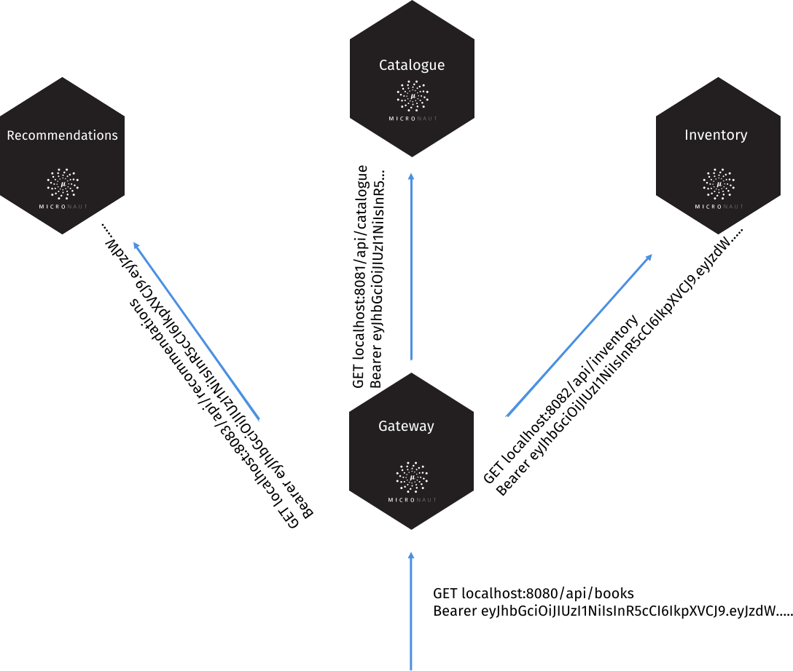

# 12. 令牌传播

想象一下，你有一个网关微服务，它消耗其他三个微服务：



前面的配置配置了一个 [HttpHeaderTokenPropagator](https://micronaut-projects.github.io/micronaut-security/latest/api/io/micronaut/security/token/propagation/HttpHeaderTokenPropagator.html) 和一个传播过滤器 [TokenPropagationHttpClientFilter](https://micronaut-projects.github.io/micronaut-security/latest/api/io/micronaut/security/token/propagation/TokenPropagationHttpClientFilter.html)，它将无缝传播安全令牌。

如果使用[服务发现](/core/cloud/serviceDiscovery)功能，可以在服务 id 正则表达式中使用服务 id：

```bash
micronaut.security.token.propagation.service-id-regex="catalogue|recommendations|inventory"
```

有多种配置选项可供选择：

*表 1. [TokenPropagationConfigurationProperties](https://micronaut-projects.github.io/micronaut-security/latest/api/io/micronaut/security/token/propagation/TokenPropagationConfigurationProperties.html) 配置属性*

|属性|类型|描述|
|--|--|--|
|micronaut.security.token.propagation.service-id-regex|java.lang.String||
|micronaut.security.token.propagation.uri-regex|java.lang.String||
|micronaut.security.token.propagation.service-id-pattern|java.util.regex.Pattern||
|micronaut.security.token.propagation.uri-pattern|java.util.regex.Pattern||
|micronaut.security.token.propagation.enabled|boolean|启用 [TokenPropagationHttpClientFilter](TokenPropagationHttpClientFilter)。默认值 `true`。|
|micronaut.security.token.propagation.path|java.lang.String||

对于通过 HTTP 头传播，你可以进行配置：

*表 2. [HttpHeaderTokenPropagatorConfigurationProperties](https://micronaut-projects.github.io/micronaut-security/latest/api/io/micronaut/security/token/propagation/HttpHeaderTokenPropagatorConfigurationProperties.html) 的配置属性*

|属性|类型|描述|
|--|--|--|
|micronaut.security.token.propagation.header.enabled|boolean|启用 [HttpHeaderTokenPropagator](https://micronaut-projects.github.io/micronaut-security/latest/api/io/micronaut/security/token/propagation/HttpHeaderTokenPropagator.html)。默认值 `true`。|
|micronaut.security.token.propagation.header.prefix|java.lang.String||
|micronaut.security.token.propagation.header.header-name|java.lang.String||

:::note 提示
阅读[令牌传播教程](https://guides.micronaut.io/latest/micronaut-token-propagation.html)，了解更多信息
:::

> [英文链接](https://micronaut-projects.github.io/micronaut-security/latest/guide/index.html#tokenPropagation)
